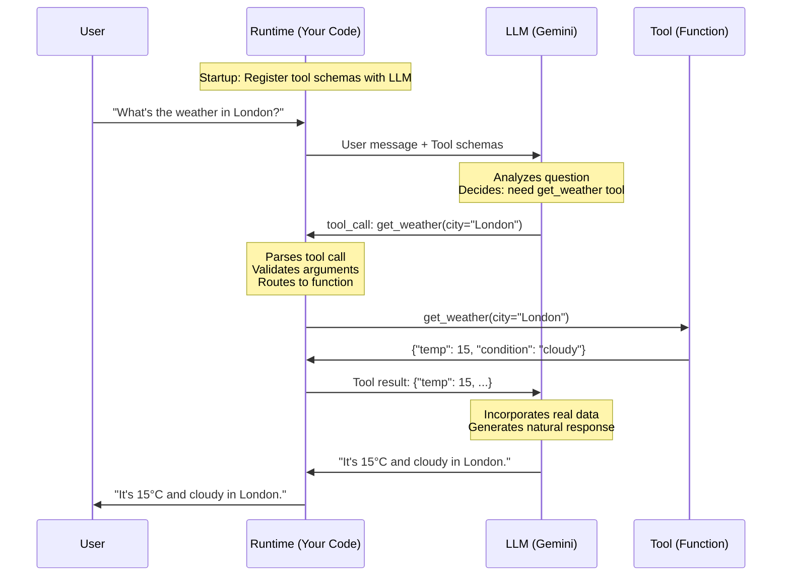
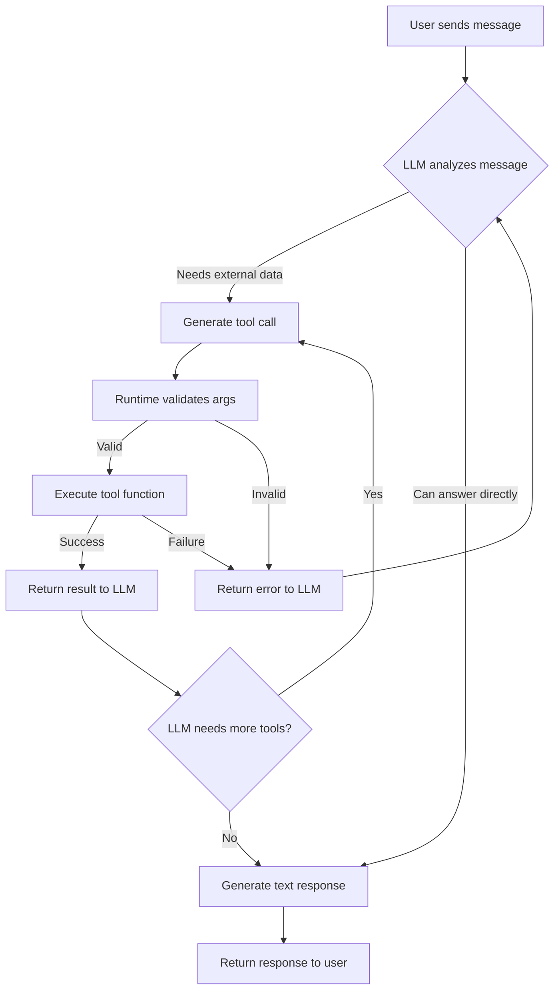
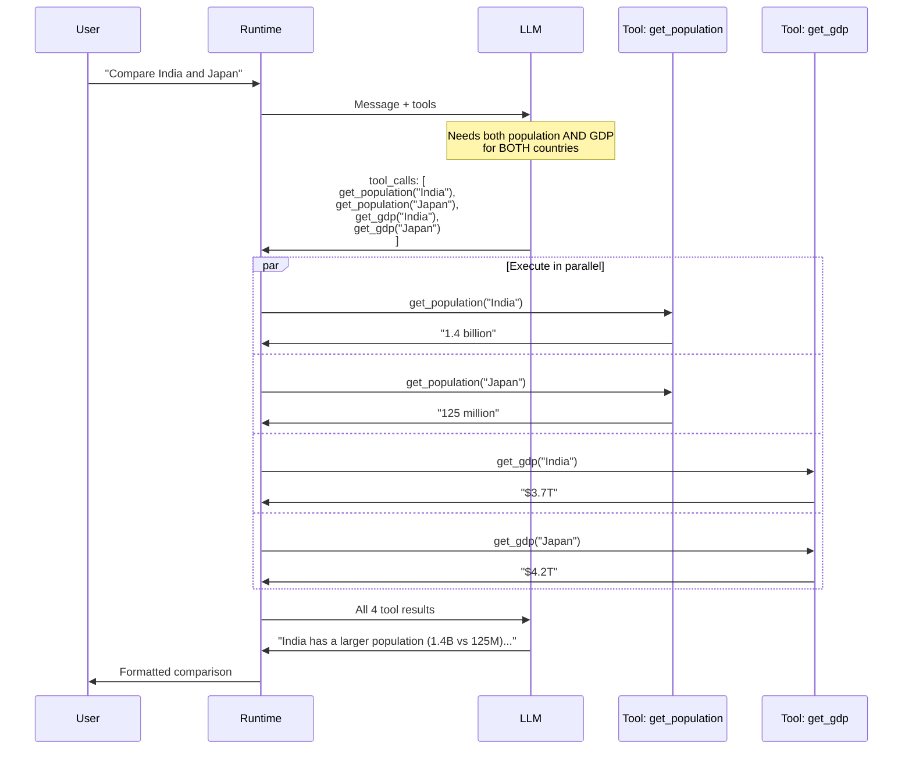
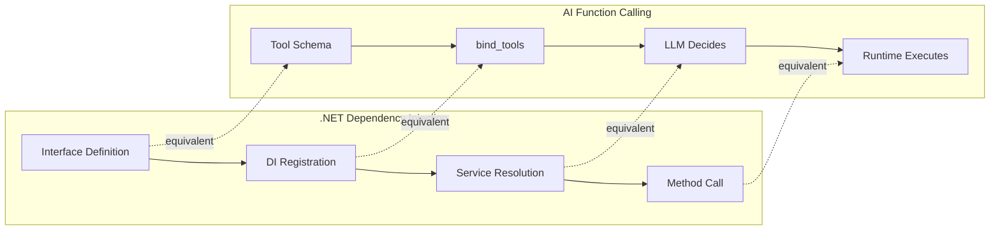

# Function / Tool Calling — Deep Dive

> **Day 5 of your learning path** | Phase 2 — Making Agents That Take Actions  
> Estimated study time: **4–5 hours**  
> Prerequisites: Phase 1 complete (agents, ReAct, basic tool use)

---

## Table of Contents

1. [Simple Explanation](#1-simple-explanation)
2. [Why It Matters](#2-why-it-matters)
3. [Internal Working](#3-internal-working)
4. [Real-World Use Cases](#4-real-world-use-cases)
5. [Common Beginner Mistakes](#5-common-beginner-mistakes)
6. [Best Practices](#6-best-practices)
7. [Python Examples](#7-python-examples)
8. [.NET / C# Equivalent Explanation](#8-net--c-equivalent-explanation)
9. [Diagrams](#9-diagrams)
10. [Mental Models and Analogies](#10-mental-models-and-analogies)

---

## 1. Simple Explanation

**Function calling** (also called "tool calling") is the mechanism by which an LLM tells your code *what function to run* and *what arguments to pass*. 

Here's the critical insight: **the LLM never executes the function itself**. It only generates a structured request — like filling out a form — and your code actually runs the function and feeds the result back.

Think of it like this: you're at a restaurant. You (the LLM) read the menu (tool schemas), decide what you want, and write your order on a slip of paper (function call JSON). The kitchen (your runtime) actually cooks the food (executes the function) and brings back the result.

### The Three Participants

| Participant | Role | Example |
|---|---|---|
| **LLM** | Decides *which* tool to call and *what* arguments to pass | "I need to call `get_weather` with `city='London'`" |
| **Runtime** (your code) | Actually executes the function and returns the result | Calls the weather API, gets `{"temp": 15, "condition": "cloudy"}` |
| **User** | Asked the original question | "What's the weather in London?" |

The LLM is the **brain** that decides. Your code is the **hands** that act. The user is the **person** who asked.

---

## 2. Why It Matters

### Without function calling:
```
User: "What's 847 * 293?"
LLM: "847 * 293 = 248,171"  ← This is WRONG (actual answer: 248,171... actually let's check: 847 × 293 = 248,171. OK that one works, but many don't)
```

LLMs are bad at precise computation, API calls, database queries, and anything requiring real-time data. Function calling bridges this gap.

### With function calling:
```
User: "What's 847 * 293?"
LLM → generates: {"function": "calculator", "args": {"expression": "847 * 293"}}
Runtime → executes: eval("847 * 293") → 248171
LLM → responds: "847 × 293 = 248,171"
```

Now the LLM **delegates** what it can't do reliably to code that can.

### Business Impact

| Without Tools | With Tools |
|---|---|
| LLM hallucinates data | LLM retrieves real data |
| Can't interact with systems | Can query DBs, call APIs, send emails |
| Static knowledge (training cutoff) | Dynamic, real-time information |
| Unreliable calculations | Precise computation via code |
| Can only generate text | Can take actions in the real world |

---

## 3. Internal Working

### The Complete Lifecycle

When you send a message to an LLM with tools enabled, here's exactly what happens:

#### Step 1: Tool Registration

Before any conversation, you register your tools with the LLM by providing **schemas** — structured descriptions of what each tool does, what parameters it accepts, and what types those parameters are.

```json
{
  "name": "get_weather",
  "description": "Get current weather for a city. Use this when the user asks about weather conditions.",
  "parameters": {
    "type": "object",
    "properties": {
      "city": {
        "type": "string",
        "description": "City name, e.g., 'London' or 'New York'"
      },
      "unit": {
        "type": "string",
        "enum": ["celsius", "fahrenheit"],
        "description": "Temperature unit"
      }
    },
    "required": ["city"]
  }
}
```

This schema gets injected into the system prompt (or handled via API-level tool configuration). The LLM now "knows" what tools are available.

#### Step 2: User Sends a Message

```
User: "Is it cold in Tokyo right now?"
```

#### Step 3: LLM Decides Whether to Call a Tool

The LLM looks at:
- The user's question
- The available tool schemas
- The conversation history

It decides: "I need real-time weather data. I should call `get_weather`."

Instead of generating a text response, it generates a **tool call**:

```json
{
  "tool_calls": [
    {
      "id": "call_abc123",
      "function": {
        "name": "get_weather",
        "arguments": "{\"city\": \"Tokyo\", \"unit\": \"celsius\"}"
      }
    }
  ]
}
```

#### Step 4: Your Code Executes the Function

Your runtime receives this JSON, parses it, finds the matching function, validates the arguments, and runs it:

```python
result = get_weather(city="Tokyo", unit="celsius")
# Returns: {"temperature": 8, "condition": "clear", "humidity": 45}
```

#### Step 5: Result Goes Back to the LLM

You send the function result back as a new message in the conversation:

```json
{
  "role": "tool",
  "tool_call_id": "call_abc123",
  "content": "{\"temperature\": 8, \"condition\": \"clear\", \"humidity\": 45}"
}
```

#### Step 6: LLM Generates Final Response

The LLM now has the real data and generates a natural language response:

```
"It's currently 8°C in Tokyo with clear skies and 45% humidity. 
That's fairly cold — you might want a jacket!"
```

### What the API Messages Look Like (Full Conversation)

```json
[
  {"role": "system", "content": "You are a helpful weather assistant."},
  {"role": "user", "content": "Is it cold in Tokyo right now?"},
  {"role": "assistant", "content": null, "tool_calls": [
    {"id": "call_abc123", "function": {"name": "get_weather", "arguments": "{\"city\":\"Tokyo\",\"unit\":\"celsius\"}"}}
  ]},
  {"role": "tool", "tool_call_id": "call_abc123", "content": "{\"temperature\":8,\"condition\":\"clear\",\"humidity\":45}"},
  {"role": "assistant", "content": "It's currently 8°C in Tokyo with clear skies..."}
]
```

Notice the conversation has **5 messages** for what seemed like a single question. This is the hidden complexity of tool calling.

---

## 4. Real-World Use Cases

### 1. Customer Support Bot
```
User: "What's the status of my order #12345?"
→ Tool call: lookup_order(order_id="12345")
→ Result: {"status": "shipped", "eta": "2024-03-15"}
→ Response: "Your order #12345 has shipped and should arrive by March 15th."
```

### 2. Data Analysis Agent
```
User: "Show me sales trends for Q4"
→ Tool call: query_database(sql="SELECT month, SUM(revenue) FROM sales WHERE quarter='Q4' GROUP BY month")
→ Result: [{"month": "Oct", "revenue": 45000}, ...]
→ Response: "Q4 sales show a 15% increase month-over-month..."
```

### 3. DevOps Assistant
```
User: "Is the production API healthy?"
→ Tool call: check_health(service="prod-api")
→ Result: {"status": "degraded", "error_rate": 0.05, "latency_p99": 2300}
→ Response: "The production API is degraded — error rate is 5% and P99 latency is 2.3s."
```

### 4. Research Agent
```
User: "Compare the GDP of India and Brazil"
→ Tool calls (parallel): 
   get_gdp(country="India")
   get_gdp(country="Brazil")
→ Results: India=$3.7T, Brazil=$2.1T
→ Response: "India's GDP ($3.7T) is about 76% larger than Brazil's ($2.1T)..."
```

### 5. Code Generation with Verification
```
User: "Write a function to sort a list and verify it works"
→ Tool call: execute_python(code="def sort_list(lst): return sorted(lst)\nprint(sort_list([3,1,2]))")
→ Result: "[1, 2, 3]"
→ Response: "Here's the function, and I've verified it outputs [1, 2, 3]..."
```

---

## 5. Common Beginner Mistakes

### Mistake 1: Vague Tool Descriptions

```python
# ❌ BAD — LLM doesn't know when to use this
@tool
def search(query: str) -> str:
    """Search for stuff."""
    ...

# ✅ GOOD — Clear, specific, tells LLM exactly when to use it
@tool
def search_company_database(query: str) -> str:
    """Search the internal company knowledge base for information about 
    products, policies, and procedures. Use this when the user asks about 
    company-specific information that wouldn't be in your training data.
    
    Args:
        query: Natural language search query, e.g., 'return policy for electronics'
    """
    ...
```

**Why it matters**: The LLM decides which tool to call based on the description. A vague description = wrong tool choices.

### Mistake 2: Not Validating Tool Arguments

```python
# ❌ BAD — LLM might pass anything
def get_user(user_id):
    return db.query(f"SELECT * FROM users WHERE id = {user_id}")  # SQL injection!

# ✅ GOOD — Validate and parameterize
def get_user(user_id: int) -> dict:
    if not isinstance(user_id, int) or user_id < 0:
        return {"error": "Invalid user ID"}
    return db.query("SELECT * FROM users WHERE id = ?", (user_id,))
```

### Mistake 3: Returning Raw Errors to LLM

```python
# ❌ BAD — Stack trace confuses the LLM
@tool
def fetch_data(url: str) -> str:
    response = requests.get(url)  # Might throw ConnectionError, Timeout, etc.
    return response.text

# ✅ GOOD — Return structured, actionable error messages
@tool
def fetch_data(url: str) -> str:
    """Fetch data from a URL."""
    try:
        response = requests.get(url, timeout=10)
        response.raise_for_status()
        return response.text
    except requests.Timeout:
        return "ERROR: Request timed out after 10 seconds. The server might be slow."
    except requests.ConnectionError:
        return "ERROR: Could not connect to the server. The URL might be wrong."
    except requests.HTTPError as e:
        return f"ERROR: Server returned status {e.response.status_code}."
```

### Mistake 4: Too Many Tools

Registering 50 tools overwhelms the LLM. It fills up the context window with schemas and makes it harder for the LLM to choose the right one.

**Rule of thumb**: Start with 3–5 tools. Add more only when needed. Consider dynamic tool selection (covered in Phase 3) for large tool sets.

### Mistake 5: Not Testing Tool Schemas Independently

Before wiring a tool to an agent, test it standalone:

```python
# Test the tool function directly
result = get_weather(city="London", unit="celsius")
print(result)  # Does it return what you expect?
print(type(result))  # Is it the right type?
```

---

## 6. Best Practices

### 1. Write Tool Descriptions Like API Documentation

Your tool description is the **most important part** of function calling. The LLM reads it to decide:
- **When** to call the tool
- **What** arguments to pass
- **What** to expect back

```python
@tool
def calculate_shipping_cost(
    weight_kg: float,
    destination_country: str,
    shipping_method: str = "standard"
) -> str:
    """Calculate the shipping cost for a package.
    
    Use this tool when the user asks about shipping costs, delivery prices,
    or how much it costs to send a package.
    
    Args:
        weight_kg: Package weight in kilograms. Must be between 0.1 and 50.
        destination_country: ISO 3166-1 alpha-2 country code (e.g., 'US', 'GB', 'JP')
        shipping_method: One of 'standard' (5-7 days), 'express' (2-3 days), or 'overnight' (next day)
    
    Returns:
        JSON string with cost in USD and estimated delivery date.
        Example: {"cost": 12.50, "currency": "USD", "estimated_days": 5}
    """
```

### 2. Return Structured Data from Tools

```python
# ❌ BAD — Unstructured string
return "The weather in London is 15 degrees and cloudy"

# ✅ GOOD — Structured JSON the LLM can reason about
return json.dumps({
    "city": "London",
    "temperature": 15,
    "unit": "celsius", 
    "condition": "cloudy",
    "humidity": 72
})
```

### 3. Include Examples in Descriptions

```python
@tool
def search_products(query: str, category: str = "all") -> str:
    """Search the product catalog.
    
    Examples of good queries:
    - "red running shoes size 10"
    - "wireless noise-cancelling headphones under $200"
    - "organic coffee beans 1kg"
    
    The category parameter helps narrow results:
    - "electronics", "clothing", "food", "home", "all"
    """
```

### 4. Handle Partial Failures Gracefully

```python
@tool
def get_stock_prices(symbols: list[str]) -> str:
    """Get current stock prices for one or more ticker symbols."""
    results = {}
    for symbol in symbols:
        try:
            price = stock_api.get_price(symbol)
            results[symbol] = {"price": price, "status": "ok"}
        except Exception:
            results[symbol] = {"price": None, "status": "unavailable"}
    return json.dumps(results)
```

### 5. Version Your Tool Schemas

When you change a tool's parameters, old conversations might break. Keep tool schemas stable, add new optional parameters rather than changing existing ones.

---

## 7. Python Examples

### Example 1: LangChain Tool with Gemini

```python
"""
Function calling with LangChain and Google Gemini.
The @tool decorator creates a tool the LLM can call.
"""
import json
from dotenv import load_dotenv
from langchain_google_genai import ChatGoogleGenerativeAI
from langchain_core.tools import tool
from langchain_core.messages import HumanMessage, ToolMessage

load_dotenv()

# ── Define tools ──────────────────────────────────────

@tool
def calculator(expression: str) -> str:
    """Evaluate a mathematical expression. Use this for any math calculations.
    
    Args:
        expression: A valid Python math expression, e.g., '2 + 2' or '(10 ** 2) / 4'
    """
    try:
        # WARNING: In production, use a safe math parser, not eval()
        result = eval(expression, {"__builtins__": {}}, {})
        return json.dumps({"result": result, "expression": expression})
    except Exception as e:
        return json.dumps({"error": str(e), "expression": expression})

@tool
def get_current_time(timezone: str = "UTC") -> str:
    """Get the current date and time. Use this when the user asks what time it is.
    
    Args:
        timezone: Timezone name like 'UTC', 'US/Eastern', 'Asia/Tokyo'
    """
    from datetime import datetime
    import pytz
    try:
        tz = pytz.timezone(timezone)
        now = datetime.now(tz)
        return json.dumps({
            "time": now.strftime("%H:%M:%S"),
            "date": now.strftime("%Y-%m-%d"),
            "timezone": timezone
        })
    except Exception as e:
        return json.dumps({"error": f"Unknown timezone: {timezone}"})

# ── Bind tools to the model ───────────────────────────

llm = ChatGoogleGenerativeAI(model="gemini-2.0-flash")
llm_with_tools = llm.bind_tools([calculator, get_current_time])

# ── Send a message and handle tool calls ──────────────

messages = [HumanMessage(content="What's 1847 * 293 + 17?")]
response = llm_with_tools.invoke(messages)

print("LLM Response:", response)
print("Tool calls:", response.tool_calls)

# If the LLM wants to call a tool, execute it
if response.tool_calls:
    # Add the LLM's response to conversation history
    messages.append(response)
    
    # Execute each tool call
    for tool_call in response.tool_calls:
        tool_name = tool_call["name"]
        tool_args = tool_call["args"]
        
        # Route to the correct tool
        if tool_name == "calculator":
            result = calculator.invoke(tool_args)
        elif tool_name == "get_current_time":
            result = get_current_time.invoke(tool_args)
        else:
            result = json.dumps({"error": f"Unknown tool: {tool_name}"})
        
        # Add tool result to conversation
        messages.append(ToolMessage(content=result, tool_call_id=tool_call["id"]))
    
    # Get final response from LLM with tool results
    final_response = llm_with_tools.invoke(messages)
    print("\nFinal Answer:", final_response.content)
```

### Example 2: Raw Gemini API (No Framework)

```python
"""
Function calling using raw Google Gemini API — no LangChain.
This shows exactly what happens under the hood.
"""
import os
import json
import requests
from dotenv import load_dotenv

load_dotenv()

API_KEY = os.getenv("GOOGLE_API_KEY")
MODEL = os.getenv("GEMINI_MODEL", "gemini-2.0-flash")
BASE_URL = f"https://generativelanguage.googleapis.com/v1beta/models/{MODEL}"

# ── Define tool schemas (JSON format) ─────────────────

TOOL_SCHEMAS = {
    "tools": [{
        "function_declarations": [
            {
                "name": "calculator",
                "description": "Evaluate a mathematical expression. Use for any math.",
                "parameters": {
                    "type": "object",
                    "properties": {
                        "expression": {
                            "type": "string",
                            "description": "Python math expression, e.g., '2 + 2'"
                        }
                    },
                    "required": ["expression"]
                }
            },
            {
                "name": "get_current_time",
                "description": "Get the current date and time for a timezone.",
                "parameters": {
                    "type": "object",
                    "properties": {
                        "timezone": {
                            "type": "string",
                            "description": "Timezone like 'UTC' or 'Asia/Tokyo'"
                        }
                    },
                    "required": ["timezone"]
                }
            }
        ]
    }]
}

# ── Actual tool implementations ───────────────────────

def execute_tool(name: str, args: dict) -> str:
    """Route and execute a tool call."""
    if name == "calculator":
        try:
            result = eval(args["expression"], {"__builtins__": {}}, {})
            return json.dumps({"result": result})
        except Exception as e:
            return json.dumps({"error": str(e)})
    
    elif name == "get_current_time":
        from datetime import datetime
        import pytz
        tz = pytz.timezone(args.get("timezone", "UTC"))
        now = datetime.now(tz)
        return json.dumps({"time": now.strftime("%H:%M:%S"), "date": now.strftime("%Y-%m-%d")})
    
    return json.dumps({"error": f"Unknown tool: {name}"})

# ── The conversation loop ─────────────────────────────

def chat_with_tools(user_message: str) -> str:
    """Full function calling cycle with raw HTTP calls."""
    
    # Step 1: Send user message with tool schemas
    payload = {
        "contents": [{"role": "user", "parts": [{"text": user_message}]}],
        **TOOL_SCHEMAS
    }
    
    response = requests.post(
        f"{BASE_URL}:generateContent?key={API_KEY}",
        json=payload
    )
    data = response.json()
    candidate = data["candidates"][0]["content"]
    
    # Step 2: Check if LLM wants to call a tool
    for part in candidate["parts"]:
        if "functionCall" in part:
            func_call = part["functionCall"]
            tool_name = func_call["name"]
            tool_args = func_call.get("args", {})
            
            print(f"  → LLM wants to call: {tool_name}({tool_args})")
            
            # Step 3: Execute the tool
            tool_result = execute_tool(tool_name, tool_args)
            print(f"  → Tool returned: {tool_result}")
            
            # Step 4: Send result back to LLM
            payload2 = {
                "contents": [
                    {"role": "user", "parts": [{"text": user_message}]},
                    candidate,  # LLM's tool call message
                    {
                        "role": "function",
                        "parts": [{
                            "functionResponse": {
                                "name": tool_name,
                                "response": json.loads(tool_result)
                            }
                        }]
                    }
                ],
                **TOOL_SCHEMAS
            }
            
            response2 = requests.post(
                f"{BASE_URL}:generateContent?key={API_KEY}",
                json=payload2
            )
            data2 = response2.json()
            return data2["candidates"][0]["content"]["parts"][0]["text"]
        
        elif "text" in part:
            # LLM responded directly without calling a tool
            return part["text"]

# ── Run it ────────────────────────────────────────────

print(chat_with_tools("What's 1847 * 293 + 17?"))
```

### Example 3: Parallel Tool Calls

```python
"""
Some LLMs can call multiple tools in a single turn.
This is like Task.WhenAll() in C# — fire multiple requests simultaneously.
"""
from langchain_google_genai import ChatGoogleGenerativeAI
from langchain_core.tools import tool
from langchain_core.messages import HumanMessage, ToolMessage
import json

@tool
def get_population(country: str) -> str:
    """Get the population of a country."""
    populations = {"India": "1.4 billion", "Brazil": "215 million", "Japan": "125 million"}
    return json.dumps({"country": country, "population": populations.get(country, "Unknown")})

@tool
def get_gdp(country: str) -> str:
    """Get the GDP of a country in USD."""
    gdps = {"India": "$3.7 trillion", "Brazil": "$2.1 trillion", "Japan": "$4.2 trillion"}
    return json.dumps({"country": country, "gdp": gdps.get(country, "Unknown")})

llm = ChatGoogleGenerativeAI(model="gemini-2.0-flash")
llm_with_tools = llm.bind_tools([get_population, get_gdp])

# This question requires TWO different tools for TWO different countries
messages = [HumanMessage(content="Compare the population and GDP of India and Japan")]
response = llm_with_tools.invoke(messages)

print(f"Number of tool calls: {len(response.tool_calls)}")
for tc in response.tool_calls:
    print(f"  → {tc['name']}({tc['args']})")

# Execute all tool calls (could be parallelized with asyncio)
if response.tool_calls:
    messages.append(response)
    
    tool_map = {"get_population": get_population, "get_gdp": get_gdp}
    
    for tc in response.tool_calls:
        result = tool_map[tc["name"]].invoke(tc["args"])
        messages.append(ToolMessage(content=result, tool_call_id=tc["id"]))
    
    final = llm_with_tools.invoke(messages)
    print(f"\nFinal: {final.content}")
```

### Example 4: Dynamic Tool Registry

```python
"""
Instead of hardcoding tool routing, build a registry.
This is the pattern used in production agent frameworks.
"""
from langchain_core.tools import tool
import json

# ── Tool Registry ─────────────────────────────────────

class ToolRegistry:
    """A registry that maps tool names to their implementations.
    Think of this as a DI container for tools."""
    
    def __init__(self):
        self._tools = {}
    
    def register(self, tool_func):
        """Register a tool by its name."""
        self._tools[tool_func.name] = tool_func
        return tool_func
    
    def get(self, name: str):
        """Get a tool by name."""
        return self._tools.get(name)
    
    def all_tools(self) -> list:
        """Get all registered tools (for binding to LLM)."""
        return list(self._tools.values())
    
    def execute(self, name: str, args: dict) -> str:
        """Execute a tool by name with given arguments."""
        tool_func = self.get(name)
        if tool_func is None:
            return json.dumps({"error": f"Tool '{name}' not found"})
        try:
            return tool_func.invoke(args)
        except Exception as e:
            return json.dumps({"error": f"Tool '{name}' failed: {str(e)}"})

# ── Usage ─────────────────────────────────────────────

registry = ToolRegistry()

@registry.register
@tool
def calculator(expression: str) -> str:
    """Evaluate a math expression."""
    result = eval(expression, {"__builtins__": {}}, {})
    return json.dumps({"result": result})

@registry.register
@tool
def string_length(text: str) -> str:
    """Count characters in a string."""
    return json.dumps({"length": len(text), "text": text[:50]})

# Now you can route any tool call dynamically:
# result = registry.execute(tool_call["name"], tool_call["args"])
```

---

## 8. .NET / C# Equivalent Explanation

### Tool Calling ≈ Interface-Based Service Invocation

In .NET, when you need a service, you:
1. **Define an interface** (= tool schema)
2. **Register it in DI** (= bind tools to LLM)
3. **Resolve and call it** (= LLM generates a function call, runtime executes)

```csharp
// 1. Define the interface (≈ tool schema)
public interface IWeatherService
{
    WeatherResult GetWeather(string city, string unit = "celsius");
}

// 2. Register in DI (≈ binding tools to LLM)
services.AddScoped<IWeatherService, OpenWeatherService>();

// 3. Resolve and call (≈ runtime executing the tool)
var weatherService = serviceProvider.GetService<IWeatherService>();
var result = weatherService.GetWeather("London");
```

**In AI tool calling:**
```python
# 1. Define the tool schema (≈ interface)
@tool
def get_weather(city: str, unit: str = "celsius") -> str:
    """Get weather for a city."""
    ...

# 2. Register with LLM (≈ DI registration)
llm_with_tools = llm.bind_tools([get_weather])

# 3. LLM generates call, you execute (≈ resolve + call)
for tool_call in response.tool_calls:
    result = get_weather.invoke(tool_call["args"])
```

### Tool Schema ≈ Data Annotations / Swagger Schema

```csharp
// .NET: You define parameter constraints via attributes
public class ShippingRequest
{
    [Required]
    [StringLength(100)]
    public string Destination { get; set; }
    
    [Range(0.1, 50.0)]
    public double WeightKg { get; set; }
    
    [RegularExpression("standard|express|overnight")]
    public string Method { get; set; } = "standard";
}
```

```python
# Python/AI: You define the same via Pydantic or tool schema
@tool
def calculate_shipping(
    destination: str,  # ≈ [Required] [StringLength]
    weight_kg: float,  # ≈ [Range(0.1, 50.0)]
    method: str = "standard"  # ≈ default value + [RegularExpression]
) -> str:
    """Calculate shipping cost."""
    ...
```

### Tool Registry ≈ Service Locator / DI Container

```csharp
// .NET DI Container
var services = new ServiceCollection();
services.AddSingleton<ICalculator, Calculator>();
services.AddSingleton<IWeatherService, WeatherService>();
var provider = services.BuildServiceProvider();

// Resolve by type
var calculator = provider.GetRequiredService<ICalculator>();
```

```python
# AI Tool Registry
registry = ToolRegistry()
registry.register(calculator)
registry.register(get_weather)

# Resolve by name
tool = registry.get("calculator")
```

### The Key Difference

In .NET, **your code** decides which service to call. In AI tool calling, **the LLM** decides which tool to call. Your code just executes whatever the LLM requests.

This is like the difference between:
- **Traditional**: Controller calls `_weatherService.GetWeather()` directly
- **AI Agent**: LLM says "call `get_weather`", your runtime dispatches it

Think of the LLM as an extremely flexible **controller** that reads the user's intent and routes to the appropriate service — except it uses natural language understanding instead of hardcoded routes.

---

## 9. Diagrams

### Tool Calling Lifecycle



### Tool Decision Flow



### Parallel Tool Calls



### .NET Analogy Diagram



---

## 10. Mental Models and Analogies

### The Restaurant Analogy (Best for beginners)

| Restaurant | Function Calling |
|---|---|
| Menu | Tool schemas (what's available) |
| Customer reads menu, orders | LLM reads schemas, generates tool call |
| Order slip (written) | Function call JSON |
| Kitchen cooks the food | Runtime executes the function |
| Waiter brings food back | Tool result returned to LLM |
| Customer eats and is satisfied | LLM incorporates result and responds |

**Key insight**: The customer (LLM) never enters the kitchen (never executes code). They only write orders (generate JSON).

### The Call Center Analogy

Imagine an LLM as a smart call center operator:
- They know about many departments (tools)
- When a caller (user) asks something, they don't make up answers
- Instead, they **transfer the call** to the right department
- The department gives them the answer
- They relay it back to the caller in plain language

### The Puppet Master vs. The Puppet

- **LLM** = Puppet master (decides what to do, but can't physically act)
- **Tools** = Puppet (can act, but can't decide)
- **Runtime** = The strings (connects decisions to actions)

### The Form-Filling Mental Model

When the LLM "calls a function," it's really just filling out a form:

```
┌─────────────────────────────┐
│  FUNCTION CALL FORM         │
│                             │
│  Function: [get_weather  ]  │
│  city:     [London       ]  │
│  unit:     [celsius      ]  │
│                             │
│  [Submit]                   │
└─────────────────────────────┘
```

Your code reads the form, processes it, and writes the answer on the back. Then the LLM reads the answer and talks to the user.

### The .NET Mental Model

For .NET developers, the simplest mental model:

```
Traditional .NET:
    Controller → manually calls → Service → returns → Controller formats response

AI Function Calling:
    LLM → generates call request → Runtime dispatches → Tool executes → Result → LLM formats response
```

The difference: In .NET, **you hardcode** which service to call. In AI, **the LLM dynamically decides** which tool to call based on the user's natural language input. It's like having a controller that can understand any request in any language and route it to the right service automatically.

---

## Summary

| Concept | One-Line Summary |
|---|---|
| Function calling | LLM generates structured requests; your code executes them |
| Tool schema | JSON description of a function's name, purpose, and parameters |
| Tool binding | Registering available tools with the LLM |
| Tool execution | Your runtime parses the LLM's request and runs the actual function |
| Parallel calls | LLM requests multiple tools in one turn (like `Task.WhenAll`) |
| Tool registry | A dynamic lookup of available tools (like a DI container) |

---

**Next**: [02_structured_outputs.md](./02_structured_outputs.md) — Learn how to force the LLM's output into a known schema using Pydantic and JSON mode.
