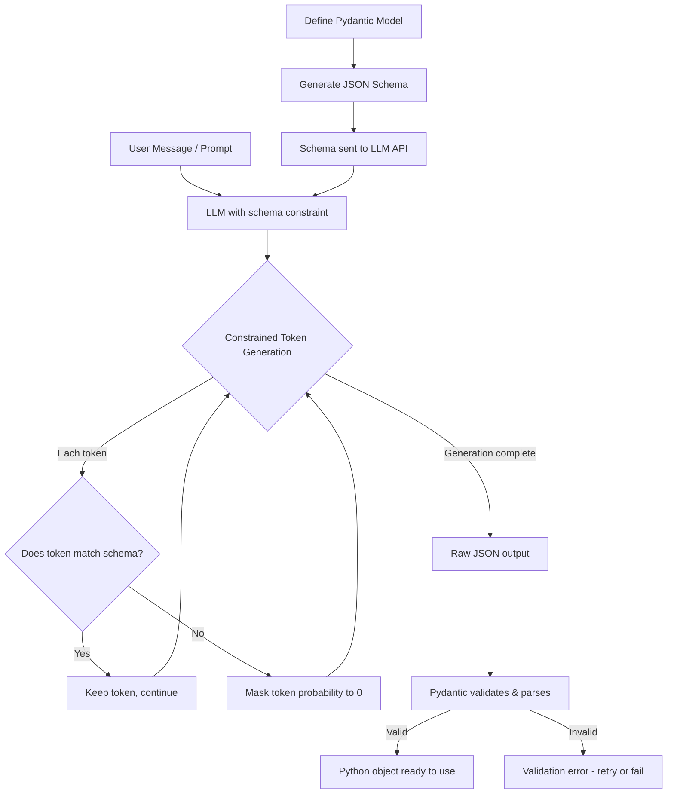
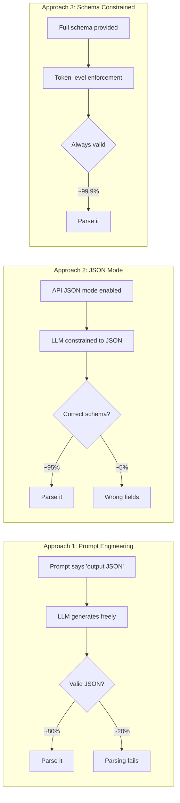
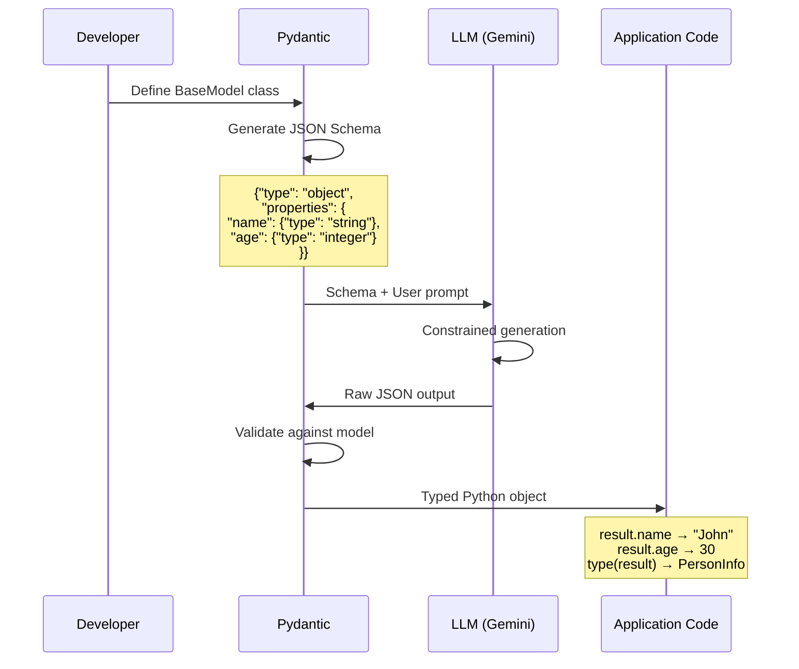
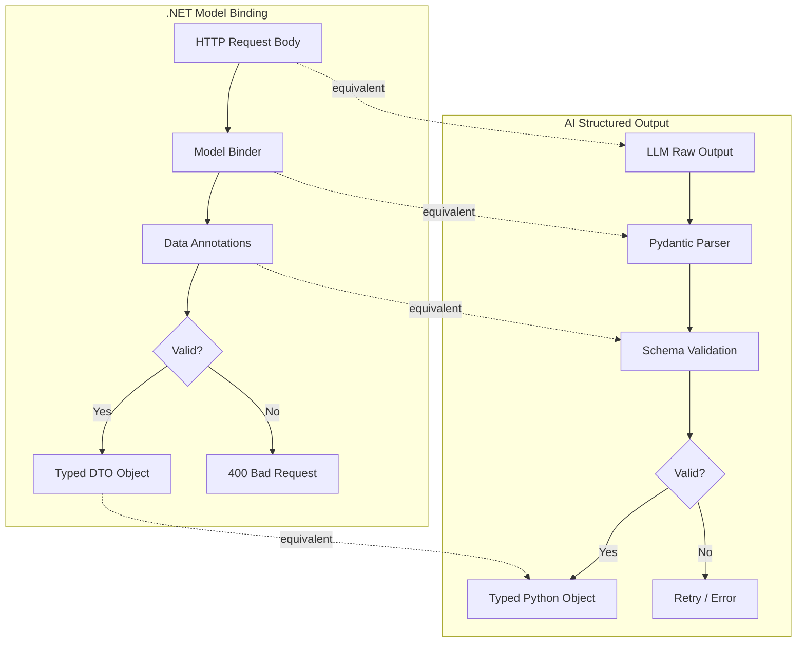

# Structured Outputs — Deep Dive

> **Day 6 of your learning path** | Phase 2 — Making Agents That Take Actions  
> Estimated study time: **4–5 hours**  
> Prerequisites: Function calling (01_function_calling.md)

---

## Table of Contents

1. [Simple Explanation](#1-simple-explanation)
2. [Why It Matters](#2-why-it-matters)
3. [Internal Working](#3-internal-working)
4. [Real-World Use Cases](#4-real-world-use-cases)
5. [Common Beginner Mistakes](#5-common-beginner-mistakes)
6. [Best Practices](#6-best-practices)
7. [Python Examples](#7-python-examples)
8. [.NET / C# Equivalent Explanation](#8-net--c-equivalent-explanation)
9. [Diagrams](#9-diagrams)
10. [Mental Models and Analogies](#10-mental-models-and-analogies)

---

## 1. Simple Explanation

Normally, an LLM returns free-form text — it can say anything in any format. **Structured output** forces the LLM to return data in a specific, predictable shape that your code can reliably parse.

Instead of this:

```
The user's name is John, he's 30 years old, and he lives in New York.
```

You get this:

```json
{
  "name": "John",
  "age": 30,
  "city": "New York"
}
```

**Why does this matter?** Because your code needs to *do something* with the LLM's output. If the output is unpredictable text, your code has to guess how to parse it. If the output is a guaranteed JSON structure, your code can reliably extract exactly what it needs.

### The Core Idea

You define a **schema** (a blueprint) that says: "I want the output to have these exact fields, with these exact types." The LLM is then constrained to only generate output that matches this schema.

Think of it like a form:
- **Without structured output**: LLM writes a free-form essay
- **With structured output**: LLM fills in specific fields on a form

---

## 2. Why It Matters

### The Parsing Problem

Without structured output, you end up writing fragile parsing code:

```python
# ❌ BAD: Trying to extract data from free-form text
response = "The sentiment is positive with a confidence of 0.85"

# Now you have to parse this... but what if the LLM says:
# "I'd rate the sentiment as quite positive, around 85% confidence"
# or "Positive sentiment (confidence: 85%)"
# or "The text has a positive tone. I'm fairly confident about this."

# Every variation breaks your parser!
import re
match = re.search(r"(positive|negative|neutral)", response)  # Fragile!
```

With structured output:

```python
# ✅ GOOD: Guaranteed structure
response = {"sentiment": "positive", "confidence": 0.85}

# Always works, no parsing needed
sentiment = response["sentiment"]
confidence = response["confidence"]
```

### Where It's Critical

| Scenario | Without Structure | With Structure |
|---|---|---|
| API responses | Text that downstream systems can't parse | JSON that APIs consume directly |
| Database inserts | Regex-extracted, error-prone data | Validated fields ready for INSERT |
| Multi-agent systems | Agent B can't reliably read Agent A's output | Agent B gets exact expected fields |
| UI rendering | Frontend must guess where the data is | Frontend knows exactly what to display |
| Decision logic | `if "yes" in response.lower()` (fragile) | `if response["approved"] == True` (solid) |

### The Scale Problem

When you call an LLM once, you can manually inspect the output. When your agent calls an LLM 10,000 times per day, **every response must be machine-parseable**. Structured output is what makes LLM calls reliable at scale.

---

## 3. Internal Working

### How LLMs Generate Text (Background)

To understand structured output, you need to understand **how LLMs generate text**:

1. The LLM predicts the **next token** (word/character) based on everything before it
2. It generates a **probability distribution** over all possible next tokens
3. It picks one token and adds it to the output
4. Repeat until done

For example, if the prompt says "Output JSON:", the LLM might predict:
- `{` has 80% probability
- `The` has 10% probability  
- `[` has 5% probability
- etc.

### Three Approaches to Structured Output

#### Approach 1: Prompt Engineering (Weakest)

Just ask the LLM nicely:

```
Please respond in this exact JSON format:
{"name": string, "age": number, "city": string}
```

**Problem**: The LLM *usually* follows instructions, but it might:
- Add extra text before/after the JSON
- Use the wrong field names
- Skip optional fields inconsistently
- Add markdown code fences around the JSON

**Reliability**: ~80-90% (not good enough for production)

#### Approach 2: JSON Mode (Medium)

Most LLM APIs have a "JSON mode" that constrains the output to valid JSON:

```python
response = llm.invoke(prompt, response_format={"type": "json_object"})
```

The LLM is **guaranteed** to return valid JSON, but there's no guarantee about the *shape* of that JSON. It might return `{"answer": "John is 30"}` instead of the exact fields you want.

**Reliability**: 100% valid JSON, ~90-95% correct schema

#### Approach 3: Schema-Constrained Output (Strongest)

You provide a JSON Schema or Pydantic model, and the LLM is constrained to output only tokens that match the schema:

```python
class UserInfo(BaseModel):
    name: str
    age: int
    city: str

response = llm.with_structured_output(UserInfo).invoke(prompt)
# response is GUARANTEED to be a UserInfo instance
```

**How it works internally**:

1. Your Pydantic model is converted to a JSON Schema
2. The schema is sent to the LLM API alongside the prompt
3. During token generation, the LLM's **token probabilities are masked** — tokens that would violate the schema get zero probability
4. For example, after `{"name": "John", "age":` the LLM can only output number tokens, not strings

This is called **constrained decoding** or **guided generation**.

**Reliability**: ~99.9% (the schema is enforced at the token level)

### The Constrained Decoding Process

```
Schema says "age" must be an integer.

After generating: {"name": "John", "age": 

Token probabilities BEFORE constraining:
  "thirty" → 0.25
  30       → 0.20
  "30"     → 0.15
  25       → 0.10
  ...

Token probabilities AFTER constraining (masking non-integers):
  "thirty" → 0.00  ← BLOCKED (string, not int)
  30       → 0.40  ← BOOSTED
  "30"     → 0.00  ← BLOCKED (quoted string, not int)
  25       → 0.20  ← BOOSTED
  ...

Result: LLM outputs 30 (a valid integer)
```

### What Pydantic Does

[Pydantic](https://docs.pydantic.dev/) is a Python library for data validation. In the AI world, it serves as the bridge between your Python code and the LLM's JSON output.

```python
from pydantic import BaseModel, Field

class ExtractedInfo(BaseModel):
    name: str = Field(description="Person's full name")
    age: int = Field(ge=0, le=150, description="Person's age in years")
    city: str = Field(description="City of residence")
```

Pydantic does three things:
1. **Generates a JSON Schema** from your Python class → sent to the LLM
2. **Validates the output** → ensures the LLM's JSON matches the schema  
3. **Converts to Python objects** → you get a typed Python object, not a raw dict

---

## 4. Real-World Use Cases

### 1. Data Extraction from Unstructured Text

```python
class InvoiceData(BaseModel):
    vendor_name: str
    invoice_number: str
    total_amount: float
    currency: str
    line_items: list[LineItem]

# Input: Scanned invoice text (messy, unstructured)
# Output: Clean, validated InvoiceData object
```

### 2. Sentiment Analysis Pipeline

```python
class SentimentResult(BaseModel):
    sentiment: Literal["positive", "negative", "neutral"]
    confidence: float = Field(ge=0.0, le=1.0)
    key_phrases: list[str]
    reasoning: str

# Guaranteed to return one of three sentiments, confidence between 0-1
```

### 3. Content Moderation

```python
class ModerationResult(BaseModel):
    is_safe: bool
    categories: list[Literal["violence", "hate", "sexual", "self_harm", "none"]]
    severity: Literal["low", "medium", "high", "none"]
    explanation: str
```

### 4. Agent Decision Making

```python
class AgentDecision(BaseModel):
    """What the agent decides to do next."""
    thought: str = Field(description="The agent's reasoning process")
    action: Literal["search", "calculate", "respond", "ask_clarification"]
    action_input: str = Field(description="Input for the chosen action")
    confidence: float = Field(ge=0.0, le=1.0)
```

### 5. Multi-Step Form Filling

```python
class JobApplication(BaseModel):
    full_name: str
    email: str
    years_experience: int = Field(ge=0)
    skills: list[str] = Field(min_length=1)
    availability: Literal["immediate", "2_weeks", "1_month", "other"]
    salary_expectation: Optional[int] = None
```

---

## 5. Common Beginner Mistakes

### Mistake 1: Over-Constraining the Schema

```python
# ❌ BAD — Too rigid, LLM struggles with exact constraints
class UserProfile(BaseModel):
    name: str = Field(min_length=2, max_length=50, pattern=r"^[A-Za-z\s]+$")
    age: int = Field(ge=18, le=120)
    email: str = Field(pattern=r"^[\w.-]+@[\w.-]+\.\w+$")
    phone: str = Field(pattern=r"^\+\d{1,3}-\d{3}-\d{3}-\d{4}$")
```

The LLM has to satisfy all these regex patterns while generating tokens. This often leads to failures or low-quality outputs.

```python
# ✅ GOOD — Reasonable constraints, validate strictly in your code
class UserProfile(BaseModel):
    name: str = Field(description="Person's full name")
    age: int = Field(description="Age in years")
    email: str = Field(description="Email address")
    phone: Optional[str] = Field(default=None, description="Phone number if available")
```

**Rule**: Let the LLM generate reasonable values, then validate strictly in your application code.

### Mistake 2: Ignoring Optional Fields

```python
# ❌ BAD — All fields required, but LLM might not have all info
class ExtractedPerson(BaseModel):
    name: str
    age: int          # What if age isn't mentioned?
    email: str        # What if no email in the text?
    phone: str        # What if no phone?

# LLM is forced to hallucinate values to fill required fields!
```

```python
# ✅ GOOD — Optional fields let the LLM say "I don't know"
class ExtractedPerson(BaseModel):
    name: str
    age: Optional[int] = Field(default=None, description="Age if mentioned, null otherwise")
    email: Optional[str] = Field(default=None, description="Email if mentioned, null otherwise")
    phone: Optional[str] = Field(default=None, description="Phone if mentioned, null otherwise")
```

### Mistake 3: Not Using Field Descriptions

```python
# ❌ BAD — LLM has to guess what these fields mean
class Result(BaseModel):
    score: float
    category: str
    tags: list[str]

# ✅ GOOD — Descriptions guide the LLM
class Result(BaseModel):
    score: float = Field(description="Relevance score from 0.0 (irrelevant) to 1.0 (perfect match)")
    category: str = Field(description="One of: 'tech', 'science', 'business', 'health', 'other'")
    tags: list[str] = Field(description="3-5 descriptive keywords about the content")
```

### Mistake 4: Deeply Nested Schemas

```python
# ❌ BAD — 4 levels of nesting confuses the LLM
class Report(BaseModel):
    sections: list[Section]

class Section(BaseModel):
    paragraphs: list[Paragraph]

class Paragraph(BaseModel):
    sentences: list[Sentence]

class Sentence(BaseModel):
    text: str
    entities: list[Entity]  # This is getting ridiculous
```

```python
# ✅ GOOD — Flatten when possible
class Report(BaseModel):
    title: str
    summary: str
    key_findings: list[str]
    entities_mentioned: list[str]
```

**Rule of thumb**: Keep nesting to 2 levels maximum. If you need deeper structure, break it into multiple LLM calls.

### Mistake 5: Using Structured Output for Creative Tasks

```python
# ❌ BAD — Don't constrain creative writing
class Poem(BaseModel):
    line_1: str = Field(max_length=40)
    line_2: str = Field(max_length=40)
    line_3: str = Field(max_length=40)
    rhyme_scheme: str

# ✅ GOOD — Let creative output be free-form
response = llm.invoke("Write a haiku about programming")
# Returns: "Semicolons lost / In a sea of brackets deep / The bug hides within"
```

Structured output is for **data extraction**, not **content generation**.

---

## 6. Best Practices

### 1. Use `Literal` for Fixed Choices

```python
from typing import Literal

class ClassificationResult(BaseModel):
    category: Literal["bug", "feature", "question", "documentation"]
    priority: Literal["low", "medium", "high", "critical"]
```

This ensures the LLM can only output one of your predefined values. It's like an enum.

### 2. Add Descriptions to Every Field

The `Field(description=...)` is your primary way to communicate intent to the LLM:

```python
class SearchQuery(BaseModel):
    query: str = Field(description="The optimized search query, not the user's raw input")
    filters: list[str] = Field(
        description="Filters to apply. Each filter is 'field:value', e.g., 'language:python'"
    )
    max_results: int = Field(
        default=10,
        description="Number of results to return. Use 5 for quick lookups, 20 for thorough research"
    )
```

### 3. Use Enums for Categorization

```python
from enum import Enum

class Sentiment(str, Enum):
    POSITIVE = "positive"
    NEGATIVE = "negative"
    NEUTRAL = "neutral"
    MIXED = "mixed"

class Analysis(BaseModel):
    sentiment: Sentiment
    topics: list[str]
```

### 4. Include a "reasoning" Field

Adding a reasoning/thought field improves the quality of other fields:

```python
class Decision(BaseModel):
    reasoning: str = Field(description="Step-by-step thought process for the decision")
    decision: Literal["approve", "reject", "escalate"]
    confidence: float = Field(ge=0.0, le=1.0)
```

**Why?** The LLM generates tokens left-to-right. If `reasoning` comes first, it "thinks" before deciding. This is called **chain-of-thought in structured output**.

### 5. Validate After Parsing

Even with structured output, validate business logic in your code:

```python
result = llm.with_structured_output(OrderData).invoke(prompt)

# Schema guarantees the shape, but validate the semantics
if result.quantity <= 0:
    raise ValueError("Quantity must be positive")
if result.delivery_date < datetime.now():
    raise ValueError("Delivery date must be in the future")
```

### 6. Use `model_json_schema()` to Inspect What Gets Sent

```python
print(UserInfo.model_json_schema())
# See the exact JSON Schema being sent to the LLM
# This helps debug why the LLM might be confused
```

---

## 7. Python Examples

### Example 1: Basic Structured Output with Pydantic + LangChain

```python
"""
Force the LLM to extract structured data from unstructured text.
"""
from pydantic import BaseModel, Field
from typing import Optional, Literal
from langchain_google_genai import ChatGoogleGenerativeAI
from dotenv import load_dotenv

load_dotenv()

# ── Define the output schema ─────────────────────────

class PersonInfo(BaseModel):
    """Information about a person extracted from text."""
    name: str = Field(description="Person's full name")
    age: Optional[int] = Field(default=None, description="Age if mentioned")
    occupation: Optional[str] = Field(default=None, description="Job or profession if mentioned")
    location: Optional[str] = Field(default=None, description="City or country if mentioned")
    sentiment: Literal["positive", "negative", "neutral"] = Field(
        description="Overall sentiment of the text about this person"
    )

# ── Create LLM with structured output ────────────────

llm = ChatGoogleGenerativeAI(model="gemini-2.0-flash")
structured_llm = llm.with_structured_output(PersonInfo)

# ── Use it ────────────────────────────────────────────

text = """
I met this brilliant engineer named Sarah Chen at the conference in Berlin. 
She's been working at SpaceX for about 5 years and she's only 28! 
Really impressive work on the propulsion systems.
"""

result = structured_llm.invoke(f"Extract person information from this text:\n{text}")

print(type(result))        # <class 'PersonInfo'>
print(result.name)         # Sarah Chen
print(result.age)          # 28
print(result.occupation)   # Engineer at SpaceX
print(result.location)     # Berlin
print(result.sentiment)    # positive
print(result.model_dump()) # Full dict
```

### Example 2: Multi-Item Extraction

```python
"""
Extract a LIST of structured items from text.
"""
from pydantic import BaseModel, Field
from typing import Optional

class Task(BaseModel):
    """A task extracted from meeting notes."""
    description: str = Field(description="What needs to be done")
    assignee: Optional[str] = Field(default=None, description="Who is responsible")
    priority: str = Field(description="One of: high, medium, low")
    deadline: Optional[str] = Field(default=None, description="Due date if mentioned")

class MeetingTasks(BaseModel):
    """All tasks extracted from meeting notes."""
    meeting_topic: str = Field(description="What the meeting was about")
    tasks: list[Task] = Field(description="List of action items from the meeting")
    next_meeting: Optional[str] = Field(default=None, description="When the next meeting is")

llm = ChatGoogleGenerativeAI(model="gemini-2.0-flash")
structured_llm = llm.with_structured_output(MeetingTasks)

notes = """
Sprint planning meeting - March 15
We discussed the new authentication feature. 
John will handle the backend API by Friday.
Sarah needs to update the UI components - high priority, due Wednesday.
Mike should write tests for the login flow, medium priority.
Let's meet again next Tuesday to review progress.
"""

result = structured_llm.invoke(f"Extract tasks from these meeting notes:\n{notes}")

print(f"Meeting: {result.meeting_topic}")
print(f"Next meeting: {result.next_meeting}")
for task in result.tasks:
    print(f"  [{task.priority}] {task.description} → {task.assignee} (due: {task.deadline})")
```

### Example 3: Raw JSON Mode (No Framework)

```python
"""
Structured output using raw Gemini API — no LangChain.
Shows what happens under the hood.
"""
import os
import json
import requests
from dotenv import load_dotenv

load_dotenv()

API_KEY = os.getenv("GOOGLE_API_KEY")
MODEL = os.getenv("GEMINI_MODEL", "gemini-2.0-flash")
BASE_URL = f"https://generativelanguage.googleapis.com/v1beta/models/{MODEL}"

# ── Define schema as JSON ─────────────────────────────

PERSON_SCHEMA = {
    "type": "object",
    "properties": {
        "name": {"type": "string", "description": "Person's full name"},
        "age": {"type": "integer", "description": "Age if mentioned, -1 if unknown"},
        "occupation": {"type": "string", "description": "Job or profession"},
        "sentiment": {
            "type": "string",
            "enum": ["positive", "negative", "neutral"]
        }
    },
    "required": ["name", "sentiment"]
}

# ── Call Gemini with response schema ──────────────────

text = "Met John Doe, a 35-year-old doctor. Really great guy!"

payload = {
    "contents": [{"parts": [{"text": f"Extract person info from: {text}"}]}],
    "generationConfig": {
        "responseMimeType": "application/json",
        "responseSchema": PERSON_SCHEMA
    }
}

response = requests.post(
    f"{BASE_URL}:generateContent?key={API_KEY}",
    json=payload
)

data = response.json()
raw_text = data["candidates"][0]["content"]["parts"][0]["text"]
parsed = json.loads(raw_text)

print(parsed)
# {"name": "John Doe", "age": 35, "occupation": "doctor", "sentiment": "positive"}
```

### Example 4: Chain-of-Thought with Structured Output

```python
"""
Combine reasoning (chain-of-thought) with structured decisions.
The 'reasoning' field comes first so the LLM thinks before deciding.
"""
from pydantic import BaseModel, Field
from typing import Literal
from langchain_google_genai import ChatGoogleGenerativeAI

class CodeReview(BaseModel):
    """Structured code review result."""
    reasoning: str = Field(
        description="Step-by-step analysis of the code. Consider: correctness, "
                    "performance, readability, security, and edge cases."
    )
    verdict: Literal["approve", "request_changes", "needs_discussion"] = Field(
        description="Final decision on the code"
    )
    issues: list[str] = Field(
        description="Specific issues found, empty list if none"
    )
    severity: Literal["none", "minor", "major", "critical"] = Field(
        description="Highest severity of issues found"
    )
    suggested_improvements: list[str] = Field(
        description="Actionable suggestions, empty if code is perfect"
    )

llm = ChatGoogleGenerativeAI(model="gemini-2.0-flash")
reviewer = llm.with_structured_output(CodeReview)

code = '''
def get_user(user_id):
    query = f"SELECT * FROM users WHERE id = {user_id}"
    return db.execute(query)
'''

result = reviewer.invoke(
    f"Review this Python code for quality and security:\n```python\n{code}\n```"
)

print(f"Verdict: {result.verdict}")
print(f"Severity: {result.severity}")
print(f"Reasoning: {result.reasoning}")
for issue in result.issues:
    print(f"  ⚠ {issue}")
for suggestion in result.suggested_improvements:
    print(f"  → {suggestion}")
```

### Example 5: Structured Output as Agent Decision

```python
"""
Use structured output to make the ReAct agent's decisions machine-readable.
Instead of parsing "Thought: ... Action: ..." from text, use a schema.
"""
from pydantic import BaseModel, Field
from typing import Literal, Optional

class AgentStep(BaseModel):
    """One step in the agent's reasoning process."""
    thought: str = Field(description="What the agent is thinking")
    action: Literal["search", "calculate", "lookup_db", "final_answer"] = Field(
        description="What action to take next"
    )
    action_input: str = Field(description="Input for the chosen action")
    is_final: bool = Field(
        default=False, 
        description="True if action is 'final_answer', meaning the agent is done"
    )

# In your agent loop:
# step = structured_llm.invoke(prompt)
# if step.action == "search":
#     result = search_tool(step.action_input)
# elif step.action == "calculate":
#     result = calculator(step.action_input)
# elif step.is_final:
#     return step.action_input  # The final answer
```

---

## 8. .NET / C# Equivalent Explanation

### Structured Output ≈ Strongly-Typed DTOs + Data Annotations

In .NET, you use DTOs (Data Transfer Objects) to define the exact shape of data between layers:

```csharp
// .NET: Define a DTO with validation
public class PersonInfoDto
{
    [Required]
    public string Name { get; set; }
    
    [Range(0, 150)]
    public int? Age { get; set; }
    
    public string? Occupation { get; set; }
    
    [Required]
    [AllowedValues("positive", "negative", "neutral")]
    public string Sentiment { get; set; }
}

// .NET: Model binding automatically validates and deserializes
[HttpPost("analyze")]
public IActionResult Analyze([FromBody] PersonInfoDto dto)
{
    // dto is guaranteed to be valid if we get here
    // ModelState.IsValid checked by framework
}
```

In Python/AI, Pydantic does the same thing:

```python
# Python: Define a Pydantic model (≈ DTO)
class PersonInfo(BaseModel):
    name: str                    # ≈ [Required] public string Name
    age: Optional[int] = None    # ≈ public int? Age
    occupation: Optional[str] = None
    sentiment: Literal["positive", "negative", "neutral"]  # ≈ [AllowedValues]
```

### Schema Enforcement ≈ Model Binding + FluentValidation

| .NET Concept | AI Equivalent |
|---|---|
| `[FromBody] dto` (model binding) | `with_structured_output(Model)` |
| `ModelState.IsValid` | Pydantic validation on parse |
| `[Required]` attribute | Non-optional field in Pydantic |
| `[Range(0, 100)]` | `Field(ge=0, le=100)` |
| `[AllowedValues("a", "b")]` | `Literal["a", "b"]` |
| `[JsonPropertyName("user_name")]` | `Field(alias="user_name")` |
| FluentValidation rules | Pydantic `@validator` decorators |
| `IValidatableObject` | Pydantic `@model_validator` |

### Constrained Decoding ≈ Middleware Pipeline Filtering

In ASP.NET, middleware can reject or transform requests before they reach your controller. Similarly, constrained decoding filters out invalid tokens before they become part of the output:

```csharp
// .NET: Middleware blocks bad requests
app.Use(async (context, next) =>
{
    if (!context.Request.ContentType.Contains("application/json"))
    {
        context.Response.StatusCode = 400;
        return;  // ← Blocked
    }
    await next();  // ← Allowed through
});
```

```
AI: Constrained decoding blocks bad tokens
After generating {"age": 
  Token "thirty" → probability = 0.0  ← BLOCKED (not an integer)
  Token 30       → probability = 0.4  ← ALLOWED
  Token "hello"  → probability = 0.0  ← BLOCKED (not an integer)
```

### The Mental Mapping

```
.NET World:                          AI World:
─────────────                        ─────────
Controller receives HTTP request  →  LLM receives user message
Model binding deserializes JSON   →  Structured output parses LLM response
Data annotations validate shape   →  Pydantic schema constrains output
FluentValidation checks rules     →  Field validators ensure values
DTO passed to service layer       →  Parsed object used in your code
```

---

## 9. Diagrams

### Structured Output Pipeline



### Three Approaches Comparison



### Pydantic Model to JSON Schema Flow



### .NET Analogy Diagram



---

## 10. Mental Models and Analogies

### The Form vs. Essay Analogy

| | Essay (Free-form) | Form (Structured) |
|---|---|---|
| Format | Write anything | Fill specific fields |
| Consistency | Every essay is different | Every form has same fields |
| Machine-readable | Hard to parse | Easy to parse |
| Creativity | Maximum | Limited to field choices |
| When to use | Creative writing, chat | Data extraction, decisions |

### The Mold Analogy

Think of structured output as **pouring liquid into a mold**:
- **Liquid** = the LLM's knowledge and reasoning ability
- **Mold** = the Pydantic schema
- **Result** = perfectly shaped output

Without the mold, the liquid spreads everywhere (free-form text). With the mold, you get exactly the shape you need.

### The Tax Form Analogy

Tax forms are the ultimate structured output:
- Each box has a specific meaning (= field name)
- Each box expects a specific type (= field type: number, string, date)
- Some boxes are required, others optional (= Optional fields)
- The total must equal the sum of parts (= validators)

When you ask an LLM to fill out a "tax form" (Pydantic model), it puts the right data in the right boxes.

### The .NET Developer's Mental Model

```
Structured Output is just model binding for AI.

In ASP.NET:
  HTTP Body (raw bytes) → Model Binder → Validated DTO → Your Code

In AI:
  LLM Output (raw tokens) → Pydantic → Validated Object → Your Code

You've been doing this for years.
The only difference is the input source (HTTP vs LLM).
```

### The Compiler Analogy

Think of the schema as a **type system**:
- In C#, the compiler rejects `int x = "hello"` at compile time
- In structured output, constrained decoding rejects non-integer tokens for an `int` field at generation time

Both enforce types before the data reaches your application. The schema IS the type system for LLM output.

### When NOT to Use Structured Output

Ask yourself: "Does my code need to parse this output programmatically?"

- **Yes** → Use structured output
- **No, a human reads it** → Don't use structured output
- **No, it's passed to another LLM** → Usually don't need structured output (LLMs can parse free text)

Exception: Multi-agent systems where structured output ensures reliable handoffs between agents.

---

## Summary

| Concept | One-Line Summary |
|---|---|
| Structured output | Forcing LLM output into a predictable, parseable schema |
| Pydantic | Python library that defines schemas and validates data |
| JSON Mode | LLM guaranteed to output valid JSON (but not guaranteed shape) |
| Schema-constrained | LLM guaranteed to output JSON matching exact schema |
| Constrained decoding | Blocking invalid tokens during generation |
| `Field(description=...)` | How you communicate intent to the LLM about each field |
| `Literal[...]` | Restricting a field to specific allowed values (like enum) |
| Chain-of-thought + structure | Put `reasoning` field first so LLM thinks before deciding |

---

**Previous**: [01_function_calling.md](./01_function_calling.md)  
**Next**: [03_error_handling_and_retries.md](./03_error_handling_and_retries.md) — Learn how to make your agent resilient to failures with retries, fallbacks, and graceful degradation.
