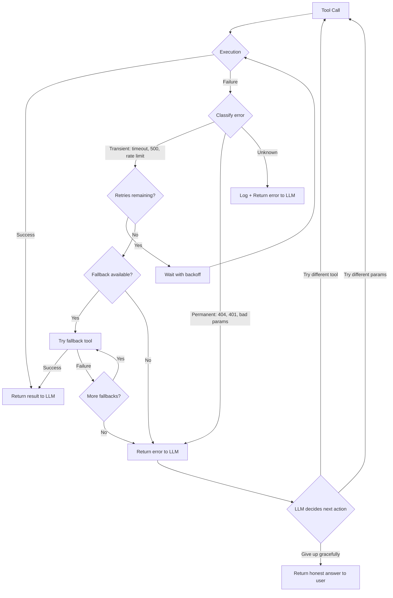
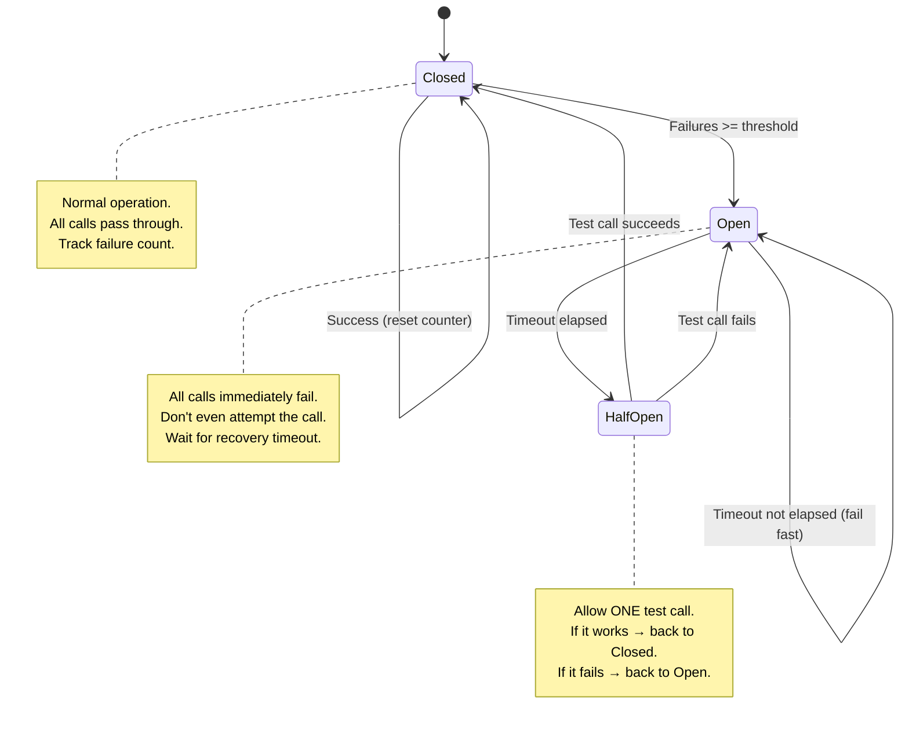
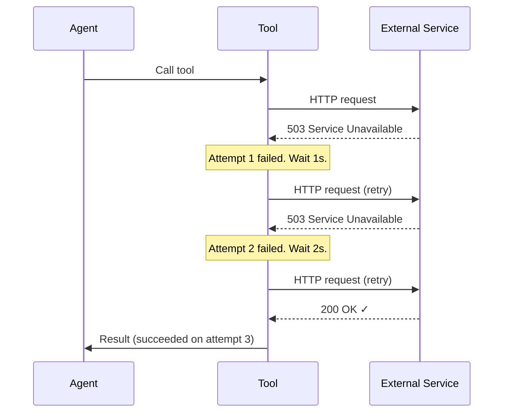
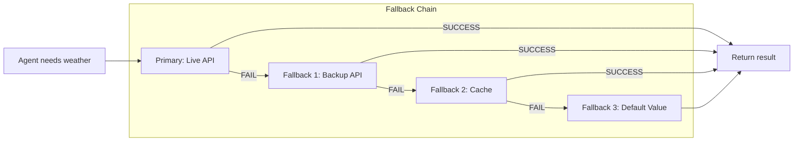
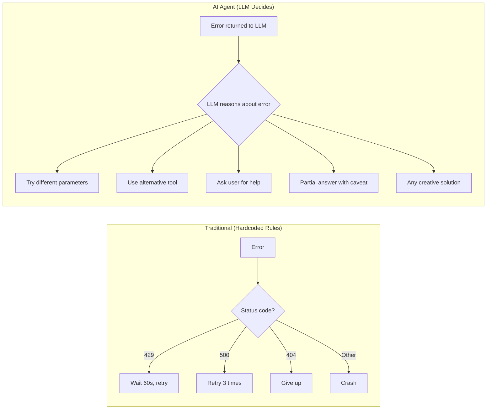

# Error Handling & Retries — Deep Dive

> **Day 7 of your learning path** | Phase 2 — Making Agents That Take Actions  
> Estimated study time: **4–5 hours**  
> Prerequisites: Function calling + Structured outputs (01 & 02)

---

## Table of Contents

1. [Simple Explanation](#1-simple-explanation)
2. [Why It Matters](#2-why-it-matters)
3. [Internal Working](#3-internal-working)
4. [Real-World Use Cases](#4-real-world-use-cases)
5. [Common Beginner Mistakes](#5-common-beginner-mistakes)
6. [Best Practices](#6-best-practices)
7. [Python Examples](#7-python-examples)
8. [.NET / C# Equivalent Explanation](#8-net--c-equivalent-explanation)
9. [Diagrams](#9-diagrams)
10. [Mental Models and Analogies](#10-mental-models-and-analogies)

---

## 1. Simple Explanation

Tools fail. APIs time out. Databases go down. Rate limits get hit. This is normal in production software, and it's normal in AI agents too.

**Error handling in agents** means three things:

1. **Catching failures** — When a tool fails, don't crash the whole agent
2. **Deciding what to do** — Retry? Try a different tool? Skip and continue? Ask the user?
3. **Communicating failures** — Tell the LLM what went wrong so it can adapt its strategy

The unique thing about AI agents: **the LLM itself can reason about errors**. When you return an error message to the LLM instead of crashing, the LLM can decide to:
- Retry with different parameters
- Use a different tool that achieves the same goal
- Reformulate its approach entirely
- Tell the user it couldn't complete the task and why

This is fundamentally different from traditional retry logic. In traditional code, **you** write the retry rules. In AI agents, the **LLM** can decide the retry strategy dynamically based on the error.

---

## 2. Why It Matters

### The Fragility Problem

An agent without error handling is like a house of cards:

```
User: "What's the weather in London and convert it to Fahrenheit?"
Agent: calls get_weather("London") → API returns 500 error
Agent: ❌ CRASHES — Python traceback, user sees nothing
```

An agent WITH error handling:

```
User: "What's the weather in London and convert it to Fahrenheit?"
Agent: calls get_weather("London") → API returns 500 error
Agent: "The weather API returned an error. Let me try a different source..."
Agent: calls backup_weather("London") → Success: 15°C
Agent: calls calculator("15 * 9/5 + 32") → 59°F
Agent: "It's about 15°C (59°F) in London right now."
```

### The Numbers

In production systems:
- **2-5%** of API calls fail on average
- **10-20%** during peak hours or outages
- **100%** of LLM calls occasionally return unexpected formats

If your agent makes 10 tool calls per conversation, there's a **20-40% chance at least one will fail**. Error handling isn't optional — it's a requirement.

### The Three Categories of Failure

| Category | Examples | Strategy |
|---|---|---|
| **Transient** | Network timeout, rate limit, 503 | Retry with backoff |
| **Permanent** | 404 not found, invalid API key, bad parameters | Don't retry, use fallback or report |
| **Logical** | Tool returns unexpected data, LLM misuses tool | Retry with corrected parameters or different approach |

---

## 3. Internal Working

### How Errors Flow Through an Agent

```
User Message
    ↓
LLM decides to call tool
    ↓
Runtime executes tool
    ↓
    ├── SUCCESS → result goes back to LLM → normal flow
    │
    └── FAILURE → error type determines next step:
        │
        ├── TRANSIENT ERROR (timeout, rate limit)
        │   → Wait → Retry same tool → may succeed
        │
        ├── PERMANENT ERROR (404, auth failure)
        │   → Return error message to LLM
        │   → LLM decides: different tool? different params? give up?
        │
        └── UNEXPECTED RESULT (tool returns garbage)
            → Return descriptive error to LLM
            → LLM reformulates approach
```

### Retry Strategies

#### 1. Fixed Delay Retry

```
Attempt 1: FAIL → wait 1s → Attempt 2: FAIL → wait 1s → Attempt 3: SUCCESS
```

Simple but problematic: if the server is overloaded, hammering it every second makes things worse.

#### 2. Exponential Backoff

```
Attempt 1: FAIL → wait 1s → Attempt 2: FAIL → wait 2s → Attempt 3: FAIL → wait 4s → Attempt 4: SUCCESS
```

Each retry waits longer. This gives the failing service time to recover.

#### 3. Exponential Backoff with Jitter

```
Attempt 1: FAIL → wait 1.2s → Attempt 2: FAIL → wait 2.7s → Attempt 3: SUCCESS
```

Add randomness to the wait time. This prevents the "thundering herd" problem where 1000 agents all retry at the exact same second.

#### 4. Circuit Breaker

```
Normal state: calls pass through → if failures exceed threshold...
Open state: all calls immediately fail (don't even try) → after cooldown period...
Half-open state: allow ONE test call → if it succeeds, return to Normal
                                      → if it fails, return to Open
```

This is like a fuse box in your house. When too many failures happen, the circuit "breaks" and stops trying. After a cooldown, it cautiously tests if the service is back.

### Fallback Chains

When retry isn't enough, you use fallbacks — alternative ways to achieve the same goal:

```
Primary:  Call OpenWeatherMap API
  ↓ FAIL
Fallback 1: Call WeatherStack API
  ↓ FAIL
Fallback 2: Call cached weather data
  ↓ FAIL
Fallback 3: Return "Weather data temporarily unavailable"
```

### LLM-Driven Error Recovery

This is the unique power of AI agents. Instead of hardcoded retry rules, you can let the LLM reason about errors:

```python
# Traditional: hardcoded retry
if error.status_code == 429:
    time.sleep(60)
    retry()

# AI agent: LLM-driven recovery
tool_result = "ERROR: Rate limit exceeded. The weather API allows 60 requests/minute."
# LLM receives this and might decide:
# "I'll try a different weather API instead of waiting"
# or "I'll ask the user to wait a moment"
# or "I'll use the temperature I found 2 minutes ago since it hasn't changed"
```

---

## 4. Real-World Use Cases

### 1. API Integration with Multiple Providers

```python
# Agent tries primary weather API, falls back to secondary
# If both fail, uses cached data from last successful call
# If no cache, tells user honestly that weather data is unavailable
```

### 2. Database Operations with Retry

```python
# Agent tries to insert a record
# Gets "deadlock" error → retries after 500ms
# Gets "duplicate key" error → tells LLM the record already exists
# Gets "connection refused" → falls back to in-memory queue for later
```

### 3. Web Scraping Agent

```python
# Agent scrapes a website for product data
# Gets 403 Forbidden → tries different User-Agent
# Gets 429 Rate Limit → exponential backoff
# Gets 404 Not Found → tries alternative URL
# Gets timeout → retries with longer timeout
# Gets CAPTCHA → tells user it can't access this site
```

### 4. Multi-Step Workflow Recovery

```python
# Agent planning a trip:
# Step 1: Search flights ✓
# Step 2: Book hotel → API DOWN
# Step 3: Reserve car (depends on hotel location)
# 
# Agent decides: "I'll search for hotels near the airport instead,
# and once the hotel API is back, I can update the booking."
```

### 5. Graceful Degradation in Customer Support

```python
# Customer asks about order status
# Step 1: Query order DB → SUCCESS
# Step 2: Query shipping API → TIMEOUT
# 
# Instead of failing entirely:
# "Your order #12345 was placed on March 10. I'm currently unable to reach
#  the shipping provider for real-time tracking, but based on standard
#  shipping times, it should arrive by March 17."
```

---

## 5. Common Beginner Mistakes

### Mistake 1: Swallowing Errors Silently

```python
# ❌ BAD — The LLM never knows the tool failed
@tool
def search_web(query: str) -> str:
    try:
        return search_engine.search(query)
    except Exception:
        return ""  # Silent failure — LLM thinks search returned nothing

# ✅ GOOD — Tell the LLM what happened
@tool
def search_web(query: str) -> str:
    try:
        return search_engine.search(query)
    except ConnectionError:
        return "ERROR: Search service is unreachable. Try again or use a different approach."
    except RateLimitError:
        return "ERROR: Search rate limit hit. Wait 30 seconds or try with fewer queries."
```

### Mistake 2: Retrying Non-Retryable Errors

```python
# ❌ BAD — Retrying a 404 will never work
@retry(max_attempts=3)
def get_user(user_id: str):
    response = requests.get(f"/api/users/{user_id}")
    response.raise_for_status()  # 404 → retry → 404 → retry → 404 → fail

# ✅ GOOD — Only retry transient errors
@retry(max_attempts=3, retry_on=(ConnectionError, TimeoutError))
def get_user(user_id: str):
    response = requests.get(f"/api/users/{user_id}", timeout=10)
    if response.status_code == 404:
        return {"error": "User not found", "retryable": False}
    if response.status_code >= 500:
        raise TransientError("Server error, will retry")
    return response.json()
```

### Mistake 3: No Timeout on Tool Calls

```python
# ❌ BAD — Tool can hang forever
@tool
def fetch_webpage(url: str) -> str:
    return requests.get(url).text  # What if the server never responds?

# ✅ GOOD — Always set timeouts
@tool
def fetch_webpage(url: str) -> str:
    try:
        response = requests.get(url, timeout=15)  # 15 second max
        return response.text[:5000]  # Also limit response size
    except requests.Timeout:
        return "ERROR: Page took too long to load (>15s)."
```

### Mistake 4: Infinite Retry Loops

```python
# ❌ BAD — Can retry forever
while True:
    try:
        result = call_api()
        break
    except:
        time.sleep(1)

# ✅ GOOD — Max attempts + total timeout
MAX_ATTEMPTS = 3
for attempt in range(MAX_ATTEMPTS):
    try:
        result = call_api()
        break
    except TransientError:
        if attempt == MAX_ATTEMPTS - 1:
            result = {"error": f"Failed after {MAX_ATTEMPTS} attempts"}
        else:
            time.sleep(2 ** attempt)  # 1s, 2s, 4s
```

### Mistake 5: Not Limiting Agent Retries

The agent loop itself can retry indefinitely if not bounded:

```python
# ❌ BAD — Agent might loop forever trying different tools
while not is_final_answer:
    step = llm.invoke(messages)
    # ... execute tool ...

# ✅ GOOD — Limit total iterations
MAX_AGENT_STEPS = 10
for step_num in range(MAX_AGENT_STEPS):
    step = llm.invoke(messages)
    if is_final_answer(step):
        break
else:
    return "I wasn't able to find an answer within the allowed number of steps."
```

---

## 6. Best Practices

### 1. Classify Errors by Retryability

```python
class ErrorClassifier:
    """Determine if an error is worth retrying."""
    
    TRANSIENT_CODES = {408, 429, 500, 502, 503, 504}
    PERMANENT_CODES = {400, 401, 403, 404, 405, 422}
    
    @staticmethod
    def is_retryable(error) -> bool:
        if isinstance(error, (ConnectionError, TimeoutError)):
            return True
        if hasattr(error, 'response') and error.response is not None:
            return error.response.status_code in ErrorClassifier.TRANSIENT_CODES
        return False
```

### 2. Return Structured Errors to the LLM

```python
import json

def format_tool_error(tool_name: str, error: Exception, retryable: bool) -> str:
    """Format errors in a way the LLM can understand and act on."""
    return json.dumps({
        "status": "error",
        "tool": tool_name,
        "error_type": type(error).__name__,
        "message": str(error),
        "retryable": retryable,
        "suggestion": "Try again in a moment" if retryable else "Use a different approach"
    })
```

### 3. Implement Fallback Chains

```python
class FallbackChain:
    """Try multiple approaches in order until one succeeds."""
    
    def __init__(self, *tools):
        self.tools = tools
    
    def execute(self, **kwargs) -> str:
        errors = []
        for tool in self.tools:
            try:
                result = tool(**kwargs)
                return result
            except Exception as e:
                errors.append(f"{tool.__name__}: {e}")
        
        return json.dumps({
            "status": "all_fallbacks_failed",
            "attempts": errors
        })

# Usage
weather_chain = FallbackChain(
    openweather_api,
    weatherstack_api,
    cached_weather
)
result = weather_chain.execute(city="London")
```

### 4. Add Observability

Log every tool call, its result, any errors, and the retry attempts. This is essential for debugging agent behavior.

```python
import logging
import time

logger = logging.getLogger("agent.tools")

def execute_with_logging(tool_name: str, tool_func, args: dict) -> str:
    """Execute a tool with full logging."""
    start = time.time()
    
    try:
        result = tool_func(**args)
        duration = time.time() - start
        logger.info(f"Tool {tool_name} succeeded in {duration:.2f}s", 
                    extra={"tool": tool_name, "args": args, "duration": duration})
        return result
    except Exception as e:
        duration = time.time() - start
        logger.error(f"Tool {tool_name} failed after {duration:.2f}s: {e}",
                     extra={"tool": tool_name, "args": args, "duration": duration, "error": str(e)})
        raise
```

### 5. Set Total Budget Limits

```python
MAX_TOTAL_RETRIES = 10     # Across all tool calls in one conversation
MAX_TOOL_RETRIES = 3       # Per individual tool call
MAX_AGENT_STEPS = 15       # Total LLM calls per conversation
MAX_WALL_TIME = 120        # Total seconds for entire conversation

class BudgetTracker:
    def __init__(self):
        self.total_retries = 0
        self.agent_steps = 0
        self.start_time = time.time()
    
    def can_retry(self) -> bool:
        if self.total_retries >= MAX_TOTAL_RETRIES:
            return False
        if time.time() - self.start_time > MAX_WALL_TIME:
            return False
        return True
    
    def can_step(self) -> bool:
        return self.agent_steps < MAX_AGENT_STEPS
```

---

## 7. Python Examples

### Example 1: Tool with Built-in Retry (Tenacity)

```python
"""
Using the 'tenacity' library for automatic retries with backoff.
Tenacity is Python's equivalent of Polly in .NET.
"""
import json
import requests
from tenacity import retry, stop_after_attempt, wait_exponential, retry_if_exception_type
from langchain_core.tools import tool

# ── Retry decorator on the underlying function ───────

@retry(
    stop=stop_after_attempt(3),                    # Max 3 attempts
    wait=wait_exponential(multiplier=1, max=10),   # 1s, 2s, 4s
    retry=retry_if_exception_type((ConnectionError, TimeoutError)),  # Only transient errors
    reraise=True  # Re-raise if all retries fail
)
def _fetch_weather(city: str) -> dict:
    """Internal function with retry logic."""
    response = requests.get(
        f"https://api.weatherapi.com/v1/current.json",
        params={"key": "YOUR_API_KEY", "q": city},
        timeout=10
    )
    response.raise_for_status()
    return response.json()

# ── The tool wraps it with error handling ─────────────

@tool
def get_weather(city: str) -> str:
    """Get current weather for a city. Automatically retries on transient failures.
    
    Args:
        city: City name, e.g., 'London', 'Tokyo', 'New York'
    """
    try:
        data = _fetch_weather(city)
        return json.dumps({
            "city": city,
            "temperature_c": data["current"]["temp_c"],
            "condition": data["current"]["condition"]["text"],
            "humidity": data["current"]["humidity"]
        })
    except requests.HTTPError as e:
        if e.response.status_code == 404:
            return json.dumps({"error": f"City '{city}' not found. Check the spelling."})
        return json.dumps({"error": f"Weather API returned status {e.response.status_code}"})
    except (ConnectionError, TimeoutError):
        return json.dumps({"error": "Weather service is unreachable after 3 attempts. Try again later."})
    except Exception as e:
        return json.dumps({"error": f"Unexpected error: {type(e).__name__}: {str(e)}"})
```

### Example 2: LangChain Fallback Pattern

```python
"""
LangChain has built-in fallback support.
If the primary tool/LLM fails, it automatically tries the fallback.
"""
from langchain_google_genai import ChatGoogleGenerativeAI
from langchain_core.tools import tool
import json

# ── Primary and fallback tools ────────────────────────

@tool
def search_primary(query: str) -> str:
    """Search using primary search engine."""
    # Simulating an unreliable primary source
    import random
    if random.random() < 0.3:  # 30% failure rate
        raise ConnectionError("Primary search is down")
    return json.dumps({"source": "primary", "results": [f"Result for: {query}"]})

@tool
def search_fallback(query: str) -> str:
    """Search using backup search engine."""
    return json.dumps({"source": "fallback", "results": [f"Backup result for: {query}"]})

# ── LLM with fallback ────────────────────────────────

primary_llm = ChatGoogleGenerativeAI(model="gemini-2.0-flash", temperature=0)
fallback_llm = ChatGoogleGenerativeAI(model="gemini-2.0-flash", temperature=0.3)

# If primary LLM fails, use fallback with different temperature
llm_with_fallback = primary_llm.with_fallbacks([fallback_llm])

# The same pattern works for tools
# If search_primary fails, search_fallback is tried
resilient_search = search_primary.with_fallbacks([search_fallback])
result = resilient_search.invoke({"query": "Python agents"})
print(result)
```

### Example 3: LLM-Driven Error Recovery

```python
"""
Let the LLM decide how to handle errors, instead of hardcoding retry logic.
The agent loop catches tool failures and passes them back to the LLM.
"""
from langchain_google_genai import ChatGoogleGenerativeAI
from langchain_core.tools import tool
from langchain_core.messages import HumanMessage, AIMessage, ToolMessage, SystemMessage
import json

@tool
def query_database(sql: str) -> str:
    """Execute a SQL query against the company database.
    
    Args:
        sql: A valid SQL SELECT query. Only SELECT queries are allowed.
    """
    # Simulate various failures
    if "DROP" in sql.upper() or "DELETE" in sql.upper():
        return json.dumps({"error": "Only SELECT queries are allowed.", "retryable": False})
    
    if "users" in sql.lower():
        return json.dumps({
            "columns": ["id", "name", "email"],
            "rows": [
                [1, "Alice", "alice@example.com"],
                [2, "Bob", "bob@example.com"]
            ]
        })
    
    return json.dumps({"error": f"Table not found in query: {sql}", "retryable": True,
                       "hint": "Available tables: users, orders, products"})

@tool
def calculator(expression: str) -> str:
    """Evaluate a mathematical expression."""
    try:
        result = eval(expression, {"__builtins__": {}}, {})
        return json.dumps({"result": result})
    except Exception as e:
        return json.dumps({"error": f"Invalid expression: {str(e)}"})

# ── Agent loop with error awareness ──────────────────

SYSTEM_PROMPT = """You are a helpful data assistant with access to a database and calculator.

IMPORTANT ERROR HANDLING RULES:
- If a tool returns an error, read the error carefully
- If the error says "retryable": true, you may try again with corrected parameters
- If the error includes a "hint", use it to fix your approach
- If you've tried 2 times and still failing, tell the user what went wrong
- Never make up data — if you can't get it, say so honestly
"""

def run_agent(user_message: str, max_steps: int = 8) -> str:
    llm = ChatGoogleGenerativeAI(model="gemini-2.0-flash")
    llm_with_tools = llm.bind_tools([query_database, calculator])
    
    messages = [
        SystemMessage(content=SYSTEM_PROMPT),
        HumanMessage(content=user_message)
    ]
    
    tool_map = {"query_database": query_database, "calculator": calculator}
    
    for step in range(max_steps):
        response = llm_with_tools.invoke(messages)
        messages.append(response)
        
        if not response.tool_calls:
            # LLM gave a final text answer
            return response.content
        
        for tc in response.tool_calls:
            try:
                result = tool_map[tc["name"]].invoke(tc["args"])
            except Exception as e:
                result = json.dumps({
                    "error": f"Tool execution failed: {str(e)}",
                    "retryable": True
                })
            
            messages.append(ToolMessage(content=result, tool_call_id=tc["id"]))
    
    return "I've reached my maximum number of steps. Please try a simpler question."

# ── Test it ───────────────────────────────────────────

# This will fail first (wrong table), then succeed using the hint
print(run_agent("How many employees do we have?"))
# LLM tries: SELECT COUNT(*) FROM employees → error with hint about 'users' table
# LLM retries: SELECT COUNT(*) FROM users → success!
```

### Example 4: Circuit Breaker Pattern

```python
"""
Circuit breaker: stop calling a failing service and fail fast.
Prevents cascading failures and gives the service time to recover.
"""
import time
from enum import Enum

class CircuitState(Enum):
    CLOSED = "closed"      # Normal operation
    OPEN = "open"          # Failing fast
    HALF_OPEN = "half_open"  # Testing recovery

class CircuitBreaker:
    """
    Circuit breaker pattern.
    
    .NET equivalent: Polly's CircuitBreakerPolicy
    """
    def __init__(self, failure_threshold: int = 3, recovery_timeout: int = 30):
        self.failure_threshold = failure_threshold
        self.recovery_timeout = recovery_timeout
        self.state = CircuitState.CLOSED
        self.failure_count = 0
        self.last_failure_time = 0
    
    def call(self, func, *args, **kwargs):
        """Execute a function through the circuit breaker."""
        
        if self.state == CircuitState.OPEN:
            # Check if recovery timeout has passed
            if time.time() - self.last_failure_time > self.recovery_timeout:
                self.state = CircuitState.HALF_OPEN
                print("  Circuit → HALF_OPEN (testing recovery)")
            else:
                raise CircuitBreakerError(
                    f"Circuit is OPEN. Service unavailable. "
                    f"Try again in {self.recovery_timeout - (time.time() - self.last_failure_time):.0f}s"
                )
        
        try:
            result = func(*args, **kwargs)
            
            # Success: reset circuit
            if self.state == CircuitState.HALF_OPEN:
                print("  Circuit → CLOSED (service recovered)")
            self.state = CircuitState.CLOSED
            self.failure_count = 0
            return result
            
        except Exception as e:
            self.failure_count += 1
            self.last_failure_time = time.time()
            
            if self.failure_count >= self.failure_threshold:
                self.state = CircuitState.OPEN
                print(f"  Circuit → OPEN (failed {self.failure_count} times)")
            
            raise

class CircuitBreakerError(Exception):
    pass

# ── Usage with a tool ─────────────────────────────────

weather_circuit = CircuitBreaker(failure_threshold=3, recovery_timeout=30)

def get_weather_raw(city: str) -> dict:
    """The actual API call that might fail."""
    import requests
    resp = requests.get(f"https://weather-api.example.com/{city}", timeout=5)
    resp.raise_for_status()
    return resp.json()

# In your tool:
@tool
def get_weather(city: str) -> str:
    """Get weather for a city. Uses circuit breaker to handle repeated failures."""
    try:
        data = weather_circuit.call(get_weather_raw, city)
        return json.dumps(data)
    except CircuitBreakerError as e:
        return json.dumps({"error": str(e), "retryable": False, 
                          "suggestion": "Weather service is down. Try again later."})
    except Exception as e:
        return json.dumps({"error": str(e), "retryable": True})
```

### Example 5: Comprehensive Resilient Tool Wrapper

```python
"""
A reusable wrapper that adds retry, timeout, fallback, and logging to any tool.
This is the pattern you'd use in production.
"""
import json
import time
import logging
from functools import wraps
from tenacity import retry, stop_after_attempt, wait_exponential, retry_if_exception_type

logger = logging.getLogger("agent.tools")

def resilient_tool(
    max_retries: int = 3,
    timeout_seconds: int = 30,
    fallback_value: str = None,
    retryable_errors: tuple = (ConnectionError, TimeoutError)
):
    """
    Decorator that adds resilience to any tool function.
    
    Args:
        max_retries: Maximum retry attempts for transient errors
        timeout_seconds: Total time budget for all attempts
        fallback_value: Value to return if all attempts fail (None = raise)
        retryable_errors: Exception types that should be retried
    """
    def decorator(func):
        @wraps(func)
        def wrapper(*args, **kwargs):
            start_time = time.time()
            last_error = None
            
            for attempt in range(max_retries):
                # Check total timeout
                elapsed = time.time() - start_time
                if elapsed > timeout_seconds:
                    logger.warning(f"{func.__name__} timed out after {elapsed:.1f}s")
                    break
                
                try:
                    result = func(*args, **kwargs)
                    if attempt > 0:
                        logger.info(f"{func.__name__} succeeded on attempt {attempt + 1}")
                    return result
                    
                except retryable_errors as e:
                    last_error = e
                    wait_time = min(2 ** attempt, 10)  # Exponential backoff, max 10s
                    logger.warning(
                        f"{func.__name__} attempt {attempt + 1}/{max_retries} failed: {e}. "
                        f"Retrying in {wait_time}s..."
                    )
                    time.sleep(wait_time)
                    
                except Exception as e:
                    # Non-retryable error — don't retry
                    logger.error(f"{func.__name__} non-retryable error: {e}")
                    return json.dumps({
                        "error": str(e),
                        "retryable": False,
                        "tool": func.__name__
                    })
            
            # All retries exhausted
            if fallback_value is not None:
                logger.warning(f"{func.__name__} using fallback after {max_retries} failures")
                return fallback_value
            
            return json.dumps({
                "error": f"Failed after {max_retries} attempts. Last error: {last_error}",
                "retryable": False,
                "tool": func.__name__
            })
        
        return wrapper
    return decorator

# ── Usage ─────────────────────────────────────────────

@tool
@resilient_tool(
    max_retries=3,
    timeout_seconds=15,
    fallback_value=json.dumps({"error": "Weather service unavailable", "retryable": False})
)
def get_weather(city: str) -> str:
    """Get weather for a city."""
    import requests
    response = requests.get(f"https://api.weather.com/{city}", timeout=5)
    response.raise_for_status()
    return json.dumps(response.json())
```

---

## 8. .NET / C# Equivalent Explanation

### Retry Logic ≈ Polly Retry Policies

The most direct mapping. Polly is .NET's standard resilience library, and `tenacity` is Python's equivalent.

```csharp
// .NET: Polly retry with exponential backoff
var retryPolicy = Policy
    .Handle<HttpRequestException>()
    .Or<TimeoutException>()
    .WaitAndRetryAsync(
        retryCount: 3,
        sleepDurationProvider: attempt => TimeSpan.FromSeconds(Math.Pow(2, attempt)),
        onRetry: (exception, timeSpan, retryCount, context) =>
        {
            _logger.LogWarning($"Retry {retryCount} after {timeSpan.TotalSeconds}s: {exception.Message}");
        }
    );

var result = await retryPolicy.ExecuteAsync(() => _httpClient.GetAsync("/api/weather"));
```

```python
# Python: tenacity retry with exponential backoff
@retry(
    stop=stop_after_attempt(3),
    wait=wait_exponential(multiplier=1, max=10),
    retry=retry_if_exception_type((ConnectionError, TimeoutError)),
    before_sleep=lambda retry_state: 
        logger.warning(f"Retry {retry_state.attempt_number}: {retry_state.outcome.exception()}")
)
def get_weather(city: str) -> dict:
    return requests.get(f"/api/weather/{city}", timeout=10).json()
```

### Circuit Breaker ≈ Polly Circuit Breaker

```csharp
// .NET: Polly circuit breaker
var circuitBreaker = Policy
    .Handle<HttpRequestException>()
    .CircuitBreakerAsync(
        exceptionsAllowedBeforeBreaking: 3,
        durationOfBreak: TimeSpan.FromSeconds(30),
        onBreak: (ex, breakDuration) => _logger.LogError($"Circuit opened for {breakDuration}"),
        onReset: () => _logger.LogInfo("Circuit closed — service recovered")
    );
```

```python
# Python: Our custom CircuitBreaker class (see Example 4)
breaker = CircuitBreaker(failure_threshold=3, recovery_timeout=30)
```

### Fallback Chain ≈ Polly Fallback Policy

```csharp
// .NET: Polly fallback
var fallbackPolicy = Policy<WeatherData>
    .Handle<HttpRequestException>()
    .FallbackAsync(
        fallbackAction: async ct => await GetCachedWeather(),
        onFallbackAsync: async (result, context) =>
            _logger.LogWarning($"Using fallback: {result.Exception?.Message}")
    );

// Chain: Retry → Circuit Breaker → Fallback
var resilientPolicy = Policy.WrapAsync(fallbackPolicy, circuitBreaker, retryPolicy);
var weather = await resilientPolicy.ExecuteAsync(() => GetLiveWeather("London"));
```

```python
# Python: LangChain fallback
resilient_tool = primary_tool.with_fallbacks([secondary_tool, cached_tool])
```

### Error Handling ≈ Middleware Exception Handling

```csharp
// .NET: Global error handling middleware
app.UseExceptionHandler(errorApp =>
{
    errorApp.Run(async context =>
    {
        var error = context.Features.Get<IExceptionHandlerFeature>();
        var response = new { error = error.Error.Message, retryable = IsTransient(error.Error) };
        await context.Response.WriteAsJsonAsync(response);
    });
});
```

In AI agents, your tool wrapper is the equivalent of this middleware — it catches errors, classifies them, and returns structured error information to the LLM.

### The Full .NET Mapping

| .NET Concept | AI Agent Equivalent |
|---|---|
| Polly `RetryAsync()` | `tenacity.retry()` |
| Polly `CircuitBreakerAsync()` | Custom `CircuitBreaker` class |
| Polly `FallbackAsync()` | LangChain `.with_fallbacks()` |
| Polly `Policy.WrapAsync()` | Stacking decorators or middleware |
| `ILogger` | Python `logging` |
| `IExceptionHandler` middleware | Tool wrapper that catches and formats errors |
| `HealthChecks` | Tool availability checks |
| Background retry (Hangfire/Quartz) | Agent retry loop with max steps |

---

## 9. Diagrams

### Error Handling Decision Flow



### Circuit Breaker States



### Retry with Exponential Backoff



### Fallback Chain



### LLM-Driven vs Traditional Error Recovery



---

## 10. Mental Models and Analogies

### The Safety Net Analogy

Think of error handling as layers of safety nets under a tightrope walker:

```
┌─────────────────────────────────────────┐
│         Tightrope (Happy Path)          │  ← Tool call succeeds first time
├─────────────────────────────────────────┤
│    Safety Net 1: Retry with Backoff     │  ← Transient failure, try again
├─────────────────────────────────────────┤
│    Safety Net 2: Fallback Tool          │  ← Primary tool keeps failing
├─────────────────────────────────────────┤
│    Safety Net 3: Cached/Default Data    │  ← All tools failing
├─────────────────────────────────────────┤
│    Safety Net 4: Graceful Message       │  ← Tell user honestly
└─────────────────────────────────────────┘
│    Ground: CRASH (never reach here)     │
```

### The Customer Service Analogy

Imagine calling a company for help:
- **Retry** = "Let me check again..." (same person tries again)
- **Fallback** = "Let me transfer you to another department" (different resource, same goal)
- **Circuit Breaker** = "Our phone lines are overloaded, please try back in 30 minutes" (stop accepting calls temporarily)
- **Graceful Degradation** = "I can't look up your exact order status, but based on standard processing times, it should arrive by Friday" (partial answer is better than no answer)

### The .NET Developer's Mental Model

```
If you've used Polly, you already understand 80% of agent error handling.

The only new concept is: the LLM can be PART of the error handling strategy.

Traditional .NET:
  HttpClient → Polly Retry → Polly Circuit Breaker → Polly Fallback → Error Response

AI Agent:
  Tool Call → Retry → Circuit Breaker → Fallback → Error to LLM → LLM DECIDES WHAT TO DO NEXT

That last step is the magic. The LLM is like a senior developer 
who reads the error log and decides the best recovery strategy 
for this specific situation.
```

### The Error as Information Mental Model

In traditional code, errors are problems to suppress. In AI agents, errors are **information** that helps the LLM make better decisions.

Don't think of errors as failures — think of them as **feedback**:

```python
# This is NOT a failure — it's useful information for the LLM
return json.dumps({
    "error": "Database query timed out after 10s",
    "table_size": "2.5 million rows",
    "suggestion": "Try a more specific query with WHERE clauses to reduce row scanning"
})

# The LLM might respond: "The query was too broad. Let me add a date filter 
# to narrow down the results..."
```

The LLM treats error messages like a developer treats stack traces — it reads them, understands the cause, and adjusts its approach.

---

## Summary

| Concept | One-Line Summary |
|---|---|
| Retry | Try again after transient failure (timeout, rate limit) |
| Exponential backoff | Increase wait time between retries (1s, 2s, 4s, ...) |
| Jitter | Add randomness to backoff to prevent thundering herd |
| Circuit breaker | Stop calling a failing service to let it recover |
| Fallback | Try alternative tools/data when primary fails |
| Graceful degradation | Return partial results instead of complete failure |
| LLM-driven recovery | Let the LLM reason about errors and decide the strategy |
| Error budget | Limit total retries and steps to prevent infinite loops |
| Error as information | Return structured errors so the LLM can adapt |

---

**Previous**: [02_structured_outputs.md](./02_structured_outputs.md)  
**Back to Phase 2**: [README.md](./README.md)  
**Next Phase**: [Phase 3 — Multi-Agent Systems](../phase3/README.md)
