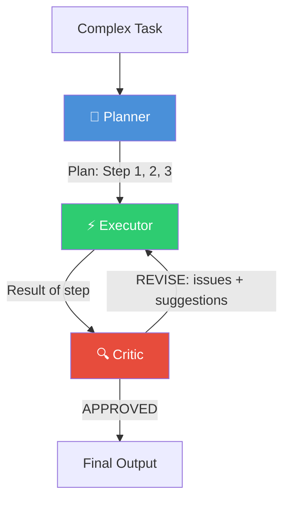
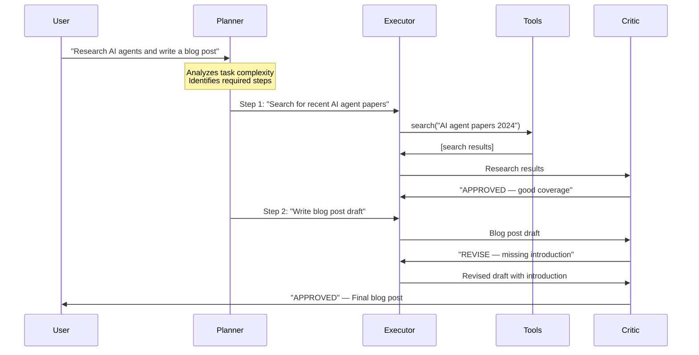
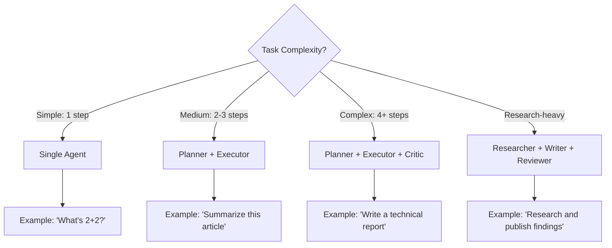
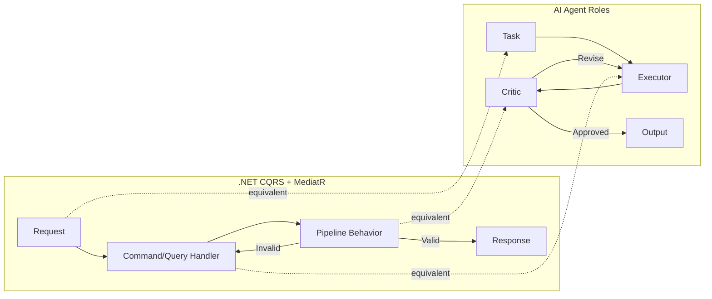

# Agent Roles — Deep Dive

> **Day 9 of your learning path** | Phase 3 — Multi-Agent Systems  
> Estimated study time: **2–3 hours**  
> Prerequisites: Phase 2 complete (function calling, structured output, error handling)

---

## Table of Contents

1. [Simple Explanation](#1-simple-explanation)
2. [Why It Matters](#2-why-it-matters)
3. [Internal Working](#3-internal-working)
4. [Real-World Use Cases](#4-real-world-use-cases)
5. [Common Beginner Mistakes](#5-common-beginner-mistakes)
6. [Best Practices](#6-best-practices)
7. [Python Examples](#7-python-examples)
8. [.NET / C# Equivalent Explanation](#8-net--c-equivalent-explanation)
9. [Diagrams](#9-diagrams)
10. [Mental Models and Analogies](#10-mental-models-and-analogies)

---

## 1. Simple Explanation

In Phase 1 and 2, you built a single agent that does everything — it reads the question, decides what to do, calls tools, and generates the answer. That works for simple tasks, but complex tasks benefit from **specialization**.

**Agent roles** means giving different agents different jobs:

| Role | What It Does | Human Equivalent |
|---|---|---|
| **Planner** | Breaks a complex task into steps | Project manager writing a task list |
| **Executor** | Carries out individual steps | Developer writing code for a specific ticket |
| **Critic** | Reviews work and identifies problems | QA engineer or code reviewer |
| **Researcher** | Gathers information from sources | Research analyst pulling data |
| **Writer** | Produces the final output | Technical writer creating documentation |

The key insight: **each role gets a different system prompt** that focuses its behavior. A Planner agent doesn't have access to tools — it just thinks about strategy. An Executor agent doesn't plan — it just executes what it's told.

### Why Not One Agent?

A single agent trying to do everything tends to:
- Get confused about whether to plan or act
- Skip planning and jump to execution
- Forget to review its own work
- Produce lower quality because it's "context switching" between roles

By splitting into roles, each agent stays focused on what it does best.

---

## 2. Why It Matters

### The Complexity Cliff

Simple tasks (one tool, one step) work great with a single agent. But as tasks get complex, a single agent's quality drops dramatically:

```
Task Complexity vs. Single Agent Quality:

Quality
  100% |██████████
   90% |███████████████
   80% |████████████████████
   70% |██████████████████████████
   60% |█████████████████████████████████           ← Quality cliff
   40% |█████████████████████████████████████████
   20% |████████████████████████████████████████████████
       └──────────────────────────────────────────────
       Simple    Medium    Complex    Very Complex
```

With specialized roles, quality stays high because each agent handles a manageable piece:

```
Task Complexity vs. Multi-Role Quality:

Quality
  100% |██████████
   95% |███████████████
   90% |████████████████████
   85% |██████████████████████████
   80% |█████████████████████████████████           ← Gradual decline
   75% |█████████████████████████████████████████
   70% |████████████████████████████████████████████████
       └──────────────────────────────────────────────
       Simple    Medium    Complex    Very Complex
```

### When to Use Roles

| Scenario | Single Agent | Multiple Roles |
|---|---|---|
| "What's the weather?" | ✅ Use this | ❌ Overkill |
| "Summarize this article" | ✅ Use this | ❌ Overkill |
| "Research topic X and write a report" | ⚠️ Possible but messy | ✅ Researcher + Writer |
| "Plan a project, build it, test it" | ❌ Too much for one | ✅ Planner + Executor + Critic |
| "Analyze data, find insights, present" | ❌ Context overload | ✅ Analyst + Writer |

**Rule of thumb**: If the task has clearly distinct phases (research → analyze → write), use roles. If it's a single action, use one agent.

---

## 3. Internal Working

### The Three Core Roles

#### Planner

The Planner receives a complex task and breaks it into ordered, actionable steps. It doesn't execute anything — it only creates a plan.

```python
PLANNER_SYSTEM_PROMPT = """You are a planning specialist. Your job is to take a complex task 
and break it into clear, ordered steps.

RULES:
- Output a numbered list of steps
- Each step should be specific and actionable
- Each step should be completable by a single tool call or LLM generation
- Consider dependencies between steps
- Do NOT execute any steps — only plan them
- If information is missing, include a step to gather it

FORMAT:
1. [Step description] - [Why this step is needed]
2. [Step description] - [Why this step is needed]
...
"""
```

**Planner characteristics:**
- No tools bound (only thinks, doesn't act)
- Receives the full task description
- Outputs a structured plan
- Considers edge cases and dependencies
- May revise the plan if execution feedback suggests issues

#### Executor

The Executor takes one step from the plan and carries it out. It has access to tools and focuses entirely on completing the given step.

```python
EXECUTOR_SYSTEM_PROMPT = """You are an execution specialist. You receive a specific task 
to complete and you carry it out using your available tools.

RULES:
- Focus ONLY on the specific step you've been given
- Use the tools available to you to complete the step
- Return the result of your execution clearly
- If the step cannot be completed, explain why
- Do NOT plan ahead or modify the plan — just execute this one step
"""
```

**Executor characteristics:**
- Has tools bound (can act)
- Receives a single step, not the whole task
- Returns structured results
- Reports success or failure honestly
- Doesn't deviate from the assigned step

#### Critic

The Critic reviews the Executor's output and either approves it or requests improvements. It's the quality gate.

```python
CRITIC_SYSTEM_PROMPT = """You are a quality review specialist. You receive work output 
and evaluate it against requirements.

RULES:
- Check if the output actually addresses the original requirement
- Look for errors, omissions, and quality issues
- Be specific about what's wrong (not just "this is bad")
- Suggest concrete improvements
- If the output is acceptable, say APPROVED
- If not, say REVISE with specific feedback
- Don't rewrite the output yourself — just review it

FORMAT:
Status: APPROVED or REVISE
Issues: [list of specific issues]
Suggestions: [list of specific improvements]
"""
```

**Critic characteristics:**
- No tools (only evaluates, doesn't act)
- Receives: original requirement + executor's output
- Outputs: approval or revision requests with specifics
- Acts as a quality gate before final output

### How Roles Interact

```
Task: "Research AI agents and write a blog post"

Step 1: PLANNER receives task
  → Output: Plan with 5 steps

Step 2: EXECUTOR receives Step 1 from plan
  → Calls research tools
  → Returns raw research data

Step 3: CRITIC reviews research data
  → "APPROVED — good coverage of the topic"

Step 4: EXECUTOR receives Step 2 from plan (write draft)
  → Generates blog post draft

Step 5: CRITIC reviews draft
  → "REVISE — missing introduction, conclusion too short"

Step 6: EXECUTOR receives revision feedback
  → Rewrites with improvements

Step 7: CRITIC reviews revised draft
  → "APPROVED — ready for publication"

Final output → User
```

### Role Prompting: The Key Mechanism

The "magic" of agent roles is **system prompt engineering**. You don't need special frameworks — you just write focused, constraining system prompts:

```python
# The system prompt IS the role definition
planner = ChatGoogleGenerativeAI(model="gemini-2.0-flash")
# No tools, planning prompt
planner_messages = [SystemMessage(content=PLANNER_SYSTEM_PROMPT)]

executor = ChatGoogleGenerativeAI(model="gemini-2.0-flash")
# With tools, execution prompt
executor_with_tools = executor.bind_tools([search, calculator, database])
executor_messages = [SystemMessage(content=EXECUTOR_SYSTEM_PROMPT)]

critic = ChatGoogleGenerativeAI(model="gemini-2.0-flash")
# No tools, review prompt
critic_messages = [SystemMessage(content=CRITIC_SYSTEM_PROMPT)]
```

Same LLM, same model, different behavior — all driven by the system prompt.

---

## 4. Real-World Use Cases

### 1. Content Generation Pipeline

```
Researcher → gathers sources, facts, data
Outliner (Planner) → creates structure for the content
Writer (Executor) → produces the draft
Editor (Critic) → reviews for quality, accuracy, tone
Writer → revises based on feedback
Editor → final approval
```

### 2. Code Generation and Review

```
Planner → breaks feature request into coding tasks
Coder (Executor) → writes code for each task
Reviewer (Critic) → checks for bugs, security, style
Coder → fixes issues
Tester (specialized Critic) → runs/verifies test scenarios
```

### 3. Data Analysis Report

```
Planner → identifies what data to gather and analyze
Data Gatherer (Executor) → queries databases, APIs
Analyst (specialized Executor) → processes data, finds patterns
Report Writer → creates narrative from analysis
Fact Checker (Critic) → validates claims against source data
```

### 4. Customer Support Escalation

```
Classifier (Planner) → categorizes issue and determines complexity
First-Line Agent (Executor) → attempts resolution with standard tools
Quality Checker (Critic) → reviews if response actually solves the issue
Escalation Agent → if quality check fails, routes to specialized handler
```

### 5. Investment Research

```
Planner → identifies research areas (financials, competitors, market)
Financial Analyst (Executor) → analyzes financial data
Market Researcher (Executor) → analyzes market trends
Critic → validates analysis for logical consistency
Synthesizer (Writer) → combines into investment thesis
```

---

## 5. Common Beginner Mistakes

### Mistake 1: Making Every Role a Separate Agent

```
# ❌ BAD — 7 agents for a simple blog post
Researcher → Outliner → Drafter → Editor → Fact Checker → Formatter → Publisher

# ✅ GOOD — Start minimal, add roles only when needed
Researcher → Writer → Reviewer
```

**Rule**: Start with 2 roles. Add a third only if quality is measurably low.

### Mistake 2: Vague Role Boundaries

```python
# ❌ BAD — Overlapping responsibilities
PLANNER_PROMPT = "Plan the work and also do some initial research..."
EXECUTOR_PROMPT = "Execute the plan, but also check if the plan makes sense..."

# ✅ GOOD — Clear, non-overlapping boundaries
PLANNER_PROMPT = "Create a plan. Do NOT execute any steps. Do NOT research."
EXECUTOR_PROMPT = "Execute the given step. Do NOT modify the plan. Do NOT review."
```

### Mistake 3: Not Constraining the Critic

```python
# ❌ BAD — Critic rewrites everything from scratch
CRITIC_PROMPT = "Review and improve the output."
# The critic just generates a whole new version, making the executor useless

# ✅ GOOD — Critic only reviews, doesn't rewrite
CRITIC_PROMPT = """Review the output. 
You MUST respond with:
  Status: APPROVED or REVISE
  Issues: [specific problems]
  Suggestions: [how to fix each problem]
Do NOT rewrite the content yourself."""
```

### Mistake 4: Infinite Revision Loops

```python
# ❌ BAD — Critic and Executor can loop forever
while critic_result.status == "REVISE":
    executor_output = executor.invoke(critic_result.feedback)
    critic_result = critic.invoke(executor_output)

# ✅ GOOD — Limit revision rounds
MAX_REVISIONS = 2
for round in range(MAX_REVISIONS):
    critic_result = critic.invoke(executor_output)
    if critic_result.status == "APPROVED":
        break
    executor_output = executor.invoke(critic_result.feedback)
else:
    # Use the last version even if not perfect
    pass
```

### Mistake 5: Passing Too Much Context Between Roles

```python
# ❌ BAD — Dumping entire conversation history to each role
# Each agent gets ALL messages from ALL other agents
# Context window fills up fast!

# ✅ GOOD — Pass only what each role needs
planner_receives = [task_description]
executor_receives = [current_step, relevant_context_only]
critic_receives = [original_requirement, executor_output_only]
```

---

## 6. Best Practices

### 1. Define Roles with RULES and FORMAT Sections

Every role prompt should have clear constraints:

```python
ROLE_PROMPT = """You are a [role name].

YOUR JOB:
[What this role does]

RULES:
- [What you MUST do]
- [What you MUST NOT do]
- [Boundaries of your responsibility]

FORMAT:
[Exactly how to structure your output]

EXAMPLES:
[One or two examples of good output]
"""
```

### 2. Use Structured Output for Role Communication

Don't pass free text between roles — use Pydantic models:

```python
class PlanOutput(BaseModel):
    steps: list[str]
    estimated_complexity: Literal["simple", "medium", "complex"]

class ExecutionResult(BaseModel):
    step_completed: str
    result: str
    success: bool
    
class CriticReview(BaseModel):
    status: Literal["APPROVED", "REVISE"]
    issues: list[str]
    suggestions: list[str]
```

### 3. Give Tools Only to Roles That Need Them

```python
# Planner: NO tools (only thinks)
planner = llm  # No bind_tools

# Executor: HAS tools (acts on the world)
executor = llm.bind_tools([search, database, calculator])

# Critic: NO tools (only reviews)
critic = llm  # No bind_tools
```

### 4. Consider Hybrid Roles

Sometimes pure role separation is too rigid. A "Planning Executor" that plans one step and immediately executes it can be more practical:

```python
PLANNING_EXECUTOR_PROMPT = """You are a task completion specialist.
For each user request:
1. THINK: What steps are needed? (1-3 steps max)
2. ACT: Execute the first step using your tools
3. OBSERVE: Check the result
4. Repeat for remaining steps
5. RESPOND: Give the final answer

This is more practical than separate planner and executor for simple tasks.
"""
```

### 5. Log Role Transitions

For debugging, track which role is active and what was passed between them:

```python
def log_role_transition(from_role: str, to_role: str, message_summary: str):
    print(f"\n{'='*60}")
    print(f"  {from_role} → {to_role}")
    print(f"  Context: {message_summary[:200]}")
    print(f"{'='*60}\n")
```

---

## 7. Python Examples

### Example 1: Simple Planner-Executor Pattern

```python
"""
Two-role system: Planner creates a plan, Executor carries it out.
"""
from langchain_google_genai import ChatGoogleGenerativeAI
from langchain_core.messages import SystemMessage, HumanMessage
from pydantic import BaseModel, Field
from typing import Literal
from dotenv import load_dotenv

load_dotenv()

# ── Define structured outputs ─────────────────────────

class Plan(BaseModel):
    steps: list[str] = Field(description="Ordered list of steps to complete the task")
    reasoning: str = Field(description="Why this plan makes sense")

class StepResult(BaseModel):
    step: str = Field(description="The step that was executed")
    result: str = Field(description="What was accomplished")
    success: bool = Field(description="Whether the step completed successfully")

# ── Create role-specific LLMs ─────────────────────────

llm = ChatGoogleGenerativeAI(model="gemini-2.0-flash")

planner = llm.with_structured_output(Plan)
executor = llm  # Free-form for execution

# ── Role prompts ──────────────────────────────────────

PLANNER_PROMPT = """You are a planning specialist. Break the user's task into 
3-5 clear, ordered steps. Each step should be specific and actionable.
Do NOT execute anything — only plan."""

EXECUTOR_PROMPT = """You are an execution specialist. You will be given a specific 
step to complete. Execute it thoroughly and return the result.
Focus ONLY on the given step."""

# ── Run the pipeline ──────────────────────────────────

def plan_and_execute(task: str) -> str:
    # Phase 1: Plan
    print(f"\n📋 PLANNER: Analyzing task...")
    plan = planner.invoke([
        SystemMessage(content=PLANNER_PROMPT),
        HumanMessage(content=task)
    ])
    print(f"Plan ({len(plan.steps)} steps):")
    for i, step in enumerate(plan.steps, 1):
        print(f"  {i}. {step}")
    
    # Phase 2: Execute each step
    results = []
    for i, step in enumerate(plan.steps, 1):
        print(f"\n⚡ EXECUTOR: Working on step {i}...")
        result = executor.invoke([
            SystemMessage(content=EXECUTOR_PROMPT),
            HumanMessage(content=f"Original task: {task}\n\nExecute this step: {step}\n\nPrevious results: {results}")
        ])
        results.append(f"Step {i}: {result.content[:500]}")
        print(f"  Result: {result.content[:200]}...")
    
    # Phase 3: Synthesize final answer
    print(f"\n📝 SYNTHESIZING final answer...")
    final = llm.invoke([
        SystemMessage(content="Combine the following step results into a coherent final answer."),
        HumanMessage(content=f"Task: {task}\n\nResults:\n" + "\n".join(results))
    ])
    
    return final.content

# ── Test it ───────────────────────────────────────────

result = plan_and_execute(
    "Explain the differences between REST and GraphQL APIs, "
    "including pros/cons of each and when to use which."
)
print(f"\n{'='*60}\nFINAL ANSWER:\n{'='*60}\n{result}")
```

### Example 2: Planner-Executor-Critic with Revision Loop

```python
"""
Three-role system with a quality gate.
Critic can send work back to the Executor for revision.
"""
from langchain_google_genai import ChatGoogleGenerativeAI
from langchain_core.messages import SystemMessage, HumanMessage
from pydantic import BaseModel, Field
from typing import Literal
from dotenv import load_dotenv

load_dotenv()

# ── Structured outputs for role communication ─────────

class CriticReview(BaseModel):
    status: Literal["APPROVED", "REVISE"] = Field(description="Whether the output passes quality review")
    issues: list[str] = Field(description="Specific problems found (empty if APPROVED)")
    suggestions: list[str] = Field(description="How to fix each issue")
    quality_score: int = Field(ge=1, le=10, description="Quality score 1-10")

# ── Role-specific LLMs ────────────────────────────────

llm = ChatGoogleGenerativeAI(model="gemini-2.0-flash")
critic_llm = llm.with_structured_output(CriticReview)

EXECUTOR_PROMPT = """You are a writing specialist. Write clear, well-structured content 
based on the given topic. If you receive revision feedback, address each point specifically."""

CRITIC_PROMPT = """You are a quality reviewer. Evaluate the given content for:
- Accuracy: Are the facts correct?
- Completeness: Are all important aspects covered?
- Clarity: Is it easy to understand?
- Structure: Is it well-organized?

Be constructive but honest. Only APPROVE if quality score is 7 or above."""

# ── Run with revision loop ────────────────────────────

def execute_with_review(task: str, max_revisions: int = 2) -> str:
    # Initial execution
    print("⚡ EXECUTOR: Creating initial output...")
    output = llm.invoke([
        SystemMessage(content=EXECUTOR_PROMPT),
        HumanMessage(content=task)
    ]).content
    
    for revision in range(max_revisions):
        # Critic reviews
        print(f"\n🔍 CRITIC: Reviewing (round {revision + 1})...")
        review = critic_llm.invoke([
            SystemMessage(content=CRITIC_PROMPT),
            HumanMessage(content=f"Original task: {task}\n\nOutput to review:\n{output}")
        ])
        
        print(f"  Status: {review.status} (score: {review.quality_score}/10)")
        if review.issues:
            for issue in review.issues:
                print(f"  Issue: {issue}")
        
        if review.status == "APPROVED":
            print("  ✅ APPROVED!")
            return output
        
        # Revision needed
        print("  📝 Sending back for revision...")
        revision_prompt = f"""Original task: {task}

Your previous output:
{output}

REVISION REQUIRED. Address these issues:
{chr(10).join(f'- {issue}' for issue in review.issues)}

Suggestions:
{chr(10).join(f'- {s}' for s in review.suggestions)}

Rewrite the output addressing ALL issues above."""

        output = llm.invoke([
            SystemMessage(content=EXECUTOR_PROMPT),
            HumanMessage(content=revision_prompt)
        ]).content
    
    print("  ⚠️ Max revisions reached, using last version.")
    return output

# ── Test it ───────────────────────────────────────────

result = execute_with_review("Write a technical explanation of how DNS resolution works, suitable for junior developers.")
print(f"\n{'='*60}\nFINAL OUTPUT:\n{'='*60}\n{result}")
```

### Example 3: Role as a Reusable Class

```python
"""
Encapsulate agent roles as reusable classes.
This is a clean pattern for building multi-agent systems.
"""
from langchain_google_genai import ChatGoogleGenerativeAI
from langchain_core.messages import SystemMessage, HumanMessage
from langchain_core.tools import tool
from dotenv import load_dotenv

load_dotenv()

class AgentRole:
    """Base class for an agent role. 
    Think of this as an abstract base class / interface in .NET."""
    
    def __init__(self, name: str, system_prompt: str, tools: list = None):
        self.name = name
        self.llm = ChatGoogleGenerativeAI(model="gemini-2.0-flash")
        self.system_prompt = system_prompt
        
        if tools:
            self.llm = self.llm.bind_tools(tools)
        
        self.history = [SystemMessage(content=system_prompt)]
    
    def invoke(self, message: str) -> str:
        """Send a message to this role and get a response."""
        self.history.append(HumanMessage(content=message))
        response = self.llm.invoke(self.history)
        self.history.append(response)
        return response.content
    
    def reset(self):
        """Clear conversation history, keeping system prompt."""
        self.history = [SystemMessage(content=self.system_prompt)]

# ── Create specific roles ─────────────────────────────

planner = AgentRole(
    name="Planner",
    system_prompt="""You are a planning specialist. Break tasks into 3-5 ordered steps.
    Output ONLY the numbered steps, nothing else."""
)

researcher = AgentRole(
    name="Researcher",
    system_prompt="""You are a research specialist. When given a topic, provide 
    comprehensive, factual information organized by subtopic. Include key statistics 
    and contrasting viewpoints where relevant."""
)

writer = AgentRole(
    name="Writer",
    system_prompt="""You are a writing specialist. Take research notes and create 
    polished, well-structured content. Use clear headings, examples, and a logical flow.
    Target audience: technical professionals."""
)

reviewer = AgentRole(
    name="Reviewer",
    system_prompt="""You are a review specialist. Evaluate content for accuracy, 
    completeness, and clarity. Respond with either:
    APPROVED: [brief reason]
    or
    REVISE: [specific issues and suggestions]"""
)

# ── Orchestrate roles ─────────────────────────────────

def multi_role_pipeline(task: str) -> str:
    print(f"📋 {planner.name}: Planning...")
    plan = planner.invoke(task)
    print(f"  Plan:\n{plan}\n")
    
    print(f"🔬 {researcher.name}: Researching...")
    research = researcher.invoke(f"Research the following topic based on this plan:\nPlan: {plan}\nOriginal task: {task}")
    print(f"  Research complete ({len(research)} chars)\n")
    
    print(f"✍️ {writer.name}: Writing...")
    draft = writer.invoke(f"Write content based on this research:\n{research}\n\nOriginal task: {task}")
    print(f"  Draft complete ({len(draft)} chars)\n")
    
    print(f"🔍 {reviewer.name}: Reviewing...")
    review = reviewer.invoke(f"Review this content:\n{draft}\n\nOriginal task: {task}")
    print(f"  Review: {review[:200]}\n")
    
    if "REVISE" in review.upper():
        print(f"✍️ {writer.name}: Revising...")
        draft = writer.invoke(f"Revise based on this feedback:\n{review}")
    
    return draft

# ── Test ──────────────────────────────────────────────

result = multi_role_pipeline("Explain microservices vs monolith architecture for a tech blog")
print(f"\n{'='*60}\n{result}")
```

---

## 8. .NET / C# Equivalent Explanation

### Agent Roles ≈ CQRS + MediatR Pipeline

The Planner-Executor-Critic pattern maps directly to CQRS and MediatR:

```csharp
// .NET CQRS: Command (Executor) vs Query (Researcher) separation
public class ResearchQuery : IRequest<ResearchResult>
{
    public string Topic { get; set; }
}

public class WriteCommand : IRequest<ContentResult>
{
    public ResearchResult Research { get; set; }
    public string Task { get; set; }
}

// MediatR pipeline behavior (≈ Critic role)
public class QualityReviewBehavior<TRequest, TResponse> 
    : IPipelineBehavior<TRequest, TResponse>
{
    public async Task<TResponse> Handle(
        TRequest request, 
        RequestHandlerDelegate<TResponse> next,
        CancellationToken ct)
    {
        var result = await next();  // Executor produces result
        
        // Critic reviews
        var review = await _qualityService.Review(result);
        if (!review.IsApproved)
        {
            // Send back for revision
            return await next();  // Re-execute with feedback
        }
        
        return result;
    }
}
```

```python
# AI equivalent: Same flow, different syntax
plan = planner.invoke(task)          # ≈ IRequest<Plan>
research = researcher.invoke(plan)   # ≈ ResearchQuery handler
draft = writer.invoke(research)      # ≈ WriteCommand handler
review = critic.invoke(draft)        # ≈ IPipelineBehavior
if review.status == "REVISE":
    draft = writer.invoke(feedback)  # ≈ Re-handle with feedback
```

### Planner ≈ Orchestration Service / Saga Coordinator

```csharp
// .NET: A saga coordinator plans the steps
public class OrderSaga : ISaga
{
    public IEnumerable<SagaStep> Plan(OrderRequest request)
    {
        yield return new ValidateInventoryStep();
        yield return new ProcessPaymentStep();
        yield return new ShipOrderStep();
        yield return new SendConfirmationStep();
    }
}
```

```python
# AI: A planner agent does the same thing
plan = planner.invoke("Process this customer order")
# Returns: ["1. Validate inventory", "2. Process payment", "3. Ship order", "4. Send confirmation"]
```

### Critic ≈ Validation Pipeline / Code Review Bot

```csharp
// .NET: A validation pipeline that gates output quality
public class QualityGate
{
    private readonly IValidator<ContentResult> _validator;
    
    public ValidationResult Review(ContentResult content)
    {
        var result = _validator.Validate(content);
        return result.IsValid 
            ? ValidationResult.Approved() 
            : ValidationResult.NeedsRevision(result.Errors);
    }
}
```

### The Full .NET Mapping

| Agent Role | .NET Pattern | Key Similarity |
|---|---|---|
| **Planner** | Saga Coordinator / Orchestrator | Breaks work into steps |
| **Executor** | Command Handler (MediatR) | Does one specific thing |
| **Critic** | IPipelineBehavior / Validator | Quality gate before output |
| **Researcher** | Query Handler (MediatR) | Gathers data without side effects |
| **Writer** | View/Response formatter | Produces the final output |
| **Role prompt** | Interface definition | Constrains what the component can do |
| **Role switching** | Strategy pattern | Same input, different behavior based on role |

---

## 9. Diagrams

### The Three Core Roles



### Role Interaction Flow (Detailed)



### When to Use Which Role Configuration



### .NET CQRS Mapping



---

## 10. Mental Models and Analogies

### The Film Production Analogy

Making a movie requires specialized roles, not one person doing everything:

| Film Role | Agent Role | What They Do |
|---|---|---|
| Director | **Planner** | Decides the vision and sequence of scenes |
| Actor | **Executor** | Performs specific scenes as directed |
| Film Critic | **Critic** | Reviews the final cut and gives feedback |
| Researcher | **Researcher** | Gathers historical accuracy, reference material |
| Screenwriter | **Writer** | Creates the final script |

You'd never ask the actor to also direct, write the script, AND review the film. Each role stays in its lane.

### The Restaurant Kitchen Analogy

```
Head Chef (Planner):     Designs the menu, plans the order of dishes
Line Cook (Executor):    Cooks each dish as instructed
Food Critic (Critic):    Tastes and approves before serving
Sous Chef (Researcher):  Sources ingredients, tests new recipes
```

### The .NET Developer's Mental Model

```
Agent roles are just the Single Responsibility Principle applied to AI.

In .NET:
  - Each class has ONE job (SRP)
  - Each service implements ONE interface
  - Each MediatR handler handles ONE request type

In AI:
  - Each agent has ONE role (Planner OR Executor OR Critic)
  - Each role has ONE system prompt
  - Each role produces ONE type of output

You already think this way.
The only difference: the "classes" are LLM instances with different prompts.
```

### The Three Questions Mental Model

When designing roles, ask three questions:
1. **Who thinks?** → Planner (no tools, only strategy)
2. **Who acts?** → Executor (has tools, follows instructions)
3. **Who checks?** → Critic (no tools, only evaluation)

If your system has clear answers to all three, you have good role separation. If one role does two of these, your boundaries are blurry.

---

## Summary

| Concept | One-Line Summary |
|---|---|
| Agent roles | Specialized agents with focused responsibilities |
| Planner | Breaks complex tasks into ordered steps (no tools) |
| Executor | Carries out individual steps (has tools) |
| Critic | Reviews output quality and requests revisions (no tools) |
| Role prompting | Using system prompts to constrain an agent's behavior to a specific role |
| Revision loop | Critic sends feedback to Executor for improvement (with max iterations) |
| Hybrid roles | Combining two roles when pure separation is overkill |

---

**Next**: [02_sequential_communication.md](./02_sequential_communication.md) — Learn how to chain agents in a pipeline where Agent A's output feeds into Agent B.
