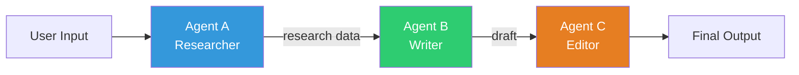
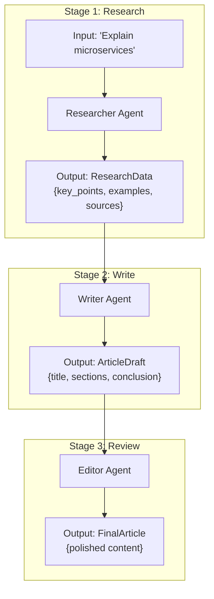
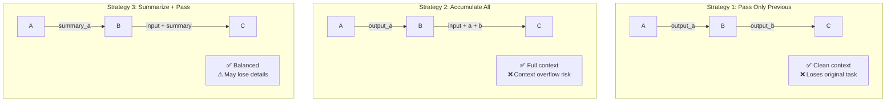
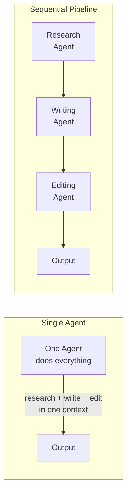
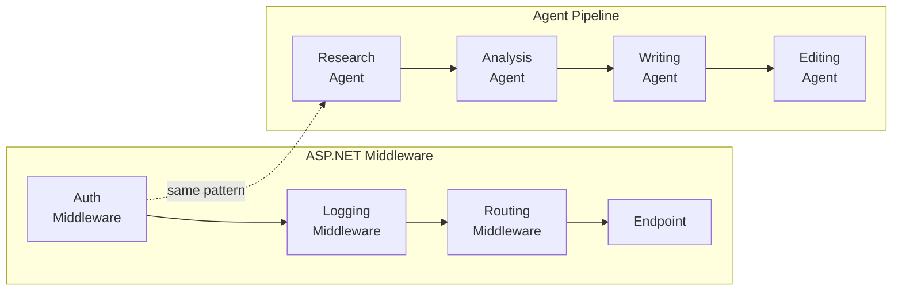

# Sequential Communication — Deep Dive

> **Day 10 of your learning path** | Phase 3 — Multi-Agent Systems  
> Estimated study time: **2–3 hours**  
> Prerequisites: Agent Roles (01_agent_roles.md)

---

## Table of Contents

1. [Simple Explanation](#1-simple-explanation)
2. [Why It Matters](#2-why-it-matters)
3. [Internal Working](#3-internal-working)
4. [Real-World Use Cases](#4-real-world-use-cases)
5. [Common Beginner Mistakes](#5-common-beginner-mistakes)
6. [Best Practices](#6-best-practices)
7. [Python Examples](#7-python-examples)
8. [.NET / C# Equivalent Explanation](#8-net--c-equivalent-explanation)
9. [Diagrams](#9-diagrams)
10. [Mental Models and Analogies](#10-mental-models-and-analogies)

---

## 1. Simple Explanation

Sequential communication is the simplest multi-agent pattern: **Agent A does its work, passes the result to Agent B, which does its work and passes to Agent C**, and so on.

```
Input → [Agent A] → output_a → [Agent B] → output_b → [Agent C] → Final Output
```

It's a pipeline. Like a factory assembly line where each worker adds something to the product before passing it to the next worker.

In your existing codebase, you've already seen this in a simpler form — in ASP.NET middleware, each middleware processes the request and passes it to the next. Sequential agent communication works the same way, but each "middleware" is an LLM agent.

### Key Property

Each agent in the pipeline:
- Receives the **output of the previous agent** (not the raw user input)
- Does **one specific transformation** 
- Passes its result to the **next agent**
- Cannot go backwards or skip agents in the chain

This means the order of agents matters. Like in a factory — you can't paint before you cut, and you can't package before you paint.

---

## 2. Why It Matters

### Why Not Just Use One Agent?

One agent CAN do multiple steps, but:

| One Agent (All Steps) | Sequential Pipeline |
|---|---|
| Long, complex system prompt | Short, focused prompts per agent |
| Context window fills up fast | Each agent gets clean context |
| Hard to debug (which step failed?) | Easy to debug (check each agent's output) |
| Hard to improve (change affects everything) | Easy to improve (change one agent) |
| All-or-nothing execution | Can stop/resume at any stage |

### Where Pipelines Shine

Sequential pipelines are perfect when your task has **clearly ordered phases** where each phase transforms the data:

```
Raw Data → Clean Data → Analyzed Data → Report → Reviewed Report
```

Each step takes one form of data and produces another. The steps are naturally ordered — you can't analyze dirty data, and you can't review a report that hasn't been written.

---

## 3. Internal Working

### The Message Flow

In a sequential pipeline, the conversation history is NOT shared across agents. Each agent gets a fresh conversation with only the relevant context:

```python
# Agent A gets: System prompt + User's original question
# Agent A produces: Research notes

# Agent B gets: System prompt + Agent A's research notes
# Agent B produces: Draft article

# Agent C gets: System prompt + Agent B's draft + Original question
# Agent C produces: Final reviewed article
```

This is intentional. Each agent has a "clean" context window focused on its specific job.

### Context Management Strategies

#### Strategy 1: Pass Only Previous Output

```python
# Each agent only sees the immediately previous output
result_a = agent_a.invoke(user_input)
result_b = agent_b.invoke(result_a)        # Only sees A's output
result_c = agent_c.invoke(result_b)        # Only sees B's output
```

**Pro**: Clean, minimal context. **Con**: Later agents lose original context.

#### Strategy 2: Accumulate Context

```python
# Each agent sees all previous outputs
result_a = agent_a.invoke(user_input)
result_b = agent_b.invoke(f"Original: {user_input}\nResearch: {result_a}")
result_c = agent_c.invoke(f"Original: {user_input}\nResearch: {result_a}\nDraft: {result_b}")
```

**Pro**: Full context available. **Con**: Context window fills up.

#### Strategy 3: Summarize and Pass

```python
# Summarize large outputs before passing
result_a = agent_a.invoke(user_input)
summary_a = summarize(result_a)  # Compress long output
result_b = agent_b.invoke(f"Original: {user_input}\nResearch summary: {summary_a}")
```

**Pro**: Best of both worlds. **Con**: Summarization may lose details.

### Data Transformation at Each Step

Think of each agent as a **function** that transforms data from one type to another:

```
Agent A: str (raw question) → ResearchData (facts, sources)
Agent B: ResearchData → DraftContent (structured article)
Agent C: DraftContent → ReviewedContent (polished article)
Agent D: ReviewedContent → FormattedOutput (HTML/Markdown)
```

Each step has a clear input type and output type. This is exactly like a pipeline of functions in functional programming, or a series of middleware in ASP.NET.

---

## 4. Real-World Use Cases

### 1. Content Creation Pipeline

```
User: "Write a blog post about microservices"

Agent 1 (Researcher):   Gathers facts, examples, current trends
Agent 2 (Outliner):      Creates logical structure from research
Agent 3 (Writer):        Produces full draft from outline
Agent 4 (Editor):        Polishes prose, fixes grammar, improves clarity
Agent 5 (SEO Optimizer): Adds keywords, meta description, headings
```

### 2. Code Generation Pipeline

```
User: "Build a REST API for user management"

Agent 1 (Architect):     Designs API endpoints, data models
Agent 2 (Coder):         Generates code from architecture
Agent 3 (Test Writer):   Creates test cases from the code
Agent 4 (Code Reviewer): Checks for bugs, security, best practices
```

### 3. Data Processing Pipeline

```
User: "Analyze our Q4 sales data"

Agent 1 (Data Cleaner):    Identifies and handles missing/invalid data
Agent 2 (Analyst):          Runs statistical analysis, finds trends
Agent 3 (Visualizer):       Creates chart descriptions and data summaries
Agent 4 (Report Writer):    Combines into narrative report
```

### 4. Email Processing Pipeline

```
Incoming email → 

Agent 1 (Classifier):      Categorizes: support/sales/spam/personal
Agent 2 (Summarizer):       Creates 2-line summary
Agent 3 (Action Extractor): Identifies required actions
Agent 4 (Responder):        Drafts appropriate response
```

### 5. Translation with Quality Control

```
User: "Translate this legal document to Japanese"

Agent 1 (Translator):       Raw translation
Agent 2 (Legal Reviewer):   Checks legal terminology accuracy
Agent 3 (Native Speaker):   Reviews natural language flow
Agent 4 (Formatter):        Matches original document formatting
```

---

## 5. Common Beginner Mistakes

### Mistake 1: Pipeline Too Long

```
# ❌ BAD — 7 agents for a simple task
User → Understander → Researcher → Planner → Writer → Reviewer → Formatter → Publisher

# ✅ GOOD — Minimal agents for simple tasks
User → Researcher → Writer → Reviewer
```

**Rule**: Each agent should meaningfully transform the data. If removing an agent doesn't change the quality, remove it.

### Mistake 2: Losing the Original Task

```python
# ❌ BAD — By Agent C, the original question is lost
result_a = agent_a.invoke(user_input)
result_b = agent_b.invoke(result_a)  # Only sees Agent A's output
result_c = agent_c.invoke(result_b)  # Has no idea what the user originally asked

# ✅ GOOD — Pass original context along
result_b = agent_b.invoke(f"Original task: {user_input}\n\nPrevious output:\n{result_a}")
```

### Mistake 3: No Error Handling Between Stages

```python
# ❌ BAD — If Agent B fails, Agent C gets garbage
result_a = agent_a.invoke(input)
result_b = agent_b.invoke(result_a)  # Might fail or produce garbage
result_c = agent_c.invoke(result_b)  # Garbage in, garbage out

# ✅ GOOD — Validate between stages
result_a = agent_a.invoke(input)
if not validate_research(result_a):
    return "Research stage produced insufficient data. Please refine the query."

result_b = agent_b.invoke(result_a)
if not validate_draft(result_b):
    result_b = agent_b.invoke(f"Your previous output was insufficient. Try again:\n{result_a}")
```

### Mistake 4: Context Window Overflow

```python
# ❌ BAD — Accumulating everything blows context
context = user_input
for agent in [agent_a, agent_b, agent_c, agent_d, agent_e]:
    result = agent.invoke(context)
    context += "\n\n" + result  # Context grows with each step!

# ✅ GOOD — Pass only what each agent needs
results = {}
results['research'] = agent_a.invoke(user_input)
results['outline'] = agent_b.invoke(summarize(results['research']))
results['draft'] = agent_c.invoke(results['outline'])  # Only needs outline, not raw research
results['final'] = agent_d.invoke(results['draft'])
```

### Mistake 5: Not Defining Input/Output Contracts

```python
# ❌ BAD — Agents return arbitrary text, next agent has to guess the format
# Agent A might return "Here's what I found: ..." or "Research results: ..." or just data

# ✅ GOOD — Use structured output for clear contracts
class ResearchOutput(BaseModel):
    findings: list[str]
    sources: list[str]
    confidence: float

class DraftOutput(BaseModel):
    title: str
    sections: list[str]
    word_count: int
```

---

## 6. Best Practices

### 1. Define Clear Input/Output Types

Every agent in the pipeline should have a clear contract:

```python
from pydantic import BaseModel, Field

class PipelineStage:
    """Base for a pipeline stage with typed I/O."""
    input_type: type = str
    output_type: type = str
    
class ResearchStage(PipelineStage):
    input_type = str  # Raw question
    output_type = "ResearchOutput"  # Structured findings
    
class WritingStage(PipelineStage):
    input_type = "ResearchOutput"
    output_type = "DraftOutput"
```

### 2. Add Validation Between Stages

```python
def validate_stage_output(output, stage_name: str) -> bool:
    """Check if a stage produced usable output."""
    if not output or len(str(output)) < 50:
        print(f"⚠️ {stage_name} produced insufficient output ({len(str(output))} chars)")
        return False
    return True
```

### 3. Support Pipeline Interruption

Allow stopping the pipeline mid-way and resuming later:

```python
class Pipeline:
    def __init__(self, stages: list):
        self.stages = stages
        self.results = {}
    
    def run(self, input_data: str, start_from: int = 0) -> str:
        data = input_data
        for i, stage in enumerate(self.stages[start_from:], start=start_from):
            print(f"Running stage {i}: {stage.name}")
            data = stage.invoke(data)
            self.results[i] = data  # Save checkpoint
        return data
    
    def resume_from(self, stage_num: int) -> str:
        """Resume from a specific stage using cached results."""
        last_result = self.results[stage_num - 1]
        return self.run(last_result, start_from=stage_num)
```

### 4. Keep Pipelines Short (3-4 Stages Max)

Each stage adds latency (LLM call) and cost (tokens). For most tasks, 3-4 stages is optimal:

```
Research → Write → Review        (3 stages — most tasks)
Research → Analyze → Write → Review  (4 stages — complex analysis)
```

### 5. Use Structured Output for Inter-Agent Communication

This is the single most important practice. Free text between agents is unreliable:

```python
# ✅ GOOD — Structured contract between agents
class HandoffData(BaseModel):
    """Data passed from research agent to writing agent."""
    original_task: str
    key_findings: list[str]
    relevant_examples: list[str]
    suggested_structure: list[str]
    confidence: float

research_agent = llm.with_structured_output(HandoffData)
```

---

## 7. Python Examples

### Example 1: Simple Two-Agent Pipeline

```python
"""
Minimal sequential pipeline: Researcher → Writer.
"""
from langchain_google_genai import ChatGoogleGenerativeAI
from langchain_core.messages import SystemMessage, HumanMessage
from dotenv import load_dotenv

load_dotenv()

llm = ChatGoogleGenerativeAI(model="gemini-2.0-flash")

# ── Define pipeline stages ────────────────────────────

def research_stage(topic: str) -> str:
    """Stage 1: Research the topic."""
    response = llm.invoke([
        SystemMessage(content="""You are a research specialist. 
Given a topic, provide comprehensive research notes including:
- Key concepts and definitions
- Important facts and statistics
- Common misconceptions
- Different perspectives

Output ONLY research notes. Do NOT write the final article."""),
        HumanMessage(content=f"Research this topic: {topic}")
    ])
    return response.content

def writing_stage(research_notes: str, original_topic: str) -> str:
    """Stage 2: Write article from research."""
    response = llm.invoke([
        SystemMessage(content="""You are a technical writer.
Given research notes, write a clear, well-structured article.
Include an introduction, main sections with headings, and a conclusion.
Target audience: software developers."""),
        HumanMessage(content=f"Original topic: {original_topic}\n\nResearch notes:\n{research_notes}")
    ])
    return response.content

# ── Run the pipeline ──────────────────────────────────

topic = "How garbage collection works in modern programming languages"

print("📚 Stage 1: Researching...")
research = research_stage(topic)
print(f"  Research complete ({len(research)} chars)")

print("\n✍️ Stage 2: Writing...")
article = writing_stage(research, topic)
print(f"  Article complete ({len(article)} chars)")

print(f"\n{'='*60}\n{article}")
```

### Example 2: Pipeline with Structured Handoffs

```python
"""
Pipeline with typed data flowing between stages.
Each stage has a clear input/output contract.
"""
from langchain_google_genai import ChatGoogleGenerativeAI
from langchain_core.messages import SystemMessage, HumanMessage
from pydantic import BaseModel, Field
from typing import Literal
from dotenv import load_dotenv

load_dotenv()

# ── Define data contracts ─────────────────────────────

class ResearchData(BaseModel):
    topic: str = Field(description="The topic that was researched")
    key_points: list[str] = Field(description="Main findings, 5-10 bullet points")
    examples: list[str] = Field(description="Real-world examples found")
    complexity: Literal["beginner", "intermediate", "advanced"] = Field(
        description="Complexity level of the topic"
    )

class ArticleDraft(BaseModel):
    title: str = Field(description="Article title")
    introduction: str = Field(description="Opening paragraph")
    sections: list[str] = Field(description="Main content sections")
    conclusion: str = Field(description="Closing paragraph")

class ReviewResult(BaseModel):
    approved: bool = Field(description="Whether the article is ready")
    overall_score: int = Field(ge=1, le=10, description="Quality 1-10")
    strengths: list[str] = Field(description="What's good about the article")
    improvements: list[str] = Field(description="What needs work")

# ── Pipeline stages ───────────────────────────────────

llm = ChatGoogleGenerativeAI(model="gemini-2.0-flash")

def stage_research(topic: str) -> ResearchData:
    researcher = llm.with_structured_output(ResearchData)
    return researcher.invoke([
        SystemMessage(content="You are a research specialist. Gather key facts about the given topic."),
        HumanMessage(content=f"Research: {topic}")
    ])

def stage_write(research: ResearchData) -> ArticleDraft:
    writer = llm.with_structured_output(ArticleDraft)
    return writer.invoke([
        SystemMessage(content="You are a technical writer. Create an article from these research notes."),
        HumanMessage(content=f"Research data:\n{research.model_dump_json(indent=2)}")
    ])

def stage_review(draft: ArticleDraft, original_topic: str) -> ReviewResult:
    reviewer = llm.with_structured_output(ReviewResult)
    return reviewer.invoke([
        SystemMessage(content="You are a content reviewer. Evaluate this article for quality and accuracy."),
        HumanMessage(content=f"Topic: {original_topic}\n\nArticle:\n{draft.model_dump_json(indent=2)}")
    ])

# ── Run the pipeline ──────────────────────────────────

def content_pipeline(topic: str) -> str:
    print(f"📚 Stage 1: Research")
    research = stage_research(topic)
    print(f"  Found {len(research.key_points)} key points, complexity: {research.complexity}")
    
    print(f"\n✍️ Stage 2: Write")
    draft = stage_write(research)
    print(f"  Title: {draft.title}")
    print(f"  Sections: {len(draft.sections)}")
    
    print(f"\n🔍 Stage 3: Review")
    review = stage_review(draft, topic)
    print(f"  Score: {review.overall_score}/10")
    print(f"  Approved: {review.approved}")
    
    if not review.approved and review.improvements:
        print(f"\n✍️ Stage 2b: Revise")
        # Re-write with feedback
        writer = llm.with_structured_output(ArticleDraft)
        draft = writer.invoke([
            SystemMessage(content="Revise this article based on the reviewer's feedback."),
            HumanMessage(content=f"Current draft:\n{draft.model_dump_json(indent=2)}\n\n"
                        f"Improvements needed:\n" + "\n".join(f"- {i}" for i in review.improvements))
        ])
    
    # Format final output
    output = f"# {draft.title}\n\n{draft.introduction}\n\n"
    for section in draft.sections:
        output += f"{section}\n\n"
    output += draft.conclusion
    
    return output

# ── Test ──────────────────────────────────────────────

result = content_pipeline("How dependency injection works and why it matters")
print(f"\n{'='*60}\n{result}")
```

### Example 3: Reusable Pipeline Framework

```python
"""
A generic pipeline class that chains any number of agents.
"""
from langchain_google_genai import ChatGoogleGenerativeAI
from langchain_core.messages import SystemMessage, HumanMessage
from dotenv import load_dotenv
from typing import Callable
import time

load_dotenv()

class PipelineStage:
    """One stage in an agent pipeline."""
    
    def __init__(self, name: str, system_prompt: str, 
                 include_original: bool = False,
                 structured_output=None):
        self.name = name
        self.system_prompt = system_prompt
        self.include_original = include_original
        
        llm = ChatGoogleGenerativeAI(model="gemini-2.0-flash")
        if structured_output:
            self.llm = llm.with_structured_output(structured_output)
        else:
            self.llm = llm
    
    def run(self, input_data: str, original_input: str = None) -> str:
        messages = [SystemMessage(content=self.system_prompt)]
        
        if self.include_original and original_input:
            messages.append(HumanMessage(
                content=f"Original request: {original_input}\n\n"
                       f"Previous stage output:\n{input_data}"
            ))
        else:
            messages.append(HumanMessage(content=input_data))
        
        result = self.llm.invoke(messages)
        
        if hasattr(result, 'content'):
            return result.content
        elif hasattr(result, 'model_dump_json'):
            return result.model_dump_json(indent=2)
        return str(result)


class AgentPipeline:
    """Chain multiple agents in sequence. Like ASP.NET middleware pipeline."""
    
    def __init__(self, *stages: PipelineStage):
        self.stages = stages
        self.checkpoints = {}
    
    def run(self, user_input: str, verbose: bool = True) -> str:
        data = user_input
        
        for i, stage in enumerate(self.stages):
            if verbose:
                print(f"\n{'─'*40}")
                print(f"Stage {i+1}/{len(self.stages)}: {stage.name}")
            
            start = time.time()
            data = stage.run(data, original_input=user_input)
            elapsed = time.time() - start
            
            self.checkpoints[stage.name] = data
            
            if verbose:
                print(f"  Completed in {elapsed:.1f}s ({len(data)} chars)")
        
        return data

# ── Build a pipeline ──────────────────────────────────

pipeline = AgentPipeline(
    PipelineStage(
        name="Researcher",
        system_prompt="Research the given topic. Return organized, factual notes with key points."
    ),
    PipelineStage(
        name="Analyzer",
        system_prompt="Analyze these research notes. Identify patterns, contradictions, and key insights. Rank findings by importance.",
        include_original=True
    ),
    PipelineStage(
        name="Writer",
        system_prompt="Write a clear, engaging article from this analysis. Use headings, examples, and a logical flow.",
        include_original=True
    ),
    PipelineStage(
        name="Editor",
        system_prompt="Edit this article for clarity, conciseness, and accuracy. Fix any issues. Return the final polished version.",
        include_original=True
    )
)

# ── Run it ────────────────────────────────────────────

result = pipeline.run("Explain event-driven architecture vs request-response patterns")
print(f"\n{'='*60}\nFINAL OUTPUT:\n{'='*60}\n{result[:500]}...")
```

---

## 8. .NET / C# Equivalent Explanation

### Sequential Agents ≈ ASP.NET Middleware Pipeline

This is the most direct .NET mapping. In ASP.NET, middleware forms a pipeline:

```csharp
// .NET: Each middleware processes and passes to next
app.UseAuthentication();    // Stage 1: Authenticate
app.UseAuthorization();     // Stage 2: Authorize
app.UseRouting();           // Stage 3: Route
app.UseEndpoints(...);      // Stage 4: Handle

// Each middleware:
// 1. Receives HttpContext from previous middleware
// 2. Does its transformation
// 3. Calls next() to pass to the next middleware
```

```python
# AI: Each agent processes and passes to next
pipeline = AgentPipeline(
    PipelineStage("Researcher", research_prompt),    # Stage 1
    PipelineStage("Analyzer", analysis_prompt),      # Stage 2
    PipelineStage("Writer", writing_prompt),         # Stage 3
    PipelineStage("Editor", editing_prompt)          # Stage 4
)

# Each stage:
# 1. Receives output from previous stage
# 2. Does its transformation (via LLM)
# 3. Passes result to the next stage
```

### Sequential Pipeline ≈ Chain of Responsibility

```csharp
// .NET: Chain of Responsibility pattern
public abstract class Handler
{
    private Handler _next;
    
    public Handler SetNext(Handler next) { _next = next; return next; }
    
    public virtual string Handle(string request)
    {
        return _next?.Handle(request);
    }
}

public class ResearchHandler : Handler
{
    public override string Handle(string request)
    {
        var research = DoResearch(request);
        return base.Handle(research);  // Pass to next handler
    }
}

// Build chain
var chain = new ResearchHandler();
chain.SetNext(new AnalysisHandler())
     .SetNext(new WritingHandler())
     .SetNext(new EditingHandler());

var result = chain.Handle("Topic: microservices");
```

### Pipeline Stages ≈ MediatR Pipeline Behaviors

```csharp
// .NET MediatR: Pipeline behaviors wrap the handler
services.AddTransient(typeof(IPipelineBehavior<,>), typeof(ValidationBehavior<,>));
services.AddTransient(typeof(IPipelineBehavior<,>), typeof(LoggingBehavior<,>));

// Request flows: Logging → Validation → Handler → Validation → Logging
```

```python
# AI: Pipeline stages wrap the output
# Input → Research → Analysis → Writing → Editing → Output
```

### Data Flow ≈ LINQ Pipeline

```csharp
// .NET LINQ: Each operation transforms data
var result = orders
    .Where(o => o.Date > cutoff)          // Filter (≈ research relevant info)
    .Select(o => new { o.Customer, o.Total })  // Transform (≈ extract key data)
    .GroupBy(o => o.Customer)              // Aggregate (≈ analyze patterns)
    .OrderByDescending(g => g.Sum(o => o.Total)) // Sort (≈ prioritize findings)
    .Take(10);                             // Limit (≈ final output)
```

```python
# AI: Each agent transforms data
result = (
    research(topic)          # Gather raw data
    |> analyze               # Find patterns
    |> write                 # Create narrative
    |> edit                  # Polish output
)
```

### The Full .NET Mapping

| Sequential Pipeline Concept | .NET Equivalent |
|---|---|
| Pipeline stage | Middleware / Pipeline Behavior |
| Input data flowing between stages | `HttpContext` flowing through middleware |
| Stage order matters | Middleware order matters (auth before routing) |
| Validation between stages | Model validation between layers |
| Context accumulation | `HttpContext.Items` carrying data through pipeline |
| Pipeline interruption | Short-circuiting middleware |
| Checkpoint/resume | Saga state persistence |

---

## 9. Diagrams

### Basic Sequential Pipeline



### Data Transformation at Each Stage



### Context Management Strategies



### Comparison: Sequential vs Single Agent



### ASP.NET Middleware Analogy



---

## 10. Mental Models and Analogies

### The Assembly Line

A car factory is the perfect analogy:

```
Station 1: Weld the frame         (≈ Researcher: gather raw material)
Station 2: Install the engine     (≈ Analyzer: add core content)
Station 3: Paint the body         (≈ Writer: make it presentable)
Station 4: Quality inspection     (≈ Editor: final quality check)

Each station:
- Receives work from the previous station
- Does ONE specific thing
- Passes to the next station
- Never goes backwards
```

### The Cooking Analogy

Making a complex dish:

```
Step 1: Prep cook chops vegetables    (≈ Research: gather ingredients)
Step 2: Sous chef makes the sauce     (≈ Analysis: combine and transform)
Step 3: Head chef plates the dish     (≈ Writing: create the final form)
Step 4: Manager approves for service  (≈ Editing: quality check)
```

Each cook specializes. The prep cook never plates dishes. The head chef never chops onions.

### The .NET Developer's Mental Model

```
A sequential agent pipeline IS middleware.

In ASP.NET:
    Request → Auth → Logging → Routing → Controller → Response

In AI agents:
    Question → Research → Analyze → Write → Edit → Answer

You already design pipelines. The only difference:
each "middleware" is an LLM call instead of a C# method.
```

### The Unix Pipe Mental Model

```bash
# Unix: Each command transforms data and pipes to the next
cat data.txt | grep "error" | sort | uniq -c | head -10

# AI: Each agent transforms data and passes to the next
input → research → analyze → write → edit → output
```

Same philosophy: small, focused tools chained together. Each does one thing well.

---

## Summary

| Concept | One-Line Summary |
|---|---|
| Sequential pipeline | Agents chained in order, each receives previous agent's output |
| Stage | One agent in the pipeline with a specific transformation job |
| Handoff | Data passed from one stage to the next |
| Context strategy | How much history to pass (previous only, accumulate, or summarize) |
| Validation gate | Checking output quality between stages before proceeding |
| Pipeline checkpoint | Saving intermediate results for debugging or resumption |

---

**Previous**: [01_agent_roles.md](./01_agent_roles.md)  
**Next**: [03_hierarchical_agents.md](./03_hierarchical_agents.md) — Learn the Supervisor pattern where one agent delegates to specialized sub-agents.
