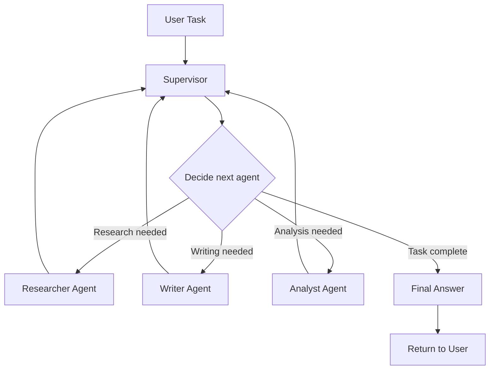
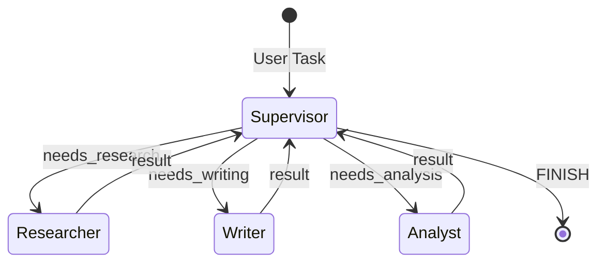
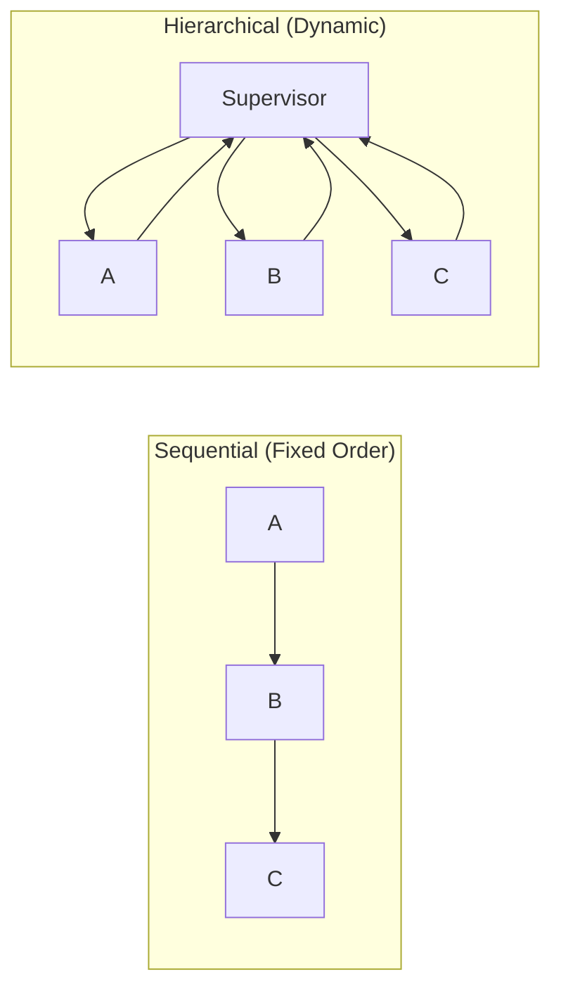
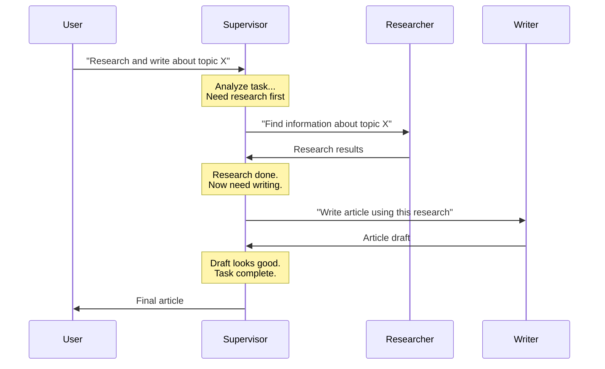
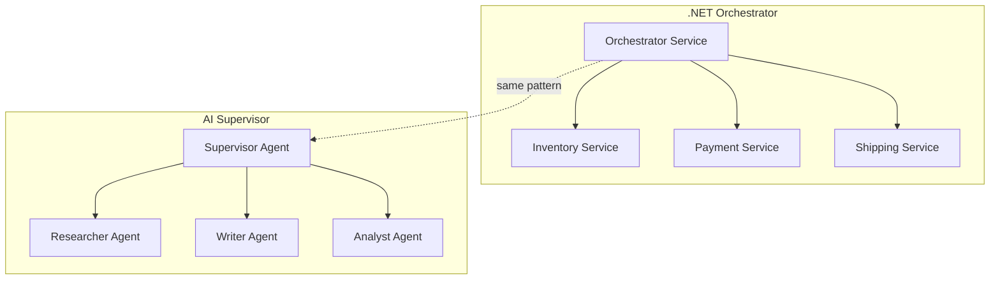

# Hierarchical Agents (Supervisor Pattern) — Deep Dive

> **Day 11 of your learning path** | Phase 3 — Multi-Agent Systems  
> Estimated study time: **4–5 hours**  
> Prerequisites: Agent Roles + Sequential Communication (01 & 02)

---

## Table of Contents

1. [Simple Explanation](#1-simple-explanation)
2. [Why It Matters](#2-why-it-matters)
3. [Internal Working](#3-internal-working)
4. [Real-World Use Cases](#4-real-world-use-cases)
5. [Common Beginner Mistakes](#5-common-beginner-mistakes)
6. [Best Practices](#6-best-practices)
7. [Python Examples](#7-python-examples)
8. [.NET / C# Equivalent Explanation](#8-net--c-equivalent-explanation)
9. [Diagrams](#9-diagrams)
10. [Mental Models and Analogies](#10-mental-models-and-analogies)

---

## 1. Simple Explanation

In a **hierarchical** (supervisor) system, one agent — the **Supervisor** — receives the user's task and decides which **sub-agent** should handle each part. The Supervisor delegates, collects results, and synthesizes the final answer.

```
User → Supervisor → "This needs research" → Researcher → results
                  → "Now write it up"     → Writer     → draft
                  → "Let me review..."    → Final answer to User
```

The Supervisor is like a project manager who:
- Reads the requirements
- Assigns tasks to the right team members
- Collects their work
- Combines it into a deliverable

**Key difference from sequential**: In sequential pipelines, the order is fixed (A → B → C always). In hierarchical systems, the Supervisor **dynamically decides** which sub-agent to call, in what order, and how many times. It might call Agent A, then Agent B, then Agent A again based on results.

### Sequential vs. Hierarchical

| | Sequential | Hierarchical |
|---|---|---|
| **Order** | Fixed (A → B → C) | Dynamic (Supervisor decides) |
| **Control** | No coordinator | Supervisor controls everything |
| **Flexibility** | Same path every time | Different path per task |
| **Routing** | Implicit (next in chain) | Explicit (Supervisor chooses) |
| **Loops** | Not possible | Supervisor can retry/re-route |

---

## 2. Why It Matters

### The Problem with Fixed Pipelines

Sequential pipelines work for tasks that always follow the same pattern. But many real tasks are **unpredictable**:

```
Task: "Help me debug this production issue"

Sometimes the path is:
  Read logs → Identify error → Suggest fix

Other times:
  Read logs → Need more context → Check database → Check config → Identify error → Suggest fix → Verify fix

A fixed pipeline can't handle this variability.
A Supervisor can dynamically route based on what's discovered.
```

### When You Need a Supervisor

| Scenario | Why Sequential Fails | Why Hierarchical Works |
|---|---|---|
| Task has conditional branches | Pipeline is linear | Supervisor routes conditionally |
| Sub-tasks can be done in parallel | Pipeline is sequential | Supervisor can dispatch parallel |
| Different tasks need different agents | Pipeline is fixed | Supervisor picks the right agent |
| Results need quality checking | No loop-back mechanism | Supervisor can re-dispatch |
| New agent types added frequently | Pipeline code must change | Supervisor adapts via routing |

### The Business Value

Hierarchical systems are how most production AI applications work:
- **Customer support**: Supervisor routes to billing, technical, or general agent
- **Content generation**: Supervisor coordinates researcher, writer, editor
- **Data analysis**: Supervisor picks the right analyst for the data type
- **Code assistance**: Supervisor routes to frontend, backend, or DevOps agent

---

## 3. Internal Working

### The Supervisor's Decision Loop

The Supervisor is an LLM agent with a special system prompt and access to sub-agents as "tools":

```
while task not complete:
    1. Supervisor analyzes current state (task + results so far)
    2. Supervisor decides: which sub-agent to call next (or finish)
    3. Sub-agent executes and returns result
    4. Result is added to Supervisor's context
    5. Go back to step 1
```

### Two Implementation Approaches

#### Approach 1: Sub-Agents as Tools

The Supervisor has tools where each tool represents calling a sub-agent:

```python
@tool
def call_researcher(query: str) -> str:
    """Delegate research tasks to the Researcher agent."""
    return researcher_agent.invoke(query)

@tool
def call_writer(content: str) -> str:
    """Delegate writing tasks to the Writer agent."""
    return writer_agent.invoke(content)

supervisor = llm.bind_tools([call_researcher, call_writer])
```

The Supervisor uses function calling to "call" sub-agents just like any other tool. This is the simplest approach and works well for 2-5 sub-agents.

#### Approach 2: LangGraph State Machine

LangGraph models the Supervisor as a **graph** where nodes are agents and edges are routing decisions:

```python
# LangGraph defines:
# - Nodes: supervisor, researcher, writer, editor
# - Edges: supervisor decides which node to route to next
# - State: shared context that all nodes can read/write

graph = StateGraph(AgentState)
graph.add_node("supervisor", supervisor_node)
graph.add_node("researcher", researcher_node)
graph.add_node("writer", writer_node)

# Supervisor decides routing
graph.add_conditional_edges("supervisor", route_to_agent)
```

This is more powerful but more complex. Use it for 3+ sub-agents with complex routing logic.

### The Routing Decision

The Supervisor's most important job is **routing** — deciding which sub-agent handles each sub-task. This happens through a structured output:

```python
class SupervisorDecision(BaseModel):
    reasoning: str = Field(description="Why this routing makes sense")
    next_agent: Literal["researcher", "writer", "editor", "FINISH"] = Field(
        description="Which agent to delegate to, or FINISH if task is complete"
    )
    task_for_agent: str = Field(description="Specific instructions for the chosen agent")
```

The Supervisor sees:
- The original user request
- All sub-agent results so far
- The list of available sub-agents and their capabilities

And decides: "Next, I should send this to the writer because the research is complete."

### State Management

The Supervisor maintains a shared state that tracks:

```python
class SupervisorState:
    original_task: str              # What the user asked
    current_plan: list[str]         # Steps remaining
    completed_steps: list[str]      # Steps done
    agent_results: dict[str, str]   # Results from each sub-agent call
    iteration_count: int            # Guard against infinite loops
```

---

## 4. Real-World Use Cases

### 1. Customer Support Routing

```
User: "I was charged twice and the app keeps crashing"

Supervisor analyzes: Two issues — billing + technical
  → Route to Billing Agent: "Customer reports double charge"
  ← Billing Agent: "Found duplicate charge, issuing refund"
  → Route to Technical Agent: "App crash on version 2.3"
  ← Technical Agent: "Known issue, fix in update 2.3.1"
  
Supervisor synthesizes: "We've issued a refund for the duplicate charge.
The app crash is a known issue — please update to version 2.3.1."
```

### 2. Research Report Generation

```
User: "Create a market analysis for AI in healthcare"

Supervisor:
  → Researcher: "Find market size data for AI in healthcare"
  ← Data: Market size, growth rates, key players
  → Researcher: "Find regulatory challenges for AI in healthcare"
  ← Data: FDA regulations, compliance requirements
  → Analyst: "Analyze competitive landscape from this data"
  ← Analysis: Market leaders, challengers, trends
  → Writer: "Create executive summary from all findings"
  ← Draft: Executive summary
  → Editor: "Review for accuracy and completeness"
  ← Review: Approved with minor edits
  
Final: Complete market analysis report
```

### 3. Multi-Tool Problem Solving

```
User: "What's the most cost-effective cloud region for our European users?"

Supervisor:
  → Database Agent: "Query our user location data for European users"
  ← Data: 60% UK, 25% Germany, 15% France
  → Web Search Agent: "Find cloud pricing for AWS eu-west-1, eu-central-1"
  ← Data: Pricing tables
  → Calculator Agent: "Calculate cost for 100k users at each pricing tier"
  ← Results: eu-west-1 = $2,400/mo, eu-central-1 = $2,100/mo
  → FINISH: "eu-central-1 (Frankfurt) is 12% cheaper for your user distribution"
```

### 4. Code Review Coordinator

```
User: "Review this pull request"

Supervisor:
  → Security Agent: "Check for security vulnerabilities"
  → Performance Agent: "Check for performance issues"
  → Style Agent: "Check code style and best practices"
  ← Security: "SQL injection on line 45"
  ← Performance: "N+1 query in the loop on line 72"
  ← Style: "Missing error handling in API calls"
  
Supervisor compiles: Comprehensive review with categorized issues
```

---

## 5. Common Beginner Mistakes

### Mistake 1: Supervisor Does Everything Itself

```python
# ❌ BAD — Supervisor tries to do sub-agent work
SUPERVISOR_PROMPT = """You are a supervisor. 
When asked a question, research it thoroughly, write a detailed response,
and review it for quality."""
# This is just a single agent, not a supervisor!

# ✅ GOOD — Supervisor only coordinates
SUPERVISOR_PROMPT = """You are a supervisor managing a team of specialists.
You NEVER do the work yourself. You ONLY:
1. Analyze what needs to be done
2. Delegate to the right specialist
3. Review their work
4. Combine results into a final answer

Available specialists:
- researcher: Finds information and data
- writer: Creates polished content
- analyst: Processes data and finds insights
"""
```

### Mistake 2: Too Many Sub-Agents

```python
# ❌ BAD — 8 sub-agents overwhelm the supervisor
agents = [researcher, fact_checker, outliner, writer, editor, 
          seo_optimizer, formatter, publisher]

# ✅ GOOD — Start with 2-3 sub-agents
agents = [researcher, writer, reviewer]
# Add more only when clearly needed
```

**Why**: Each sub-agent's description consumes context window space. The Supervisor has to understand all agents to route correctly. More agents = worse routing decisions.

### Mistake 3: No Maximum Iterations

```python
# ❌ BAD — Supervisor can loop forever
while supervisor_decision.next_agent != "FINISH":
    result = call_sub_agent(supervisor_decision)
    supervisor_decision = supervisor.decide(result)

# ✅ GOOD — Limit iterations
MAX_ITERATIONS = 10
for i in range(MAX_ITERATIONS):
    decision = supervisor.decide(state)
    if decision.next_agent == "FINISH":
        break
    result = call_sub_agent(decision)
    state.add_result(result)
else:
    return "Task could not be completed within the step limit."
```

### Mistake 4: Sub-Agents Too Coupled

```python
# ❌ BAD — Sub-agents know about each other
WRITER_PROMPT = """Write content. If you need research, ask the researcher.
If you need fact-checking, call the fact-checker."""
# Now the writer is trying to be a mini-supervisor!

# ✅ GOOD — Sub-agents are independent
WRITER_PROMPT = """Write content based on the information provided to you.
If you don't have enough information, say so clearly."""
# The SUPERVISOR decides if more research is needed, not the writer
```

### Mistake 5: Not Passing Enough Context to Sub-Agents

```python
# ❌ BAD — Sub-agent has no idea what the bigger picture is
supervisor → writer("Write about microservices")
# Writer has no research data, no outline, no context

# ✅ GOOD — Pass relevant context
supervisor → writer(
    "Write a 500-word article about microservices.\n"
    "Target audience: Junior developers\n"
    "Key points to cover:\n"
    f"{research_results}\n"
    "Tone: Educational, not promotional"
)
```

---

## 6. Best Practices

### 1. Supervisor System Prompt Template

```python
SUPERVISOR_PROMPT = """You are a team supervisor managing specialized agents.

YOUR ROLE:
- Analyze the user's request
- Break it into sub-tasks
- Delegate each sub-task to the right agent
- Review results and decide next steps
- Synthesize final answer when all sub-tasks are complete

AVAILABLE AGENTS:
{agent_descriptions}

RULES:
- NEVER do the work yourself — always delegate
- Choose ONE agent per turn
- Provide clear, specific instructions to the chosen agent
- After receiving results, decide: delegate more or FINISH
- If an agent's result is unsatisfactory, you may re-delegate with clearer instructions
- Maximum {max_iterations} delegation rounds

OUTPUT FORMAT:
Choose the next action: one of [{agent_names}, FINISH]
Instructions for the chosen agent: [specific task description]
"""
```

### 2. Use Structured Output for Routing

```python
from typing import Literal

class RoutingDecision(BaseModel):
    thought: str = Field(description="Reasoning about what needs to happen next")
    next_agent: Literal["researcher", "writer", "analyst", "FINISH"]
    instructions: str = Field(description="Specific task for the chosen agent")
    expected_output: str = Field(description="What you expect the agent to return")
```

### 3. Track Delegation History

```python
class DelegationLog:
    """Track all supervisor decisions for debugging."""
    
    def __init__(self):
        self.entries = []
    
    def log(self, iteration: int, decision: RoutingDecision, result: str):
        self.entries.append({
            "iteration": iteration,
            "agent": decision.next_agent,
            "instructions": decision.instructions,
            "result_preview": result[:200],
            "timestamp": time.time()
        })
    
    def summary(self) -> str:
        lines = []
        for e in self.entries:
            lines.append(f"  [{e['iteration']}] → {e['agent']}: {e['instructions'][:80]}")
        return "\n".join(lines)
```

### 4. Allow Supervisor to Re-Route

The Supervisor should be able to send work back if quality is insufficient:

```python
# In the supervisor loop:
if result_quality < threshold:
    decision = RoutingDecision(
        next_agent=same_agent,
        instructions=f"Your previous output was insufficient. "
                    f"Issues: {quality_issues}. Please redo."
    )
```

### 5. Sub-Agent Descriptions Are Critical

The Supervisor chooses agents based on their descriptions. Make them precise:

```python
AGENT_DESCRIPTIONS = """
- researcher: Searches the web and knowledge bases for factual information. 
  Use for: finding data, statistics, current events, technical documentation.
  Do NOT use for: writing content, making decisions, or analysis.

- writer: Creates polished, well-structured written content.
  Use for: articles, summaries, reports, documentation.
  Do NOT use for: research, data analysis, or code.

- analyst: Processes data to find patterns, trends, and insights.
  Use for: comparing data, statistical analysis, finding correlations.
  Do NOT use for: writing prose, research, or code.
"""
```

---

## 7. Python Examples

### Example 1: Supervisor with Sub-Agents as Tools

```python
"""
Supervisor pattern using create_react_agent.
Each sub-agent is a real ReAct agent with its own tools and loop.
The supervisor is also a ReAct agent whose "tools" invoke sub-agents.
No manual loops — the framework handles everything.
"""
from langchain_google_genai import ChatGoogleGenerativeAI
from langchain_core.tools import tool
from langgraph.prebuilt import create_react_agent
from dotenv import load_dotenv

load_dotenv()

llm = ChatGoogleGenerativeAI(model="gemini-2.0-flash")

# ── Sub-agent tools (what each specialist can do) ─────

@tool
def search_web(query: str) -> str:
    """Search the web for factual information on a topic."""
    # plug in a real search tool here (e.g. DuckDuckGo, Tavily)
    return f"[search results for: {query}]"

@tool
def run_analysis(data: str) -> str:
    """Identify patterns, trends, and key insights from provided data."""
    return f"[analysis of: {data}]"

# ── Real sub-agents (each has its own ReAct loop) ─────
# create_react_agent gives each one: tool execution, loop, memory

researcher = create_react_agent(
    model=llm,
    tools=[search_web],
    prompt="You are a research specialist. Use search_web to find factual, "
           "well-sourced information. Return bullet points.",
)

writer = create_react_agent(
    model=llm,
    tools=[],   # writer needs no tools — it synthesises from context
    prompt="You are a professional writer. Create clear, engaging content "
           "based on the information provided to you.",
)

analyst = create_react_agent(
    model=llm,
    tools=[run_analysis],
    prompt="You are a data analyst. Use run_analysis to identify patterns, "
           "trends, and key insights.",
)

# ── Wrap sub-agents as tools for the supervisor ───────
# The supervisor calls these tools; each tool runs a full ReAct agent.

@tool
def delegate_to_researcher(query: str) -> str:
    """Delegate a research task to the Researcher agent.
    Use when you need to find facts, data, or information."""
    result = researcher.invoke({"messages": [{"role": "user", "content": query}]})
    return result["messages"][-1].content

@tool
def delegate_to_writer(instructions: str) -> str:
    """Delegate a writing task to the Writer agent.
    Use when you need content written, edited, or formatted."""
    result = writer.invoke({"messages": [{"role": "user", "content": instructions}]})
    return result["messages"][-1].content

@tool
def delegate_to_analyst(data: str) -> str:
    """Delegate an analysis task to the Analyst agent.
    Use when you need data analyzed for patterns or insights."""
    result = analyst.invoke({"messages": [{"role": "user", "content": data}]})
    return result["messages"][-1].content

# ── Supervisor — also a real ReAct agent ──────────────
# create_react_agent provides the delegation loop automatically.
# No manual for-loop, no tool_map, no message management.

supervisor = create_react_agent(
    model=llm,
    tools=[delegate_to_researcher, delegate_to_writer, delegate_to_analyst],
    prompt="""You are a team supervisor. Complete the user's request by delegating to specialists.
NEVER do the work yourself — always delegate.
Your team:
- delegate_to_researcher: finds facts and data
- delegate_to_analyst: analyzes data for insights
- delegate_to_writer: writes polished content
Delegate one task at a time. When all results are in, synthesize the final answer.""",
)

# ── Run — one call, framework handles the loop ────────

result = supervisor.invoke({
    "messages": [{
        "role": "user",
        "content": "Research the current state of quantum computing, "
                   "analyze the key challenges, and write a brief executive summary."
    }]
})
print(result["messages"][-1].content)
```

### Example 2: LangGraph Supervisor

```python
"""
Supervisor using real LangGraph StateGraph.
- MessagesState (built-in) is the shared state — no custom TypedDict needed
- Each sub-agent is a create_react_agent node
- Supervisor uses with_structured_output for typed routing
- add_conditional_edges drives routing — no manual loops
"""
from typing import Literal
from pydantic import BaseModel, Field
from langchain_google_genai import ChatGoogleGenerativeAI
from langchain_core.messages import SystemMessage
from langchain_core.tools import tool
from langgraph.graph import StateGraph, START, END
from langgraph.graph.message import MessagesState
from langgraph.prebuilt import create_react_agent
from dotenv import load_dotenv

load_dotenv()

llm = ChatGoogleGenerativeAI(model="gemini-2.0-flash")

# ── Sub-agent tools ───────────────────────────────────

@tool
def search_web(query: str) -> str:
    """Search the web for information on a topic."""
    return f"[search results for: {query}]"

@tool
def write_content(instructions: str) -> str:
    """Write polished content based on provided instructions."""
    return f"[written content for: {instructions}]"

# ── Real sub-agents ───────────────────────────────────

researcher_agent = create_react_agent(
    model=llm,
    tools=[search_web],
    prompt="You are a research specialist. Use search_web to find thorough, factual information.",
)

writer_agent = create_react_agent(
    model=llm,
    tools=[write_content],
    prompt="You are a professional writer. Create polished, well-structured content.",
)

# ── Routing decision schema ───────────────────────────

class RoutingDecision(BaseModel):
    reasoning: str = Field(description="Why this routing decision makes sense")
    next_agent: Literal["researcher", "writer", "FINISH"] = Field(
        description="Which agent to delegate to, or FINISH if done"
    )
    task_for_agent: str = Field(description="Specific instructions for the chosen agent")

routing_llm = llm.with_structured_output(RoutingDecision)

# ── Graph nodes ───────────────────────────────────────

def supervisor_node(state: MessagesState) -> dict:
    decision = routing_llm.invoke([
        SystemMessage(content="""You are a supervisor managing a researcher and a writer.
Analyze the conversation and decide what needs to happen next.
Choose FINISH only when the final written content is ready."""),
        *state["messages"],
    ])
    print(f"\n🧠 Supervisor → {decision.next_agent}: {decision.reasoning}")
    return {"messages": [{"role": "user", "content": decision.task_for_agent,
                          "name": f"supervisor_to_{decision.next_agent}"}]}

def researcher_node(state: MessagesState) -> dict:
    last_task = state["messages"][-1].content
    result = researcher_agent.invoke({"messages": [{"role": "user", "content": last_task}]})
    reply = result["messages"][-1].content
    print(f"🔬 Researcher done ({len(reply)} chars)")
    return {"messages": [{"role": "assistant", "content": reply, "name": "researcher"}]}

def writer_node(state: MessagesState) -> dict:
    last_task = state["messages"][-1].content
    result = writer_agent.invoke({"messages": [{"role": "user", "content": last_task}]})
    reply = result["messages"][-1].content
    print(f"✍️ Writer done ({len(reply)} chars)")
    return {"messages": [{"role": "assistant", "content": reply, "name": "writer"}]}

# ── Routing function ──────────────────────────────────

def route(state: MessagesState) -> Literal["researcher", "writer", "__end__"]:
    last = state["messages"][-1]
    target = getattr(last, "name", "").replace("supervisor_to_", "")
    return END if target == "FINISH" else target

# ── Build the real LangGraph ──────────────────────────

graph = StateGraph(MessagesState)
graph.add_node("supervisor", supervisor_node)
graph.add_node("researcher", researcher_node)
graph.add_node("writer", writer_node)

graph.add_edge(START, "supervisor")
graph.add_conditional_edges("supervisor", route)
graph.add_edge("researcher", "supervisor")
graph.add_edge("writer", "supervisor")

app = graph.compile()

# ── Run ───────────────────────────────────────────────

result = app.invoke({
    "messages": [{"role": "user", "content": "Explain how garbage collectors work in Java vs Go"}]
})
print(f"\n{'='*60}\n{result['messages'][-1].content}")
```

### Example 3: Supervisor with Dynamic Agent Selection

```python
"""
Supervisor with a dynamic agent registry using real LangGraph.
New agents can be added to the graph without changing the supervisor logic.
Each sub-agent is a create_react_agent node registered into a StateGraph.
The supervisor uses with_structured_output to pick the next node dynamically.
"""
from typing import Literal
from pydantic import BaseModel, Field
from langchain_google_genai import ChatGoogleGenerativeAI
from langchain_core.messages import SystemMessage
from langchain_core.tools import tool
from langgraph.graph import StateGraph, START, END
from langgraph.graph.message import MessagesState
from langgraph.prebuilt import create_react_agent
from dotenv import load_dotenv

load_dotenv()

llm = ChatGoogleGenerativeAI(model="gemini-2.0-flash")

# ── Sub-agent tools ───────────────────────────────────

@tool
def search_web(query: str) -> str:
    """Search the web for factual information."""
    return f"[search results for: {query}]"

@tool
def write_content(instructions: str) -> str:
    """Write polished content based on provided instructions."""
    return f"[written content for: {instructions}]"

@tool
def write_code(instructions: str) -> str:
    """Write clean, well-documented code based on provided instructions."""
    return f"[code for: {instructions}]"

@tool
def review_content(content: str) -> str:
    """Review content for quality, accuracy, and completeness."""
    return f"[review of: {content}]"

# ── Agent registry: name → (create_react_agent, description) ─
# To add a new agent: create its tools, call create_react_agent,
# add it to AGENT_REGISTRY. The supervisor and graph wire up automatically.

AGENT_REGISTRY = {
    "researcher": (
        create_react_agent(model=llm, tools=[search_web],
                           prompt="You are a research specialist. Use search_web to find thorough, factual information."),
        "Finds factual information, data, and current events",
    ),
    "writer": (
        create_react_agent(model=llm, tools=[write_content],
                           prompt="You are a professional writer. Create clear, engaging content."),
        "Creates polished articles, summaries, and documentation",
    ),
    "coder": (
        create_react_agent(model=llm, tools=[write_code],
                           prompt="You are a senior software engineer. Write clean, well-documented code."),
        "Writes and reviews code in Python, JavaScript, and other languages",
    ),
    "reviewer": (
        create_react_agent(model=llm, tools=[review_content],
                           prompt="You are a quality reviewer. Identify issues and suggest improvements."),
        "Reviews content for quality, accuracy, and completeness",
    ),
}

# ── Routing decision (built from registry keys) ───────

agent_names = list(AGENT_REGISTRY.keys())
agent_descriptions = "\n".join(f"- {n}: {d}" for n, (_, d) in AGENT_REGISTRY.items())

class RoutingDecision(BaseModel):
    reasoning: str = Field(description="Why this routing decision makes sense")
    next_agent: str = Field(description=f"One of: {', '.join(agent_names + ['FINISH'])}")
    task_for_agent: str = Field(description="Specific instructions for the chosen agent")

routing_llm = llm.with_structured_output(RoutingDecision)

# ── Graph nodes ───────────────────────────────────────

def supervisor_node(state: MessagesState) -> dict:
    decision = routing_llm.invoke([
        SystemMessage(content=f"""You are a supervisor. Delegate work to your team.
Available agents:
{agent_descriptions}
Choose FINISH when the task is fully complete."""),
        *state["messages"],
    ])
    print(f"\n🧠 Supervisor → {decision.next_agent}: {decision.reasoning}")
    return {"messages": [{"role": "user", "content": decision.task_for_agent,
                          "name": f"supervisor_to_{decision.next_agent}"}]}

def make_agent_node(agent_graph, label: str):
    """Factory: wraps a create_react_agent into a graph node function."""
    def node(state: MessagesState) -> dict:
        last_task = state["messages"][-1].content
        result = agent_graph.invoke({"messages": [{"role": "user", "content": last_task}]})
        reply = result["messages"][-1].content
        print(f"  [{label}] done ({len(reply)} chars)")
        return {"messages": [{"role": "assistant", "content": reply, "name": label}]}
    return node

# ── Routing function ──────────────────────────────────

def route(state: MessagesState) -> str:
    last = state["messages"][-1]
    target = getattr(last, "name", "").replace("supervisor_to_", "")
    return END if target == "FINISH" else target

# ── Build graph dynamically from registry ─────────────

graph = StateGraph(MessagesState)
graph.add_node("supervisor", supervisor_node)

for name, (agent_graph, _) in AGENT_REGISTRY.items():
    graph.add_node(name, make_agent_node(agent_graph, name))
    graph.add_edge(name, "supervisor")   # every sub-agent returns to supervisor

graph.add_edge(START, "supervisor")
graph.add_conditional_edges("supervisor", route)

app = graph.compile()

# ── Run ───────────────────────────────────────────────

result = app.invoke({
    "messages": [{
        "role": "user",
        "content": "Research Python async/await patterns, write a tutorial with code examples, and review it for accuracy."
    }]
})
print(f"\n{'='*60}\n{result['messages'][-1].content}")
```

---

## 8. .NET / C# Equivalent Explanation

### Supervisor ≈ Orchestrator Service

```csharp
// .NET: An orchestrator that coordinates microservices
public class OrderOrchestrator
{
    private readonly IInventoryService _inventory;
    private readonly IPaymentService _payment;
    private readonly IShippingService _shipping;
    
    public async Task<OrderResult> ProcessOrder(OrderRequest request)
    {
        // Step 1: Check inventory (≈ delegate to researcher)
        var available = await _inventory.CheckStock(request.Items);
        
        // Step 2: Process payment (≈ delegate to analyst)
        if (available)
        {
            var payment = await _payment.Charge(request.PaymentInfo);
            
            // Step 3: Ship order (≈ delegate to writer)
            if (payment.Succeeded)
            {
                return await _shipping.CreateShipment(request);
            }
        }
        
        return OrderResult.Failed("Unable to process order");
    }
}
```

```python
# AI: A supervisor that coordinates sub-agents
def supervisor(task):
    research = delegate_to_researcher(task)   # ≈ _inventory.CheckStock()
    analysis = delegate_to_analyst(research)   # ≈ _payment.Charge()
    content = delegate_to_writer(analysis)     # ≈ _shipping.CreateShipment()
    return content
```

**Key difference**: In .NET, the orchestrator's logic is hardcoded. In AI, the Supervisor dynamically decides the routing based on the task and intermediate results.

### Supervisor ≈ API Gateway / Reverse Proxy

```csharp
// .NET: API Gateway routes requests to appropriate microservices
app.MapGet("/api/{*path}", async (HttpContext ctx, string path) =>
{
    var service = _router.RouteToService(path);  // ≈ Supervisor decides
    var result = await service.Handle(ctx);       // ≈ Sub-agent executes
    return result;
});
```

### Sub-Agent Registration ≈ Dependency Injection

```csharp
// .NET: Register services in DI
services.AddScoped<IResearchService, ResearchService>();
services.AddScoped<IWritingService, WritingService>();
services.AddScoped<IAnalysisService, AnalysisService>();

// Resolve at runtime
var service = provider.GetRequiredService<IResearchService>();
```

```python
# AI: Register sub-agents
registry.register(SubAgent("researcher", ...))
registry.register(SubAgent("writer", ...))
registry.register(SubAgent("analyst", ...))

# Resolve at runtime
agent = registry.get("researcher")
```

### The Full .NET Mapping

| Supervisor Pattern | .NET Equivalent |
|---|---|
| **Supervisor agent** | Orchestrator service / API Gateway |
| **Sub-agents** | Microservices / Domain services |
| **Routing decision** | Request routing / Service resolver |
| **Agent registry** | DI Container / Service Collection |
| **State management** | Saga state / Workflow state machine |
| **Max iterations** | Circuit breaker / Timeout policy |
| **Agent descriptions** | Interface contracts / API documentation |
| **Dynamic routing** | Convention-based routing in MVC |
| **Re-delegation** | Retry policy in orchestrator |

---

## 9. Diagrams

### Supervisor Decision Loop



### Supervisor as State Machine



### Sequential vs Hierarchical



### Routing Decision Process



### .NET Orchestrator Analogy



---

## 10. Mental Models and Analogies

### The Project Manager Analogy

The Supervisor is a project manager:

| PM Action | Supervisor Action |
|---|---|
| Reads the project brief | Receives user task |
| Assigns tasks to team members | Routes to sub-agents |
| Reviews deliverables | Checks sub-agent results |
| Asks for revisions | Re-delegates with feedback |
| Compiles final report | Synthesizes final answer |
| Never writes code themselves | Never does the work themselves |

### The Call Center Routing Analogy

```
Customer calls → IVR System (Supervisor) → analyzes the request
  → "Billing issue" → routes to Billing Agent
  → "Technical issue" → routes to Tech Support Agent
  → "General question" → routes to General Agent

Each agent handles their specialty, reports back.
IVR combines information if needed.
```

### The .NET Developer's Mental Model

```
The Supervisor pattern is just the Orchestrator pattern from microservices.

In .NET microservices:
  - API Gateway receives request
  - Routes to appropriate microservice
  - Microservice does its work
  - Gateway collects and returns result

In AI:
  - Supervisor receives task
  - Routes to appropriate sub-agent
  - Sub-agent does its work  
  - Supervisor collects and returns result

The only difference: your Gateway's routing rules are hardcoded in C#.
The AI Supervisor's routing rules are dynamic — the LLM decides.
```

### The Hospital Emergency Room Analogy

```
Patient arrives → Triage Nurse (Supervisor)
  → evaluates condition
  → sends to Surgeon (critical)
  → or sends to GP (minor)
  → or sends to Radiologist (needs scans first) → then back to Surgeon
  
Triage nurse coordinates, never treats patients directly.
```

---

## Summary

| Concept | One-Line Summary |
|---|---|
| Supervisor pattern | One agent coordinates and delegates to specialized sub-agents |
| Routing | Supervisor decides which sub-agent handles each sub-task |
| Sub-agent | A specialized agent that handles one type of work |
| Dynamic routing | Supervisor decides routing at runtime based on task and results |
| Agent registry | A collection of available sub-agents with descriptions |
| State management | Tracking task, results, and iteration count |
| Re-delegation | Sending work back to an agent with revised instructions |

---

**Previous**: [02_sequential_communication.md](./02_sequential_communication.md)  
**Next**: [04_collaborative_patterns.md](./04_collaborative_patterns.md) — Learn how agents share context and work together in collaborative patterns like debate and voting.
