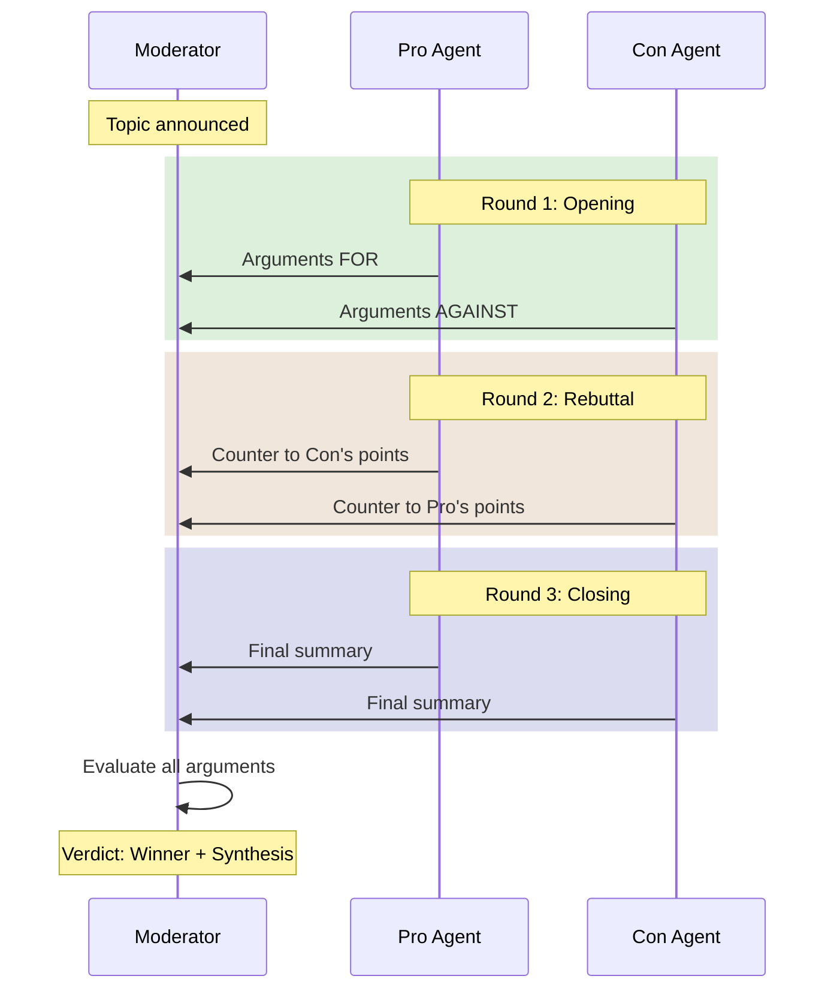
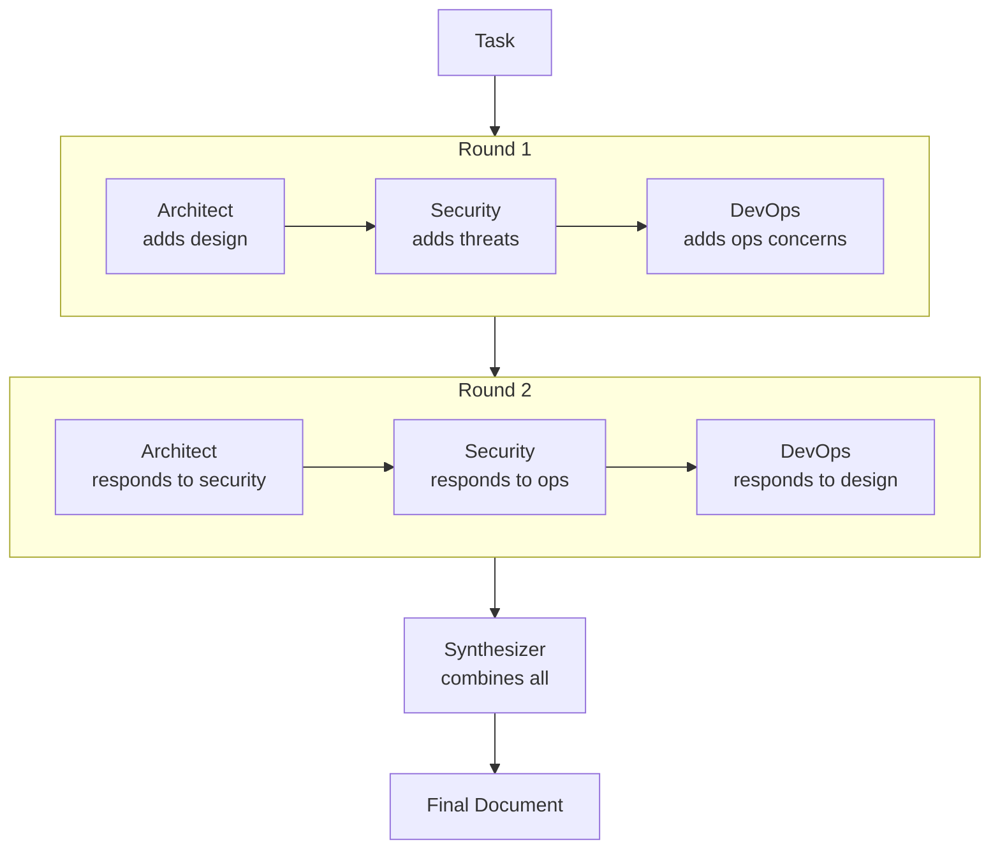
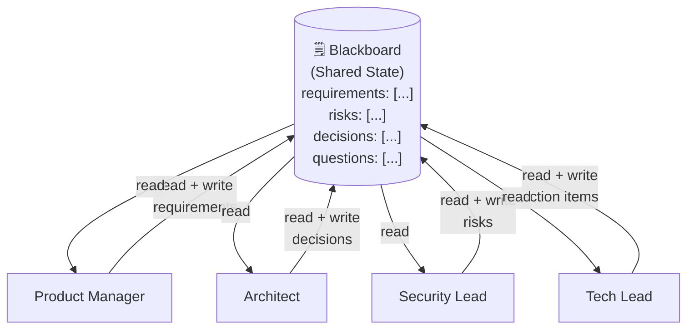
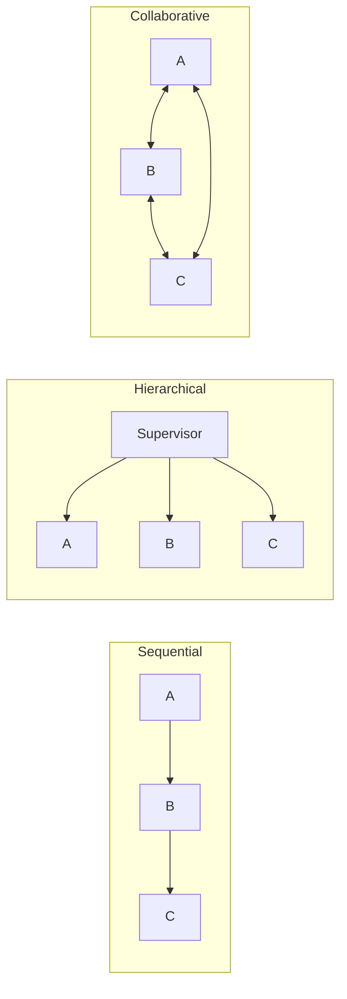

# Collaborative Patterns — Deep Dive

> **Day 12 of your learning path** | Phase 3 — Multi-Agent Systems  
> Estimated study time: **3–4 hours**  
> Prerequisites: Agent Roles + Sequential + Hierarchical (01–03)

---

## Table of Contents

1. [Simple Explanation](#1-simple-explanation)
2. [Why It Matters](#2-why-it-matters)
3. [Internal Working](#3-internal-working)
4. [Real-World Use Cases](#4-real-world-use-cases)
5. [Common Beginner Mistakes](#5-common-beginner-mistakes)
6. [Best Practices](#6-best-practices)
7. [Python Examples](#7-python-examples)
8. [.NET / C# Equivalent Explanation](#8-net--c-equivalent-explanation)
9. [Diagrams](#9-diagrams)
10. [Mental Models and Analogies](#10-mental-models-and-analogies)

---

## 1. Simple Explanation

In sequential and hierarchical patterns, there's a clear flow of control — either a fixed pipeline or a supervisor directing traffic. **Collaborative patterns** are different: agents work together as **peers**, sharing context and building on each other's contributions.

Think of it as the difference between:
- **Sequential**: Assembly line — each worker does their part, passes it on
- **Hierarchical**: Manager assigns tasks to workers
- **Collaborative**: A brainstorming meeting where everyone contributes and responds to each other

In collaborative patterns, agents:
- **See each other's output** (shared context)
- **React to each other** (Agent B's output depends on Agent A's output, and vice versa)
- **May disagree** (debate pattern — agents argue different positions)
- **Reach consensus** (voting, averaging, or moderator decides)

### The Three Main Collaborative Patterns

| Pattern | How It Works | Best For |
|---|---|---|
| **Debate** | Agents argue opposing positions, moderator decides | Decision-making, exploring alternatives |
| **Round-Robin** | Agents take turns contributing to shared work | Iterative refinement, brainstorming |
| **Blackboard** | Agents read/write to shared state independently | Complex problems needing diverse expertise |

---

## 2. Why It Matters

### The Diversity of Thought Problem

A single LLM agent tends to converge on one answer and then reinforce it. This is called **mode collapse** — the model gets stuck in one way of thinking.

```
Single agent: "The best approach is X because..."
              (never considers Y or Z)
```

Multiple collaborating agents, each with a different perspective, explore more of the solution space:

```
Agent A (optimist): "Approach X works because..."
Agent B (skeptic):  "But X fails when... approach Y handles that"
Agent C (pragmatist): "Y is ideal but Z is more practical given..."
Moderator: Synthesizes the best answer from all perspectives
```

### When Collaboration Beats Hierarchy

| Scenario | Hierarchy Best | Collaboration Best |
|---|---|---|
| Clear, well-defined task | ✅ | |
| Task requires exploring alternatives | | ✅ |
| Single correct answer | ✅ | |
| Trade-offs and judgment calls | | ✅ |
| Speed is priority | ✅ | |
| Quality/thoroughness is priority | | ✅ |
| Risk assessment | | ✅ |
| Creative work | | ✅ |

---

## 3. Internal Working

### Pattern 1: Debate

Two or more agents argue different sides of a question. A moderator evaluates the arguments and decides.

```
Round 1:
  Pro Agent:  "We should use microservices because [arguments]"
  Con Agent:  "We should stay monolithic because [counter-arguments]"

Round 2 (Rebuttal):
  Pro Agent:  "Regarding the Con's point about complexity, [rebuttal]"
  Con Agent:  "Regarding the Pro's point about scalability, [rebuttal]"

Round 3 (Closing):
  Pro Agent:  [Final argument]
  Con Agent:  [Final argument]

Moderator:  Evaluates all rounds → Declares winner with reasoning
```

**How the message flow works:**

```python
# Each agent sees the FULL debate history
pro_context = [
    SystemMessage("You argue FOR the given position"),
    HumanMessage(f"Topic: {topic}"),
    # Round 1
    AIMessage(content=pro_round1),     # Pro's opening
    HumanMessage(content=con_round1),  # Con's opening (as "opponent said")
    # Round 2
    AIMessage(content=pro_round2),     # Pro's rebuttal
    HumanMessage(content=con_round2),  # Con's rebuttal
]
```

Each agent responds to the *other agent's* argument, creating a dynamic back-and-forth.

### Pattern 2: Round-Robin Contribution

Agents take turns contributing to a shared artifact. Each sees what all previous agents wrote and adds their part.

```
Shared document starts empty.

Agent A (security expert): Adds security considerations
Agent B (performance expert): Adds performance analysis
Agent C (usability expert): Adds UX recommendations
Agent A: Reviews and updates based on B and C's additions
Agent B: Reviews and updates based on A and C's additions
...
```

**Key**: Each agent sees the **full current state** of the shared artifact, not just the last addition.

### Pattern 3: Blackboard

The most flexible pattern. A shared "blackboard" (state/memory) is accessible to all agents. Agents read from it, process what they see, and write back.

```
┌──────────────────────────────────┐
│          BLACKBOARD              │
│                                  │
│  task: "Design a chat app"       │
│  requirements: [list]            │
│  architecture: {diagram}         │
│  risks: [identified risks]      │
│  decisions: [made decisions]     │
│  open_questions: [unanswered]    │
└──────────────────────────────────┘
        ↑↓         ↑↓         ↑↓
    Architect    Security    Product
     Agent       Agent       Agent
```

Each agent:
1. Reads the blackboard
2. Finds something they can contribute to
3. Writes their contribution back
4. Other agents see the update and may react

This is **asynchronous** — agents don't have a fixed order. They act when there's something relevant for them.

### Consensus Mechanisms

When agents disagree, you need a way to resolve it:

| Mechanism | How It Works | When to Use |
|---|---|---|
| **Moderator** | A dedicated agent evaluates all positions | Debate, complex decisions |
| **Voting** | Each agent votes, majority wins | Simple choices with 3+ agents |
| **Weighted voting** | Votes weighted by agent expertise/confidence | When some agents are more authoritative |
| **Synthesis** | Combine best elements from all positions | Creative work, not binary choices |

---

## 4. Real-World Use Cases

### 1. AI Debate for Decision Making

```
Topic: "Should we migrate from monolith to microservices?"

Pro Agent: Argues for migration (scalability, team independence, tech diversity)
Con Agent: Argues against (complexity, network overhead, deployment complexity)
Moderator: Weighs both sides, considers the company's specific context

Result: Nuanced recommendation with trade-offs clearly laid out
```

### 2. Multi-Perspective Code Review

```
Security Agent: Reviews for vulnerabilities (injection, auth, secrets)
Performance Agent: Reviews for efficiency (N+1 queries, memory leaks)
Maintainability Agent: Reviews for readability (naming, structure, SOLID)

Each agent sees the others' reviews and may add to them:
Security Agent: "The performance fix on line 42 introduces a new attack vector..."
```

### 3. Content Fact-Checking

```
Writer: Creates an article
Fact-Checker A: Checks scientific claims
Fact-Checker B: Checks statistical claims
Fact-Checker C: Checks quote attributions

Round-robin: Each fact-checker sees others' findings and may flag related issues
Final: Consolidated list of corrections
```

### 4. Investment Committee Simulation

```
Bull Agent: Presents the case for investing
Bear Agent: Presents the case against investing
Risk Agent: Analyzes downside scenarios
Moderator: Makes final recommendation with risk-adjusted analysis
```

### 5. Multi-Language Translation Review

```
Translator A: Creates initial translation
Translator B: Reviews and suggests alternatives
Native Speaker Agent: Evaluates which sounds more natural
Cultural Agent: Checks for cultural sensitivity issues

Collaborative discussion to reach best translation
```

---

## 5. Common Beginner Mistakes

### Mistake 1: Debate Without a Moderator

```python
# ❌ BAD — Agents debate forever with no resolution
while True:
    pro_argument = pro_agent.invoke(con_argument)
    con_argument = con_agent.invoke(pro_argument)
    # Who decides when to stop? Who picks the winner?

# ✅ GOOD — Fixed rounds + moderator
for round_num in range(3):  # 3 rounds: opening, rebuttal, closing
    pro_arg = pro_agent.invoke(debate_context)
    con_arg = con_agent.invoke(debate_context)
    
winner = moderator.invoke(full_debate_history)
```

### Mistake 2: Echo Chamber

```python
# ❌ BAD — All agents have similar prompts, just agree with each other
agent_1_prompt = "You are an AI expert. Discuss the topic."
agent_2_prompt = "You are a technology specialist. Discuss the topic."
# These will produce nearly identical responses!

# ✅ GOOD — Force genuine diversity
agent_1_prompt = "You MUST argue in FAVOR of the proposed approach. Find every strength."
agent_2_prompt = "You MUST argue AGAINST the proposed approach. Find every weakness."
agent_3_prompt = "You are a pragmatist. Find the middle ground and practical tradeoffs."
```

### Mistake 3: Context Pollution

```python
# ❌ BAD — Dumping ALL messages from ALL agents into each agent's context
for agent in agents:
    agent.invoke(all_messages_from_all_agents)  # MASSIVE context!

# ✅ GOOD — Each agent sees only relevant context
pro_agent.invoke([
    topic,
    pro_agent_opening,     # Their own previous output
    con_agent_opening,     # Opponent's output (so they can respond)
    # NOT: moderator notes, audience feedback, etc.
])
```

### Mistake 4: No Turn Limits

```python
# ❌ BAD — Round-robin can go forever
while not all_agents_satisfied:
    for agent in agents:
        contribution = agent.invoke(shared_state)
        shared_state.update(contribution)

# ✅ GOOD — Fixed number of rounds
MAX_ROUNDS = 3
for round in range(MAX_ROUNDS):
    for agent in agents:
        contribution = agent.invoke(shared_state)
        shared_state.update(contribution)
```

### Mistake 5: Not Structuring the Debate

```python
# ❌ BAD — Just "discuss this topic" with no structure
debate_result = pro.invoke("Discuss microservices") + con.invoke("Discuss microservices")

# ✅ GOOD — Structured rounds with clear expectations
ROUND_PROMPTS = {
    "opening": "Present your strongest 3 arguments for your position.",
    "rebuttal": "Address the opponent's strongest point. Explain why it's wrong or overstated.",
    "closing": "Summarize your position in 2-3 sentences. Acknowledge any valid opponent points."
}
```

---

## 6. Best Practices

### 1. Structure Debates with Clear Rounds

```python
DEBATE_STRUCTURE = [
    {"round": "opening", "instructions": "Present your 3 strongest arguments"},
    {"round": "rebuttal", "instructions": "Counter the opponent's strongest point"},
    {"round": "closing", "instructions": "Final summary, acknowledge opponent's valid points"}
]
```

### 2. Force Diversity Through System Prompts

```python
# Each agent has a DIFFERENT perspective baked into their prompt
perspectives = [
    "You are a security-first thinker. Prioritize safety above all else.",
    "You are a performance-first thinker. Prioritize speed and efficiency.",
    "You are a user-first thinker. Prioritize ease of use and developer experience.",
    "You are a cost-first thinker. Prioritize budget and ROI."
]
```

### 3. Use a Structured Moderator

```python
class DebateVerdict(BaseModel):
    winning_position: str = Field(description="Which side won and why")
    key_strengths_pro: list[str] = Field(description="Best arguments from the pro side")
    key_strengths_con: list[str] = Field(description="Best arguments from the con side")
    synthesis: str = Field(description="Balanced recommendation combining best of both")
    confidence: float = Field(ge=0.0, le=1.0, description="How confident is this verdict")
```

### 4. Limit Context Per Agent

Don't show every agent everything. Show each agent:
- The topic/task
- Their own previous contributions
- The opposing/other agent's most recent contribution
- NOT the full history of all agents

### 5. Combine Patterns When Appropriate

```
Supervisor decides which agents should debate
  → Pro and Con agents debate (collaborative)
    → Each debate round goes through a quality check (sequential)
  → Supervisor reads moderator verdict
  → Supervisor decides next action
```

Real systems mix and match patterns.

---

## 7. Python Examples

### Example 1: Debate Pattern

```python
"""
Two agents debate a topic, moderator decides.
The simplest collaborative pattern.
"""
from langchain_google_genai import ChatGoogleGenerativeAI
from langchain_core.messages import SystemMessage, HumanMessage
from pydantic import BaseModel, Field
from typing import Literal
from dotenv import load_dotenv

load_dotenv()

llm = ChatGoogleGenerativeAI(model="gemini-2.0-flash")

# ── Debate agents ─────────────────────────────────────

PRO_PROMPT = """You are a debate participant arguing IN FAVOR of the given position.
- Present clear, logical arguments with evidence
- Respond directly to opponent's points in rebuttals
- Be persuasive but honest — don't make up facts
- Acknowledge strong counter-arguments when appropriate"""

CON_PROMPT = """You are a debate participant arguing AGAINST the given position.
- Present clear, logical arguments with evidence
- Respond directly to opponent's points in rebuttals
- Be persuasive but honest — don't make up facts
- Acknowledge strong counter-arguments when appropriate"""

class DebateVerdict(BaseModel):
    analysis: str = Field(description="Analysis of both sides' arguments")
    winner: Literal["pro", "con", "draw"] = Field(description="Which side argued more convincingly")
    recommendation: str = Field(description="Balanced recommendation considering both sides")
    pro_best_point: str = Field(description="The strongest argument from the pro side")
    con_best_point: str = Field(description="The strongest argument from the con side")

MODERATOR_PROMPT = """You are an impartial debate moderator. 
Evaluate both sides fairly based on:
- Quality and relevance of arguments
- Use of evidence and logic
- Effectiveness of rebuttals
- Overall persuasiveness

Make a fair judgment. It's OK to declare a draw if both sides are equally strong."""

# ── Run the debate ────────────────────────────────────

def run_debate(topic: str, position: str, rounds: int = 3) -> DebateVerdict:
    debate_history = []
    
    round_names = ["Opening Statements", "Rebuttals", "Closing Arguments"]
    round_instructions = [
        "Present your 3 strongest arguments.",
        "Address the opponent's strongest point and explain why your position is better.",
        "Give your final summary. Acknowledge any valid points from your opponent."
    ]
    
    for round_num in range(min(rounds, 3)):
        print(f"\n{'═'*50}")
        print(f"  Round {round_num + 1}: {round_names[round_num]}")
        print(f"{'═'*50}")
        
        # Pro argues
        pro_context = f"Topic: {topic}\nPosition to argue FOR: {position}\n"
        pro_context += f"Round: {round_names[round_num]} — {round_instructions[round_num]}\n"
        if debate_history:
            pro_context += "\nDebate so far:\n" + "\n".join(debate_history[-4:])  # Last 4 entries
        
        pro_response = llm.invoke([
            SystemMessage(content=PRO_PROMPT),
            HumanMessage(content=pro_context)
        ]).content
        
        debate_history.append(f"PRO ({round_names[round_num]}): {pro_response}")
        print(f"\n🟢 PRO: {pro_response[:300]}...")
        
        # Con argues
        con_context = f"Topic: {topic}\nPosition to argue AGAINST: {position}\n"
        con_context += f"Round: {round_names[round_num]} — {round_instructions[round_num]}\n"
        con_context += "\nDebate so far:\n" + "\n".join(debate_history[-4:])
        
        con_response = llm.invoke([
            SystemMessage(content=CON_PROMPT),
            HumanMessage(content=con_context)
        ]).content
        
        debate_history.append(f"CON ({round_names[round_num]}): {con_response}")
        print(f"\n🔴 CON: {con_response[:300]}...")
    
    # Moderator decides
    print(f"\n{'═'*50}")
    print(f"  MODERATOR VERDICT")
    print(f"{'═'*50}")
    
    moderator = llm.with_structured_output(DebateVerdict)
    verdict = moderator.invoke([
        SystemMessage(content=MODERATOR_PROMPT),
        HumanMessage(content=f"Topic: {topic}\nPosition debated: {position}\n\n"
                    f"Full debate:\n" + "\n\n".join(debate_history))
    ])
    
    print(f"\n🏆 Winner: {verdict.winner.upper()}")
    print(f"📊 Analysis: {verdict.analysis[:200]}...")
    print(f"💡 Recommendation: {verdict.recommendation}")
    
    return verdict

# ── Test ──────────────────────────────────────────────

verdict = run_debate(
    topic="Software Architecture",
    position="Companies should migrate from monolith to microservices"
)
```

### Example 2: Round-Robin Contribution

```python
"""
Multiple agents take turns contributing to a shared document.
Each sees the full current state.
"""
from langchain_google_genai import ChatGoogleGenerativeAI
from langchain_core.messages import SystemMessage, HumanMessage
from dotenv import load_dotenv

load_dotenv()

llm = ChatGoogleGenerativeAI(model="gemini-2.0-flash")

# ── Define contributors with different expertise ─────

contributors = [
    {
        "name": "Architecture Expert",
        "prompt": "You are a software architecture expert. Focus on system design, "
                 "scalability, and component interaction. Add architecture considerations."
    },
    {
        "name": "Security Expert",
        "prompt": "You are a security expert. Focus on vulnerabilities, authentication, "
                 "authorization, and data protection. Add security considerations."
    },
    {
        "name": "Performance Expert",
        "prompt": "You are a performance optimization expert. Focus on latency, throughput, "
                 "caching, and resource usage. Add performance considerations."
    },
    {
        "name": "DevOps Expert",
        "prompt": "You are a DevOps/infrastructure expert. Focus on deployment, monitoring, "
                 "CI/CD, and operational concerns. Add DevOps considerations."
    }
]

# ── Round-robin contribution ──────────────────────────

def collaborative_review(topic: str, num_rounds: int = 2) -> str:
    shared_document = f"# Technical Review: {topic}\n\n"
    
    for round_num in range(num_rounds):
        print(f"\n{'='*40} Round {round_num + 1} {'='*40}")
        
        for contributor in contributors:
            print(f"\n📝 {contributor['name']} contributing...")
            
            response = llm.invoke([
                SystemMessage(content=contributor['prompt'] + 
                    "\n\nRULES:\n"
                    "- Read the current document carefully\n"
                    "- Add your expertise to any section that's missing your perspective\n"
                    "- React to other experts' points if you disagree or want to add\n"
                    "- Keep your additions concise (3-5 bullet points)\n"
                    "- Mark your additions with your role name\n"
                    "- Do NOT repeat what's already written"),
                HumanMessage(content=f"Current document state:\n\n{shared_document}\n\n"
                            f"Add your {contributor['name']} perspective. "
                            f"This is round {round_num + 1} of {num_rounds}.")
            ])
            
            shared_document += f"\n## {contributor['name']} (Round {round_num + 1})\n"
            shared_document += response.content + "\n"
            print(f"  Added {len(response.content)} chars")
    
    # Final synthesis
    print(f"\n{'='*40} Synthesis {'='*40}")
    
    final = llm.invoke([
        SystemMessage(content="You are a technical lead. Synthesize all expert contributions "
                     "into a coherent, well-organized technical review document. "
                     "Resolve any conflicts between experts. "
                     "Keep the most important points from each perspective."),
        HumanMessage(content=f"Raw contributions:\n\n{shared_document}")
    ])
    
    return final.content

# ── Test ──────────────────────────────────────────────

result = collaborative_review("Migrating a .NET monolith to cloud-native architecture")
print(f"\n{'='*60}\nFINAL DOCUMENT:\n{'='*60}\n{result[:800]}...")
```

### Example 3: Blackboard Pattern

```python
"""
Blackboard pattern: agents read/write to shared state.
Any agent can contribute when they have something relevant.
"""
from langchain_google_genai import ChatGoogleGenerativeAI
from langchain_core.messages import SystemMessage, HumanMessage
from pydantic import BaseModel, Field
from typing import Optional
from dotenv import load_dotenv
import json

load_dotenv()

llm = ChatGoogleGenerativeAI(model="gemini-2.0-flash")

# ── Blackboard (shared state) ─────────────────────────

class Blackboard:
    """Shared state that all agents can read and write to.
    Like a shared Redis cache or database that microservices access."""
    
    def __init__(self, task: str):
        self.state = {
            "task": task,
            "requirements": [],
            "architecture_decisions": [],
            "risks": [],
            "open_questions": [],
            "resolved_questions": [],
            "action_items": []
        }
        self.history = []  # Track who wrote what
    
    def read(self) -> str:
        return json.dumps(self.state, indent=2)
    
    def write(self, agent_name: str, section: str, content: list[str]):
        if section in self.state:
            self.state[section].extend(content)
            self.history.append(f"{agent_name} added to {section}: {content}")
    
    def resolve_question(self, question: str, answer: str):
        if question in self.state["open_questions"]:
            self.state["open_questions"].remove(question)
            self.state["resolved_questions"].append(f"Q: {question} → A: {answer}")

# ── Blackboard contribution model ─────────────────────

class BlackboardContribution(BaseModel):
    section: str = Field(description="Which section to add to: requirements, architecture_decisions, risks, open_questions, action_items")
    items: list[str] = Field(description="Items to add to that section")
    resolved_questions: list[str] = Field(default=[], description="Open questions you can answer")

# ── Agents ────────────────────────────────────────────

def run_agent_on_blackboard(
    agent_name: str, 
    agent_prompt: str, 
    blackboard: Blackboard
) -> BlackboardContribution:
    """An agent reads the blackboard and contributes."""
    
    structured_llm = llm.with_structured_output(BlackboardContribution)
    
    contribution = structured_llm.invoke([
        SystemMessage(content=agent_prompt + 
            "\n\nRead the current blackboard state and contribute from your expertise."
            "\nAdd items to the section most relevant to your expertise."
            "\nIf you can answer any open questions, resolve them."),
        HumanMessage(content=f"Current blackboard:\n{blackboard.read()}")
    ])
    
    # Write to blackboard
    blackboard.write(agent_name, contribution.section, contribution.items)
    
    # Resolve any answered questions
    for q in contribution.resolved_questions:
        blackboard.resolve_question(q, f"Resolved by {agent_name}")
    
    return contribution

# ── Run the blackboard session ────────────────────────

def blackboard_session(task: str, num_rounds: int = 2) -> dict:
    board = Blackboard(task)
    
    agents = [
        ("Product Manager", "You are a product manager. Focus on requirements, user needs, and priorities."),
        ("Architect", "You are a software architect. Focus on system design, tech stack, and scalability decisions."),
        ("Security Lead", "You are a security lead. Focus on threats, vulnerabilities, and compliance requirements."),
        ("Tech Lead", "You are a tech lead. Focus on implementation risks, team skills, and action items.")
    ]
    
    for round_num in range(num_rounds):
        print(f"\n{'─'*40} Round {round_num + 1} {'─'*40}")
        
        for agent_name, agent_prompt in agents:
            contribution = run_agent_on_blackboard(agent_name, agent_prompt, board)
            print(f"  {agent_name} → {contribution.section}: {len(contribution.items)} items")
    
    print(f"\n{'═'*60}")
    print(f"FINAL BLACKBOARD STATE:")
    print(f"{'═'*60}")
    print(board.read())
    print(f"\nHistory ({len(board.history)} actions):")
    for h in board.history:
        print(f"  • {h}")
    
    return board.state

# ── Test ──────────────────────────────────────────────

result = blackboard_session("Design a real-time chat application with end-to-end encryption")
```

---

## 8. .NET / C# Equivalent Explanation

### Debate Pattern ≈ Strategy + Evaluation

```csharp
// .NET: Multiple strategies evaluated against each other
public interface IApproachStrategy
{
    ApproachResult Evaluate(Problem problem);
    string Position { get; }  // "pro" or "con"
}

public class ProMicroservicesStrategy : IApproachStrategy
{
    public string Position => "pro";
    public ApproachResult Evaluate(Problem problem) 
    {
        // Arguments FOR microservices
    }
}

public class ConMicroservicesStrategy : IApproachStrategy
{
    public string Position => "con";
    public ApproachResult Evaluate(Problem problem)
    {
        // Arguments AGAINST microservices
    }
}

// Moderator evaluates both
public class DecisionModerator
{
    public Verdict Evaluate(IEnumerable<ApproachResult> results)
    {
        // Compare arguments, declare winner
    }
}
```

### Round-Robin ≈ Pipeline Behaviors / Observer Pattern

```csharp
// .NET: Multiple observers enriching a shared model
public class TechnicalReview
{
    public string Topic { get; set; }
    public List<ReviewSection> Sections { get; } = new();
}

public interface IReviewContributor
{
    void Contribute(TechnicalReview review);
}

public class SecurityContributor : IReviewContributor { ... }
public class PerformanceContributor : IReviewContributor { ... }
public class ArchitectureContributor : IReviewContributor { ... }

// Round-robin: each contributes to the shared review
foreach (var contributor in _contributors)
{
    contributor.Contribute(review);  // Each sees full review state
}
```

### Blackboard ≈ Shared State / Event-Driven Architecture

```csharp
// .NET: Shared state accessed by multiple services
public class ProjectBlackboard
{
    private readonly ConcurrentDictionary<string, List<string>> _state = new();
    
    public void Write(string section, string item) 
    {
        _state.GetOrAdd(section, _ => new List<string>()).Add(item);
    }
    
    public IReadOnlyList<string> Read(string section)
    {
        return _state.TryGetValue(section, out var items) ? items : Array.Empty<string>();
    }
}

// Each service reads/writes independently
public class SecurityService
{
    public void Analyze(ProjectBlackboard board)
    {
        var requirements = board.Read("requirements");
        board.Write("risks", $"SQL injection risk in: {requirements[0]}");
    }
}
```

This maps directly to:
- **Redis/Shared Cache**: Services reading/writing to shared state
- **Event Bus (MassTransit/NServiceBus)**: Services reacting to each other's events
- **Pub/Sub**: Agents publishing contributions, others subscribing to updates

### The Full .NET Mapping

| Collaborative Pattern | .NET Equivalent |
|---|---|
| **Debate** | Strategy pattern + evaluation service |
| **Round-Robin** | Observer/Enricher pattern — services enrich shared model |
| **Blackboard** | Shared state (Redis) + event-driven microservices |
| **Moderator** | Aggregator service / Decision engine |
| **Voting** | Saga with consensus (distributed consensus) |
| **Shared context** | Distributed cache / Event store |
| **Contribution** | Event publishing / State mutation |

---

## 9. Diagrams

### Debate Pattern



### Round-Robin Flow



### Blackboard Pattern



### All Three Patterns Compared



---

## 10. Mental Models and Analogies

### The Meeting Types Analogy

| Meeting Type | Agent Pattern |
|---|---|
| **Status update** (each person reports) | Sequential pipeline |
| **Manager assigns tasks** | Hierarchical/Supervisor |
| **Brainstorm** (everyone contributes freely) | Blackboard/Round-robin |
| **Formal debate** (for/against) | Debate pattern |
| **Committee vote** | Voting consensus |

### The Courtroom Analogy (Debate)

```
Prosecution (Pro Agent):  "The evidence shows X..."
Defense (Con Agent):      "But the evidence also shows Y..."
Judge (Moderator):        Weighs both sides, delivers verdict

Each side responds to the other. Judge evaluates, doesn't participate.
```

### The Whiteboard in a Meeting Room (Blackboard)

```
Imagine a physical whiteboard in a meeting room.
Anyone can walk up and write on it.
Everyone can see what's been written.
People react to and build on what others wrote.

The blackboard pattern is literally this — a shared surface 
that multiple agents read from and write to.
```

### The .NET Developer's Mental Model

```
Collaborative patterns are event-driven microservices.

In .NET microservices with event bus:
  - Service A publishes "OrderCreated" event
  - Service B sees event, processes it, publishes "PaymentProcessed"
  - Service C sees both events, publishes "ShipmentCreated"
  - Each service reacts to what others have done

In collaborative agents:
  - Agent A writes to blackboard
  - Agent B reads, reacts, writes back
  - Agent C reads everything, adds its perspective
  - Each agent reacts to what others have contributed

Same pattern: independent actors sharing state and reacting to each other.
```

### The Decision Spectrum

Choose your pattern based on how much agents need to interact:

```
No interaction          Some interaction          Full interaction
    │                        │                         │
    ▼                        ▼                         ▼
Sequential          Hierarchical                Collaborative
(assembly line)     (supervisor)               (brainstorm)

Use when:           Use when:                  Use when:
- Fixed order       - Dynamic routing          - Need diverse perspectives
- Simple tasks      - Clear delegation         - Complex trade-offs
- Speed matters     - 3-5 sub-agents          - Quality over speed
```

---

## Summary

| Concept | One-Line Summary |
|---|---|
| Collaborative pattern | Agents work as peers, sharing context and responding to each other |
| Debate | Agents argue opposing positions, moderator evaluates |
| Round-robin | Agents take turns contributing to shared work |
| Blackboard | Agents independently read/write to shared state |
| Moderator | A neutral agent that evaluates collaborative output |
| Consensus | How agents resolve disagreements (voting, moderator, synthesis) |
| Context sharing | All agents see each other's contributions |

---

**Previous**: [03_hierarchical_agents.md](./03_hierarchical_agents.md)  
**Back to Phase 3**: [README.md](./README.md)  
**Next Phase**: [Phase 4 — Stateful Agents](../phase4/README.md)
