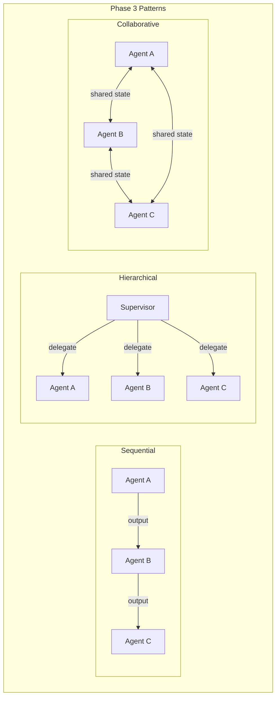

# Phase 3 — Multi-Agent Systems

> **Days 9–12 of your learning path** | True Agentic Behavior  
> Total estimated study time: **15–18 hours** (3 days at 5–6 hrs each)  
> Prerequisites: Phase 2 complete (function calling, structured outputs, error handling)

---

## What You'll Learn

Phase 3 is where AI gets truly powerful. Instead of one agent doing everything, you'll learn to build **systems of specialized agents** that work together — each with its own role, tools, and expertise.

Think of it as the difference between:
- **Phase 2**: A single developer who does everything (fullstack)
- **Phase 3**: A team of specialists (architect, frontend dev, QA) working together

---

## Study Order

```
Day 1 (5–6 hrs): Agent Roles + Sequential Communication
Day 2 (5–6 hrs): Hierarchical (Supervisor) Pattern
Day 3 (5–6 hrs): Collaborative Patterns + Review
```

### Detailed Daily Breakdown

#### Day 1: Foundations of Multi-Agent (5–6 hrs)
| Time | Activity |
|---|---|
| 1.5 hrs | [01_agent_roles.md](./01_agent_roles.md) — Planner, Executor, Critic roles |
| 0.5 hrs | Hands-on: Write role-specific system prompts for each role |
| 1.5 hrs | [02_sequential_communication.md](./02_sequential_communication.md) — Agent pipelines |
| 0.5 hrs | Hands-on: Build a 2-agent sequential pipeline |
| 1.0 hrs | Review + connect concepts: How roles feed into pipelines |
| 0.5 hrs | Review glossary, write notes on what surprised you |

#### Day 2: Hierarchical Systems (5–6 hrs)
| Time | Activity |
|---|---|
| 2.5 hrs | [03_hierarchical_agents.md](./03_hierarchical_agents.md) — Supervisor pattern deep dive |
| 1.0 hrs | Hands-on: Build supervisor + 2 sub-agents with LangGraph |
| 1.0 hrs | Experiment: What happens when sub-agents fail? How does the supervisor handle it? |
| 1.0 hrs | Compare: Sequential vs Hierarchical — when to use each |

#### Day 3: Collaborative Systems + Phase Review (5–6 hrs)
| Time | Activity |
|---|---|
| 2.0 hrs | [04_collaborative_patterns.md](./04_collaborative_patterns.md) — Shared context, debate, voting |
| 1.0 hrs | Hands-on: Build a debate between two agents with a moderator |
| 1.0 hrs | Review all 4 communication patterns — create a comparison matrix |
| 0.5 hrs | [glossary.md](./glossary.md) — Review all Phase 3 terms |
| 0.5 hrs | Reflect: Which pattern would you use for your own project ideas? |

---

## Prerequisites

Before starting Phase 3, make sure you're comfortable with:

- [x] **Function calling**: How LLMs request tool execution (Phase 2, Day 5)
- [x] **Structured outputs**: Pydantic models for predictable LLM output (Phase 2, Day 6)
- [x] **Error handling**: Retry, fallback, circuit breaker patterns (Phase 2, Day 7)
- [x] **ReAct pattern**: Think → Act → Observe loop (Phase 1, Day 2)
- [x] **LangChain basics**: `ChatGoogleGenerativeAI`, `@tool`, `create_react_agent` (Phase 1)

---

## Key Outcomes

After completing Phase 3, you will be able to:

1. **Design agent roles** — Know when to use Planner, Executor, Critic, and hybrid roles
2. **Build sequential pipelines** — Chain agents where output of A becomes input of B
3. **Implement supervisor systems** — Create an orchestrator that delegates to specialists
4. **Choose communication patterns** — Know the tradeoffs between sequential, hierarchical, and collaborative
5. **Handle multi-agent failures** — Understand error propagation and recovery in multi-agent systems

---

## .NET Mental Map

| Multi-Agent Pattern | .NET Equivalent |
|---|---|
| Agent Roles (Planner/Executor/Critic) | CQRS + MediatR pipeline behaviors |
| Sequential Communication | ASP.NET Middleware Pipeline / Chain of Responsibility |
| Hierarchical (Supervisor) | Orchestrator Service / API Gateway / Background Job Dispatcher |
| Collaborative (Shared State) | Event-driven microservices / Redis pub/sub / Shared cache |
| Agent as Tool | Microservice called via HTTP from another service |

---

## Common Traps

1. **Over-engineering agent count**: Don't create 10 agents when 2 would suffice. Start with the minimum number and add more only when a single agent clearly can't handle the complexity.

2. **Unclear role boundaries**: If you can't explain in one sentence what each agent does, your roles are too vague. Each agent should have a clear, non-overlapping responsibility.

3. **Ignoring context window limits**: Every message between agents consumes tokens. Long multi-agent conversations can blow past the context limit. Plan for context management.

4. **No error propagation**: If a sub-agent fails, the supervisor needs to know. Don't silently ignore sub-agent failures.

5. **Treating agents like microservices**: Agents share an LLM and context window. They're not independent services with separate resources. Over-splitting can actually make things slower and more expensive.

---

## Architecture Overview



---

## Files in This Phase

| File | Topic | Key Concepts |
|---|---|---|
| [01_agent_roles.md](./01_agent_roles.md) | Agent Roles | Planner, Executor, Critic, role prompting |
| [02_sequential_communication.md](./02_sequential_communication.md) | Sequential Pipelines | Agent chains, context passing, pipeline ordering |
| [03_hierarchical_agents.md](./03_hierarchical_agents.md) | Supervisor Pattern | Delegation, routing, LangGraph supervisor |
| [04_collaborative_patterns.md](./04_collaborative_patterns.md) | Collaborative Agents | Shared state, debate, blackboard, voting |
| [glossary.md](./glossary.md) | Terminology | All Phase 3 terms explained |

---

**Previous Phase**: [Phase 2 — Tool Mastery](../phase2/README.md)  
**Next Phase**: [Phase 4 — Stateful Agents](../phase4/README.md)
