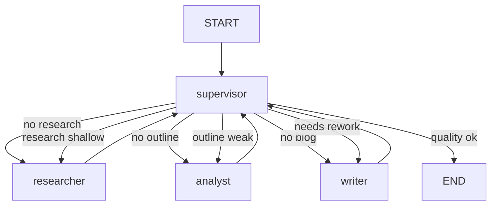
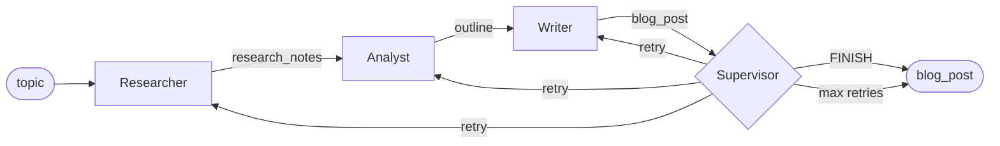

# Blog Generation Graph — Phase 3

## Main Graph

## State Flow

## Node Responsibilities

| Node | Reads | Writes |
|---|---|---|
| supervisor | entire state | next_node, supervisor_feedback, retry_count |
| researcher | topic, supervisor_feedback | research_notes |
| analyst | research_notes, supervisor_feedback | outline |
| writer | outline, research_notes, supervisor_feedback | blog_post |
