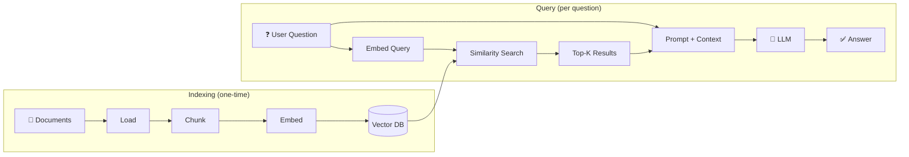
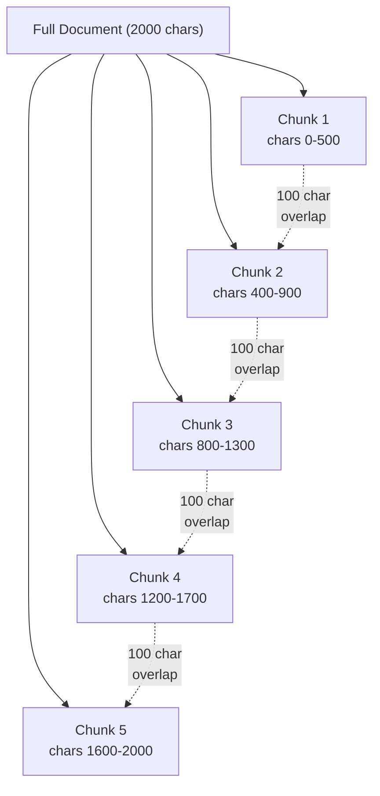
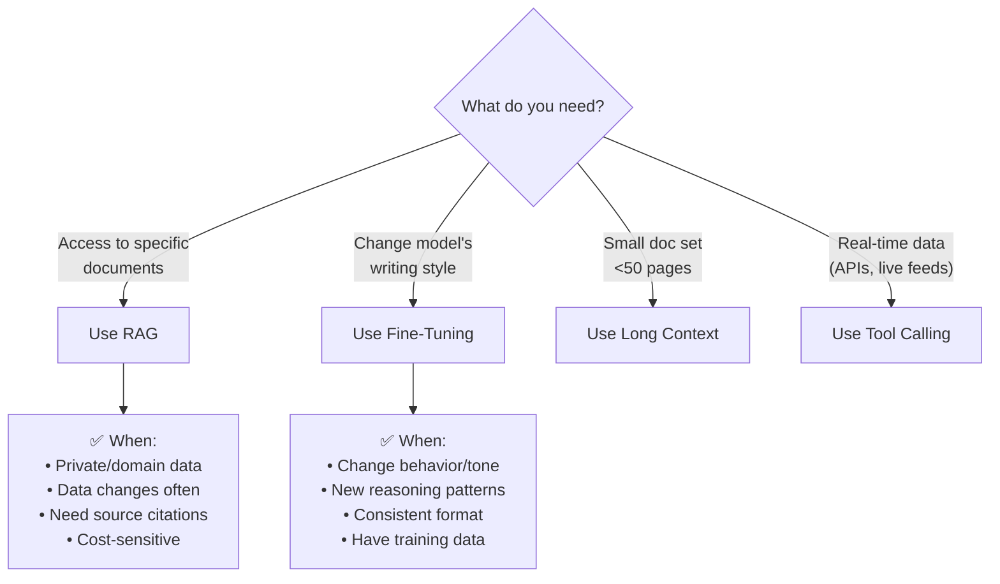
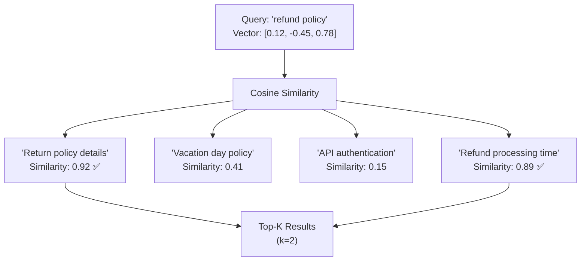

# RAG Fundamentals — Deep Dive

> **Day 13 of your learning path** | Phase 4 — Stateful Agents  
> Estimated study time: **5–6 hours**  
> Prerequisites: Tool calling (Phase 2), basic understanding of LLM API calls

---

## Table of Contents

1. [Simple Explanation](#1-simple-explanation)
2. [Why It Matters](#2-why-it-matters)
3. [Internal Working](#3-internal-working)
4. [Real-World Use Cases](#4-real-world-use-cases)
5. [Common Beginner Mistakes](#5-common-beginner-mistakes)
6. [Best Practices](#6-best-practices)
7. [Python Examples](#7-python-examples)
8. [.NET / C# Equivalent Explanation](#8-net--c-equivalent-explanation)
9. [Diagrams](#9-diagrams)
10. [Mental Models and Analogies](#10-mental-models-and-analogies)

---

## 1. Simple Explanation

**RAG** (Retrieval-Augmented Generation) is a technique that gives an LLM access to **your own data** before it generates a response.

Without RAG:
```
User: "What's our company's refund policy?"
LLM: "I don't have access to your company's policies." (or worse, hallucinated answer)
```

With RAG:
```
User: "What's our company's refund policy?"
System: [searches your documents, finds refund policy page]
LLM: "According to your policy document, refunds are available within 30 days..." ✅
```

The core idea in one sentence: **Search your documents first, then let the LLM answer using what you found.**

### The RAG Pipeline (5 Steps)

```
1. LOAD:      Load your documents (PDFs, web pages, databases)
2. CHUNK:     Split documents into smaller pieces
3. EMBED:     Convert each chunk into a numeric vector (embedding)
4. STORE:     Save vectors in a vector database
5. RETRIEVE:  When user asks a question, find the most relevant chunks
   + GENERATE: Feed those chunks to the LLM as context for answering
```

Think of it as building a custom search engine for the LLM.

---

## 2. Why It Matters

### The Knowledge Cutoff Problem

LLMs have a **training cutoff date**. They don't know about:
- Your company's internal documents
- Events after their training date
- Private data (user records, proprietary research)
- Frequently changing information (prices, stock, weather)

RAG solves this by giving the LLM access to up-to-date, private, domain-specific knowledge.

### RAG vs Fine-Tuning vs Long Context

| Approach | What It Does | Best For | Cost |
|---|---|---|---|
| **RAG** | Retrieves relevant docs at query time | Domain knowledge, private data, changing data | Low — no training needed |
| **Fine-tuning** | Trains the model on your data | Changing behavior/style, specialized reasoning | High — requires training data + compute |
| **Long context** | Paste everything into the prompt | Small document sets (< 200 pages) | Medium — expensive per-query |

**RAG is the default choice** for most applications because:
- No model training required
- Data can be updated without retraining
- Works with any LLM
- Cost-effective (you only retrieve what's needed)
- Verifiable (you know which document the answer came from)

### When RAG Is Not Enough

| Scenario | Better Approach |
|---|---|
| Need to change the model's writing style | Fine-tuning |
| Document set is < 50 pages and never changes | Long context (just paste it in) |
| Need the model to learn new reasoning patterns | Fine-tuning |
| Need real-time data (stock prices, weather) | Tool calling (API calls) |

---

## 3. Internal Working

### Step 1: Document Loading

Documents come in many formats. You need loaders for each:

```python
# LangChain provides loaders for common formats
from langchain_community.document_loaders import (
    PyPDFLoader,          # PDF files
    TextLoader,           # Plain text
    CSVLoader,            # CSV data
    WebBaseLoader,        # Web pages
    DirectoryLoader       # All files in a directory
)
```

Each loader produces `Document` objects containing:
- `page_content`: The text
- `metadata`: Source file, page number, URL, etc.

### Step 2: Chunking

Documents are too long to embed as a single piece. You split them into **chunks** — small, self-contained pieces of text.

**Why chunking matters**: 
- Embedding models have a max input size (typically 512–8192 tokens)
- Smaller chunks = more precise retrieval
- Bigger chunks = more context per result

#### Chunking Strategies

| Strategy | How It Works | Best For |
|---|---|---|
| **Fixed-size** | Split every N characters with overlap | Simple text, uniform documents |
| **Recursive** | Split by paragraphs → sentences → words, respecting boundaries | General purpose (best default) |
| **Semantic** | Split where the topic/meaning changes | Long documents with varied topics |
| **Document-specific** | Split by headers, sections, or code blocks | Markdown, HTML, source code |

```python
# The most common chunking approach: RecursiveCharacterTextSplitter
from langchain_text_splitters import RecursiveCharacterTextSplitter

splitter = RecursiveCharacterTextSplitter(
    chunk_size=1000,      # Max characters per chunk
    chunk_overlap=200,    # Overlap between consecutive chunks
    separators=["\n\n", "\n", ". ", " "],  # Split hierarchy
)
```

**How `RecursiveCharacterTextSplitter` works internally:**
1. Try to split on `\n\n` (paragraph boundaries)
2. If chunks are still too big, split on `\n` (line breaks)
3. If still too big, split on `. ` (sentences)
4. Last resort: split on ` ` (words)
5. Add overlap so context isn't lost at boundaries

**Overlap** is critical — without it, information at chunk boundaries gets lost:

```
Without overlap:
  Chunk 1: "...The refund policy was updated on"
  Chunk 2: "January 15, 2024 to include digital products."
  ↑ The date is split across chunks!

With overlap (200 chars):
  Chunk 1: "...The refund policy was updated on January 15, 2024 to include..."
  Chunk 2: "...was updated on January 15, 2024 to include digital products."
  ↑ Both chunks have the complete sentence!
```

### Step 3: Embedding

An **embedding** converts text into a fixed-size vector (array of numbers) that captures its semantic meaning.

```
"The cat sat on the mat"  →  [0.12, -0.45, 0.78, 0.33, ...]  (768 numbers)
"A feline rested on a rug"  →  [0.11, -0.43, 0.76, 0.35, ...]  (similar!)
"Stock prices rose today"  →  [-0.89, 0.21, -0.15, 0.67, ...]  (very different)
```

**Key insight**: Similar meanings produce similar vectors. This is how retrieval works — find vectors closest to the query vector.

#### Embedding Models

| Model | Dimensions | Provider | Notes |
|---|---|---|---|
| `text-embedding-004` | 768 | Google | Good balance, works with Gemini |
| `text-embedding-3-small` | 1536 | OpenAI | Popular, cost-effective |
| `text-embedding-3-large` | 3072 | OpenAI | Higher quality, more expensive |
| `all-MiniLM-L6-v2` | 384 | HuggingFace | Free, runs locally |

For your Gemini-based stack:

```python
from langchain_google_genai import GoogleGenerativeAIEmbeddings

embeddings = GoogleGenerativeAIEmbeddings(model="models/text-embedding-004")
```

### Step 4: Storage (Vector Database)

Embeddings are stored in a **vector database** that supports fast similarity search. (Covered in depth in [02_vector_databases.md](./02_vector_databases.md).)

```python
from langchain_chroma import Chroma

# Store embeddings
vectorstore = Chroma.from_documents(
    documents=chunks,
    embedding=embeddings,
    persist_directory="./chroma_db"
)
```

### Step 5: Retrieval + Generation

When the user asks a question:

```
1. Embed the user's question into a vector
2. Search the vector DB for the K most similar chunk vectors
3. Retrieve those chunks (the actual text)
4. Construct a prompt: "Here's relevant context: {chunks}. Now answer: {question}"
5. Send to LLM for generation
```

```python
# Retrieval
retriever = vectorstore.as_retriever(search_kwargs={"k": 4})
relevant_docs = retriever.invoke("What is the refund policy?")

# Generation
context = "\n\n".join(doc.page_content for doc in relevant_docs)
answer = llm.invoke(f"Context:\n{context}\n\nQuestion: What is the refund policy?")
```

### How Similarity Search Works

The most common metric is **cosine similarity** — the angle between two vectors:

```
Cosine similarity = 1.0  →  Identical meaning
Cosine similarity = 0.0  →  Unrelated
Cosine similarity = -1.0 →  Opposite meaning

"refund policy" vs "return policy"    →  ~0.92 (very similar)
"refund policy" vs "cat pictures"     →  ~0.05 (unrelated)
```

---

## 4. Real-World Use Cases

### 1. Company Knowledge Base Bot

```
Documents: Internal wiki, HR policies, product docs
User: "How many vacation days do new employees get?"
RAG: Retrieves HR policy → "New employees receive 15 vacation days per year"
```

### 2. Legal Document Search

```
Documents: Thousands of legal contracts
User: "Which contracts have a non-compete clause?"
RAG: Retrieves relevant contract sections → Lists contracts with non-compete clauses
```

### 3. Code Documentation Assistant

```
Documents: API docs, README files, code comments
User: "How do I authenticate with the payment API?"
RAG: Retrieves auth documentation → Step-by-step authentication guide
```

### 4. Customer Support with Product Knowledge

```
Documents: Product manuals, FAQ, troubleshooting guides
User: "My printer shows error code E-502"
RAG: Retrieves troubleshooting guide for E-502 → Specific fix instructions
```

### 5. Research Assistant

```
Documents: Academic papers, reports
User: "What are the latest findings on CRISPR gene editing safety?"
RAG: Retrieves relevant paper sections → Summarized findings with citations
```

---

## 5. Common Beginner Mistakes

### Mistake 1: Chunks Too Large

```python
# ❌ BAD — Chunks of 5000 characters
splitter = RecursiveCharacterTextSplitter(chunk_size=5000)
# Results contain too much irrelevant text, confusing the LLM

# ✅ GOOD — Chunks of 500-1000 characters with overlap
splitter = RecursiveCharacterTextSplitter(
    chunk_size=800,
    chunk_overlap=200
)
# Results are focused and relevant
```

### Mistake 2: No Overlap Between Chunks

```python
# ❌ BAD — Zero overlap
splitter = RecursiveCharacterTextSplitter(chunk_size=500, chunk_overlap=0)
# Information at chunk boundaries is lost!

# ✅ GOOD — 10-20% overlap
splitter = RecursiveCharacterTextSplitter(chunk_size=500, chunk_overlap=100)
```

### Mistake 3: Not Including Source References

```python
# ❌ BAD — LLM answers but user has no way to verify
prompt = f"Context: {context}\n\nAnswer the question: {question}"

# ✅ GOOD — Include sources in the prompt
prompt = f"""Answer the question using ONLY the provided context.
After your answer, list which sources you used.

Context:
{context_with_sources}

Question: {question}

Answer (with source citations):"""
```

### Mistake 4: Retrieving Too Many or Too Few Documents

```python
# ❌ BAD — Too many (noisy, confusing)
retriever = vectorstore.as_retriever(search_kwargs={"k": 20})

# ❌ BAD — Too few (might miss important context)
retriever = vectorstore.as_retriever(search_kwargs={"k": 1})

# ✅ GOOD — 3-5 is the sweet spot for most tasks
retriever = vectorstore.as_retriever(search_kwargs={"k": 4})
```

### Mistake 5: Using RAG Prompt Without Grounding Instructions

```python
# ❌ BAD — LLM might ignore context and hallucinate
prompt = f"Context: {context}\n\nQuestion: {question}"

# ✅ GOOD — Explicitly ground the LLM
prompt = f"""Answer the question based ONLY on the following context.
If the context doesn't contain the answer, say "I don't have enough information."
Do NOT make up information that isn't in the context.

Context:
{context}

Question: {question}"""
```

### Mistake 6: Same Embedding Model for Different Languages

```python
# ❌ BAD — English embedding model for mixed-language documents
# If your docs are in multiple languages, use a multilingual model

# ✅ GOOD — Use multilingual embeddings when needed
embeddings = GoogleGenerativeAIEmbeddings(model="models/text-embedding-004")
# Google's embedding model supports 100+ languages
```

---

## 6. Best Practices

### 1. The RAG Prompt Template

```python
RAG_PROMPT = """You are a helpful assistant. Answer the user's question using 
ONLY the provided context. Follow these rules:

1. If the context contains the answer, provide it clearly
2. If the context partially answers the question, say what you know and what's missing
3. If the context doesn't contain the answer, say "I don't have enough information to answer this"
4. NEVER make up information not in the context
5. Cite which source document(s) your answer comes from

Context:
{context}

Question: {question}

Answer:"""
```

### 2. Metadata Is Your Friend

Always preserve document metadata — it enables filtering and citation:

```python
# When loading documents
doc = Document(
    page_content="Refund policy text here...",
    metadata={
        "source": "policies/refund_policy.pdf",
        "page": 3,
        "department": "customer_service",
        "last_updated": "2024-01-15"
    }
)

# When retrieving, you can filter
results = vectorstore.similarity_search(
    query,
    filter={"department": "customer_service"}  # Only search CS docs
)
```

### 3. Chunking Strategy Selection

```
Plain text / articles   → RecursiveCharacterTextSplitter (default)
Markdown / HTML         → MarkdownHeaderTextSplitter / HTMLHeaderTextSplitter
Source code             → Language-aware splitter (RecursiveCharacterTextSplitter.from_language())
Structured data (CSV)   → Row-based chunking (each row = one document)
Legal / academic        → Semantic chunking (split by topic change)
```

### 4. Evaluate Your RAG Pipeline

Measure these metrics:
- **Retrieval precision**: Are the retrieved documents actually relevant?
- **Retrieval recall**: Did you miss any relevant documents?
- **Answer faithfulness**: Does the answer only use information from retrieved docs?
- **Answer relevance**: Does the answer actually address the question?

### 5. Iterative Improvement

```
V1: Basic RAG (fixed chunking, simple retrieval)
  → Measure quality, identify failures
  
V2: Better chunking (smaller chunks, more overlap)
  → Re-measure, check if retrieval improved

V3: Add metadata filtering (department, date range)
  → Re-measure, check precision improvement

V4: Add reranking (re-score retrieved docs for relevance)
  → Re-measure, check answer quality
```

---

## 7. Python Examples

### Example 1: Complete RAG Pipeline from Scratch

```python
"""
Build a RAG pipeline from scratch using LangChain + Gemini.
This indexes text documents and answers questions from them.
"""
from langchain_google_genai import ChatGoogleGenerativeAI, GoogleGenerativeAIEmbeddings
from langchain_core.messages import SystemMessage, HumanMessage
from langchain_text_splitters import RecursiveCharacterTextSplitter
from langchain_chroma import Chroma
from langchain_core.documents import Document
from dotenv import load_dotenv

load_dotenv()

# ── Step 1: Create sample documents ──────────────────

# In real apps, you'd load from files. Here we create sample docs.
documents = [
    Document(
        page_content="""
        Company Refund Policy (Updated January 2024)
        
        All products purchased from our store can be returned within 30 days 
        of purchase for a full refund. Digital products (software, e-books) 
        can be refunded within 14 days if not downloaded. Physical products 
        must be in original packaging. Shipping costs are non-refundable.
        
        To request a refund, email support@example.com with your order number.
        Refunds are processed within 5-7 business days.
        """,
        metadata={"source": "policies/refund_policy.md", "department": "customer_service"}
    ),
    Document(
        page_content="""
        Employee Vacation Policy (2024)
        
        Full-time employees receive vacation days based on tenure:
        - Year 1-2: 15 days
        - Year 3-5: 20 days  
        - Year 5+: 25 days
        
        Vacation days do not roll over to the next year. Unused days 
        are forfeited on December 31st. Employees must request vacation 
        at least 2 weeks in advance through the HR portal.
        """,
        metadata={"source": "policies/vacation_policy.md", "department": "hr"}
    ),
    Document(
        page_content="""
        API Authentication Guide
        
        All API requests require authentication via Bearer tokens.
        
        To get a token:
        1. Register your application at developer.example.com
        2. Get your client_id and client_secret
        3. POST to /oauth/token with your credentials
        4. Use the returned access_token in the Authorization header
        
        Tokens expire after 1 hour. Use the refresh_token to get a new one.
        Rate limit: 1000 requests per minute per token.
        """,
        metadata={"source": "docs/api_auth.md", "department": "engineering"}
    ),
    Document(
        page_content="""
        Quarterly Sales Report - Q4 2023
        
        Total revenue: $4.2M (up 15% from Q3)
        Top products: Cloud Platform (40%), Analytics Suite (35%), API Gateway (25%)
        New customers: 142 (up 23% from Q3)
        Churn rate: 3.2% (down from 4.1% in Q3)
        
        Key wins: Enterprise deal with Acme Corp ($500K ARR), 
        expansion of existing customer TechCo to premium tier.
        
        Challenges: Longer sales cycles in EMEA region, 
        competitor launched similar product at lower price point.
        """,
        metadata={"source": "reports/q4_2023_sales.md", "department": "sales"}
    ),
]

# ── Step 2: Chunk documents ───────────────────────────

splitter = RecursiveCharacterTextSplitter(
    chunk_size=500,
    chunk_overlap=100,
    separators=["\n\n", "\n", ". ", " "]
)

chunks = splitter.split_documents(documents)
print(f"Split {len(documents)} documents into {len(chunks)} chunks")

for i, chunk in enumerate(chunks):
    print(f"  Chunk {i}: {len(chunk.page_content)} chars from {chunk.metadata['source']}")

# ── Step 3: Embed and store ───────────────────────────

embeddings = GoogleGenerativeAIEmbeddings(model="models/text-embedding-004")

vectorstore = Chroma.from_documents(
    documents=chunks,
    embedding=embeddings,
    collection_name="company_docs"
    # persist_directory="./chroma_db"  # Uncomment to save to disk
)

print(f"\nStored {len(chunks)} chunks in vector database")

# ── Step 4: Retrieval + Generation ────────────────────

llm = ChatGoogleGenerativeAI(model="gemini-2.0-flash")

RAG_PROMPT = """Answer the question using ONLY the provided context.
If the context doesn't contain the answer, say "I don't have enough information."
Do NOT make up information. Cite the source document.

Context:
{context}

Question: {question}"""

def ask(question: str, k: int = 3) -> str:
    # Retrieve relevant chunks
    results = vectorstore.similarity_search(question, k=k)
    
    # Format context with sources
    context_parts = []
    for doc in results:
        source = doc.metadata.get('source', 'unknown')
        context_parts.append(f"[Source: {source}]\n{doc.page_content}")
    context = "\n\n---\n\n".join(context_parts)
    
    # Generate answer
    prompt = RAG_PROMPT.format(context=context, question=question)
    response = llm.invoke([HumanMessage(content=prompt)])
    
    return response.content

# ── Step 5: Test ──────────────────────────────────────

questions = [
    "What is the refund policy for digital products?",
    "How many vacation days does a 4-year employee get?",
    "How do I authenticate with the API?",
    "What was the Q4 revenue?",
    "What is the CEO's name?",  # Not in our docs — should say "I don't know"
]

for q in questions:
    print(f"\n{'─'*50}")
    print(f"Q: {q}")
    print(f"A: {ask(q)}")
```

### Example 2: RAG with Metadata Filtering

```python
"""
RAG with metadata filtering — search only within specific departments.
"""
from langchain_google_genai import ChatGoogleGenerativeAI, GoogleGenerativeAIEmbeddings
from langchain_core.messages import HumanMessage
from langchain_text_splitters import RecursiveCharacterTextSplitter
from langchain_chroma import Chroma
from langchain_core.documents import Document
from dotenv import load_dotenv

load_dotenv()

embeddings = GoogleGenerativeAIEmbeddings(model="models/text-embedding-004")
llm = ChatGoogleGenerativeAI(model="gemini-2.0-flash")

# Create a vectorstore with department metadata
# (reuse documents from Example 1)

def filtered_search(question: str, department: str = None, k: int = 3) -> str:
    """Search with optional department filter."""
    
    search_kwargs = {"k": k}
    if department:
        search_kwargs["filter"] = {"department": department}
    
    results = vectorstore.similarity_search(question, **search_kwargs)
    
    context = "\n\n".join(
        f"[{doc.metadata['source']}] {doc.page_content}" 
        for doc in results
    )
    
    prompt = f"""Answer using ONLY this context. Cite sources.
If the answer isn't in the context, say so.

Context:
{context}

Question: {question}"""
    
    return llm.invoke([HumanMessage(content=prompt)]).content

# Without filter — searches everything
print("All departments:", filtered_search("What are the vacation days?"))

# With filter — only HR documents
print("HR only:", filtered_search("What are the vacation days?", department="hr"))

# With filter — only engineering
print("Engineering only:", filtered_search("How do I authenticate?", department="engineering"))
```

### Example 3: RAG Pipeline with Reranking

```python
"""
Advanced RAG with reranking — retrieve more, then rerank for the most relevant.
This improves quality when the initial retrieval has noise.
"""
from langchain_google_genai import ChatGoogleGenerativeAI, GoogleGenerativeAIEmbeddings
from langchain_core.messages import SystemMessage, HumanMessage
from pydantic import BaseModel, Field
from dotenv import load_dotenv

load_dotenv()

llm = ChatGoogleGenerativeAI(model="gemini-2.0-flash")

# ── LLM-based reranker ───────────────────────────────

class RelevanceScore(BaseModel):
    score: float = Field(ge=0.0, le=1.0, description="Relevance score 0-1")
    reasoning: str = Field(description="Why this score")

def rerank_documents(query: str, documents: list, top_k: int = 3) -> list:
    """Use the LLM to rerank retrieved documents by relevance."""
    
    scorer = llm.with_structured_output(RelevanceScore)
    scored_docs = []
    
    for doc in documents:
        score = scorer.invoke([
            SystemMessage(content="Rate how relevant this document is to the query. "
                        "Score 0.0 = completely irrelevant, 1.0 = perfectly relevant."),
            HumanMessage(content=f"Query: {query}\n\nDocument:\n{doc.page_content}")
        ])
        scored_docs.append((doc, score.score, score.reasoning))
    
    # Sort by score descending
    scored_docs.sort(key=lambda x: x[1], reverse=True)
    
    print(f"\nReranking results for: '{query}'")
    for doc, score, reason in scored_docs:
        print(f"  Score {score:.2f}: {doc.page_content[:60]}... ({reason[:50]})")
    
    return [doc for doc, _, _ in scored_docs[:top_k]]

def rag_with_reranking(question: str, vectorstore, initial_k: int = 8, final_k: int = 3) -> str:
    """
    Two-stage retrieval:
    1. Retrieve initial_k documents (cast a wide net)
    2. Rerank to find the final_k most relevant
    """
    # Stage 1: Broad retrieval
    initial_docs = vectorstore.similarity_search(question, k=initial_k)
    
    # Stage 2: Rerank for precision
    best_docs = rerank_documents(question, initial_docs, top_k=final_k)
    
    # Generate
    context = "\n\n".join(doc.page_content for doc in best_docs)
    
    response = llm.invoke([
        SystemMessage(content="Answer using ONLY the provided context. Cite sources."),
        HumanMessage(content=f"Context:\n{context}\n\nQuestion: {question}")
    ])
    
    return response.content
```

### Example 4: RAG as an Agent Tool

```python
"""
Combine RAG with agent tool calling — the agent decides WHEN to search.
This is how production RAG agents work.
"""
from langchain_google_genai import ChatGoogleGenerativeAI, GoogleGenerativeAIEmbeddings
from langchain_core.messages import SystemMessage, HumanMessage, ToolMessage
from langchain_core.tools import tool
from langchain_chroma import Chroma
from dotenv import load_dotenv

load_dotenv()

llm = ChatGoogleGenerativeAI(model="gemini-2.0-flash")
embeddings = GoogleGenerativeAIEmbeddings(model="models/text-embedding-004")

# Assume vectorstore is already populated
# vectorstore = Chroma(persist_directory="./chroma_db", embedding_function=embeddings)

@tool
def search_knowledge_base(query: str) -> str:
    """Search the company knowledge base for relevant information.
    Use this when you need to find specific facts, policies, or documentation.
    
    Args:
        query: The search query — what information you're looking for.
    """
    results = vectorstore.similarity_search(query, k=4)
    
    if not results:
        return "No relevant documents found."
    
    formatted = []
    for doc in results:
        source = doc.metadata.get("source", "unknown")
        formatted.append(f"[{source}]\n{doc.page_content}")
    
    return "\n\n---\n\n".join(formatted)

# ── Agent with RAG tool ───────────────────────────────

AGENT_PROMPT = """You are a helpful company assistant with access to the knowledge base.

When the user asks a question:
1. If you need information, search the knowledge base first
2. Answer based on what you find
3. If the knowledge base doesn't have the answer, say so
4. Always cite your sources

You can have a normal conversation without searching if the question doesn't need knowledge base info."""

def run_rag_agent(user_message: str) -> str:
    agent = llm.bind_tools([search_knowledge_base])
    
    messages = [
        SystemMessage(content=AGENT_PROMPT),
        HumanMessage(content=user_message)
    ]
    
    for _ in range(3):  # Max 3 tool call rounds
        response = agent.invoke(messages)
        messages.append(response)
        
        if not response.tool_calls:
            return response.content
        
        for tc in response.tool_calls:
            result = search_knowledge_base.invoke(tc["args"])
            messages.append(ToolMessage(content=result, tool_call_id=tc["id"]))
    
    return messages[-1].content

# ── Test ──────────────────────────────────────────────

# This question triggers a knowledge base search
print(run_rag_agent("What's our refund policy for digital products?"))

# This question doesn't need the knowledge base
print(run_rag_agent("What is 2 + 2?"))
```

---

## 8. .NET / C# Equivalent Explanation

### RAG ≈ Full-Text Search + Answer Generation

```csharp
// .NET: The RAG pipeline maps to familiar patterns

// 1. Document Loading ≈ File/DB reading
var documents = Directory.GetFiles("docs/", "*.md")
    .Select(f => new { Content = File.ReadAllText(f), Source = f });

// 2. Chunking ≈ String splitting (but smarter)
var chunks = documents.SelectMany(doc => 
    ChunkDocument(doc.Content, maxSize: 500, overlap: 100));

// 3. Embedding ≈ Computing a hash, but semantic
// Like computing a feature vector for ML
float[] embedding = await embeddingService.Embed("some text");

// 4. Storage ≈ Indexing for search (like Lucene.NET)
await searchIndex.IndexDocuments(chunks);

// 5. Retrieval ≈ Search query
var results = await searchIndex.Search(userQuery, topK: 4);

// 6. Generation ≈ Template + LLM call
var prompt = $"Context: {results}\n\nQuestion: {userQuery}";
var answer = await llm.Generate(prompt);
```

### Vector Embedding ≈ Feature Vector

```csharp
// .NET ML.NET: Feature extraction is the same concept
// Text → fixed-size numeric array that captures meaning

// In ML.NET:
var pipeline = mlContext.Transforms.Text
    .FeaturizeText("Features", "Text");  // Text → float[]

// In RAG:
float[] embedding = await embeddings.Embed("refund policy");
// Same idea: text → float[] that represents meaning
```

### Similarity Search ≈ Nearest Neighbor

```csharp
// .NET: Finding the closest match
// Like LINQ's OrderBy with a distance function

var closest = documents
    .Select(doc => new { 
        Doc = doc, 
        Similarity = CosineSimilarity(queryVector, doc.Vector) 
    })
    .OrderByDescending(x => x.Similarity)
    .Take(4);

// CosineSimilarity is like string.Compare() but for meaning
static double CosineSimilarity(float[] a, float[] b)
{
    double dot = a.Zip(b, (x, y) => x * y).Sum();
    double magA = Math.Sqrt(a.Sum(x => x * x));
    double magB = Math.Sqrt(b.Sum(x => x * x));
    return dot / (magA * magB);
}
```

### The Full .NET Mapping

| RAG Concept | .NET Equivalent |
|---|---|
| **Document loader** | `File.ReadAllText()`, `StreamReader`, `HttpClient.GetStringAsync()` |
| **Chunking** | String splitting with overlap — like windowed LINQ operations |
| **Embedding** | `ML.NET FeaturizeText` / Feature vector in ML pipeline |
| **Vector store** | Lucene.NET index / Azure Cognitive Search / Elasticsearch |
| **Similarity search** | `OrderBy(CosineSimilarity)` / K-Nearest Neighbors |
| **Metadata filter** | `WHERE` clause in SQL / `filter` in search index |
| **RAG prompt** | String interpolation template with context injection |
| **Reranking** | Second-pass scoring — like applying business rules to search results |

### Azure-Specific RAG

```csharp
// If you're in Azure, the .NET RAG stack looks like:
// 1. Azure Blob Storage (document storage)
// 2. Azure AI Document Intelligence (PDF parsing)
// 3. Azure OpenAI Embeddings (embedding)
// 4. Azure AI Search (vector database + search)
// 5. Azure OpenAI GPT (generation)

// Semantic Kernel (Microsoft's LangChain equivalent) handles this:
var memory = new MemoryBuilder()
    .WithAzureOpenAITextEmbeddingGeneration(...)
    .WithAzureAISearchMemoryStore(...)
    .Build();

await memory.SaveInformationAsync("docs", "Refund policy text...", "refund-policy");
var results = await memory.SearchAsync("docs", "refund for digital products");
```

---

## 9. Diagrams

### End-to-End RAG Pipeline



### Chunking with Overlap



### RAG vs Fine-Tuning Decision



### Similarity Search Visualization



---

## 10. Mental Models and Analogies

### The Library Research Analogy

```
RAG is like using a library:

1. LOAD:     The library acquires books (your documents)
2. CHUNK:    Books are catalogued by chapter/section (chunking)
3. EMBED:    Each section gets index cards with topics (embedding)
4. STORE:    Index cards go into the card catalog (vector database)
5. RETRIEVE: You search the catalog for your topic (similarity search)
6. GENERATE: You read the relevant sections and write your report (LLM generation)

Without RAG: You ask someone who's read many books but not yours
With RAG: You give them the relevant pages from YOUR books, then they answer
```

### The .NET Developer's Mental Model

```
RAG is just a search engine with an LLM on top.

You already understand:
  1. Loading files (File.ReadAllText)
  2. Splitting text (String.Split, but smarter)
  3. Indexing for search (Lucene.NET / SQL Full-Text)
  4. Querying the index (search.Query("refund policy"))
  5. Building a response (string interpolation with search results)

RAG replaces:
  - Traditional keyword matching → Semantic similarity (understands meaning)
  - Returning raw results → LLM generates a natural language answer

It's the same architecture, just with smarter search.
```

### The Embedding Intuition

```
An embedding is like GPS coordinates for meaning.

"cat" → (37.7749, -122.4194)  // San Francisco
"dog" → (37.8044, -122.2712)  // Oakland (nearby!)
"car" → (40.7128, -74.0060)   // New York (far away)

Words with similar meanings have similar "coordinates."
Similarity search = finding the nearest points on the map.

In reality: instead of 2D coordinates, embeddings have 768+ dimensions.
But the principle is identical — nearby = similar meaning.
```

### The Open-Book Exam Analogy

```
Without RAG: Closed-book exam
  - Student (LLM) answers from memory only
  - May forget details or make things up

With RAG: Open-book exam  
  - Student gets to look up the relevant pages before answering
  - Answers are more accurate and verifiable
  - But: you need a good index to find the right pages quickly
```

---

## Summary

| Concept | One-Line Summary |
|---|---|
| RAG | Search your documents first, then let the LLM answer using what you found |
| Chunking | Splitting documents into small, embeddable pieces |
| Embedding | Converting text into a numeric vector that captures meaning |
| Vector store | A database optimized for similarity search on embeddings |
| Similarity search | Finding the vectors closest to the query vector |
| Cosine similarity | A metric measuring the angle between two vectors (1.0 = identical) |
| Metadata filtering | Narrowing search results using document properties (source, date, etc.) |
| Reranking | A second pass to re-score retrieved documents for better relevance |
| Grounding | Instructing the LLM to use ONLY the provided context |

---

**Previous**: [README.md](./README.md)  
**Next**: [02_vector_databases.md](./02_vector_databases.md) — Deep dive into how vector databases store and search embeddings.
