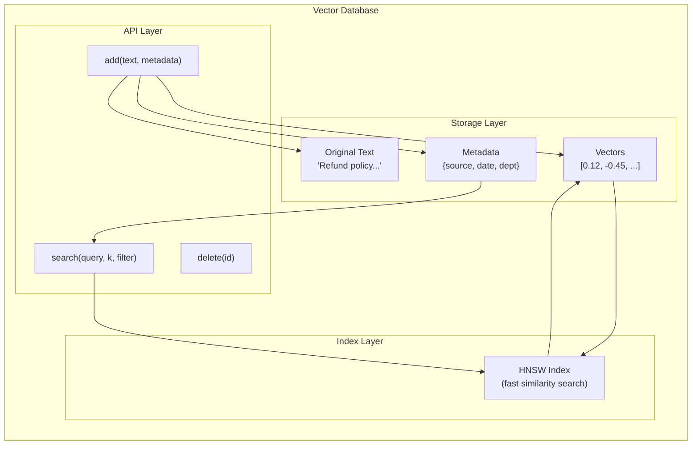
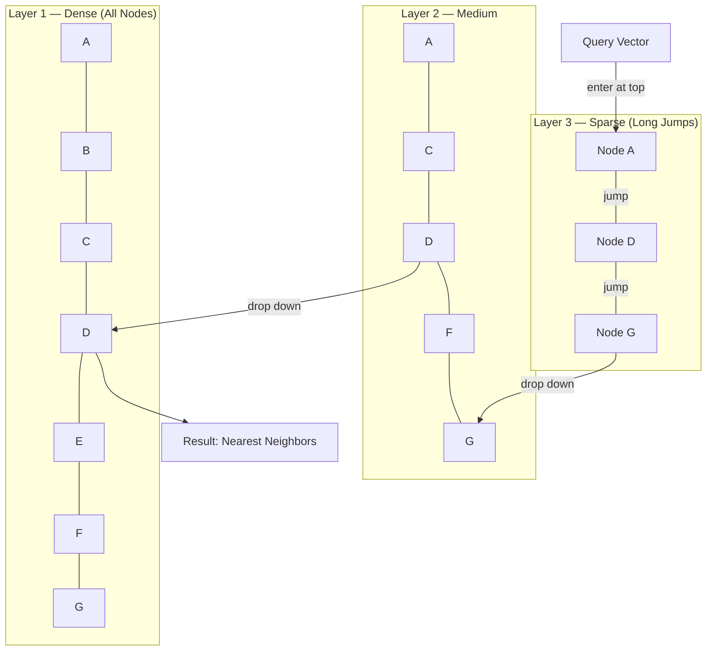
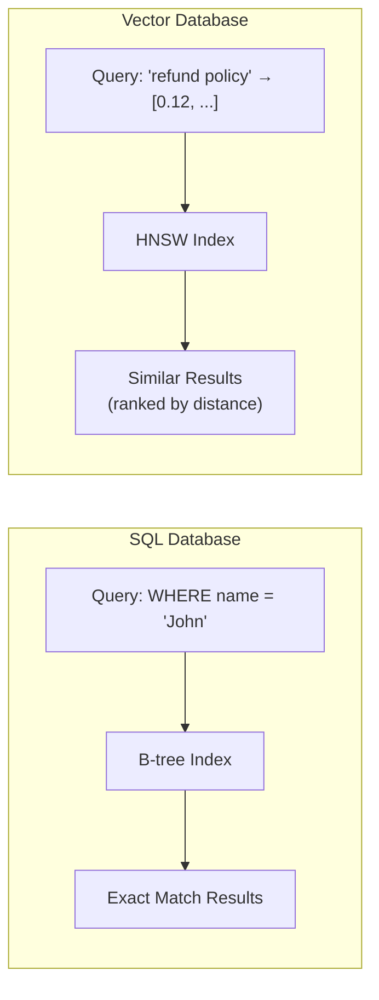
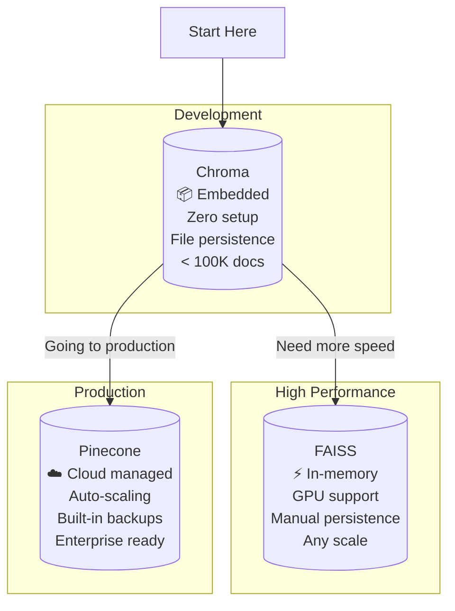

# Vector Databases — Deep Dive

> **Day 14 of your learning path** | Phase 4 — Stateful Agents  
> Estimated study time: **5–6 hours**  
> Prerequisites: RAG Fundamentals (01), understanding of embeddings

---

## Table of Contents

1. [Simple Explanation](#1-simple-explanation)
2. [Why It Matters](#2-why-it-matters)
3. [Internal Working](#3-internal-working)
4. [Real-World Use Cases](#4-real-world-use-cases)
5. [Common Beginner Mistakes](#5-common-beginner-mistakes)
6. [Best Practices](#6-best-practices)
7. [Python Examples](#7-python-examples)
8. [.NET / C# Equivalent Explanation](#8-net--c-equivalent-explanation)
9. [Diagrams](#9-diagrams)
10. [Mental Models and Analogies](#10-mental-models-and-analogies)

---

## 1. Simple Explanation

A **vector database** is a database designed to store and search **vectors** (arrays of numbers). While a regular database finds rows that match exact queries (`WHERE name = 'John'`), a vector database finds items that are **similar** to a query.

```
Traditional DB query:  "Find all users named John"    → Exact match
Vector DB query:       "Find documents about refunds" → Similarity match
```

### What Is a Vector?

A vector is just an array of numbers:

```python
# This is a vector (768 dimensions — shortened here)
embedding = [0.12, -0.45, 0.78, 0.33, -0.21, 0.56, ...]

# Think of it as coordinates in a high-dimensional space
# Each number represents some aspect of the text's meaning
```

### What Makes Vector Databases Special?

| Feature | Traditional DB (SQL) | Vector DB |
|---|---|---|
| **Query type** | Exact match (`=`, `LIKE`, `>`) | Similarity (nearest neighbors) |
| **Data stored** | Rows with typed columns | Vectors + metadata + original text |
| **Index type** | B-tree, hash index | HNSW, IVF, LSH |
| **Returns** | Rows matching criteria | K nearest neighbors by distance |
| **Good for** | Structured data, transactions | Semantic search, recommendations |
| **Example query** | `WHERE price < 100` | "Find products similar to this one" |

---

## 2. Why It Matters

### The Search Problem

Traditional search (keyword-based) fails for semantic queries:

```
Document: "Our return policy allows customers to send items back within 30 days"
Query: "refund policy"

Keyword search: ❌ No match (word "refund" doesn't appear)
Vector search:  ✅ Match (meanings are similar — "return" ≈ "refund")
```

Vector databases enable **semantic search** — finding content by meaning, not just keywords.

### Why Not Just Use a Regular Database?

You *could* store vectors in PostgreSQL:

```sql
-- Technically works, but...
CREATE TABLE documents (
    id SERIAL PRIMARY KEY,
    content TEXT,
    embedding FLOAT[768]
);

-- This query scans EVERY row — O(n) for each query
SELECT *, cosine_similarity(embedding, query_vector) as sim
FROM documents
ORDER BY sim DESC
LIMIT 5;
```

The problem: with 1 million documents, this means 1 million distance calculations per query. Vector databases use specialized indexes (HNSW, IVF) to make this fast — typically 10-100x faster than brute force.

### The Scale Perspective

| Documents | Brute Force | HNSW Index | Speedup |
|---|---|---|---|
| 10,000 | 50ms | 2ms | 25x |
| 100,000 | 500ms | 5ms | 100x |
| 1,000,000 | 5,000ms | 10ms | 500x |
| 10,000,000 | 50,000ms | 20ms | 2,500x |

---

## 3. Internal Working

### Distance Metrics

Vector databases measure "closeness" using distance metrics:

#### Cosine Similarity (Most Common for Text)

Measures the angle between two vectors. Ignores magnitude, only cares about direction.

```
cos(A, B) = (A · B) / (|A| × |B|)

Range: -1.0 to 1.0
  1.0  = identical direction (same meaning)
  0.0  = perpendicular (unrelated)
  -1.0 = opposite direction (opposite meaning)
```

```python
import numpy as np

def cosine_similarity(a, b):
    return np.dot(a, b) / (np.linalg.norm(a) * np.linalg.norm(b))
```

#### Euclidean Distance (L2)

Measures the straight-line distance between two points.

```
distance = sqrt(sum((a_i - b_i)^2))

Range: 0 to ∞
  0 = identical
  Higher = more different
```

#### When to Use Which

| Metric | Best For | Why |
|---|---|---|
| **Cosine** | Text embeddings | Magnitude doesn't matter, only direction |
| **Euclidean (L2)** | Image embeddings, coordinates | Magnitude matters |
| **Dot product** | When embeddings are already normalized | Fastest computation |

For RAG with text: **always use cosine similarity**.

### HNSW (Hierarchical Navigable Small World)

HNSW is the most popular indexing algorithm in vector databases. It enables fast approximate nearest-neighbor search.

#### The Intuition

Imagine finding someone in a city:

```
Without HNSW (brute force):
  Visit every house in the city. Check if the person lives there.
  → O(n) — slow for large cities

With HNSW:
  1. Start at the "highway" level — jump between neighborhoods
  2. Find the right neighborhood
  3. Drop to the "street" level — walk between blocks
  4. Find the right block
  5. Drop to the "house" level — check individual houses
  → O(log n) — fast even for massive cities
```

#### How HNSW Works

HNSW builds a multi-layer graph:

```
Layer 3 (sparse):   A -------- D -------- G         (long-range connections)
Layer 2 (medium):   A --- C --- D --- F --- G        (medium-range)
Layer 1 (dense):    A-B-C-D-E-F-G-H-I-J-K           (short-range, all nodes)
```

**Search algorithm:**
1. Start at the top layer (sparse, long jumps)
2. Greedily move to the nearest neighbor at each layer
3. When you can't get closer, drop to the next layer
4. Repeat until you reach the bottom layer (all nodes)
5. The bottom layer gives you the exact nearest neighbors

**Key parameters:**
- `M` (max connections per node): Higher = more accurate, more memory
- `ef_construction` (build-time search width): Higher = better index quality, slower build
- `ef_search` (query-time search width): Higher = more accurate queries, slower search

### IVF (Inverted File Index)

An alternative to HNSW that partitions the vector space into clusters:

```
1. K-means clustering divides vectors into, say, 100 clusters
2. Each vector is assigned to its nearest cluster
3. At query time: find the nearest cluster(s), search only those
4. Reduces search space from N to N/100
```

IVF is simpler than HNSW but less accurate. HNSW is the default choice.

### Popular Vector Databases Compared

| Database | Type | Best For | Pricing | Index Type |
|---|---|---|---|---|
| **Chroma** | Embedded (in-process) | Development, small projects | Free / open-source | HNSW |
| **FAISS** | Library (in-process) | High-performance local search | Free / open-source | IVF, HNSW, flat |
| **Pinecone** | Cloud-hosted | Production SaaS applications | Pay-per-use | Proprietary |
| **Weaviate** | Self-hosted / Cloud | Flexible deployment | Free / paid cloud | HNSW |
| **Qdrant** | Self-hosted / Cloud | Production with filtering | Free / paid cloud | HNSW |
| **pgvector** | PostgreSQL extension | When you already use Postgres | Free | IVF, HNSW |

**For learning and development**: Use **Chroma** — it runs in-process with zero setup.  
**For production**: Evaluate Pinecone (managed) or Qdrant (self-hosted) based on your needs.

---

## 4. Real-World Use Cases

### 1. Semantic Document Search

```
Traditional search fails:
  Query: "how to cancel my subscription"
  Document: "To terminate your recurring plan, navigate to Account Settings"
  
  Keyword match: ❌ (no shared words)
  Vector match:  ✅ ("cancel subscription" ≈ "terminate recurring plan")
```

### 2. Recommendation Systems

```
User just watched: "The Matrix" → vector representation
Find movies with similar vectors:
  - "Inception" (similarity: 0.89)
  - "Blade Runner 2049" (similarity: 0.84)
  - "Ghost in the Shell" (similarity: 0.78)
```

### 3. Duplicate Detection

```
Support ticket: "My payment was charged twice"
Find similar past tickets:
  - "Double charge on credit card" (0.91)
  - "Duplicate payment issue" (0.88)
  
Link to existing resolution: "Issue #4521 — resolved by refunding duplicate"
```

### 4. Image Search (with CLIP Embeddings)

```
User uploads: photo of a red dress
System embeds image → searches product catalog vectors
Returns: similar-looking red dresses from inventory
```

### 5. Code Search

```
Query: "function that validates email addresses"
Vector DB finds:
  - validate_email() in utils.py (similarity: 0.93)
  - check_email_format() in forms.py (similarity: 0.87)
  - EmailValidator class in validators.py (similarity: 0.82)
```

---

## 5. Common Beginner Mistakes

### Mistake 1: Mixing Embedding Models

```python
# ❌ BAD — Indexed with one model, querying with another
# Documents embedded with Google's model
vectorstore = Chroma.from_documents(docs, GoogleGenerativeAIEmbeddings(model="text-embedding-004"))

# Query embedded with OpenAI's model — INCOMPATIBLE VECTORS!
results = vectorstore.similarity_search(query, embedding=OpenAIEmbeddings())

# ✅ GOOD — Same model for indexing and querying
embeddings = GoogleGenerativeAIEmbeddings(model="models/text-embedding-004")
vectorstore = Chroma.from_documents(docs, embeddings)
results = vectorstore.similarity_search(query)  # Uses same model automatically
```

### Mistake 2: Not Persisting the Database

```python
# ❌ BAD — In-memory only, lost when script ends
vectorstore = Chroma.from_documents(docs, embeddings)
# After script ends → all data gone!

# ✅ GOOD — Persist to disk
vectorstore = Chroma.from_documents(
    docs, embeddings, 
    persist_directory="./chroma_db"  # Saved to disk
)

# Later, reload without re-embedding
vectorstore = Chroma(
    persist_directory="./chroma_db",
    embedding_function=embeddings
)
```

### Mistake 3: Ignoring Metadata

```python
# ❌ BAD — No metadata, can't filter or cite sources
vectorstore.add_texts(["refund policy text..."])

# ✅ GOOD — Rich metadata for filtering and citation
vectorstore.add_texts(
    texts=["refund policy text..."],
    metadatas=[{
        "source": "policies/refund.md",
        "department": "customer_service",
        "last_updated": "2024-01-15",
        "version": "2.1"
    }]
)

# Now you can filter
results = vectorstore.similarity_search(
    "refund", 
    filter={"department": "customer_service"}
)
```

### Mistake 4: Treating Vector DB Like SQL

```python
# ❌ BAD — Trying relational queries
# "Find all documents from Q4 2023 with revenue > $1M"
# Vector databases don't do this well!

# ✅ GOOD — Use vector DB for similarity, SQL for filtering
# 1. SQL: Get document IDs matching your filters
ids = sql_db.query("SELECT id FROM docs WHERE quarter='Q4' AND revenue > 1000000")
# 2. Vector DB: Search within those documents
results = vectorstore.similarity_search(query, filter={"id": {"$in": ids}})
```

### Mistake 5: K Too High or Too Low

```python
# ❌ BAD — K=1 might miss the best result
results = vectorstore.similarity_search(query, k=1)

# ❌ BAD — K=50 returns irrelevant noise
results = vectorstore.similarity_search(query, k=50)

# ✅ GOOD — K=3-5 for most RAG applications
results = vectorstore.similarity_search(query, k=4)

# Or use score threshold instead of fixed K
results = vectorstore.similarity_search_with_score(query, k=10)
relevant = [(doc, score) for doc, score in results if score > 0.7]
```

---

## 6. Best Practices

### 1. Choose Your Database Based on Scale

```
Prototyping / < 100K docs:  Chroma (zero setup, in-process)
Production / < 1M docs:     Qdrant or Weaviate (self-hosted)
Production / > 1M docs:     Pinecone or Qdrant Cloud (managed)
Already using Postgres:     pgvector extension
```

### 2. Always Use the Same Embedding Model

```python
# Define once, use everywhere
EMBEDDING_MODEL = GoogleGenerativeAIEmbeddings(model="models/text-embedding-004")

# Indexing
vectorstore = Chroma.from_documents(docs, EMBEDDING_MODEL)

# Querying (same model — critical!)
results = vectorstore.similarity_search(query)
```

### 3. Use Score Thresholds, Not Just Top-K

```python
def smart_search(query: str, min_score: float = 0.7, max_results: int = 5):
    """Return only results above a relevance threshold."""
    results_with_scores = vectorstore.similarity_search_with_score(query, k=max_results * 2)
    
    relevant = [
        (doc, score) for doc, score in results_with_scores 
        if score >= min_score
    ][:max_results]
    
    if not relevant:
        return "No sufficiently relevant documents found."
    
    return relevant
```

### 4. Index Metadata for Filtering

Store metadata that enables useful filters:

```python
metadatas = {
    "source": "path/to/file.md",       # For citation
    "created_at": "2024-01-15",         # For recency
    "department": "engineering",         # For access control
    "doc_type": "tutorial",             # For category filtering
    "language": "en",                    # For multilingual
    "chunk_index": 3,                    # For ordering chunks
    "total_chunks": 12                   # For completeness check
}
```

### 5. Monitor Collection Size

```python
# Check how many vectors are stored
collection = vectorstore._collection
count = collection.count()
print(f"Vectors in collection: {count}")

# If too many, consider:
# - Removing outdated documents
# - Using a more efficient index
# - Sharding across collections
```

---

## 7. Python Examples

### Example 1: Chroma Setup and Basic Operations

```python
"""
Complete Chroma vector database walkthrough.
Covers: create, add, search, filter, update, delete.
"""
from langchain_google_genai import GoogleGenerativeAIEmbeddings
from langchain_chroma import Chroma
from langchain_core.documents import Document
from dotenv import load_dotenv

load_dotenv()

embeddings = GoogleGenerativeAIEmbeddings(model="models/text-embedding-004")

# ── Create and populate ───────────────────────────────

documents = [
    Document(page_content="Python is a dynamically typed language popular for AI and data science.",
             metadata={"topic": "python", "level": "beginner"}),
    Document(page_content="C# is a statically typed language used in .NET enterprise applications.",
             metadata={"topic": "csharp", "level": "beginner"}),
    Document(page_content="Rust provides memory safety without garbage collection.",
             metadata={"topic": "rust", "level": "intermediate"}),
    Document(page_content="JavaScript runs in browsers and on servers via Node.js.",
             metadata={"topic": "javascript", "level": "beginner"}),
    Document(page_content="Go was designed by Google for concurrent server programming.",
             metadata={"topic": "go", "level": "intermediate"}),
    Document(page_content="Machine learning models require large datasets for training.",
             metadata={"topic": "ml", "level": "intermediate"}),
    Document(page_content="Neural networks are inspired by biological brain structures.",
             metadata={"topic": "ml", "level": "advanced"}),
    Document(page_content="Docker containers package applications with their dependencies.",
             metadata={"topic": "devops", "level": "beginner"}),
]

# Create vectorstore
vectorstore = Chroma.from_documents(
    documents=documents,
    embedding=embeddings,
    collection_name="tech_docs",
    persist_directory="./chroma_example"
)

print(f"Indexed {len(documents)} documents")

# ── Basic similarity search ───────────────────────────

query = "What language is good for AI?"
results = vectorstore.similarity_search(query, k=3)

print(f"\nQuery: '{query}'")
for doc in results:
    print(f"  [{doc.metadata['topic']}] {doc.page_content[:80]}...")

# ── Search with scores ────────────────────────────────

results_with_scores = vectorstore.similarity_search_with_score(query, k=5)

print(f"\nWith scores:")
for doc, score in results_with_scores:
    print(f"  Score {score:.4f}: [{doc.metadata['topic']}] {doc.page_content[:60]}...")

# ── Filtered search ───────────────────────────────────

# Only beginner-level documents
beginner_results = vectorstore.similarity_search(
    "programming language", 
    k=3,
    filter={"level": "beginner"}
)

print(f"\nBeginner docs only:")
for doc in beginner_results:
    print(f"  [{doc.metadata['level']}] {doc.page_content[:80]}...")

# Only ML documents
ml_results = vectorstore.similarity_search(
    "how does learning work?",
    k=3,
    filter={"topic": "ml"}
)

print(f"\nML docs only:")
for doc in ml_results:
    print(f"  [{doc.metadata['topic']}] {doc.page_content[:80]}...")

# ── Add more documents later ──────────────────────────

new_docs = [
    Document(page_content="TypeScript adds static types to JavaScript.",
             metadata={"topic": "typescript", "level": "intermediate"}),
]
vectorstore.add_documents(new_docs)
print(f"\nAdded {len(new_docs)} new documents. Total: {vectorstore._collection.count()}")

# ── Reload from disk ──────────────────────────────────

# In a new session, reload without re-embedding:
reloaded = Chroma(
    persist_directory="./chroma_example",
    embedding_function=embeddings,
    collection_name="tech_docs"
)
print(f"\nReloaded vectorstore with {reloaded._collection.count()} documents")
```

### Example 2: FAISS for High-Performance Local Search

```python
"""
FAISS (Facebook AI Similarity Search) — fast, local, no server needed.
Good for when you need maximum performance and don't need persistence.
"""
from langchain_google_genai import GoogleGenerativeAIEmbeddings
from langchain_community.vectorstores import FAISS
from langchain_core.documents import Document
from dotenv import load_dotenv

load_dotenv()

# pip install faiss-cpu  (or faiss-gpu for NVIDIA GPUs)

embeddings = GoogleGenerativeAIEmbeddings(model="models/text-embedding-004")

documents = [
    Document(page_content="RAG combines retrieval with generation for knowledge-grounded answers.",
             metadata={"source": "rag_guide.md"}),
    Document(page_content="Fine-tuning adapts a pre-trained model to specific tasks.",
             metadata={"source": "finetuning_guide.md"}),
    Document(page_content="Prompt engineering optimizes the input to get better LLM outputs.",
             metadata={"source": "prompting_guide.md"}),
    Document(page_content="Vector databases store embeddings for fast similarity search.",
             metadata={"source": "vectordb_guide.md"}),
]

# ── Create FAISS index ────────────────────────────────

vectorstore = FAISS.from_documents(documents, embeddings)

# ── Search ────────────────────────────────────────────

results = vectorstore.similarity_search("how to make LLMs answer better", k=2)
for doc in results:
    print(f"  [{doc.metadata['source']}] {doc.page_content[:80]}...")

# ── Save and load ─────────────────────────────────────

vectorstore.save_local("./faiss_index")

# Later:
loaded = FAISS.load_local("./faiss_index", embeddings, allow_dangerous_deserialization=True)
results = loaded.similarity_search("retrieval augmented generation", k=1)
print(f"\nLoaded result: {results[0].page_content[:80]}...")
```

### Example 3: Building a Smart Search with Multiple Collections

```python
"""
Multiple collections in Chroma — like having separate database tables.
Useful when different document types need different search strategies.
"""
from langchain_google_genai import GoogleGenerativeAIEmbeddings
from langchain_chroma import Chroma
from langchain_core.documents import Document
from dotenv import load_dotenv

load_dotenv()

embeddings = GoogleGenerativeAIEmbeddings(model="models/text-embedding-004")

# ── Create separate collections ───────────────────────

# Collection 1: Technical documentation
tech_docs = Chroma.from_documents(
    documents=[
        Document(page_content="Install Python: pip install package-name",
                metadata={"type": "tutorial"}),
        Document(page_content="The API endpoint /v2/users returns user data in JSON format",
                metadata={"type": "api_doc"}),
    ],
    embedding=embeddings,
    collection_name="technical",
    persist_directory="./multi_collection"
)

# Collection 2: Company policies
policy_docs = Chroma.from_documents(
    documents=[
        Document(page_content="Remote work is allowed 3 days per week",
                metadata={"type": "policy"}),
        Document(page_content="Annual reviews happen in December",
                metadata={"type": "policy"}),
    ],
    embedding=embeddings,
    collection_name="policies",
    persist_directory="./multi_collection"
)

# ── Smart routing: search the right collection ────────

def smart_search(query: str, k: int = 2) -> list:
    """Search both collections and merge results."""
    tech_results = tech_docs.similarity_search_with_score(query, k=k)
    policy_results = policy_docs.similarity_search_with_score(query, k=k)
    
    all_results = []
    for doc, score in tech_results:
        all_results.append(("technical", doc, score))
    for doc, score in policy_results:
        all_results.append(("policies", doc, score))
    
    # Sort by score (lower = more similar in Chroma's default metric)
    all_results.sort(key=lambda x: x[2])
    
    return all_results[:k]

# ── Test ──────────────────────────────────────────────

results = smart_search("how do I install packages?")
for collection, doc, score in results:
    print(f"  [{collection}] (score: {score:.3f}) {doc.page_content}")

results = smart_search("when are performance reviews?")
for collection, doc, score in results:
    print(f"  [{collection}] (score: {score:.3f}) {doc.page_content}")
```

### Example 4: Similarity Search with Score Threshold

```python
"""
Only return results above a quality threshold.
Prevents returning irrelevant results when nothing matches well.
"""
from langchain_google_genai import GoogleGenerativeAIEmbeddings
from langchain_chroma import Chroma
from langchain_core.documents import Document
from dotenv import load_dotenv

load_dotenv()

embeddings = GoogleGenerativeAIEmbeddings(model="models/text-embedding-004")

# Index some documents
vectorstore = Chroma.from_documents(
    documents=[
        Document(page_content="Python list comprehensions provide a concise way to create lists."),
        Document(page_content="Django is a Python web framework for rapid development."),
        Document(page_content="NumPy provides efficient numerical array operations."),
    ],
    embedding=embeddings,
    collection_name="python_docs"
)

def threshold_search(query: str, threshold: float = 0.5, max_k: int = 10) -> list:
    """
    Return only results with similarity above threshold.
    
    Note: Chroma returns L2 distance by default (lower = more similar).
    Score < threshold means MORE similar.
    """
    results = vectorstore.similarity_search_with_score(query, k=max_k)
    
    filtered = [(doc, score) for doc, score in results if score < threshold]
    
    if not filtered:
        print(f"  No results above threshold ({threshold}) for: '{query}'")
        return []
    
    return filtered

# Relevant query — should find results
print("Relevant query:")
for doc, score in threshold_search("how to create a list in Python"):
    print(f"  Score {score:.3f}: {doc.page_content[:60]}...")

# Irrelevant query — should find nothing (or low-quality results)
print("\nIrrelevant query:")
for doc, score in threshold_search("quantum physics equations", threshold=0.3):
    print(f"  Score {score:.3f}: {doc.page_content[:60]}...")
```

---

## 8. .NET / C# Equivalent Explanation

### Vector DB ≈ Search Index (but Semantic)

```csharp
// .NET: Azure Cognitive Search or Elasticsearch — you already know these
// A vector database is the same concept but optimized for vector similarity

// Traditional search index:
var searchClient = new SearchClient(endpoint, "my-index", credential);
var results = await searchClient.SearchAsync<Document>("refund policy");
// Finds: exact keyword matches

// Vector search index (Azure AI Search with vectors):
var vectorQuery = new VectorizedQuery(queryEmbedding) { KNearestNeighborsCount = 5 };
var results = await searchClient.SearchAsync<Document>(new SearchOptions
{
    VectorSearch = new() { Queries = { vectorQuery } }
});
// Finds: semantically similar documents
```

### Chroma ≈ SQLite for Vectors

```csharp
// Chroma is to vector databases what SQLite is to SQL databases:
// - Embedded (runs in-process, no server)
// - Zero configuration
// - File-based persistence
// - Perfect for development and small applications

// SQLite: var connection = new SqliteConnection("Data Source=app.db");
// Chroma: vectorstore = Chroma(persist_directory="./chroma_db")

// Pinecone ≈ Azure SQL Database (managed, cloud-hosted, production-grade)
// FAISS ≈ In-memory collection — fastest but no built-in persistence
```

### Similarity Search ≈ LINQ OrderBy with Custom Comparer

```csharp
// .NET conceptual equivalent of similarity search:
var results = documents
    .Select(doc => new {
        Document = doc,
        Similarity = CosineSimilarity(queryVector, doc.Embedding)
    })
    .OrderByDescending(x => x.Similarity)
    .Take(k)
    .ToList();

// The vector database does this, but with HNSW indexing
// that makes it O(log n) instead of O(n)
```

### HNSW ≈ Skip List / B-Tree for Vectors

```csharp
// .NET: You know B-trees (what SQL Server uses for indexes)
// B-tree: Efficient exact-match and range queries on sorted data
// HNSW: Efficient nearest-neighbor queries on vector data

// Both are hierarchical structures that let you skip irrelevant data:
// B-tree: navigate tree levels to find exact key → O(log n)
// HNSW: navigate graph layers to find nearest vector → O(log n)

// You don't implement B-trees yourself — SQL Server handles it
// Same with HNSW — the vector database handles it
```

### The Full .NET Mapping

| Vector DB Concept | .NET Equivalent |
|---|---|
| **Vector database** | Azure AI Search / Elasticsearch with vector support |
| **Chroma** | SQLite (embedded, file-based, zero config) |
| **FAISS** | In-memory `List<T>` with custom sorting (but O(log n)) |
| **Pinecone** | Azure SQL Database / Cosmos DB (managed cloud service) |
| **Collection** | Database table / Search index |
| **Document** | Row / Search document |
| **Embedding** | `float[]` column / Vector field |
| **Metadata** | Additional columns / Faceted fields |
| **Similarity search** | `OrderBy(similarity)` with HNSW index |
| **Metadata filter** | `WHERE` clause / Search filters |
| **HNSW index** | B-tree index (but for vectors instead of sorted keys) |
| **Persist directory** | Connection string / File path |

---

## 9. Diagrams

### Vector Database Architecture



### HNSW Multi-Layer Search



### Database Comparison



### Chroma vs FAISS vs Pinecone



---

## 10. Mental Models and Analogies

### The Map Analogy

```
A vector database is like Google Maps for text.

Each document gets "coordinates" (its embedding vector).
Similar documents are near each other on the map.

Query: "refund policy"
  → Finds your position on the map
  → Looks at the nearest labeled points
  → Returns: "return policy" (2 blocks away), "cancellation process" (3 blocks)

HNSW is like the navigation algorithm:
  - Start zoomed out (highway level) — jump between cities
  - Zoom in (street level) — navigate neighborhoods
  - Final zoom (house level) — find exact locations
```

### The .NET Developer's Mental Model

```
If you understand SQL Server indexes, you understand vector databases.

SQL Server:
  - Data: rows in tables
  - Index: B-tree for fast lookups
  - Query: SELECT WHERE column = value (exact match)

Vector Database:
  - Data: vectors in collections
  - Index: HNSW for fast similarity search
  - Query: find K nearest vectors (approximate match)

Same concept, different data type:
  SQL: indexed on strings/numbers → exact/range queries
  Vector: indexed on float arrays → similarity queries
```

### The Library Catalog Analogy

```
Traditional DB = Library catalog sorted by title/author
  → Fast to find "Harry Potter by J.K. Rowling"
  → Can't find "books about a boy wizard at a magical school"

Vector DB = Library catalog sorted by topic/theme
  → Can find "books similar to Harry Potter"
  → Returns: Percy Jackson, The Magicians, A Wizard of Earthsea
  → Because their "topic vectors" are close together
```

### The K-Nearest Neighbors Intuition

```
Imagine you're new in a city and want to find a good restaurant.

Brute force: Visit every restaurant, rate it, pick the best (K=1).
  → Works but takes forever in a big city.

HNSW: Ask at the hotel (top layer) → they point to a good neighborhood.
  Ask in the neighborhood (mid layer) → they point to a good street.
  Walk the street (bottom layer) → find the 3 best restaurants (K=3).
  → Much faster, nearly as good as trying everything.
```

---

## Summary

| Concept | One-Line Summary |
|---|---|
| Vector database | A database optimized for storing and searching vectors (embeddings) |
| Vector | An array of numbers representing the meaning of text |
| Similarity search | Finding the K vectors closest to a query vector |
| Cosine similarity | Measures angle between vectors (1.0 = identical meaning) |
| HNSW | Multi-layer graph index for fast approximate nearest neighbor search |
| Chroma | Embedded vector database — SQLite equivalent for vectors |
| FAISS | High-performance vector search library from Meta |
| Pinecone | Managed cloud vector database for production |
| Collection | A named group of vectors (like a database table) |
| Metadata | Additional properties stored alongside vectors for filtering |

---

**Previous**: [01_rag_fundamentals.md](./01_rag_fundamentals.md)  
**Next**: [03_memory_in_agents.md](./03_memory_in_agents.md) — How agents remember past interactions using short-term, long-term, and episodic memory.
