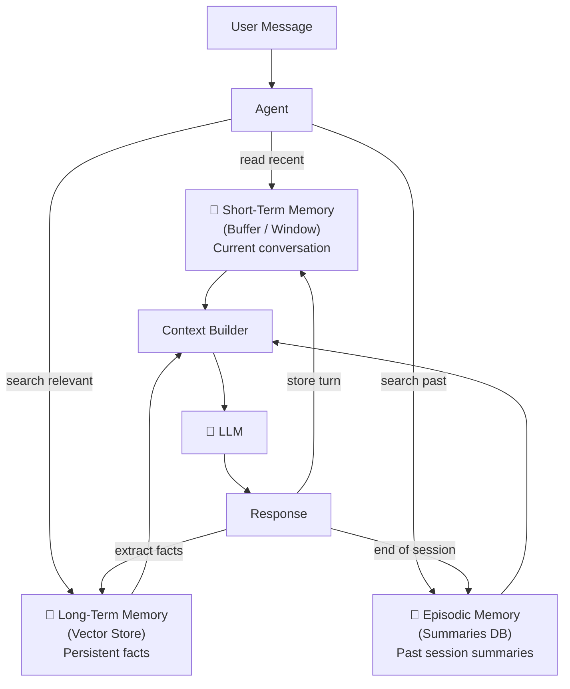
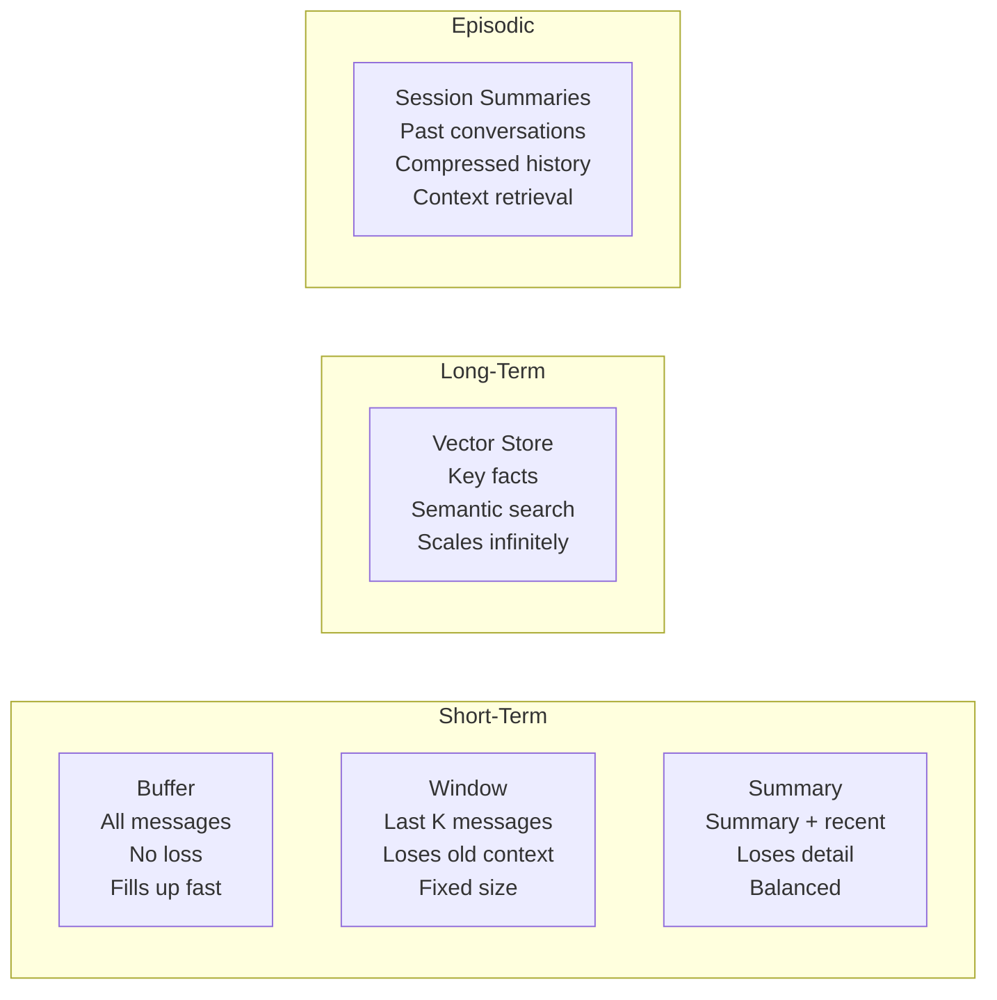
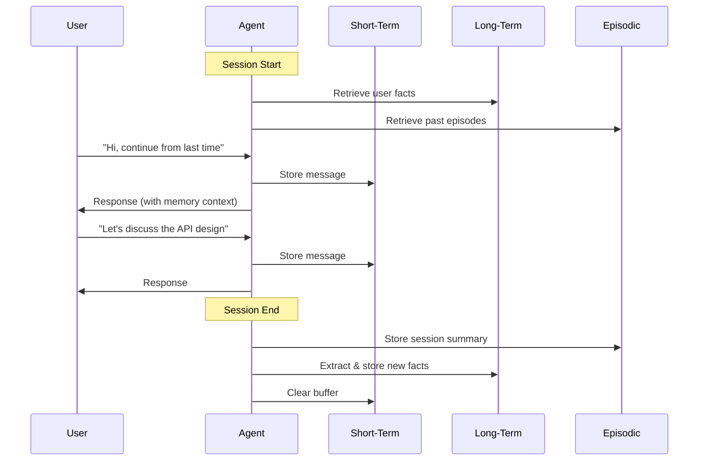
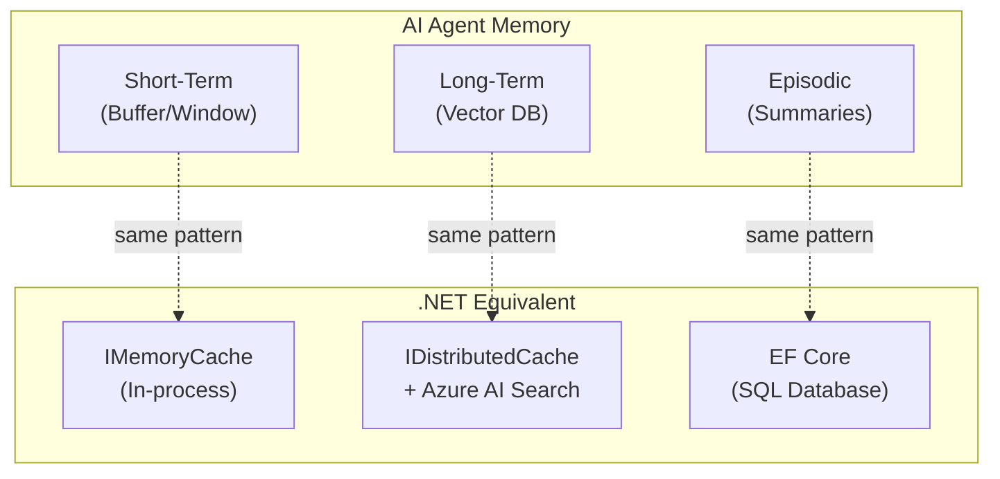

# Memory in Agents — Deep Dive

> **Day 15 of your learning path** | Phase 4 — Stateful Agents  
> Estimated study time: **5–6 hours**  
> Prerequisites: RAG Fundamentals + Vector Databases (01 & 02)

---

## Table of Contents

1. [Simple Explanation](#1-simple-explanation)
2. [Why It Matters](#2-why-it-matters)
3. [Internal Working](#3-internal-working)
4. [Real-World Use Cases](#4-real-world-use-cases)
5. [Common Beginner Mistakes](#5-common-beginner-mistakes)
6. [Best Practices](#6-best-practices)
7. [Python Examples](#7-python-examples)
8. [.NET / C# Equivalent Explanation](#8-net--c-equivalent-explanation)
9. [Diagrams](#9-diagrams)
10. [Mental Models and Analogies](#10-mental-models-and-analogies)

---

## 1. Simple Explanation

LLMs are **stateless** — every API call starts from scratch. They don't remember the previous conversation unless you explicitly send it back. **Memory** is the system that manages what an agent remembers between interactions.

Without memory:
```
Turn 1: User: "My name is Alice"      LLM: "Nice to meet you, Alice!"
Turn 2: User: "What's my name?"       LLM: "I don't know your name."  ← Forgot!
```

With memory:
```
Turn 1: User: "My name is Alice"      LLM: "Nice to meet you, Alice!"
         [Memory stores: "User's name is Alice"]
Turn 2: User: "What's my name?"       
         [Memory retrieves: "User's name is Alice"]
         LLM: "Your name is Alice!"   ← Remembers!
```

### Three Types of Memory

| Type | What It Remembers | How Long | Human Analogy |
|---|---|---|---|
| **Short-Term** | Recent conversation turns | Current session | Working memory (what you just heard) |
| **Long-Term** | Important facts across sessions | Persistent | Knowledge (things you've learned) |
| **Episodic** | Summaries of past interactions | Persistent | Memories (what happened last Tuesday) |

Think of it like human memory:
- **Short-term**: You remember the conversation you're having right now
- **Long-term**: You remember facts like "Python was created in 1991"
- **Episodic**: You remember "Last week we discussed the refund policy issue"

---

## 2. Why It Matters

### The Context Window Problem

LLMs have a **context window** — a maximum number of tokens they can process per call:

| Model | Context Window | Approximate Pages |
|---|---|---|
| GPT-4o | 128K tokens | ~200 pages |
| Gemini 2.0 Flash | 1M tokens | ~1,500 pages |
| Claude 3.5 | 200K tokens | ~300 pages |

Even with large context windows, you can't store everything:
- A support agent's full conversation history across 1,000 sessions
- All facts a user has ever mentioned
- The complete interaction log with timestamps

Memory systems manage what goes into the context window by being **selective**.

### Without Memory: Every Session Starts Fresh

```
Monday: User explains their entire project setup (30 messages)
Tuesday: User has to re-explain everything from scratch
Wednesday: Same thing again

With memory:
Monday: Agent learns about the project → stores key facts
Tuesday: Agent retrieves: "User has a .NET monolith, migrating to microservices"
         No re-explanation needed!
```

### The Memory Spectrum

```
No Memory                                              Perfect Memory
  │                                                          │
  ▼                                                          ▼
Stateless API call    Buffer    Window    Summary    Vector-backed
(forget everything)   (all)     (recent)  (compressed) (semantic)
```

Each type trades off **completeness** vs **efficiency**:
- Buffer: Complete but fills up fast
- Window: Keeps recent but loses old context
- Summary: Compressed but loses detail
- Vector-backed: Selective but most scalable

---

## 3. Internal Working

### Short-Term Memory: Buffer Memory

The simplest form — store all messages in a list, send them all with each LLM call.

```python
messages = [
    SystemMessage("You are a helpful assistant"),
    HumanMessage("My name is Alice"),
    AIMessage("Nice to meet you, Alice!"),
    HumanMessage("What's my name?"),
    # All sent to LLM → LLM sees full conversation
]
```

**How it works internally:**
```
Turn 1: messages = [system, human_1]          → send to LLM
Turn 2: messages = [system, human_1, ai_1, human_2]  → send to LLM  
Turn 3: messages = [system, human_1, ai_1, human_2, ai_2, human_3]  → send to LLM
...
Turn N: messages = [system, human_1, ..., human_N]  → CONTEXT OVERFLOW!
```

**Problem**: Messages grow linearly. After 50+ turns, you exceed the context window.

### Short-Term Memory: Window Memory

Keep only the last K messages. Old messages are dropped.

```python
WINDOW_SIZE = 10  # Keep last 10 messages

messages = all_messages[-WINDOW_SIZE:]  # Sliding window
```

**How it works:**
```
Turn 15: messages = [system, msg_6, msg_7, ..., msg_15]  (dropped msgs 1-5)
Turn 16: messages = [system, msg_7, msg_8, ..., msg_16]  (dropped msg 6)
```

**Problem**: Loses early context. If the user said their name in turn 1 and you ask in turn 20, it's gone.

### Short-Term Memory: Summary Memory

Periodically summarize old messages, keep the summary + recent messages.

```python
# Before:
messages = [system, msg_1, msg_2, ..., msg_20, msg_21, ..., msg_30]

# After summarization:
summary = "User (Alice) is migrating a .NET app to microservices. 
           They've discussed database design and API patterns."
           
messages = [system, SystemMessage(f"Summary of conversation so far: {summary}"),
            msg_26, msg_27, msg_28, msg_29, msg_30]  # Keep last 5
```

**How summarization works:**
1. Take the oldest N messages
2. Send them to the LLM with "Summarize this conversation"
3. Replace the N messages with the summary
4. Keep recent messages as-is

**Trade-off**: Loses detail but preserves key facts. Good for long conversations.

### Long-Term Memory: Vector-Backed

Store important facts as embeddings in a vector database. Retrieve only relevant facts per query.

```python
# During conversation:
# Agent extracts: "User's name is Alice"
# Agent extracts: "User prefers Python over JavaScript"
# Agent extracts: "User's company uses Azure"
# → All stored as vectors

# Next session, user asks: "What cloud provider does my company use?"
# → Vector search finds: "User's company uses Azure"
# → Only THIS fact is injected into the prompt (not everything)
```

**How it works:**
1. After each conversation, extract key facts
2. Embed and store facts in a vector database
3. Before each LLM call, embed the current query
4. Retrieve the most relevant stored facts
5. Inject retrieved facts into the system prompt

### Episodic Memory: Conversation Summaries

Store summaries of past conversations (episodes), retrieve relevant ones.

```python
# After each conversation session:
episode = {
    "date": "2024-01-15",
    "summary": "Discussed migration strategy. Decided to start with auth service.",
    "key_decisions": ["Auth service first", "Use gRPC for internal comms"],
    "open_items": ["Need to benchmark database options"]
}
# → Stored in database (vector or traditional)

# Next session:
# Retrieve: "Here's what we discussed on Jan 15: ..."
```

---

## 4. Real-World Use Cases

### 1. Personal AI Assistant

```
Memory needed: Long-term (user preferences) + Episodic (past conversations)

"Remember I prefer morning meetings"  → Long-term memory
"What did we discuss last Wednesday?" → Episodic memory
"Continue from where we left off"     → Short-term + Episodic
```

### 2. Customer Support Agent

```
Memory needed: Short-term (current ticket) + Long-term (customer history)

Short-term: The current support conversation
Long-term: "This customer has had 3 billing issues in the past month"
           "Customer is on the Premium plan"
           "Preferred contact: email"
```

### 3. Coding Assistant

```
Memory needed: All three types

Short-term: Current coding session (what files we're editing)
Long-term: "User prefers tabs over spaces", "Project uses .NET 8"
Episodic: "Yesterday we refactored the auth module"
```

### 4. Learning Tutor

```
Memory needed: Long-term (student progress) + Episodic (lesson history)

Long-term: "Student struggles with recursion", "Strong in OOP"
Episodic: "Lesson 5: Covered binary trees — student scored 7/10"
           "Lesson 6: Reviewed recursion — still struggling"
```

### 5. Meeting Summarizer

```
Memory needed: Episodic (meeting summaries) + Long-term (action items)

Episodic: Summaries of each meeting
Long-term: Open action items, decisions made, who's responsible
Query: "What did the team decide about the API redesign?"
→ Retrieves meeting summary from March 12 where the decision was made
```

---

## 5. Common Beginner Mistakes

### Mistake 1: Sending Full History Every Time

```python
# ❌ BAD — Send ALL messages every time (hits context limit after ~50 turns)
messages = []
while True:
    user_input = input("You: ")
    messages.append(HumanMessage(content=user_input))
    response = llm.invoke(messages)  # Gets bigger and bigger!
    messages.append(response)

# ✅ GOOD — Use window or summary memory
messages = []
MAX_MESSAGES = 20  # Keep last 20

while True:
    user_input = input("You: ")
    messages.append(HumanMessage(content=user_input))
    
    # Only send recent messages
    context = [system_message] + messages[-MAX_MESSAGES:]
    response = llm.invoke(context)
    messages.append(response)
```

### Mistake 2: Storing Everything in Long-Term Memory

```python
# ❌ BAD — Store every message verbatim
for msg in conversation:
    long_term_memory.store(msg.content)
# Fills up with "ok", "thanks", "sure" — useless noise

# ✅ GOOD — Extract and store only key facts
KEY_FACT_PROMPT = """Extract only important facts from this conversation that 
would be useful in future conversations. Ignore small talk and acknowledgments.

Conversation:
{conversation}

Key facts (one per line):"""

facts = llm.invoke(KEY_FACT_PROMPT.format(conversation=conversation))
for fact in facts.split("\n"):
    long_term_memory.store(fact.strip())
```

### Mistake 3: Not Separating Memory Types

```python
# ❌ BAD — One memory for everything
memory = []  # Mixes conversation history, facts, summaries

# ✅ GOOD — Separate memory systems
short_term = ConversationBufferWindowMemory(k=10)  # Recent conversation
long_term = VectorStoreMemory(vectorstore)           # Persistent facts
episodic = []  # Session summaries
```

### Mistake 4: Forgetting to Clear Short-Term Memory Between Sessions

```python
# ❌ BAD — Short-term memory persists across sessions
# User A's conversation leaks into User B's session!

# ✅ GOOD — Clear short-term memory per session
def start_new_session(user_id: str):
    short_term_memory = ConversationBufferWindowMemory(k=10)  # Fresh
    long_term_facts = retrieve_user_facts(user_id)  # Persistent
    return short_term_memory, long_term_facts
```

### Mistake 5: Not Testing Memory Retrieval Quality

```python
# ❌ BAD — Assume memory retrieval always works
facts = long_term_memory.search("user preferences")
# What if it returns irrelevant facts?

# ✅ GOOD — Validate retrieved memories
facts = long_term_memory.search("user preferences", k=5)
relevant_facts = [f for f in facts if f.score > 0.7]  # Threshold
if not relevant_facts:
    # No relevant memories — don't inject garbage
    memory_context = "No relevant past context found."
else:
    memory_context = "\n".join(f.content for f in relevant_facts)
```

---

## 6. Best Practices

### 1. Memory Architecture Template

```python
class AgentMemory:
    """Complete memory system with all three types."""
    
    def __init__(self, user_id: str):
        self.user_id = user_id
        
        # Short-term: current conversation
        self.conversation_buffer = []
        self.max_buffer_size = 20
        
        # Long-term: persistent facts (vector-backed)
        self.fact_store = vectorstore  # Chroma, FAISS, etc.
        
        # Episodic: session summaries
        self.episode_store = []  # Or a database
    
    def get_context(self, current_query: str) -> str:
        """Build the memory context for the current LLM call."""
        parts = []
        
        # 1. Relevant long-term facts
        facts = self.fact_store.search(current_query, k=3)
        if facts:
            parts.append("Known facts about this user:\n" + 
                        "\n".join(f"- {f}" for f in facts))
        
        # 2. Relevant past episodes
        episodes = self.search_episodes(current_query, k=2)
        if episodes:
            parts.append("Relevant past conversations:\n" + 
                        "\n".join(f"- {e}" for e in episodes))
        
        # 3. Recent conversation (short-term)
        recent = self.conversation_buffer[-self.max_buffer_size:]
        
        return "\n\n".join(parts), recent
```

### 2. Extract Facts Automatically

```python
FACT_EXTRACTION_PROMPT = """Review this conversation and extract important facts 
about the user that would be useful in future conversations.

Focus on:
- Personal preferences (language, style, tools)
- Project details (tech stack, architecture, team size)
- Constraints (budget, timeline, compliance requirements)
- Decisions made
- Problems encountered

Ignore:
- Small talk, greetings, acknowledgments
- Temporary/session-specific details
- Information the user explicitly asked to forget

Conversation:
{conversation}

Extracted facts (one per line, start each with a dash):"""
```

### 3. Memory Injection Template

```python
SYSTEM_WITH_MEMORY = """You are a helpful assistant.

{long_term_context}

{episodic_context}

Use the above context when relevant, but don't mention that you're 
reading from memory. Respond naturally as if you simply remember."""
```

### 4. Summarize Long Conversations

```python
SUMMARY_PROMPT = """Summarize this conversation in 2-3 sentences.
Include: key topics discussed, decisions made, and any open items.

Conversation:
{conversation}

Summary:"""

def summarize_and_compress(messages: list, keep_recent: int = 5) -> list:
    """Replace old messages with a summary, keep recent ones."""
    if len(messages) <= keep_recent + 5:
        return messages  # Not enough to summarize
    
    old_messages = messages[:-keep_recent]
    recent_messages = messages[-keep_recent:]
    
    summary = llm.invoke(SUMMARY_PROMPT.format(
        conversation=format_messages(old_messages)
    )).content
    
    return [SystemMessage(f"Previous conversation summary: {summary}")] + recent_messages
```

### 5. Memory Lifecycle Management

```
Session Start:
  1. Load long-term facts for user
  2. Load relevant episodic memories
  3. Initialize empty short-term buffer

During Session:
  4. Each turn: add to short-term buffer
  5. If buffer > threshold: summarize old messages
  6. Periodically extract new facts → long-term store

Session End:
  7. Summarize entire session → episodic store
  8. Extract any new facts → long-term store
  9. Clear short-term buffer
```

---

## 7. Python Examples

### Example 1: Conversation Buffer Memory

```python
"""
Short-term memory: keeps the full conversation history.
Simplest form — good for short conversations.
"""
from langchain_google_genai import ChatGoogleGenerativeAI
from langchain_core.messages import SystemMessage, HumanMessage, AIMessage
from dotenv import load_dotenv

load_dotenv()

llm = ChatGoogleGenerativeAI(model="gemini-2.0-flash")

class BufferMemory:
    """Full conversation buffer — stores everything."""
    
    def __init__(self, system_prompt: str):
        self.messages = [SystemMessage(content=system_prompt)]
    
    def add_user_message(self, content: str):
        self.messages.append(HumanMessage(content=content))
    
    def add_ai_message(self, content: str):
        self.messages.append(AIMessage(content=content))
    
    def get_messages(self) -> list:
        return self.messages.copy()
    
    def token_estimate(self) -> int:
        """Rough token count (1 token ≈ 4 chars)."""
        return sum(len(m.content) for m in self.messages) // 4

# ── Chat loop with buffer memory ──────────────────────

memory = BufferMemory("You are a helpful assistant. Remember everything the user tells you.")

conversations = [
    "My name is Alice and I'm a .NET developer",
    "I'm learning about AI agents",
    "What's my name and what am I learning about?",
]

for user_msg in conversations:
    memory.add_user_message(user_msg)
    
    response = llm.invoke(memory.get_messages())
    memory.add_ai_message(response.content)
    
    print(f"User: {user_msg}")
    print(f"AI: {response.content}")
    print(f"  (Buffer size: {len(memory.messages)} messages, ~{memory.token_estimate()} tokens)")
    print()
```

### Example 2: Window Memory (Sliding Window)

```python
"""
Window memory: keeps only the last K messages.
Good for long conversations where early context isn't critical.
"""
from langchain_google_genai import ChatGoogleGenerativeAI
from langchain_core.messages import SystemMessage, HumanMessage, AIMessage
from dotenv import load_dotenv

load_dotenv()

llm = ChatGoogleGenerativeAI(model="gemini-2.0-flash")

class WindowMemory:
    """Sliding window memory — keeps last K message pairs."""
    
    def __init__(self, system_prompt: str, window_size: int = 10):
        self.system_message = SystemMessage(content=system_prompt)
        self.messages = []
        self.window_size = window_size  # Number of message PAIRS to keep
    
    def add_user_message(self, content: str):
        self.messages.append(HumanMessage(content=content))
    
    def add_ai_message(self, content: str):
        self.messages.append(AIMessage(content=content))
    
    def get_messages(self) -> list:
        # Keep system message + last window_size*2 messages (pairs)
        window = self.messages[-(self.window_size * 2):]
        return [self.system_message] + window
    
    @property
    def total_messages(self) -> int:
        return len(self.messages)
    
    @property
    def visible_messages(self) -> int:
        return min(len(self.messages), self.window_size * 2)

# ── Demonstrate window memory ─────────────────────────

memory = WindowMemory(
    "You are a helpful assistant.", 
    window_size=3  # Keep only last 3 message pairs
)

conversations = [
    "My name is Alice",              # Turn 1 — will be dropped after turn 4
    "I live in Seattle",             # Turn 2 — will be dropped after turn 5  
    "I work at Microsoft",           # Turn 3
    "I like hiking",                 # Turn 4 — Turn 1 dropped
    "What's my name?",              # Turn 5 — Might not remember! Turn 2 dropped
]

for user_msg in conversations:
    memory.add_user_message(user_msg)
    
    response = llm.invoke(memory.get_messages())
    memory.add_ai_message(response.content)
    
    print(f"User: {user_msg}")
    print(f"AI: {response.content}")
    print(f"  (Total: {memory.total_messages}, Visible: {memory.visible_messages})")
    print()
```

### Example 3: Summary Memory

```python
"""
Summary memory: periodically summarize old messages.
Balances completeness and efficiency.
"""
from langchain_google_genai import ChatGoogleGenerativeAI
from langchain_core.messages import SystemMessage, HumanMessage, AIMessage
from dotenv import load_dotenv

load_dotenv()

llm = ChatGoogleGenerativeAI(model="gemini-2.0-flash")

class SummaryMemory:
    """Summarizes old messages, keeps recent ones in full."""
    
    def __init__(self, system_prompt: str, keep_recent: int = 6, summarize_threshold: int = 12):
        self.system_prompt = system_prompt
        self.messages = []
        self.summary = ""
        self.keep_recent = keep_recent        # Messages to keep in full
        self.summarize_threshold = summarize_threshold  # When to trigger summarization
    
    def add_user_message(self, content: str):
        self.messages.append(HumanMessage(content=content))
        self._maybe_summarize()
    
    def add_ai_message(self, content: str):
        self.messages.append(AIMessage(content=content))
    
    def _maybe_summarize(self):
        """If messages exceed threshold, summarize the old ones."""
        if len(self.messages) <= self.summarize_threshold:
            return
        
        # Split: old messages to summarize, recent to keep
        old = self.messages[:-self.keep_recent]
        recent = self.messages[-self.keep_recent:]
        
        # Build context for summarization
        old_text = "\n".join(
            f"{'User' if isinstance(m, HumanMessage) else 'AI'}: {m.content}" 
            for m in old
        )
        
        existing = f"Previous summary: {self.summary}\n\n" if self.summary else ""
        
        summary_response = llm.invoke([
            SystemMessage(content="Summarize this conversation concisely. "
                        "Include: key facts mentioned, decisions made, topics discussed."),
            HumanMessage(content=f"{existing}New messages to include:\n{old_text}")
        ])
        
        self.summary = summary_response.content
        self.messages = recent
        print(f"  📋 Summarized! Summary: {self.summary[:100]}...")
    
    def get_messages(self) -> list:
        result = [SystemMessage(content=self.system_prompt)]
        
        if self.summary:
            result.append(SystemMessage(
                content=f"Summary of earlier conversation:\n{self.summary}"
            ))
        
        result.extend(self.messages)
        return result

# ── Test summary memory ───────────────────────────────

memory = SummaryMemory(
    "You are a helpful assistant.",
    keep_recent=4,         # Keep last 4 messages in full
    summarize_threshold=8  # Summarize when we hit 8 messages
)

conversations = [
    "My name is Alice",
    "I'm a .NET developer at Microsoft",
    "I'm learning about AI agents",
    "I want to build a chatbot for customer support",
    "The chatbot needs to handle billing and technical questions",
    "We use Azure for our cloud infrastructure",
    "What do you remember about my project?",  # Triggers summary → should still know everything
]

for user_msg in conversations:
    memory.add_user_message(user_msg)
    
    response = llm.invoke(memory.get_messages())
    memory.add_ai_message(response.content)
    
    print(f"User: {user_msg}")
    print(f"AI: {response.content[:200]}...")
    print()
```

### Example 4: Long-Term Memory (Vector-Backed)

```python
"""
Long-term memory: store facts in a vector database.
Retrieves only relevant facts per query — scales infinitely.
"""
from langchain_google_genai import ChatGoogleGenerativeAI, GoogleGenerativeAIEmbeddings
from langchain_core.messages import SystemMessage, HumanMessage
from langchain_chroma import Chroma
from langchain_core.documents import Document
from pydantic import BaseModel, Field
from dotenv import load_dotenv
from datetime import datetime

load_dotenv()

llm = ChatGoogleGenerativeAI(model="gemini-2.0-flash")
embeddings = GoogleGenerativeAIEmbeddings(model="models/text-embedding-004")

class LongTermMemory:
    """Vector-backed long-term memory for persistent user facts."""
    
    def __init__(self, user_id: str):
        self.user_id = user_id
        self.vectorstore = Chroma(
            collection_name=f"memory_{user_id}",
            embedding_function=embeddings,
            # persist_directory=f"./memory_{user_id}"  # Uncomment for persistence
        )
    
    def store_fact(self, fact: str, category: str = "general"):
        """Store a single fact."""
        self.vectorstore.add_documents([
            Document(
                page_content=fact,
                metadata={
                    "user_id": self.user_id,
                    "category": category,
                    "stored_at": datetime.now().isoformat()
                }
            )
        ])
    
    def store_facts(self, facts: list[str], category: str = "general"):
        """Store multiple facts."""
        for fact in facts:
            self.store_fact(fact, category)
    
    def retrieve(self, query: str, k: int = 5) -> list[str]:
        """Retrieve facts relevant to the query."""
        results = self.vectorstore.similarity_search_with_score(query, k=k)
        
        # Filter by relevance (lower score = more similar in Chroma)
        relevant = [doc.page_content for doc, score in results if score < 1.0]
        return relevant
    
    def count(self) -> int:
        return self.vectorstore._collection.count()

# ── Fact extraction ───────────────────────────────────

class ExtractedFacts(BaseModel):
    facts: list[str] = Field(description="List of important facts about the user")

def extract_facts(conversation: str) -> list[str]:
    """Use LLM to extract storable facts from a conversation."""
    extractor = llm.with_structured_output(ExtractedFacts)
    
    result = extractor.invoke([
        SystemMessage(content="Extract important, persistent facts from this conversation. "
                     "Focus on: preferences, project details, constraints, decisions. "
                     "Each fact should be self-contained and useful out of context."),
        HumanMessage(content=conversation)
    ])
    
    return result.facts

# ── Agent with long-term memory ───────────────────────

def chat_with_memory(user_id: str, message: str, memory: LongTermMemory) -> str:
    # Retrieve relevant memories
    memories = memory.retrieve(message, k=3)
    
    memory_context = ""
    if memories:
        memory_context = "What you know about this user:\n" + \
                        "\n".join(f"- {m}" for m in memories)
    
    response = llm.invoke([
        SystemMessage(content=f"""You are a helpful assistant with memory.
{memory_context}

Use your memories naturally — don't say "according to my records."
If you don't have relevant memories, just respond normally."""),
        HumanMessage(content=message)
    ])
    
    return response.content

# ── Test ──────────────────────────────────────────────

memory = LongTermMemory("alice_123")

# Session 1: Store facts
memory.store_facts([
    "User's name is Alice",
    "Alice is a .NET developer at Microsoft",
    "Alice is learning about AI agents",
    "Alice prefers C# but is learning Python",
    "Alice's project uses Azure cloud",
    "Alice wants to build a customer support chatbot"
], category="user_profile")

print(f"Stored {memory.count()} facts\n")

# Session 2: Later, retrieve relevant facts
queries = [
    "What programming language should I use for this project?",
    "Tell me about my cloud setup",
    "What am I building?",
]

for query in queries:
    print(f"User: {query}")
    response = chat_with_memory("alice_123", query, memory)
    print(f"AI: {response[:200]}...")
    print()
```

### Example 5: Complete Memory System (All Three Types)

```python
"""
Complete agent memory system combining short-term, long-term, and episodic memory.
"""
from langchain_google_genai import ChatGoogleGenerativeAI, GoogleGenerativeAIEmbeddings
from langchain_core.messages import SystemMessage, HumanMessage, AIMessage
from langchain_chroma import Chroma
from langchain_core.documents import Document
from dotenv import load_dotenv
from datetime import datetime

load_dotenv()

llm = ChatGoogleGenerativeAI(model="gemini-2.0-flash")
embeddings = GoogleGenerativeAIEmbeddings(model="models/text-embedding-004")

class CompleteMemory:
    """All three memory types in one system."""
    
    def __init__(self, user_id: str, window_size: int = 10):
        self.user_id = user_id
        
        # Short-term: conversation buffer (window)
        self.conversation = []
        self.window_size = window_size
        
        # Long-term: vector-backed fact store
        self.fact_store = Chroma(
            collection_name=f"facts_{user_id}",
            embedding_function=embeddings
        )
        
        # Episodic: session summaries
        self.episode_store = Chroma(
            collection_name=f"episodes_{user_id}",
            embedding_function=embeddings
        )
    
    # ── Short-term operations ──────────────────────────
    
    def add_turn(self, user_msg: str, ai_msg: str):
        self.conversation.append(HumanMessage(content=user_msg))
        self.conversation.append(AIMessage(content=ai_msg))
    
    def get_recent(self) -> list:
        return self.conversation[-(self.window_size * 2):]
    
    # ── Long-term operations ───────────────────────────
    
    def store_fact(self, fact: str):
        self.fact_store.add_documents([
            Document(page_content=fact, metadata={"stored": datetime.now().isoformat()})
        ])
    
    def recall_facts(self, query: str, k: int = 3) -> list[str]:
        results = self.fact_store.similarity_search(query, k=k)
        return [doc.page_content for doc in results]
    
    # ── Episodic operations ────────────────────────────
    
    def save_episode(self, summary: str):
        self.episode_store.add_documents([
            Document(
                page_content=summary,
                metadata={"date": datetime.now().isoformat(), "user": self.user_id}
            )
        ])
    
    def recall_episodes(self, query: str, k: int = 2) -> list[str]:
        results = self.episode_store.similarity_search(query, k=k)
        return [doc.page_content for doc in results]
    
    # ── End session ────────────────────────────────────
    
    def end_session(self):
        """Summarize session and store as episode. Extract facts."""
        if len(self.conversation) < 2:
            return
        
        conv_text = "\n".join(
            f"{'User' if isinstance(m, HumanMessage) else 'AI'}: {m.content}"
            for m in self.conversation
        )
        
        # Summarize for episodic memory
        summary = llm.invoke([
            SystemMessage(content="Summarize this conversation in 2-3 sentences."),
            HumanMessage(content=conv_text)
        ]).content
        self.save_episode(summary)
        
        # Extract facts for long-term memory
        facts = llm.invoke([
            SystemMessage(content="Extract 3-5 key facts about the user. One per line."),
            HumanMessage(content=conv_text)
        ]).content
        
        for fact in facts.strip().split("\n"):
            fact = fact.strip().lstrip("- ")
            if fact:
                self.store_fact(fact)
        
        # Clear short-term
        self.conversation = []
        print(f"Session saved. Episode: {summary[:100]}...")
    
    # ── Build context ──────────────────────────────────
    
    def build_context(self, current_query: str) -> tuple[str, list]:
        """Build memory context for LLM call."""
        parts = []
        
        # Long-term facts
        facts = self.recall_facts(current_query)
        if facts:
            parts.append("Known facts:\n" + "\n".join(f"- {f}" for f in facts))
        
        # Episodic memories
        episodes = self.recall_episodes(current_query)
        if episodes:
            parts.append("Past conversations:\n" + "\n".join(f"- {e}" for e in episodes))
        
        memory_context = "\n\n".join(parts) if parts else ""
        recent_messages = self.get_recent()
        
        return memory_context, recent_messages

# ── Agent using complete memory ───────────────────────

def run_agent(memory: CompleteMemory, user_message: str) -> str:
    memory_context, recent = memory.build_context(user_message)
    
    messages = [
        SystemMessage(content=f"""You are a helpful assistant with memory.

{memory_context}

Respond naturally using your memories. Don't mention "records" or "database".""")
    ]
    messages.extend(recent)
    messages.append(HumanMessage(content=user_message))
    
    response = llm.invoke(messages)
    memory.add_turn(user_message, response.content)
    
    return response.content

# ── Simulate two sessions ─────────────────────────────

mem = CompleteMemory("alice")

# Session 1
print("=== SESSION 1 ===")
print(run_agent(mem, "Hi, I'm Alice. I'm building a chatbot in Python."))
print(run_agent(mem, "I want it to handle customer support for my SaaS product."))
print(run_agent(mem, "We're using Azure for hosting."))
mem.end_session()

# Session 2 (later)
print("\n=== SESSION 2 ===")
print(run_agent(mem, "Hi again! Can you remind me what we discussed last time?"))
print(run_agent(mem, "What tech stack should I use for the backend?"))
```

---

## 8. .NET / C# Equivalent Explanation

### Short-Term Memory ≈ IMemoryCache

```csharp
// .NET: In-memory cache that expires
services.AddMemoryCache();

public class ConversationBuffer
{
    private readonly IMemoryCache _cache;
    
    public void AddMessage(string sessionId, ChatMessage message)
    {
        var messages = _cache.GetOrCreate(sessionId, entry =>
        {
            entry.SlidingExpiration = TimeSpan.FromMinutes(30);  // Auto-expire
            return new List<ChatMessage>();
        });
        messages.Add(message);
    }
    
    public List<ChatMessage> GetRecent(string sessionId, int count = 10)
    {
        var messages = _cache.Get<List<ChatMessage>>(sessionId);
        return messages?.TakeLast(count).ToList() ?? new List<ChatMessage>();
    }
}
```

```python
# AI equivalent: ConversationBufferWindowMemory
# Same concept — recent items in fast storage, auto-evicted
```

### Long-Term Memory ≈ IDistributedCache / Database

```csharp
// .NET: Redis or SQL Server for persistent storage
services.AddStackExchangeRedisCache(options =>
{
    options.Configuration = "localhost:6379";
});

// Store a fact (like vector memory without the vector part)
await _distributedCache.SetStringAsync(
    $"user:{userId}:facts", 
    JsonSerializer.Serialize(facts),
    new DistributedCacheEntryOptions { /* no expiration */ }
);

// In AI: vector database stores facts as embeddings for semantic retrieval
// In .NET: you'd use Azure AI Search or Elasticsearch for the same effect
```

### Episodic Memory ≈ EF Core / Event Store

```csharp
// .NET: Storing session summaries in a database
public class ConversationEpisode
{
    public int Id { get; set; }
    public string UserId { get; set; }
    public DateTime Date { get; set; }
    public string Summary { get; set; }
    public List<string> KeyDecisions { get; set; }
    public List<string> OpenItems { get; set; }
}

// Store
await _dbContext.Episodes.AddAsync(new ConversationEpisode
{
    UserId = userId,
    Date = DateTime.UtcNow,
    Summary = "Discussed migration strategy. Decided auth service first.",
    KeyDecisions = new() { "Auth first", "gRPC for internal" }
});
await _dbContext.SaveChangesAsync();

// Retrieve
var relevantEpisodes = await _dbContext.Episodes
    .Where(e => e.UserId == userId)
    .OrderByDescending(e => e.Date)
    .Take(5)
    .ToListAsync();
```

### The Full .NET Mapping

| Memory Type | .NET Equivalent | Persistence | Scope |
|---|---|---|---|
| **Buffer (full)** | `List<Message>` in memory | None | Current request |
| **Window** | `IMemoryCache` with size limit | Session | Current session |
| **Summary** | Background service that summarizes + caches | Session | Current session |
| **Long-term (vector)** | Azure AI Search / Redis + embeddings | Permanent | Per user |
| **Episodic** | EF Core / SQL table of session summaries | Permanent | Per user |

### The Architecture in .NET Terms

```csharp
public class AgentMemoryService
{
    private readonly IMemoryCache _shortTerm;            // Window memory
    private readonly ISearchIndexClient _longTerm;       // Vector search
    private readonly AppDbContext _episodic;              // EF Core
    
    public async Task<MemoryContext> BuildContext(string userId, string query)
    {
        // 1. Short-term: recent messages from cache
        var recent = _shortTerm.Get<List<Message>>($"session:{userId}");
        
        // 2. Long-term: relevant facts from search index
        var facts = await _longTerm.SearchAsync(new SearchOptions
        {
            VectorSearch = new() { Queries = { new VectorizedQuery(embed(query)) } },
            Filter = $"userId eq '{userId}'"
        });
        
        // 3. Episodic: relevant past sessions from database
        var episodes = await _episodic.Episodes
            .Where(e => e.UserId == userId)
            .OrderByDescending(e => e.Date)
            .Take(3)
            .ToListAsync();
        
        return new MemoryContext(recent, facts, episodes);
    }
}
```

---

## 9. Diagrams

### Memory Architecture Overview



### Memory Types Comparison



### Memory Lifecycle



### .NET Memory Mapping



---

## 10. Mental Models and Analogies

### The Human Memory Analogy

```
Short-term memory = Your RAM
  - What you're thinking about RIGHT NOW
  - Limited capacity (7±2 items for humans, context window for LLMs)
  - Volatile — gone when you stop thinking about it

Long-term memory = Your hard drive
  - Facts you've learned over your lifetime
  - Effectively unlimited capacity
  - You can't access everything at once — you "search" for relevant memories

Episodic memory = Your diary
  - "What happened last Tuesday?"
  - Compressed narratives of past events
  - You remember the gist, not every detail
```

### The .NET Developer's Mental Model

```
Think of an agent session like an HTTP request in ASP.NET:

Short-term memory = HttpContext.Items
  - Lives for the duration of this request (session)
  - Cleared between requests
  - Fast access

Long-term memory = Database + Redis
  - Persists across requests
  - Shared across sessions
  - Needs explicit read/write

Episodic memory = Audit log / Event store
  - Records of past interactions
  - Can be queried for history
  - Summarized, not full transcripts

The agent's memory system is just your app's data architecture
applied to conversation state.
```

### The Office Worker Analogy

```
Short-term: Your desk — current papers you're working with
  - Limited space, you rotate what's on it
  - When full, you file old papers or summarize them

Long-term: Your filing cabinet — organized documents you can retrieve
  - You don't keep everything on your desk
  - You search for specific files when needed
  
Episodic: Your calendar/notes — "Met with Alice on March 5, discussed X"
  - You don't have transcripts of every meeting
  - But you can remember key takeaways from past meetings
```

### The Memory Selection Guide

```
"When should I use which memory type?"

Just a chatbot (< 20 turns)?
  → Buffer memory (keep everything)

Chatbot with long conversations (50+ turns)?
  → Window memory (recent) + Summary (older context)

Agent that remembers users across sessions?
  → Long-term memory (vector-backed facts)

Agent that builds on past conversations?
  → Episodic memory (session summaries)

Production agent with all requirements?
  → All three: Window + Long-term + Episodic
```

---

## Summary

| Concept | One-Line Summary |
|---|---|
| Agent memory | Systems that make stateless LLMs appear to remember |
| Buffer memory | Store all messages — simple but fills context window |
| Window memory | Keep last K messages — fixed size, loses old context |
| Summary memory | Summarize old messages — balances completeness and efficiency |
| Long-term memory | Store facts in vector DB — retrieves relevant facts per query |
| Episodic memory | Store session summaries — remembers what happened when |
| Fact extraction | Using LLM to pull key facts from conversations |
| Memory injection | Adding retrieved memories to the system prompt |
| Context builder | Combining all memory types into a single prompt context |

---

**Previous**: [02_vector_databases.md](./02_vector_databases.md)  
**Next**: [glossary.md](./glossary.md) — All Phase 4 terms in one reference.
