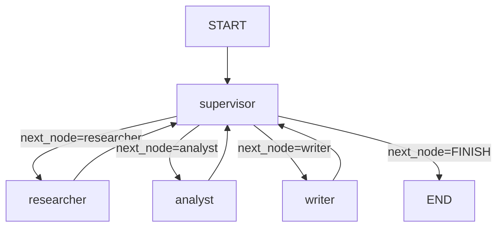
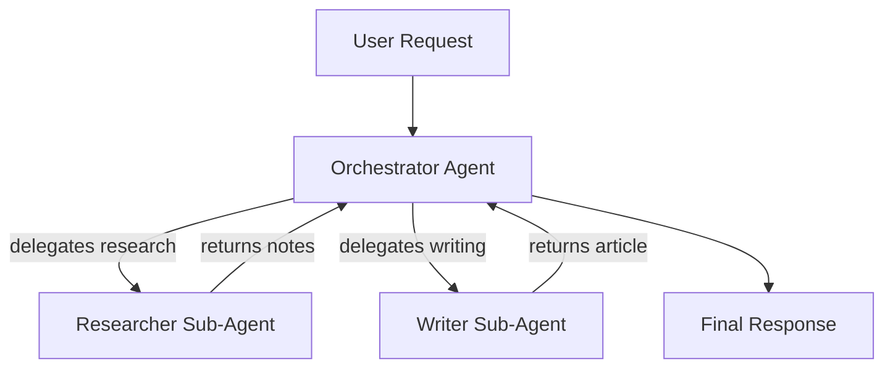
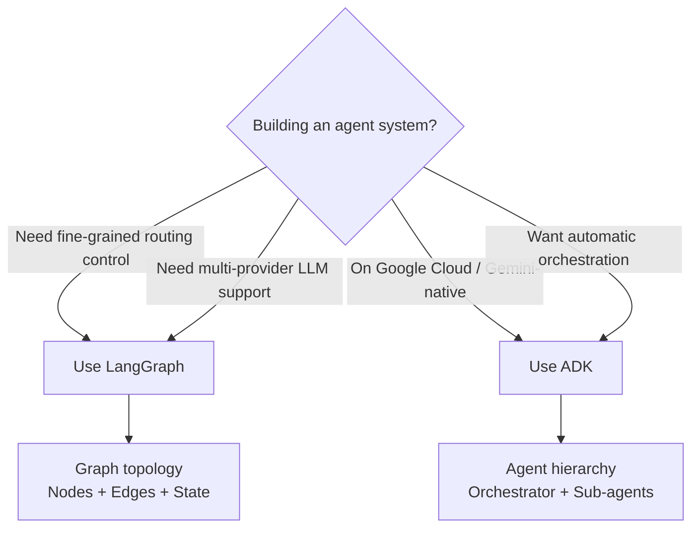

# Agent Frameworks — ADK & LangGraph

> **Phase 4 — Other Concepts** | Estimated study time: **4–5 hours**  
> Prerequisites: Phase 3 (Multi-Agent Systems), LangGraph basics from Assignment 1

---

## Table of Contents

1. [Simple Explanation](#1-simple-explanation)
2. [Why It Matters](#2-why-it-matters)
3. [Internal Working](#3-internal-working)
4. [Real-World Use Cases](#4-real-world-use-cases)
5. [Common Beginner Mistakes](#5-common-beginner-mistakes)
6. [Best Practices](#6-best-practices)
7. [Python Examples](#7-python-examples)
9. [Diagrams](#9-diagrams)

---

## 1. Simple Explanation

An **agent framework** is a structured toolkit for building, orchestrating, and running AI agents. Instead of wiring LLM calls, tool routing, and state management by hand, a framework gives you:

- A standard way to define agents and their roles
- Built-in state management between steps
- Routing logic (who runs next, under what condition)
- Observability hooks (what happened, why)

Two frameworks dominate production agentic systems today:

| Framework | Made By | Best For |
|---|---|---|
| **LangGraph** | LangChain | Graph-based multi-agent workflows, fine-grained control |
| **ADK (Agent Development Kit)** | Google | Google-ecosystem agents, Gemini-native, production deployment |

You've already used LangGraph in Phase 3. This file covers both in depth and when to choose each.

---

## 2. Why It Matters

Without a framework, building a multi-agent system means:
- Manually managing shared state between agents
- Writing your own retry and fallback logic
- No standard way to visualize or debug the flow
- Re-inventing routing logic for every project

Frameworks solve all of this. They also enforce patterns that make your code maintainable as complexity grows — a 3-agent system built without a framework becomes unmaintainable at 10 agents.

### LangGraph vs ADK — When to Choose

| Factor | LangGraph | ADK |
|---|---|---|
| LLM provider | Any (Gemini, OpenAI, Ollama) | Gemini-first (supports others) |
| Control style | Graph topology (nodes + edges) | Agent hierarchy (parent/sub-agents) |
| Deployment | Self-hosted | Google Cloud (Vertex AI Agent Engine) |
| Streaming | Manual SSE setup | Built-in streaming |
| Observability | LangSmith integration | Google Cloud Trace |
| Learning curve | Medium | Low (if already on GCP) |

---

## 3. Internal Working

### LangGraph Internals

LangGraph models your agent system as a **directed graph**:

```
Nodes  = agent functions (researcher, analyst, writer)
Edges  = fixed transitions (researcher → analyst)
Conditional edges = dynamic routing (supervisor → researcher | analyst | writer | END)
State  = a TypedDict shared across all nodes
```

Every node receives the full state, modifies only its own fields, and returns a partial dict. LangGraph merges the partial dict back into the shared state — this is the **reducer pattern**.

```
State before researcher: { topic: "AI", research_notes: "", outline: "" }
researcher_node returns:  { research_notes: "Key findings..." }
State after researcher:   { topic: "AI", research_notes: "Key findings...", outline: "" }
```

The graph engine handles:
1. Calling the current node with the full state
2. Merging the returned partial state
3. Evaluating edges to determine the next node
4. Repeating until END is reached

### ADK Internals

ADK uses an **agent hierarchy** instead of a graph:

```
Root Agent (orchestrator)
  ├── Sub-Agent A (researcher)
  ├── Sub-Agent B (analyst)
  └── Sub-Agent C (writer)
```

Each agent is a class with:
- `name` and `description` — how the orchestrator identifies it
- `instruction` — the system prompt
- `tools` — callable functions the agent can use
- `sub_agents` — child agents it can delegate to

The orchestrator decides which sub-agent to call based on the task description — no explicit routing code needed. ADK's LLM-driven orchestration handles routing automatically.

---

## 4. Real-World Use Cases

### LangGraph
- **Content pipelines**: Research → Draft → Review → Publish with supervisor re-routing (your Phase 3 assignment)
- **Customer support**: Triage → Specialist routing → Resolution → Escalation
- **Code review**: Static analysis → Security scan → Style check → Summary
- **Data pipelines**: Extract → Validate → Transform → Load with error recovery

### ADK
- **Google Workspace automation**: Agents that read Gmail, update Sheets, schedule Calendar events
- **Enterprise chatbots on Vertex AI**: Customer-facing agents with built-in safety and scaling
- **Document processing**: Agents that process Drive files with Gemini's multimodal capabilities
- **Internal tools**: HR bots, IT helpdesk agents deployed on Google Cloud

---

## 5. Common Beginner Mistakes

### LangGraph

**Mistake 1: Putting business logic in edges instead of nodes**
```python
# ❌ BAD — routing logic mixed with business logic
def route(state):
    if len(state["blog_post"]) < 100:  # business rule in router
        return "writer"
    return END

# ✅ GOOD — supervisor node makes the decision, router just reads it
def supervisor_node(state):
    # LLM decides quality, writes next_node to state
    return {"next_node": decision.next_node}

def route(state):
    return END if state["next_node"] == "FINISH" else state["next_node"]
```

**Mistake 2: No circuit breaker on conditional edges**
```python
# ❌ BAD — can loop forever if LLM always re-routes
graph.add_conditional_edges("supervisor", route_after_supervisor)

# ✅ GOOD — retry_count guard in supervisor_node
if retry_count >= MAX_RETRIES:
    return {"next_node": "FINISH"}
```

### ADK

**Mistake 3: Writing instructions that overlap between agents**
```python
# ❌ BAD — both agents claim to do research
researcher = Agent(instruction="Research topics and write outlines...")
analyst = Agent(instruction="Research and analyze topics...")

# ✅ GOOD — clear, non-overlapping responsibilities
researcher = Agent(instruction="Gather raw facts and data only. Do not interpret.")
analyst = Agent(instruction="Analyze provided research notes. Do not gather new data.")
```

---

## 6. Best Practices

### LangGraph
1. **Keep state flat** — avoid nested dicts in `TypedDict`; flat fields are easier to merge and debug
2. **One responsibility per node** — a node that does research AND writes an outline is two nodes
3. **Always add a retry guard** — every conditional edge loop needs a `max_retries` circuit breaker
4. **Compile once** — call `graph.compile()` at startup, not per request (it's expensive)
5. **Use `add_conditional_edges` only from supervisor nodes** — fixed edges everywhere else keeps the graph readable

### ADK
1. **Write agent descriptions precisely** — the orchestrator uses them to route; vague descriptions cause wrong routing
2. **Keep tools small and single-purpose** — one tool per action, not one tool that does everything
3. **Use `output_key` to pass data between agents** — don't rely on the orchestrator to summarize sub-agent output
4. **Test sub-agents independently** — each agent should work correctly in isolation before wiring into the hierarchy

---

## 7. Python Examples

### Example 1: LangGraph — Minimal Supervisor Pattern

```python
"""
Minimal LangGraph supervisor pattern.
Demonstrates the hub-and-spoke topology used in Phase 3.
"""
import os
from typing import TypedDict, Literal
from pydantic import BaseModel, Field
from langchain_google_genai import ChatGoogleGenerativeAI
from langchain_core.messages import SystemMessage, HumanMessage
from langgraph.graph import StateGraph, START, END
from dotenv import load_dotenv

load_dotenv()

llm = ChatGoogleGenerativeAI(model=os.getenv("GEMINI_MODEL", "gemini-2.0-flash-lite"))


class State(TypedDict):
    task: str
    result: str
    next_node: str
    retries: int


class Decision(BaseModel):
    next_node: Literal["worker_a", "worker_b", "FINISH"]
    feedback: str = Field(default="")


_router_llm = llm.with_structured_output(Decision)

MAX_RETRIES = 2


def supervisor(state: State) -> dict:
    if state.get("retries", 0) >= MAX_RETRIES:
        return {"next_node": "FINISH"}

    if not state.get("result"):
        return {"next_node": "worker_a"}

    decision = _router_llm.invoke([
        SystemMessage(content="Route to worker_a for research tasks, worker_b for writing tasks, FINISH when done."),
        HumanMessage(content=f"Task: {state['task']}\nResult so far: {state['result']}\nWhat next?"),
    ])
    retries = state.get("retries", 0) + (1 if decision.next_node != "FINISH" else 0)
    return {"next_node": decision.next_node, "retries": retries}


def worker_a(state: State) -> dict:
    response = llm.invoke([HumanMessage(content=f"Research this: {state['task']}")])
    return {"result": response.content}


def worker_b(state: State) -> dict:
    response = llm.invoke([HumanMessage(content=f"Write about: {state['task']}\nUsing: {state['result']}")])
    return {"result": response.content}


def route(state: State) -> Literal["worker_a", "worker_b", "__end__"]:
    return END if state["next_node"] == "FINISH" else state["next_node"]


graph = StateGraph(State)
graph.add_node("supervisor", supervisor)
graph.add_node("worker_a", worker_a)
graph.add_node("worker_b", worker_b)

graph.add_edge(START, "supervisor")
graph.add_edge("worker_a", "supervisor")
graph.add_edge("worker_b", "supervisor")
graph.add_conditional_edges("supervisor", route)

app = graph.compile()

result = app.invoke({"task": "Explain vector databases", "result": "", "next_node": "", "retries": 0})
print(result["result"])
```

### Example 2: ADK — Multi-Agent Hierarchy

```python
"""
Google ADK multi-agent hierarchy.
Orchestrator delegates to specialized sub-agents.

Install: pip install google-adk
"""
import os
from google.adk.agents import Agent
from google.adk.runners import Runner
from google.adk.sessions import InMemorySessionService
from google.adk.tools import google_search
from google.genai import types
from dotenv import load_dotenv

load_dotenv()

MODEL = os.getenv("GEMINI_MODEL", "gemini-2.0-flash-lite")

# Sub-agents — each has a single, clear responsibility
researcher = Agent(
    name="researcher",
    model=MODEL,
    description="Gathers factual information on a given topic using search.",
    instruction="Search for accurate, up-to-date information on the given topic. "
                "Return structured notes with key facts only. Do not write prose.",
    tools=[google_search],
)

writer = Agent(
    name="writer",
    model=MODEL,
    description="Writes clear, engaging content from structured research notes.",
    instruction="Convert the provided research notes into a well-structured, "
                "~300 word article. Use short paragraphs and a clear conclusion.",
)

# Root orchestrator — delegates to sub-agents automatically
orchestrator = Agent(
    name="orchestrator",
    model=MODEL,
    description="Coordinates research and writing to produce a final article.",
    instruction="You coordinate a two-step pipeline: "
                "1. Use the researcher to gather information. "
                "2. Use the writer to produce the final article. "
                "Return only the final article.",
    sub_agents=[researcher, writer],
)

# Runner wires the agent to a session
session_service = InMemorySessionService()
runner = Runner(agent=orchestrator, app_name="blog_pipeline", session_service=session_service)

session = session_service.create_session(app_name="blog_pipeline", user_id="user_1")

response = runner.run(
    user_id="user_1",
    session_id=session.id,
    new_message=types.Content(
        role="user",
        parts=[types.Part(text="Write an article about LangGraph vs ADK")]
    ),
)

for event in response:
    if event.is_final_response():
        print(event.content.parts[0].text)
```

### Example 3: LangGraph — Streaming Node Output

```python
"""
LangGraph with streaming — yields state updates as each node completes.
This is the foundation for the real-time UI in Assignment 2.
"""
import os
from typing import TypedDict
from langchain_google_genai import ChatGoogleGenerativeAI
from langchain_core.messages import HumanMessage
from langgraph.graph import StateGraph, START, END
from dotenv import load_dotenv

load_dotenv()

llm = ChatGoogleGenerativeAI(model=os.getenv("GEMINI_MODEL", "gemini-2.0-flash-lite"))


class DebateState(TypedDict):
    topic: str
    pro_argument: str
    con_argument: str
    verdict: str


def pro_agent(state: DebateState) -> dict:
    response = llm.invoke([
        HumanMessage(content=f"Argue FOR this topic in 100 words: {state['topic']}")
    ])
    return {"pro_argument": response.content}


def con_agent(state: DebateState) -> dict:
    response = llm.invoke([
        HumanMessage(content=f"Argue AGAINST this topic in 100 words: {state['topic']}")
    ])
    return {"con_argument": response.content}


def moderator(state: DebateState) -> dict:
    response = llm.invoke([
        HumanMessage(content=(
            f"Pro: {state['pro_argument']}\n"
            f"Con: {state['con_argument']}\n"
            "Declare a winner in 50 words."
        ))
    ])
    return {"verdict": response.content}


graph = StateGraph(DebateState)
graph.add_node("pro", pro_agent)
graph.add_node("con", con_agent)
graph.add_node("moderator", moderator)

graph.add_edge(START, "pro")
graph.add_edge("pro", "con")
graph.add_edge("con", "moderator")
graph.add_edge("moderator", END)

app = graph.compile()

# stream_mode="updates" yields a dict after each node completes
for update in app.stream(
    {"topic": "AI will replace software engineers", "pro_argument": "", "con_argument": "", "verdict": ""},
    stream_mode="updates"
):
    node_name = list(update.keys())[0]
    print(f"\n── {node_name} completed ──")
    print(list(update.values())[0])
```

---

## 9. Diagrams

### LangGraph — Hub-and-Spoke Topology



### ADK — Agent Hierarchy



### LangGraph vs ADK — Decision Flow



---

**Previous**: [03_memory_in_agents.md](./03_memory_in_agents.md)  
**Next**: [05_agent_evaluation.md](./05_agent_evaluation.md)
