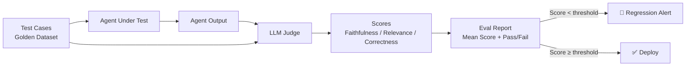
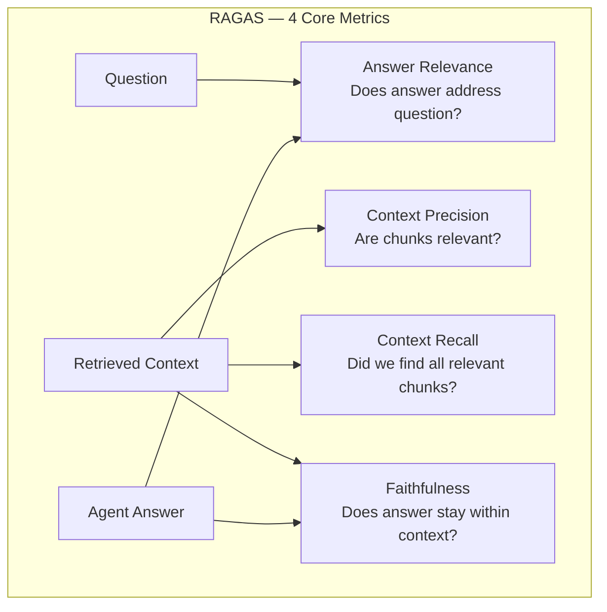
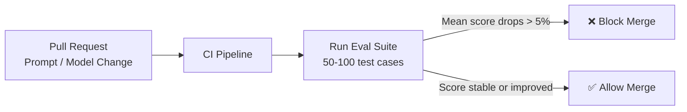

# Agent Evaluation — Metrics & Benchmarks

> **Phase 4 — Other Concepts** | Estimated study time: **3–4 hours**  
> Prerequisites: Phase 3 (Multi-Agent Systems), RAG fundamentals

---

## Table of Contents

1. [Simple Explanation](#1-simple-explanation)
2. [Why It Matters](#2-why-it-matters)
3. [Internal Working](#3-internal-working)
4. [Real-World Use Cases](#4-real-world-use-cases)
5. [Common Beginner Mistakes](#5-common-beginner-mistakes)
6. [Best Practices](#6-best-practices)
7. [Python Examples](#7-python-examples)
9. [Diagrams](#9-diagrams)

---

## 1. Simple Explanation

**Agent evaluation** is the practice of measuring whether your agent is actually doing its job well — not just whether it runs without errors.

An agent that runs successfully can still:
- Give factually wrong answers
- Miss the user's intent
- Use 5 tool calls when 1 would do
- Hallucinate sources in a RAG pipeline
- Produce inconsistent output across identical inputs

Evaluation gives you **numbers** to track quality over time, catch regressions, and compare approaches.

### Two Levels of Evaluation

```
1. Component-level  → Is each agent/tool doing its part correctly?
2. System-level     → Is the full pipeline producing the right end result?
```

---

## 2. Why It Matters

Without evaluation:
- You don't know if a prompt change made things better or worse
- You can't catch quality regressions when you update the model
- You're guessing at what's broken when users complain
- You have no data to justify architectural decisions

With evaluation:
- Every change is measurable — "this prompt improved faithfulness by 12%"
- Regressions are caught before deployment
- You can A/B test models, prompts, and retrieval strategies with data

### Evaluation vs Testing

| | Unit Testing | Agent Evaluation |
|---|---|---|
| What it checks | Code correctness | Output quality |
| Pass/fail | Binary | Scored (0.0–1.0) |
| Deterministic | Yes | No (LLM output varies) |
| Tools | pytest | LangSmith, RAGAS, custom LLM judges |

---

## 3. Internal Working

### Core Metrics

#### For RAG Pipelines

| Metric | What It Measures | Range |
|---|---|---|
| **Faithfulness** | Does the answer use only the retrieved context? | 0–1 |
| **Answer relevance** | Does the answer address the question? | 0–1 |
| **Context precision** | Are the retrieved chunks actually relevant? | 0–1 |
| **Context recall** | Did retrieval find all relevant chunks? | 0–1 |

These four form the **RAGAS** framework — the industry standard for RAG evaluation.

#### For Agent Pipelines

| Metric | What It Measures |
|---|---|
| **Task completion rate** | % of tasks the agent completes successfully |
| **Tool call efficiency** | Average tool calls per task (lower = better) |
| **Step accuracy** | % of intermediate steps that are correct |
| **Latency** | Time to complete a task end-to-end |
| **Retry rate** | How often the supervisor re-routes (from your Phase 3 `retry_count`) |

### LLM-as-Judge

For subjective quality (tone, clarity, coherence), you use a **stronger LLM to evaluate the output** of your agent:

```
Evaluator LLM receives:
  - The original question
  - The agent's answer
  - (For RAG) The retrieved context

Evaluator LLM returns:
  - A score (0–1 or 1–5)
  - A reason for the score
```

This is the most scalable evaluation approach — no human labeling needed for every test case.

### Benchmark Datasets

| Benchmark | What It Tests | Used For |
|---|---|---|
| **HotpotQA** | Multi-hop reasoning across documents | RAG agents |
| **TriviaQA** | Factual question answering | Knowledge retrieval |
| **GSM8K** | Math word problems | Reasoning agents |
| **SWE-bench** | Real GitHub issues | Code agents |
| **GAIA** | General assistant tasks | General-purpose agents |

---

## 4. Real-World Use Cases

### 1. RAG Quality Monitoring
Track faithfulness and context precision weekly. If faithfulness drops below 0.8, the retrieval pipeline or prompt has regressed.

### 2. Prompt A/B Testing
Run two prompt variants against the same test set. Pick the one with higher answer relevance score.

### 3. Model Upgrade Validation
Before switching from `gemini-2.0-flash-lite` to a newer model, run your eval suite. Only upgrade if scores improve or stay the same.

### 4. Regression Detection in CI
Run a lightweight eval suite on every PR. Fail the build if task completion rate drops more than 5%.

---

## 5. Common Beginner Mistakes

**Mistake 1: Evaluating only the happy path**
```
❌ Test set: 10 easy questions your agent was designed for
✅ Test set: Mix of easy, hard, ambiguous, and out-of-scope questions
```

**Mistake 2: Using the same LLM as judge and agent**
```
❌ gemini-2.0-flash-lite generates the answer AND evaluates it
   (The model will score its own output favorably)

✅ Use a stronger/different model as judge
   Agent: gemini-2.0-flash-lite
   Judge: gemini-2.5-flash or GPT-4o
```

**Mistake 3: Ignoring latency as a metric**
```
❌ Only track quality scores
✅ Track quality + latency + cost per task
   A 0.95 faithfulness score means nothing if each call takes 45 seconds
```

**Mistake 4: One-time evaluation instead of continuous**
```
❌ Evaluate once before launch, never again
✅ Run eval suite on every model/prompt change (CI integration)
```

---

## 6. Best Practices

1. **Build a golden dataset** — 50–100 question/answer pairs with known correct answers. This is your ground truth.
2. **Score, don't just pass/fail** — use 0–1 scores so you can track gradual improvement
3. **Separate retrieval eval from generation eval** — fix retrieval issues before blaming the LLM
4. **Log everything** — every agent run should log inputs, outputs, tool calls, and latency (LangSmith does this automatically)
5. **Set thresholds, not targets** — define minimum acceptable scores (e.g., faithfulness ≥ 0.85) and alert when breached
6. **Use RAGAS for RAG, custom LLM judge for agents** — don't try to use one framework for everything

---

## 7. Python Examples

### Example 1: LLM-as-Judge for Agent Output

```python
"""
LLM-as-Judge pattern — evaluate agent output quality without human labeling.
Industry standard for subjective quality metrics.
"""
import os
from pydantic import BaseModel, Field
from langchain_google_genai import ChatGoogleGenerativeAI
from langchain_core.messages import SystemMessage, HumanMessage
from dotenv import load_dotenv

load_dotenv()

# Use a capable model as judge — ideally stronger than the agent model
judge_llm = ChatGoogleGenerativeAI(model="gemini-2.0-flash-lite")


class EvalResult(BaseModel):
    faithfulness: float = Field(ge=0.0, le=1.0, description="Does the answer use only the provided context?")
    relevance: float = Field(ge=0.0, le=1.0, description="Does the answer address the question?")
    reasoning: str = Field(description="Brief explanation of the scores")


_judge = judge_llm.with_structured_output(EvalResult)

JUDGE_PROMPT = """You are an objective evaluator of AI-generated answers.

Score the answer on two dimensions (0.0 to 1.0):
- faithfulness: Does the answer ONLY use information from the provided context? 
  1.0 = uses only context, 0.0 = completely made up
- relevance: Does the answer actually address the question?
  1.0 = perfectly answers the question, 0.0 = completely off-topic

Be strict. Partial credit is fine."""


def evaluate(question: str, context: str, answer: str) -> EvalResult:
    return _judge.invoke([
        SystemMessage(content=JUDGE_PROMPT),
        HumanMessage(content=(
            f"Question: {question}\n\n"
            f"Context provided to the agent:\n{context}\n\n"
            f"Agent's answer:\n{answer}"
        )),
    ])


# ── Test cases ────────────────────────────────────────

test_cases = [
    {
        "question": "What is the refund window for digital products?",
        "context": "Digital products can be refunded within 14 days if not downloaded.",
        "answer": "Digital products have a 14-day refund window, provided they haven't been downloaded.",
    },
    {
        "question": "What is the refund window for digital products?",
        "context": "Digital products can be refunded within 14 days if not downloaded.",
        "answer": "You can get a refund within 30 days for any product.",  # Hallucinated
    },
    {
        "question": "What is the refund window for digital products?",
        "context": "Digital products can be refunded within 14 days if not downloaded.",
        "answer": "The weather in London is usually cloudy.",  # Irrelevant
    },
]

for i, tc in enumerate(test_cases, 1):
    result = evaluate(tc["question"], tc["context"], tc["answer"])
    print(f"\nTest {i}:")
    print(f"  Answer: {tc['answer'][:60]}...")
    print(f"  Faithfulness: {result.faithfulness:.2f}")
    print(f"  Relevance:    {result.relevance:.2f}")
    print(f"  Reasoning:    {result.reasoning}")
```

### Example 2: Batch Evaluation Suite

```python
"""
Batch evaluation — run a test suite and produce an aggregate quality report.
This is what you'd run in CI to catch regressions.
"""
import os
import json
from dataclasses import dataclass, field
from langchain_google_genai import ChatGoogleGenerativeAI
from langchain_core.messages import SystemMessage, HumanMessage
from pydantic import BaseModel, Field
from dotenv import load_dotenv

load_dotenv()

llm = ChatGoogleGenerativeAI(model=os.getenv("GEMINI_MODEL", "gemini-2.0-flash-lite"))
judge = ChatGoogleGenerativeAI(model="gemini-2.0-flash-lite")


class Score(BaseModel):
    correctness: float = Field(ge=0.0, le=1.0)
    reasoning: str


_scorer = judge.with_structured_output(Score)


@dataclass
class TestCase:
    question: str
    expected_answer: str
    context: str = ""


@dataclass
class EvalReport:
    scores: list[float] = field(default_factory=list)

    @property
    def mean(self) -> float:
        return sum(self.scores) / len(self.scores) if self.scores else 0.0

    @property
    def passed(self) -> bool:
        return self.mean >= 0.75  # Minimum acceptable threshold


def run_agent(question: str, context: str) -> str:
    """Your agent under test — replace with actual agent call."""
    prompt = f"Answer based on context only.\nContext: {context}\nQuestion: {question}"
    return llm.invoke([HumanMessage(content=prompt)]).content


def score_answer(question: str, expected: str, actual: str) -> Score:
    return _scorer.invoke([
        SystemMessage(content="Score how correct the actual answer is compared to the expected answer. "
                     "1.0 = same meaning, 0.0 = completely wrong."),
        HumanMessage(content=f"Question: {question}\nExpected: {expected}\nActual: {actual}"),
    ])


# ── Golden dataset ────────────────────────────────────

test_suite = [
    TestCase(
        question="How long is the refund window?",
        expected_answer="30 days for physical products, 14 days for digital products.",
        context="Physical products: 30-day refund. Digital products: 14-day refund if not downloaded.",
    ),
    TestCase(
        question="What is the API rate limit?",
        expected_answer="1000 requests per minute per token.",
        context="Rate limit: 1000 requests per minute per token.",
    ),
    TestCase(
        question="How many vacation days for a 3-year employee?",
        expected_answer="20 days.",
        context="Year 1-2: 15 days. Year 3-5: 20 days. Year 5+: 25 days.",
    ),
]

# ── Run evaluation ────────────────────────────────────

report = EvalReport()

print("Running evaluation suite...\n")
for tc in test_suite:
    actual = run_agent(tc.question, tc.context)
    score = score_answer(tc.question, tc.expected_answer, actual)
    report.scores.append(score.correctness)

    status = "✅" if score.correctness >= 0.75 else "❌"
    print(f"{status} [{score.correctness:.2f}] {tc.question}")
    print(f"   Expected: {tc.expected_answer}")
    print(f"   Actual:   {actual[:80]}...")

print(f"\n{'─'*50}")
print(f"Mean score:  {report.mean:.2f}")
print(f"Suite result: {'PASSED ✅' if report.passed else 'FAILED ❌'}")
```

### Example 3: RAGAS-style Context Faithfulness Check

```python
"""
Minimal RAGAS-inspired faithfulness check.
Verifies the agent's answer doesn't contain claims outside the retrieved context.
"""
import os
from typing import List
from pydantic import BaseModel, Field
from langchain_google_genai import ChatGoogleGenerativeAI
from langchain_core.messages import SystemMessage, HumanMessage
from dotenv import load_dotenv

load_dotenv()

judge = ChatGoogleGenerativeAI(model="gemini-2.0-flash-lite")


class Claim(BaseModel):
    claim: str
    supported_by_context: bool
    evidence: str = Field(description="Quote from context that supports/refutes this claim, or 'not found'")


class FaithfulnessResult(BaseModel):
    claims: List[Claim]

    @property
    def score(self) -> float:
        if not self.claims:
            return 1.0
        supported = sum(1 for c in self.claims if c.supported_by_context)
        return supported / len(self.claims)


_extractor = judge.with_structured_output(FaithfulnessResult)


def check_faithfulness(answer: str, context: str) -> FaithfulnessResult:
    """
    Decompose the answer into individual claims, then verify each
    claim is supported by the context. Unsupported claims = hallucinations.
    """
    return _extractor.invoke([
        SystemMessage(content=(
            "Extract all factual claims from the answer. "
            "For each claim, check if it is directly supported by the context. "
            "A claim is supported only if the context explicitly states it."
        )),
        HumanMessage(content=f"Context:\n{context}\n\nAnswer:\n{answer}"),
    ])


# ── Test ──────────────────────────────────────────────

context = "Refunds are available within 30 days. Digital products: 14 days. Shipping is non-refundable."

good_answer = "You can get a refund within 30 days. Digital products have a 14-day window."
bad_answer = "You can get a refund within 30 days. We also offer free return shipping."  # Hallucinated

for label, answer in [("Good answer", good_answer), ("Bad answer (hallucination)", bad_answer)]:
    result = check_faithfulness(answer, context)
    print(f"\n{label}:")
    print(f"  Faithfulness score: {result.score:.2f}")
    for claim in result.claims:
        icon = "✅" if claim.supported_by_context else "❌"
        print(f"  {icon} '{claim.claim}'")
        if not claim.supported_by_context:
            print(f"     → {claim.evidence}")
```

---

## 9. Diagrams

### Evaluation Pipeline



### RAGAS Metrics



### Evaluation in CI/CD



---

**Previous**: [04_agent_frameworks.md](./04_agent_frameworks.md)  
**Next**: [06_debugging_monitoring.md](./06_debugging_monitoring.md)
