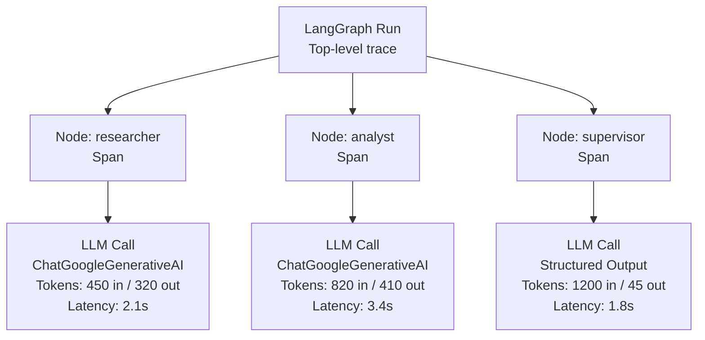
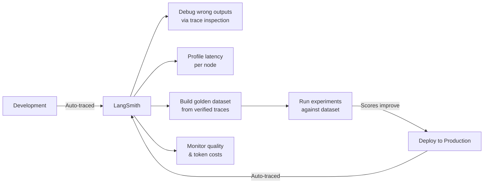

# Debugging & Monitoring — LangSmith

> **Phase 4 — Other Concepts** | Estimated study time: **3–4 hours**  
> Prerequisites: Phase 3 (Multi-Agent Systems), LangGraph basics

---

## Table of Contents

1. [Simple Explanation](#1-simple-explanation)
2. [Why It Matters](#2-why-it-matters)
3. [Internal Working](#3-internal-working)
4. [Real-World Use Cases](#4-real-world-use-cases)
5. [Common Beginner Mistakes](#5-common-beginner-mistakes)
6. [Best Practices](#6-best-practices)
7. [Python Examples](#7-python-examples)
9. [Diagrams](#9-diagrams)

---

## 1. Simple Explanation

**LangSmith** is an observability and debugging platform for LLM applications. It automatically captures every LLM call, tool invocation, and agent step — giving you a full trace of what happened, in what order, with what inputs and outputs.

Without LangSmith, debugging a multi-agent system means:
```
Agent produced wrong output → Which agent? Which LLM call? What prompt was sent?
→ Add print statements → Re-run → Still unclear → Add more prints → ...
```

With LangSmith:
```
Agent produced wrong output → Open LangSmith → Click the trace → 
See every node, every prompt, every token, every latency → Fix the exact step
```

It's the difference between debugging with `print()` and debugging with a proper debugger.

---

## 2. Why It Matters

### The Observability Gap

Traditional software: you can set breakpoints, inspect variables, read stack traces.

LLM agents: the "logic" is inside an LLM's weights. You can't set a breakpoint inside a model. The only way to understand what happened is to **log everything** — every prompt sent, every response received, every tool called.

LangSmith does this automatically with zero code changes (just two environment variables).

### What LangSmith Captures

| Data | What You See |
|---|---|
| **Traces** | Full execution tree — every node, every LLM call, nested |
| **Prompts** | Exact system + human messages sent to the LLM |
| **Completions** | Exact LLM response, including tool calls |
| **Latency** | Time per node, per LLM call, end-to-end |
| **Token usage** | Input tokens, output tokens, cost estimate |
| **Errors** | Full stack trace with the state at the time of failure |
| **Feedback** | Human ratings attached to traces (for eval) |

---

## 3. Internal Working

### How Tracing Works

LangSmith uses **callbacks** — hooks that LangChain fires at the start and end of every operation. When you set the `LANGCHAIN_TRACING_V2=true` environment variable, LangChain automatically attaches a LangSmith callback to every LLM call, tool call, and chain run.

```
Your code calls: llm.invoke([...])
LangChain fires: on_llm_start callback → LangSmith records the prompt
LLM responds
LangChain fires: on_llm_end callback → LangSmith records the response + latency
```

This happens for every nested call — so a LangGraph run with 4 nodes and 6 LLM calls produces a trace with 10 spans, all nested correctly.

### Trace Structure

```
Run (top-level)
  ├── Node: researcher
  │     └── LLM call: ChatGoogleGenerativeAI
  │           ├── Input: [SystemMessage, HumanMessage]
  │           └── Output: "Research notes..."
  ├── Node: analyst
  │     └── LLM call: ChatGoogleGenerativeAI
  │           ├── Input: [SystemMessage, HumanMessage]
  │           └── Output: "Outline..."
  └── Node: supervisor
        └── LLM call: ChatGoogleGenerativeAI (structured output)
              ├── Input: [SystemMessage, HumanMessage]
              └── Output: SupervisorDecision(next_node="FINISH")
```

### Datasets and Experiments

Beyond tracing, LangSmith supports:
- **Datasets**: Collections of input/output pairs (your golden test set)
- **Experiments**: Running your agent against a dataset and scoring results
- **Comparisons**: Side-by-side experiment results to compare prompt versions

---

## 4. Real-World Use Cases

### 1. Debugging a Wrong Answer
User reports the blog agent produced off-topic content. Open LangSmith → find the trace → see the researcher's prompt → notice the topic was malformed → fix the input sanitization.

### 2. Latency Profiling
The pipeline takes 45 seconds. Open LangSmith → check per-node latency → researcher takes 30 seconds → the prompt is too long → trim it → pipeline now takes 18 seconds.

### 3. Token Cost Monitoring
Track token usage per run. Set up alerts when a run exceeds a token budget. Identify which node is consuming the most tokens.

### 4. Prompt Regression Testing
Before deploying a new prompt, run it against your LangSmith dataset. Compare the new experiment's scores against the baseline experiment.

---

## 5. Common Beginner Mistakes

**Mistake 1: Only enabling tracing in production**
```
❌ Only trace in prod — you find bugs after users hit them
✅ Enable tracing in dev too — catch issues before they reach prod
```

**Mistake 2: Not tagging traces**
```python
# ❌ All traces look the same — hard to filter
result = app.invoke(state)

# ✅ Tag traces with metadata for filtering
result = app.invoke(
    state,
    config={"metadata": {"user_id": "u123", "topic": state["topic"], "env": "prod"}}
)
```

**Mistake 3: Logging sensitive data**
```python
# ❌ User PII ends up in LangSmith traces
state = {"topic": "...", "user_email": "user@example.com"}

# ✅ Strip PII before it enters the agent state
state = {"topic": "...", "user_id": "u123"}  # ID only, not email
```

**Mistake 4: Ignoring the feedback API**
```
❌ Traces sit unused — no signal on what's good vs bad
✅ Attach feedback scores to traces (from eval runs or human review)
   This builds your dataset for future fine-tuning or eval
```

---

## 6. Best Practices

1. **Enable tracing from day one** — two env vars, zero code changes, immediate value
2. **Use projects to separate environments** — `LANGCHAIN_PROJECT=blog-agent-dev` vs `blog-agent-prod`
3. **Tag every run with metadata** — user ID, session ID, agent version, environment
4. **Set up a dataset early** — every time you manually verify a good output, add it to your LangSmith dataset
5. **Monitor token usage per node** — the most expensive node is usually the one to optimize first
6. **Use `@traceable` for custom functions** — any function outside LangChain that you want in the trace

---

## 7. Python Examples

### Example 1: Enable LangSmith Tracing (Zero Code Change)

```python
"""
Enable LangSmith tracing with environment variables only.
No code changes needed — LangChain auto-instruments everything.

Setup:
1. Create account at smith.langchain.com
2. Get API key from Settings
3. Add to .env
"""
# .env additions:
# LANGCHAIN_TRACING_V2=true
# LANGCHAIN_API_KEY=<your_langsmith_api_key>
# LANGCHAIN_PROJECT=phase3-blog-agent

import os
from langchain_google_genai import ChatGoogleGenerativeAI
from langchain_core.messages import SystemMessage, HumanMessage
from dotenv import load_dotenv

load_dotenv()  # Picks up LANGCHAIN_TRACING_V2 and LANGCHAIN_API_KEY automatically

llm = ChatGoogleGenerativeAI(model=os.getenv("GEMINI_MODEL", "gemini-2.0-flash-lite"))

# This call is now automatically traced in LangSmith — no other changes needed
response = llm.invoke([
    SystemMessage(content="You are a helpful assistant."),
    HumanMessage(content="What is LangSmith used for?"),
])

print(response.content)
# → Open smith.langchain.com → Your project → See the trace
```

### Example 2: Custom Tracing with `@traceable`

```python
"""
Use @traceable to include custom functions in LangSmith traces.
Useful for non-LangChain code (database calls, preprocessing, etc.)
"""
import os
from langsmith import traceable
from langchain_google_genai import ChatGoogleGenerativeAI
from langchain_core.messages import HumanMessage
from dotenv import load_dotenv

load_dotenv()

llm = ChatGoogleGenerativeAI(model=os.getenv("GEMINI_MODEL", "gemini-2.0-flash-lite"))


@traceable(name="fetch_context", run_type="retriever")
def fetch_context(topic: str) -> str:
    """Simulates a retrieval step — appears as a retriever span in LangSmith."""
    # In real code: vectorstore.similarity_search(topic)
    return f"Key facts about {topic}: [retrieved context here]"


@traceable(name="generate_blog", run_type="chain")
def generate_blog(topic: str) -> str:
    """Full pipeline — appears as a chain span containing retriever + llm spans."""
    context = fetch_context(topic)

    response = llm.invoke([
        HumanMessage(content=f"Write a blog post about {topic}.\nContext: {context}")
    ])

    return response.content


@traceable(name="blog_pipeline", run_type="chain", tags=["production"])
def blog_pipeline(topic: str, user_id: str) -> dict:
    """Top-level entry point — tagged for filtering in LangSmith."""
    blog = generate_blog(topic)
    return {"topic": topic, "blog": blog, "user_id": user_id}


result = blog_pipeline("vector databases", user_id="u_001")
print(result["blog"][:200])
# → LangSmith shows: blog_pipeline → generate_blog → fetch_context + LLM call
```

### Example 3: Attach Feedback to Traces

```python
"""
Attach evaluation scores to LangSmith traces.
This builds a feedback dataset for monitoring quality over time.
"""
import os
from langsmith import Client, traceable
from langchain_google_genai import ChatGoogleGenerativeAI
from langchain_core.messages import HumanMessage
from dotenv import load_dotenv

load_dotenv()

client = Client()
llm = ChatGoogleGenerativeAI(model=os.getenv("GEMINI_MODEL", "gemini-2.0-flash-lite"))


@traceable(name="answer_question")
def answer_question(question: str, context: str) -> str:
    return llm.invoke([
        HumanMessage(content=f"Context: {context}\n\nQuestion: {question}\n\nAnswer:")
    ]).content


def run_with_feedback(question: str, context: str, expected: str) -> None:
    """Run the agent and attach an automated quality score to the trace."""

    # Run the agent — the @traceable decorator captures the run_id
    from langsmith.run_helpers import get_current_run_tree

    answer = answer_question(question, context)

    # Simple correctness check (replace with LLM judge for production)
    score = 1.0 if expected.lower() in answer.lower() else 0.0

    # Attach feedback to the trace
    # In production: get run_id from the trace context
    print(f"Q: {question}")
    print(f"A: {answer[:100]}...")
    print(f"Score: {score:.1f} ({'✅' if score == 1.0 else '❌'})")

    # To attach feedback programmatically:
    # client.create_feedback(
    #     run_id=run_id,           # from get_current_run_tree().id
    #     key="correctness",
    #     score=score,
    #     comment=f"Expected '{expected}' in answer"
    # )


run_with_feedback(
    question="What is the refund window?",
    context="Refunds are available within 30 days of purchase.",
    expected="30 days",
)
```

---

## 9. Diagrams

### LangSmith Trace Structure



### LangSmith in the Development Workflow



---

**Previous**: [05_agent_evaluation.md](./05_agent_evaluation.md)  
**Next**: [07_advanced_patterns.md](./07_advanced_patterns.md)
