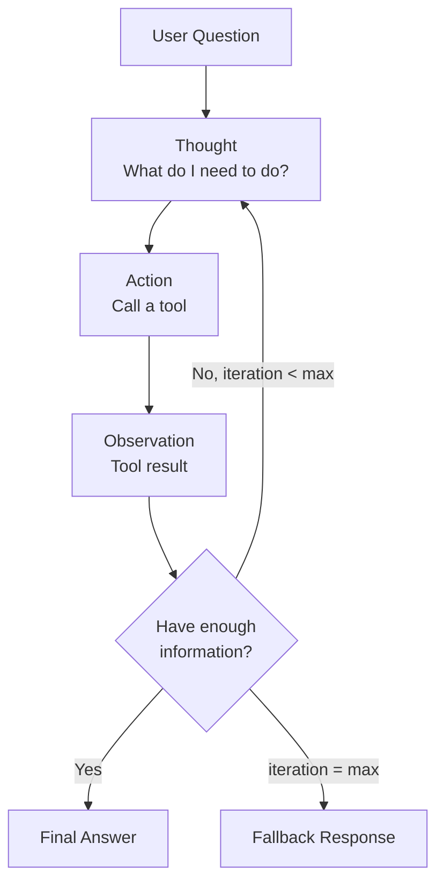
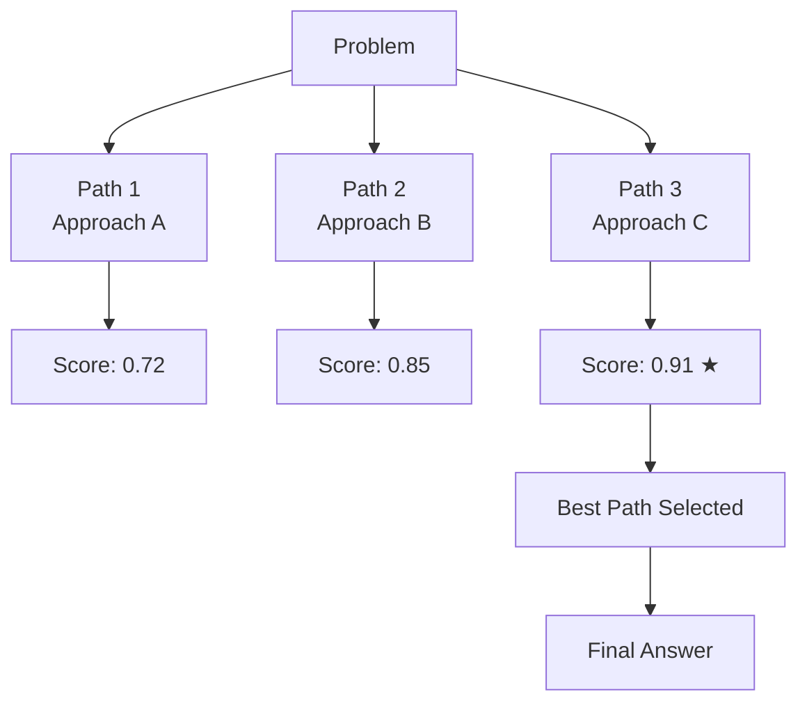
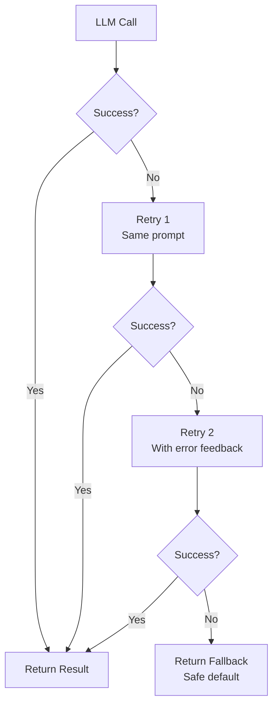

# Advanced Agentic Patterns

> **Phase 4 — Other Concepts** | Estimated study time: **4–5 hours**  
> Prerequisites: Phase 3 (Multi-Agent Systems), Tool calling (Phase 2)

---

## Table of Contents

1. [Simple Explanation](#1-simple-explanation)
2. [Why It Matters](#2-why-it-matters)
3. [Internal Working](#3-internal-working)
4. [Real-World Use Cases](#4-real-world-use-cases)
5. [Common Beginner Mistakes](#5-common-beginner-mistakes)
6. [Best Practices](#6-best-practices)
7. [Python Examples](#7-python-examples)
9. [Diagrams](#9-diagrams)

---

## 1. Simple Explanation

Advanced agentic patterns are **reasoning and execution strategies** that make agents more capable, reliable, and self-correcting. They go beyond simple "call LLM → return result" into structured thinking loops.

Three patterns covered here:

| Pattern | Core Idea | Best For |
|---|---|---|
| **ReAct** | Reason → Act → Observe → Repeat | Tool-using agents that need to adapt based on results |
| **Tree of Thought (ToT)** | Explore multiple reasoning paths, pick the best | Complex problems where the first answer is rarely the best |
| **Retry + Fallback** | Detect failure → retry with correction → fall back to safe default | Production reliability, handling LLM errors and bad outputs |

---

## 2. Why It Matters

A basic agent calls the LLM once and returns the result. That works for simple tasks. For complex tasks:

- The first tool call might return incomplete data → the agent needs to adapt
- The first reasoning path might be wrong → the agent needs to explore alternatives
- The LLM might return malformed output → the system needs to recover gracefully

These patterns are what separate a demo agent from a production agent.

---

## 3. Internal Working

### ReAct (Reason + Act)

ReAct is a loop: the agent **reasons** about what to do, **acts** (calls a tool), **observes** the result, then reasons again based on what it learned.

```
Thought: I need to find the current price of AAPL stock.
Action: search_web("AAPL stock price today")
Observation: AAPL is trading at $189.45 as of 2:30 PM EST.
Thought: I have the price. Now I need to compare it to last week.
Action: search_web("AAPL stock price last week")
Observation: AAPL was at $182.10 last week.
Thought: I have both values. I can now calculate the change.
Final Answer: AAPL rose 4.0% from $182.10 to $189.45 this week.
```

Each iteration: the agent sees the full history (all thoughts + observations) and decides whether to act again or finish. This is how LangChain's `AgentExecutor` works internally.

### Tree of Thought (ToT)

ToT generates **multiple candidate reasoning paths** in parallel, evaluates each, and selects the best one.

```
Problem: "Design a database schema for a blog platform"

Path A: Start with users table → posts → comments
Path B: Start with content types → then users → then relationships  
Path C: Start with the query patterns → work backwards to schema

Evaluate each path:
  Path A score: 0.72 (standard but misses content flexibility)
  Path B score: 0.85 (more extensible)
  Path C score: 0.91 (query-driven design is best practice)

Select Path C → continue reasoning from there
```

ToT is expensive (multiple LLM calls per step) but produces significantly better results on complex reasoning tasks.

### Retry + Fallback

A structured error handling pattern with three levels:

```
Level 1 — Retry with same input:
  LLM returns malformed JSON → retry up to N times

Level 2 — Retry with corrected input:
  LLM returns wrong format → inject error feedback into prompt → retry

Level 3 — Fallback:
  All retries exhausted → return safe default or escalate to human
```

---

## 4. Real-World Use Cases

### ReAct
- **Research agents**: Search → read result → decide if more searching needed → synthesize
- **Data analysis agents**: Query DB → check if data is sufficient → query again with refined filter
- **Customer support**: Look up order → check status → if delayed, check shipping → compose response

### Tree of Thought
- **Architecture decisions**: Generate 3 design options → score each → recommend the best
- **Code generation**: Generate 3 implementations → evaluate correctness + efficiency → return best
- **Content strategy**: Generate 5 blog angles → score by audience fit → pick top 2

### Retry + Fallback
- **Any production agent**: Structured output parsing failures, API timeouts, rate limits
- **Financial agents**: If calculation fails, fall back to "requires human review"
- **Medical agents**: If confidence is low, fall back to "consult a professional"

---

## 5. Common Beginner Mistakes

**Mistake 1: Infinite ReAct loops**
```python
# ❌ BAD — no max iterations, agent loops forever
while True:
    response = agent.step(state)
    if response.is_final:
        break

# ✅ GOOD — hard limit on iterations
for _ in range(MAX_ITERATIONS):
    response = agent.step(state)
    if response.is_final:
        break
else:
    return fallback_response()
```

**Mistake 2: Retrying without changing anything**
```python
# ❌ BAD — same prompt, same result
for _ in range(3):
    result = llm.invoke(prompt)  # Will fail the same way every time

# ✅ GOOD — inject the error into the retry prompt
for attempt in range(3):
    result = llm.invoke(prompt if attempt == 0 else f"{prompt}\n\nPrevious attempt failed: {error}. Fix it.")
```

**Mistake 3: Using ToT for simple tasks**
```
❌ Using ToT to answer "What is 2+2?" — 3x the cost, same answer
✅ Using ToT for "Design a microservices architecture for X" — worth the cost
```

---

## 6. Best Practices

1. **ReAct**: Always set `max_iterations` — 5–10 is typical for most tasks
2. **ReAct**: Log each thought/action/observation — this is your debug trail
3. **ToT**: Use 3 paths as default — diminishing returns beyond that
4. **ToT**: Score paths with a structured output schema — don't rely on free-text scoring
5. **Retry**: Exponential backoff for API errors, immediate retry for parsing errors
6. **Retry**: Always have a fallback that returns something useful — never let the agent return nothing
7. **All patterns**: Instrument with LangSmith — these patterns generate many LLM calls and tracing is essential

---

## 7. Python Examples

### Example 1: ReAct Agent with Tool Loop

```python
"""
ReAct pattern — Reason, Act, Observe loop with tool calling.
The agent decides when it has enough information to stop.
"""
import os
from langchain_google_genai import ChatGoogleGenerativeAI
from langchain_core.messages import SystemMessage, HumanMessage, ToolMessage
from langchain_core.tools import tool
from dotenv import load_dotenv

load_dotenv()

llm = ChatGoogleGenerativeAI(model=os.getenv("GEMINI_MODEL", "gemini-2.0-flash-lite"))

MAX_ITERATIONS = 6


@tool
def search(query: str) -> str:
    """Search for information on a topic. Use for factual lookups."""
    # Simulated search — replace with real search tool
    results = {
        "LangGraph": "LangGraph is a library for building stateful multi-agent systems using graphs.",
        "ADK": "Google ADK (Agent Development Kit) is a framework for building Gemini-native agents.",
        "LangSmith": "LangSmith is an observability platform for LLM applications by LangChain.",
    }
    for key, val in results.items():
        if key.lower() in query.lower():
            return val
    return f"No results found for: {query}"


@tool
def calculate(expression: str) -> str:
    """Evaluate a mathematical expression. Use for calculations."""
    try:
        return str(eval(expression, {"__builtins__": {}}, {}))
    except Exception as e:
        return f"Error: {e}"


SYSTEM = """You are a helpful research assistant. 
Think step by step. Use tools to gather information before answering.
When you have enough information, provide a final answer directly without calling more tools."""

tools = [search, calculate]
agent = llm.bind_tools(tools)
tool_map = {t.name: t for t in tools}


def run_react_agent(question: str) -> str:
    messages = [SystemMessage(content=SYSTEM), HumanMessage(content=question)]

    for iteration in range(MAX_ITERATIONS):
        response = agent.invoke(messages)
        messages.append(response)

        if not response.tool_calls:
            return response.content  # Final answer — no more tool calls

        # Execute all tool calls and add observations
        for tc in response.tool_calls:
            result = tool_map[tc["name"]].invoke(tc["args"])
            messages.append(ToolMessage(content=str(result), tool_call_id=tc["id"]))
            print(f"  [{iteration+1}] {tc['name']}({tc['args']}) → {str(result)[:80]}")

    return "Max iterations reached. Partial answer: " + messages[-1].content


print(run_react_agent("What is LangGraph and how does it relate to LangSmith?"))
```

### Example 2: Tree of Thought — Multi-Path Reasoning

```python
"""
Tree of Thought — generate multiple reasoning paths, score each, select the best.
Used for complex decisions where the first answer is rarely optimal.
"""
import os
from pydantic import BaseModel, Field
from langchain_google_genai import ChatGoogleGenerativeAI
from langchain_core.messages import SystemMessage, HumanMessage
from dotenv import load_dotenv

load_dotenv()

llm = ChatGoogleGenerativeAI(model=os.getenv("GEMINI_MODEL", "gemini-2.0-flash-lite"))

N_PATHS = 3


class ReasoningPath(BaseModel):
    approach: str = Field(description="The reasoning approach taken")
    answer: str = Field(description="The answer following this approach")
    confidence: float = Field(ge=0.0, le=1.0, description="Confidence in this answer")
    reasoning: str = Field(description="Why this approach was taken")


class ThoughtTree(BaseModel):
    paths: list[ReasoningPath] = Field(description=f"Exactly {N_PATHS} different reasoning paths")


_explorer = llm.with_structured_output(ThoughtTree)


def tree_of_thought(problem: str) -> str:
    """
    Generate N reasoning paths for a problem, then select the highest-confidence path.
    """
    # Step 1: Generate multiple reasoning paths
    thought_tree = _explorer.invoke([
        SystemMessage(content=(
            f"Generate exactly {N_PATHS} different reasoning approaches to solve the problem. "
            "Each approach should use a genuinely different strategy or perspective. "
            "Score your confidence in each approach honestly."
        )),
        HumanMessage(content=f"Problem: {problem}"),
    ])

    # Step 2: Select the best path
    best = max(thought_tree.paths, key=lambda p: p.confidence)

    print(f"Generated {len(thought_tree.paths)} reasoning paths:")
    for i, path in enumerate(thought_tree.paths, 1):
        marker = "★" if path == best else " "
        print(f"  {marker} Path {i} [{path.confidence:.2f}]: {path.approach[:60]}")

    print(f"\nSelected path (confidence: {best.confidence:.2f}):")
    print(f"Approach: {best.approach}")
    print(f"Answer: {best.answer}")

    return best.answer


tree_of_thought(
    "Should a startup use a monolith or microservices architecture for their MVP?"
)
```

### Example 3: Retry + Fallback with Structured Output

```python
"""
Retry + Fallback pattern for production reliability.
Handles LLM parsing failures with progressive error correction.
"""
import os
import time
from typing import TypeVar, Callable, Optional
from pydantic import BaseModel, Field, ValidationError
from langchain_google_genai import ChatGoogleGenerativeAI
from langchain_core.messages import SystemMessage, HumanMessage
from dotenv import load_dotenv

load_dotenv()

llm = ChatGoogleGenerativeAI(model=os.getenv("GEMINI_MODEL", "gemini-2.0-flash-lite"))

T = TypeVar("T", bound=BaseModel)


def with_retry(
    fn: Callable[[], T],
    max_attempts: int = 3,
    backoff: float = 1.0,
    fallback: Optional[T] = None,
) -> Optional[T]:
    """
    Generic retry wrapper with exponential backoff and optional fallback.
    Works for any callable — LLM calls, API calls, tool calls.
    """
    last_error = None

    for attempt in range(1, max_attempts + 1):
        try:
            return fn()
        except (ValidationError, ValueError, Exception) as e:
            last_error = e
            if attempt < max_attempts:
                wait = backoff * (2 ** (attempt - 1))  # Exponential backoff
                print(f"  Attempt {attempt} failed: {e}. Retrying in {wait:.1f}s...")
                time.sleep(wait)

    print(f"  All {max_attempts} attempts failed. Last error: {last_error}")
    return fallback


# ── Domain model ──────────────────────────────────────

class BlogOutline(BaseModel):
    title: str = Field(min_length=5)
    sections: list[str] = Field(min_length=3, description="At least 3 section headings")
    word_count_target: int = Field(ge=300, le=2000)


_outline_llm = llm.with_structured_output(BlogOutline)

FALLBACK_OUTLINE = BlogOutline(
    title="Article",
    sections=["Introduction", "Main Content", "Conclusion"],
    word_count_target=500,
)


def generate_outline(topic: str, feedback: str = "") -> BlogOutline:
    """Generate a blog outline with retry on failure."""

    def attempt() -> BlogOutline:
        prompt = f"Generate a blog outline for: {topic}"
        if feedback:
            prompt += f"\n\nPrevious attempt failed. Fix this: {feedback}"
        return _outline_llm.invoke([
            SystemMessage(content="Generate a structured blog outline."),
            HumanMessage(content=prompt),
        ])

    result = with_retry(attempt, max_attempts=3, backoff=0.5, fallback=FALLBACK_OUTLINE)
    return result


# ── Test ──────────────────────────────────────────────

outline = generate_outline("The future of AI agents in enterprise software")
print(f"\nTitle: {outline.title}")
print(f"Sections: {outline.sections}")
print(f"Target words: {outline.word_count_target}")
```

---

## 9. Diagrams

### ReAct Loop



### Tree of Thought



### Retry + Fallback



---

**Previous**: [06_debugging_monitoring.md](./06_debugging_monitoring.md)  
**Next**: [08_guardrails_safety.md](./08_guardrails_safety.md)
