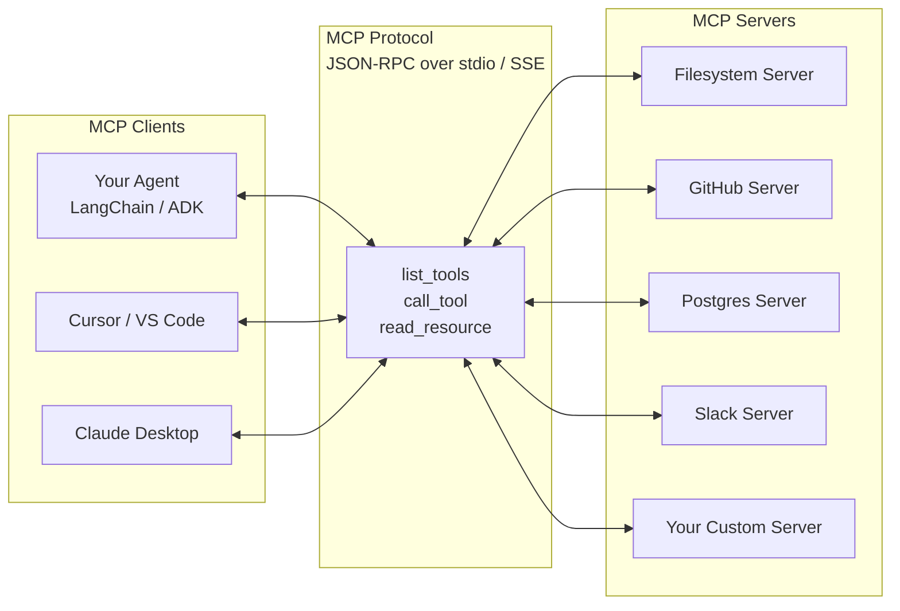
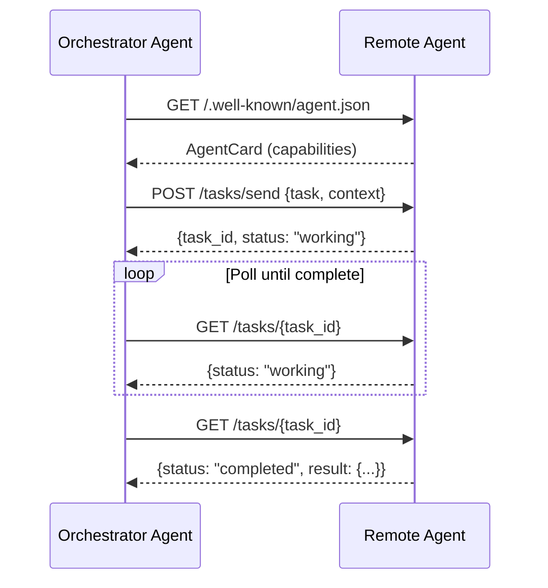
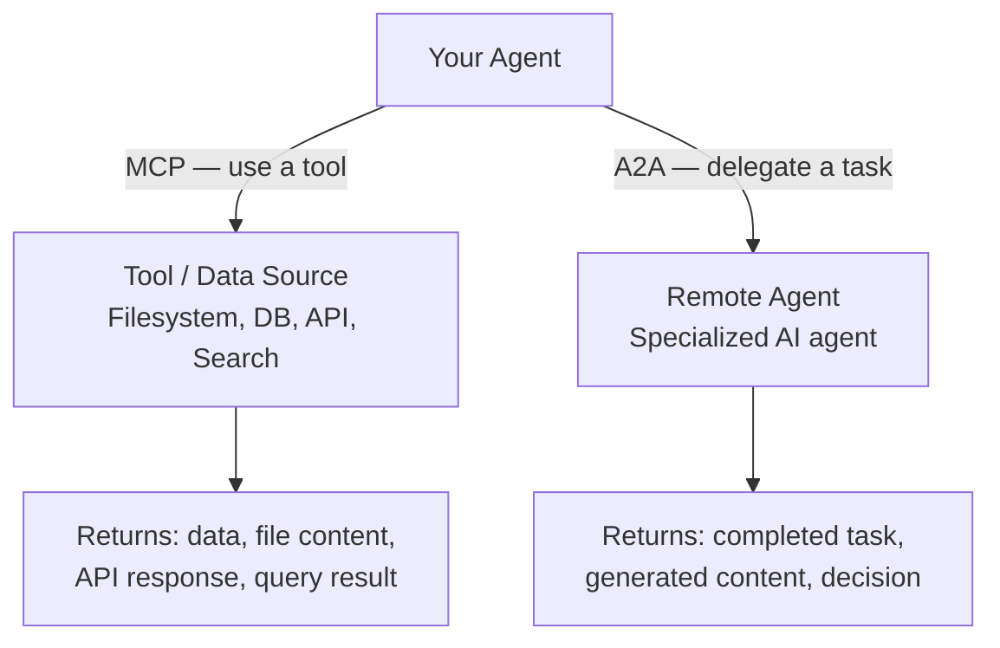

# MCP & A2A Protocols

> **Phase 4 — Other Concepts** | Estimated study time: **3–4 hours**  
> Prerequisites: Phase 3 (Multi-Agent Systems), Tool calling (Phase 2)

---

## Table of Contents

1. [Simple Explanation](#1-simple-explanation)
2. [Why It Matters](#2-why-it-matters)
3. [Internal Working](#3-internal-working)
4. [Real-World Use Cases](#4-real-world-use-cases)
5. [Common Beginner Mistakes](#5-common-beginner-mistakes)
6. [Best Practices](#6-best-practices)
7. [Python Examples](#7-python-examples)
9. [Diagrams](#9-diagrams)

---

## 1. Simple Explanation

### MCP — Model Context Protocol

**MCP** is an open standard (by Anthropic, adopted industry-wide) that defines how AI agents connect to external tools and data sources. It's a **standardized plug-in system** for agents.

Before MCP, every agent framework had its own way to define tools:
```
LangChain:  @tool decorator
OpenAI:     function_calling JSON schema
ADK:        Tool class
Custom:     Whatever you invented
```

With MCP, tools are defined once as **MCP servers** and any MCP-compatible agent can use them — regardless of framework.

```
MCP Server (e.g., filesystem, GitHub, Postgres)
    ↕ Standard MCP protocol
MCP Client (your agent — LangChain, ADK, Claude, etc.)
```

### A2A — Agent-to-Agent Protocol

**A2A** (by Google) is a standard for how agents communicate with each other across different systems, frameworks, and organizations.

Before A2A, agents from different systems couldn't collaborate:
```
LangGraph agent ←→ ??? ←→ ADK agent
(No standard way to pass tasks between them)
```

With A2A:
```
LangGraph agent ←→ A2A protocol ←→ ADK agent
(Standard task delegation, status updates, result passing)
```

### One-Line Summary

```
MCP  = standard protocol for agents to USE tools
A2A  = standard protocol for agents to TALK TO each other
```

---

## 2. Why It Matters

### MCP

Without MCP, every tool integration is custom work:
- Build a GitHub tool for LangChain → can't reuse it in ADK
- Build a database tool for ADK → can't reuse it in a custom agent
- Every framework upgrade potentially breaks your tools

With MCP:
- Build a GitHub MCP server once → works with any MCP client
- The MCP ecosystem already has 1000+ pre-built servers (GitHub, Slack, Postgres, filesystem, etc.)
- Your IDE (Cursor, VS Code) can use the same MCP servers as your agents

### A2A

Without A2A:
- Multi-agent systems are monolithic — all agents must be in the same codebase
- Can't delegate tasks to specialized agents built by other teams or vendors
- No standard way to check if a remote agent completed its task

With A2A:
- Agents become composable services — like microservices but for AI
- A customer support agent can delegate to a billing agent built by a different team
- Agents can discover each other's capabilities via Agent Cards

---

## 3. Internal Working

### MCP Architecture

MCP uses a **client-server model** over JSON-RPC:

```
MCP Client (your agent)          MCP Server (tool provider)
        │                                │
        │── list_tools() ──────────────→ │  "What tools do you have?"
        │← [tool1, tool2, tool3] ────── │  "Here's my tool catalog"
        │                                │
        │── call_tool("read_file",      │  "Execute this tool"
        │    {path: "/data/report.csv"}) │
        │← {content: "col1,col2..."}── │  "Here's the result"
```

**MCP Transport options:**
- `stdio` — local process communication (for local tools like filesystem)
- `SSE` (Server-Sent Events) — HTTP-based (for remote tools)
- `WebSocket` — bidirectional (for streaming tools)

**MCP Server exposes three primitives:**
| Primitive | What It Is | Example |
|---|---|---|
| **Tools** | Functions the agent can call | `read_file`, `search_web`, `query_db` |
| **Resources** | Data the agent can read | Files, database records, API responses |
| **Prompts** | Reusable prompt templates | "Summarize this document", "Review this code" |

### A2A Architecture

A2A uses **HTTP + JSON** with a defined message schema:

```
Requesting Agent                    Remote Agent
        │                                │
        │── GET /.well-known/agent.json → │  "What can you do?"
        │← AgentCard (capabilities) ──── │  "I'm a billing specialist"
        │                                │
        │── POST /tasks/send ──────────→ │  "Handle this task"
        │   {task: "Process refund",      │
        │    context: {...}}              │
        │← {task_id: "t_123",            │  "Got it, working on it"
        │   status: "working"}           │
        │                                │
        │── GET /tasks/t_123 ──────────→ │  "What's the status?"
        │← {status: "completed",         │  "Done, here's the result"
        │   result: {...}}               │
```

**Agent Card** — a JSON file at `/.well-known/agent.json` that describes what an agent can do:
```json
{
  "name": "Billing Agent",
  "description": "Handles refunds, invoices, and payment processing",
  "capabilities": ["process_refund", "generate_invoice", "check_payment_status"],
  "endpoint": "https://billing-agent.example.com"
}
```

---

## 4. Real-World Use Cases

### MCP
- **IDE integration**: Cursor/VS Code uses MCP to give AI assistants access to your filesystem, Git, terminal
- **Database agents**: Connect your agent to Postgres, MySQL, or MongoDB via a standard MCP server
- **SaaS integrations**: Pre-built MCP servers for GitHub, Slack, Notion, Google Drive — plug in without custom code
- **Internal tools**: Expose your company's internal APIs as MCP servers — any agent can use them

### A2A
- **Enterprise agent networks**: HR agent delegates payroll questions to a Payroll agent, IT questions to an IT agent
- **Cross-team collaboration**: Frontend team's design agent delegates accessibility checks to a specialized a11y agent
- **Vendor integration**: Your customer support agent delegates shipping questions to a logistics vendor's agent
- **Agent marketplaces**: Discover and use specialized agents built by third parties via their Agent Cards

---

## 5. Common Beginner Mistakes

**Mistake 1: Building custom tool integrations when MCP servers already exist**
```
❌ Writing a custom GitHub tool from scratch
✅ Use the official GitHub MCP server: github.com/modelcontextprotocol/servers
```

**Mistake 2: Confusing MCP with A2A**
```
MCP  = your agent using a TOOL (filesystem, database, API)
A2A  = your agent delegating a TASK to another AGENT

❌ "I'll use A2A to connect my agent to a database"
✅ "I'll use MCP to connect my agent to a database"
✅ "I'll use A2A to delegate billing tasks to the billing agent"
```

**Mistake 3: Not validating MCP tool results**
```python
# ❌ Trust the MCP server's output blindly
result = mcp_client.call_tool("read_file", {"path": user_input})
return result  # Could be anything

# ✅ Validate and sanitize MCP results
result = mcp_client.call_tool("read_file", {"path": sanitized_path})
if result.is_error:
    return handle_error(result)
return process_result(result)
```

**Mistake 4: Exposing sensitive MCP servers without authentication**
```
❌ MCP server with database access, no auth
✅ MCP server with API key auth + scoped permissions per client
```

---

## 6. Best Practices

### MCP
1. **Use existing MCP servers** before building custom ones — the ecosystem is large
2. **Scope permissions** — an MCP server should expose only what the agent needs, not everything
3. **Validate inputs** to MCP tools — treat them like API endpoints (sanitize, validate, rate-limit)
4. **Use `stdio` transport for local tools**, `SSE` for remote tools
5. **Version your MCP servers** — breaking changes in tool schemas break agents

### A2A
1. **Keep Agent Cards accurate** — agents discover capabilities from them; stale cards cause routing failures
2. **Design for async** — A2A tasks can take time; always support polling or callbacks
3. **Include task context** — remote agents need enough context to complete the task without back-and-forth
4. **Handle partial failures** — a remote agent might complete 80% of a task; design for partial results
5. **Authenticate A2A calls** — treat remote agent calls like API calls (OAuth, API keys)

---

## 7. Python Examples

### Example 1: MCP Client — Connecting to an MCP Server

```python
"""
MCP client — connect to a local MCP server and call its tools.
Uses the official MCP Python SDK.

Install: pip install mcp
"""
import asyncio
import os
from mcp import ClientSession, StdioServerParameters
from mcp.client.stdio import stdio_client
from langchain_google_genai import ChatGoogleGenerativeAI
from langchain_core.messages import HumanMessage, ToolMessage, SystemMessage
from dotenv import load_dotenv

load_dotenv()

llm = ChatGoogleGenerativeAI(model=os.getenv("GEMINI_MODEL", "gemini-2.0-flash-lite"))


async def run_with_mcp_tools(question: str) -> str:
    """
    Connect to a filesystem MCP server, discover its tools,
    and use them to answer a question.
    """
    # Connect to the filesystem MCP server (reads local files)
    server_params = StdioServerParameters(
        command="npx",
        args=["-y", "@modelcontextprotocol/server-filesystem", os.getcwd()],
    )

    async with stdio_client(server_params) as (read, write):
        async with ClientSession(read, write) as session:
            await session.initialize()

            # Discover available tools from the MCP server
            tools_response = await session.list_tools()
            mcp_tools = tools_response.tools
            print(f"Available MCP tools: {[t.name for t in mcp_tools]}")

            # Convert MCP tool schemas to LangChain tool format
            lc_tools = [
                {
                    "name": t.name,
                    "description": t.description,
                    "parameters": t.inputSchema,
                }
                for t in mcp_tools
            ]

            agent = llm.bind_tools(lc_tools)
            messages = [
                SystemMessage(content="Use the available tools to answer the question."),
                HumanMessage(content=question),
            ]

            for _ in range(5):
                response = agent.invoke(messages)
                messages.append(response)

                if not response.tool_calls:
                    return response.content

                for tc in response.tool_calls:
                    # Call the tool via MCP protocol
                    result = await session.call_tool(tc["name"], tc["args"])
                    content = result.content[0].text if result.content else "No result"
                    messages.append(ToolMessage(content=content, tool_call_id=tc["id"]))

    return messages[-1].content


# Run the async agent
result = asyncio.run(run_with_mcp_tools("List the Python files in the current directory"))
print(result)
```

### Example 2: MCP Server — Expose Custom Tools

```python
"""
Build a custom MCP server that exposes your agent's tools to any MCP client.
Any MCP-compatible agent (Claude, Cursor, your own) can now use these tools.

Install: pip install mcp
Run: python this_file.py
"""
import asyncio
from mcp.server import Server
from mcp.server.stdio import stdio_server
from mcp import types

app = Server("blog-tools-server")


@app.list_tools()
async def list_tools() -> list[types.Tool]:
    """Advertise available tools to MCP clients."""
    return [
        types.Tool(
            name="generate_outline",
            description="Generate a structured blog outline for a given topic",
            inputSchema={
                "type": "object",
                "properties": {
                    "topic": {"type": "string", "description": "The blog topic"},
                    "sections": {"type": "integer", "description": "Number of sections", "default": 4},
                },
                "required": ["topic"],
            },
        ),
        types.Tool(
            name="check_word_count",
            description="Count words in a text and check if it meets a target",
            inputSchema={
                "type": "object",
                "properties": {
                    "text": {"type": "string"},
                    "target": {"type": "integer", "description": "Target word count"},
                },
                "required": ["text", "target"],
            },
        ),
    ]


@app.call_tool()
async def call_tool(name: str, arguments: dict) -> list[types.TextContent]:
    """Handle tool calls from MCP clients."""

    if name == "generate_outline":
        topic = arguments["topic"]
        sections = arguments.get("sections", 4)
        outline = f"# {topic}\n\n" + "\n".join(
            f"## Section {i+1}: [Heading for {topic}]" for i in range(sections)
        )
        return [types.TextContent(type="text", text=outline)]

    if name == "check_word_count":
        text = arguments["text"]
        target = arguments["target"]
        count = len(text.split())
        status = "✅ meets target" if count >= target else f"❌ {target - count} words short"
        return [types.TextContent(type="text", text=f"Word count: {count} ({status})")]

    raise ValueError(f"Unknown tool: {name}")


async def main():
    async with stdio_server() as (read, write):
        await app.run(read, write, app.create_initialization_options())


if __name__ == "__main__":
    asyncio.run(main())
```

### Example 3: A2A — Agent Card + Task Delegation

```python
"""
A2A pattern — Agent Card definition and task delegation.
Shows the structure of A2A without requiring a full server setup.

In production: use google-adk which has built-in A2A support.
Install: pip install google-adk httpx
"""
import os
import json
import httpx
from dataclasses import dataclass, field
from typing import Optional
from dotenv import load_dotenv

load_dotenv()


# ── Agent Card (what a remote agent advertises) ───────

AGENT_CARD = {
    "name": "Blog Generation Agent",
    "description": "Generates structured blog posts on any topic using a multi-agent pipeline",
    "version": "1.0.0",
    "endpoint": "http://localhost:8000",
    "capabilities": [
        {
            "name": "generate_blog",
            "description": "Generate a complete blog post",
            "input_schema": {
                "type": "object",
                "properties": {"topic": {"type": "string"}},
                "required": ["topic"],
            },
            "output_schema": {
                "type": "object",
                "properties": {
                    "blog_post": {"type": "string"},
                    "outline": {"type": "string"},
                    "word_count": {"type": "integer"},
                },
            },
        }
    ],
    "authentication": {"type": "api_key", "header": "X-API-Key"},
}


# ── A2A Client — delegates tasks to remote agents ─────

@dataclass
class A2ATask:
    task_id: str
    status: str  # pending | working | completed | failed
    result: Optional[dict] = None
    error: Optional[str] = None


class A2AClient:
    """
    Minimal A2A client for delegating tasks to remote agents.
    In production: use the official A2A SDK or google-adk.
    """

    def __init__(self, agent_endpoint: str, api_key: str = ""):
        self.endpoint = agent_endpoint.rstrip("/")
        self.headers = {"X-API-Key": api_key, "Content-Type": "application/json"}

    def discover(self) -> dict:
        """Fetch the remote agent's capabilities via its Agent Card."""
        # In production: GET {endpoint}/.well-known/agent.json
        # Simulated here:
        return AGENT_CARD

    def send_task(self, capability: str, input_data: dict) -> A2ATask:
        """Delegate a task to the remote agent."""
        # In production: POST {endpoint}/tasks/send
        # Simulated here:
        print(f"  → Delegating '{capability}' to {self.endpoint}")
        print(f"    Input: {json.dumps(input_data)[:80]}")

        # Simulate task creation
        return A2ATask(task_id="task_001", status="working")

    def get_task(self, task_id: str) -> A2ATask:
        """Poll for task completion."""
        # In production: GET {endpoint}/tasks/{task_id}
        # Simulated here — returns completed result:
        return A2ATask(
            task_id=task_id,
            status="completed",
            result={
                "blog_post": "AI agents are transforming software development...",
                "outline": "1. Introduction\n2. Key Concepts\n3. Use Cases\n4. Conclusion",
                "word_count": 487,
            },
        )


# ── Orchestrator that uses A2A to delegate ────────────

def orchestrate_with_a2a(topic: str) -> dict:
    """
    Orchestrator agent that discovers a remote blog agent
    and delegates the blog generation task via A2A.
    """
    client = A2AClient(
        agent_endpoint="http://localhost:8000",
        api_key=os.getenv("BLOG_AGENT_API_KEY", "dev-key"),
    )

    # Step 1: Discover what the remote agent can do
    card = client.discover()
    print(f"Discovered agent: {card['name']}")
    print(f"Capabilities: {[c['name'] for c in card['capabilities']]}")

    # Step 2: Delegate the task
    task = client.send_task("generate_blog", {"topic": topic})
    print(f"Task created: {task.task_id} (status: {task.status})")

    # Step 3: Poll for completion (in production: use webhooks or SSE)
    completed = client.get_task(task.task_id)
    print(f"Task completed: {completed.status}")

    return completed.result


result = orchestrate_with_a2a("The future of multi-agent AI systems")
print(f"\nBlog post preview: {result['blog_post'][:100]}...")
print(f"Word count: {result['word_count']}")
```

---

## 9. Diagrams

### MCP Architecture



### A2A Task Flow



### MCP vs A2A



---

**Previous**: [08_guardrails_safety.md](./08_guardrails_safety.md)  
**Back to Phase 4**: [README.md](./README.md)
