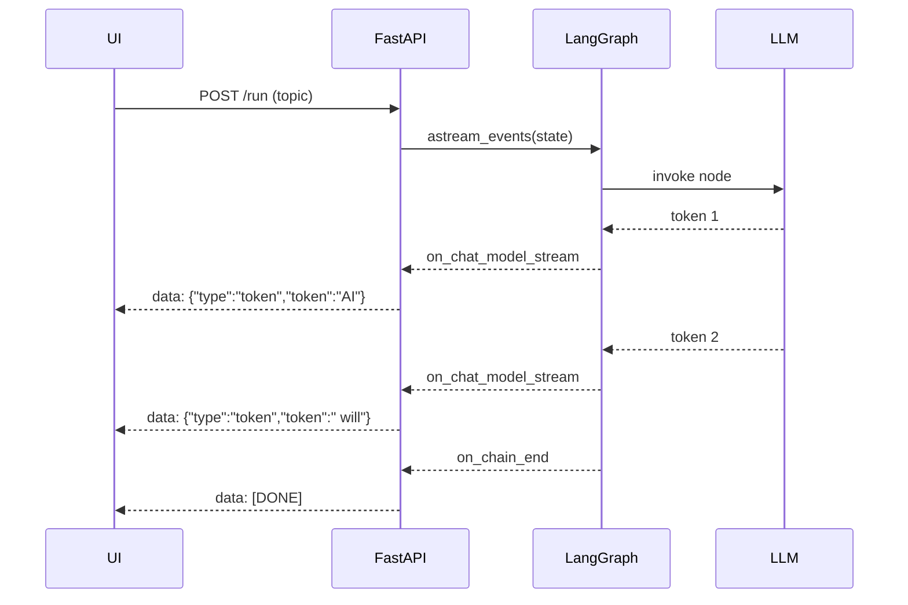
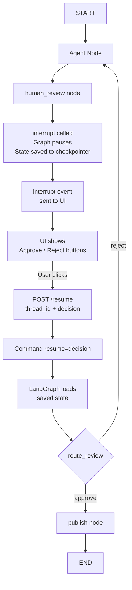
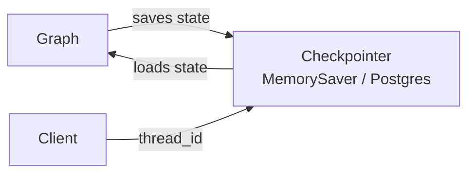

# Streaming & Human-in-the-Loop

> **Phase 4 — Other Concepts** | Estimated study time: **3–4 hours**  
> Prerequisites: Phase 3 (Multi-Agent Systems), LangGraph basics (Phase 4 `04_agent_frameworks.md`)

---

## Table of Contents

1. [Simple Explanation](#1-simple-explanation)
2. [Why It Matters](#2-why-it-matters)
3. [Internal Working](#3-internal-working)
4. [Real-World Use Cases](#4-real-world-use-cases)
5. [Common Beginner Mistakes](#5-common-beginner-mistakes)
6. [Best Practices](#6-best-practices)
7. [Python Examples](#7-python-examples)
8. [Diagrams](#8-diagrams)

---

## 1. Simple Explanation

### Streaming
Instead of waiting for the entire LLM response to be generated before sending it to the client, **streaming sends tokens one by one as they are produced**. The UI updates in real time — like watching someone type rather than waiting for a full message to appear.

### Human-in-the-Loop
A pattern where the **graph pauses mid-execution and waits for a human decision** before continuing. Instead of the agent running fully autonomously, a human gets to review and approve at critical checkpoints.

| Concept | Core Idea | Best For |
|---|---|---|
| **Streaming** | Send tokens as they arrive, not after full generation | Live UIs, long LLM responses, better perceived performance |
| **Human-in-the-Loop** | Pause graph, get human input, resume | High-stakes decisions, content review, approval workflows |

---

## 2. Why It Matters

**Without streaming**: User clicks a button, stares at a spinner for 10–30 seconds, then sees the full response appear at once. Feels slow and unresponsive.

**With streaming**: User sees tokens appearing immediately — feels fast even if total time is the same.

**Without human-in-the-loop**: Agents run fully autonomously. One bad decision cascades through the entire workflow with no chance to intervene.

**With human-in-the-loop**: Humans stay in control at critical points. The agent does the heavy lifting but humans approve before irreversible actions.

---

## 3. Internal Working

### Streaming

LangGraph's `astream_events` emits a stream of fine-grained events as the graph runs:

```
on_chain_start      → a graph node has started
on_chat_model_stream → LLM produced one token
on_chain_end        → a graph node has finished
```

These events are sent to the client using **SSE (Server-Sent Events)** — a simple HTTP protocol where the server keeps the connection open and pushes data as it becomes available:

```
data: {"type": "label", "text": "Pro Agent is presenting..."}

data: {"type": "token", "token": "AI will"}

data: {"type": "token", "token" : " create"}

data: [DONE]
```

The frontend reads this stream using the Fetch API's `ReadableStream`:

```
fetch → res.body.getReader() → read() in a loop → parse SSE lines → update UI
```

> **`astream_events` vs `astream`**: `astream` gives full node output snapshots after each node completes. `astream_events` gives token-level events in real time. Use `astream_events` when you need live token streaming.

### Human-in-the-Loop

Requires three components working together:

**1. Checkpointer** — saves graph state so it can be resumed later:
```
MemorySaver → in-memory (dev/testing)
SqliteSaver → file-based persistence
PostgresSaver → production persistence
```

**2. `interrupt()`** — pauses the graph inside a node:
```
graph runs → hits interrupt() → saves state to checkpointer → stream ends
```

**3. `Command(resume=...)`** — resumes the graph from where it paused:
```
client sends decision → Command(resume="continue") → graph loads state → continues from interrupt()
```

The `thread_id` is the key that links the paused state to the resume request. Without the same `thread_id`, the graph cannot find its saved state.

**Detecting the pause**: `astream_events` silently ends when it hits an interrupt — it does NOT raise an exception. After the stream loop ends, check the graph state:

```python
state = await graph.aget_state(config)
if state.next and state.tasks:
    # graph is paused at an interrupt
```

---

## 4. Real-World Use Cases

### Streaming
- **Chat interfaces**: Show LLM responses token by token (ChatGPT-style)
- **Long document generation**: User sees progress instead of waiting
- **Multi-agent pipelines**: Show which agent is currently running and what it's saying
- **Debate/discussion systems**: Watch arguments being constructed in real time

### Human-in-the-Loop
- **Content approval**: Agent drafts content → human approves before publishing
- **Financial transactions**: Agent prepares a trade → human confirms before execution
- **Code deployment**: Agent prepares a deployment → human reviews before applying
- **Medical triage**: Agent suggests a diagnosis → doctor confirms before treatment plan
- **Debate moderation**: Agent runs debate rounds → human decides whether to continue or redo

---

## 5. Common Beginner Mistakes

**Mistake 1: Using `get_state` (sync) inside async context**
```python
# ❌ BAD — blocks the event loop
state = graph.get_state(config)

# ✅ GOOD — async version
state = await graph.aget_state(config)
```

**Mistake 2: Forgetting the checkpointer**
```python
# ❌ BAD — interrupt() will fail without a checkpointer
graph.compile()

# ✅ GOOD
graph.compile(checkpointer=MemorySaver())
```

**Mistake 3: Using a new thread_id on resume**
```python
# ❌ BAD — creates a new thread, can't find the paused state
config = {"configurable": {"thread_id": str(uuid.uuid4())}}  # new ID on resume

# ✅ GOOD — same thread_id from the original run
config = {"configurable": {"thread_id": original_thread_id}}
```

**Mistake 4: Passing state instead of Command on resume**
```python
# ❌ BAD — passing full state re-runs from scratch
graph.astream_events(full_state, config=config)

# ✅ GOOD — Command tells LangGraph to resume the interrupted node
from langgraph.types import Command
graph.astream_events(Command(resume="continue"), config=config)
```

**Mistake 5: Listening for `on_interrupt` event**
```python
# ❌ BAD — this event does not exist in astream_events
if kind == "on_interrupt":
    ...

# ✅ GOOD — check graph state after stream ends
state = await graph.aget_state(config)
if state.next and state.tasks:
    # paused at interrupt
```

---

## 6. Best Practices

1. **Streaming**: Always set `X-Accel-Buffering: no` and `Cache-Control: no-cache` headers — proxies and CDNs buffer SSE by default
2. **Streaming**: Send a `[DONE]` sentinel at the end so the client knows the stream is complete
3. **Streaming**: Handle partial JSON in the SSE buffer — network packets can split lines mid-event
4. **Human-in-the-Loop**: Use `MemorySaver` for development, switch to a persistent checkpointer for production
5. **Human-in-the-Loop**: Always include a timeout — don't let interrupted graphs wait forever
6. **Human-in-the-Loop**: Store `thread_id` on the client side (state, localStorage) so it survives page refreshes
7. **Human-in-the-Loop**: Add a guard in routing functions — if `human_decision` is unexpected, default to a safe path

---

## 7. Python Examples

### Example 1: Streaming with `astream_events`

```python
"""
Stream LLM tokens from a LangGraph node in real time using astream_events.
"""
import asyncio
import os
from typing import TypedDict
from langgraph.graph import StateGraph, START, END
from langchain_google_genai import ChatGoogleGenerativeAI
from langchain_core.messages import SystemMessage, HumanMessage
from dotenv import load_dotenv

load_dotenv()

llm = ChatGoogleGenerativeAI(
    model=os.getenv("GEMINI_MODEL", "gemini-2.0-flash-lite"),
    streaming=True,
)


class State(TypedDict):
    topic: str
    essay: str


def write_essay_node(state: State) -> dict:
    response = llm.invoke([
        SystemMessage(content="You are a concise essay writer."),
        HumanMessage(content=f"Write a 3-paragraph essay on: {state['topic']}"),
    ])
    return {"essay": response.content}


graph = StateGraph(State)
graph.add_node("write_essay", write_essay_node)
graph.add_edge(START, "write_essay")
graph.add_edge("write_essay", END)
app = graph.compile()


async def stream_essay(topic: str):
    config = {"configurable": {}}
    print(f"Streaming essay on: {topic}\n")
    print("-" * 40)

    async for event in app.astream_events({"topic": topic, "essay": ""}, config=config, version="v2"):
        kind = event["event"]
        name = event.get("name", "")

        if kind == "on_chain_start" and name == "write_essay":
            print("[Node started: write_essay]")

        elif kind == "on_chat_model_stream":
            token = event["data"]["chunk"].content
            if token:
                print(token, end="", flush=True)

        elif kind == "on_chain_end" and name == "write_essay":
            print("\n[Node finished: write_essay]")

    print("-" * 40)


asyncio.run(stream_essay("The impact of AI on software development"))
```

### Example 2: Human-in-the-Loop with `interrupt()`

```python
"""
Human-in-the-loop pattern — graph pauses for human approval before continuing.
Uses MemorySaver checkpointer and Command(resume=...) to resume.
"""
import asyncio
import uuid
import os
from typing import TypedDict
from langgraph.graph import StateGraph, START, END
from langgraph.checkpoint.memory import MemorySaver
from langgraph.types import interrupt, Command
from langchain_google_genai import ChatGoogleGenerativeAI
from langchain_core.messages import SystemMessage, HumanMessage
from dotenv import load_dotenv

load_dotenv()

llm = ChatGoogleGenerativeAI(model=os.getenv("GEMINI_MODEL", "gemini-2.0-flash-lite"))


class State(TypedDict):
    topic: str
    draft: str
    feedback: str
    final: str


def draft_node(state: State) -> dict:
    response = llm.invoke([
        SystemMessage(content="Write a short 2-sentence summary."),
        HumanMessage(content=state["topic"]),
    ])
    return {"draft": response.content}


def human_review_node(state: State) -> dict:
    # Graph pauses here — waits for human input
    feedback = interrupt(f"Review this draft:\n\n{state['draft']}\n\nApprove or provide feedback:")
    return {"feedback": feedback}


def route_review(state: State) -> str:
    return "publish" if state["feedback"].lower() == "approve" else "draft"


def publish_node(state: State) -> dict:
    return {"final": state["draft"]}


def revise_node(state: State) -> dict:
    response = llm.invoke([
        SystemMessage(content="Revise the draft based on feedback."),
        HumanMessage(content=f"Draft: {state['draft']}\n\nFeedback: {state['feedback']}"),
    ])
    return {"draft": response.content}


# Build graph
graph = StateGraph(State)
graph.add_node("draft", draft_node)
graph.add_node("human_review", human_review_node)
graph.add_node("publish", publish_node)
graph.add_node("revise", revise_node)

graph.add_edge(START, "draft")
graph.add_edge("draft", "human_review")
graph.add_conditional_edges("human_review", route_review)
graph.add_edge("publish", END)
graph.add_edge("revise", "human_review")  # loop back for another review

app = graph.compile(checkpointer=MemorySaver())


async def run():
    thread_id = str(uuid.uuid4())
    config = {"configurable": {"thread_id": thread_id}}

    # ── Run until interrupt ──────────────────────────
    print("Running graph...")
    async for event in app.astream_events(
        {"topic": "Benefits of test-driven development", "draft": "", "feedback": "", "final": ""},
        config=config,
        version="v2",
    ):
        if event["event"] == "on_chain_end" and event["name"] == "draft":
            output = event["data"].get("output", {})
            print(f"\nDraft generated:\n{output.get('draft', '')}\n")

    # Check if paused
    state = await app.aget_state(config)
    if state.next:
        print("Graph paused at human_review.")
        print("Simulating human decision: 'approve'")

        # ── Resume with human decision ───────────────
        async for event in app.astream_events(
            Command(resume="approve"),
            config=config,
            version="v2",
        ):
            if event["event"] == "on_chain_end" and event["name"] == "publish":
                output = event["data"].get("output", {})
                print(f"\nPublished:\n{output.get('final', '')}")


asyncio.run(run())
```

### Example 3: SSE Streaming with FastAPI

```python
"""
Stream LangGraph events to a browser client using Server-Sent Events (SSE).
"""
import json
import uuid
import asyncio
from typing import TypedDict
from fastapi import FastAPI
from fastapi.responses import StreamingResponse
from langgraph.graph import StateGraph, START, END
from langgraph.checkpoint.memory import MemorySaver
from langgraph.types import interrupt, Command
from langchain_google_genai import ChatGoogleGenerativeAI
from langchain_core.messages import SystemMessage, HumanMessage
from pydantic import BaseModel

llm = ChatGoogleGenerativeAI(model="gemini-2.0-flash-lite", streaming=True)


class State(TypedDict):
    prompt: str
    result: str
    human_decision: str


def generate_node(state: State) -> dict:
    response = llm.invoke([
        SystemMessage(content="You are a helpful assistant."),
        HumanMessage(content=state["prompt"]),
    ])
    return {"result": response.content}


def review_node(state: State) -> dict:
    decision = interrupt("Review complete. Continue or redo?")
    return {"human_decision": decision}


def route_review(state: State) -> str:
    return "END" if state["human_decision"] == "continue" else "generate"


graph = StateGraph(State)
graph.add_node("generate", generate_node)
graph.add_node("review", review_node)
graph.add_edge(START, "generate")
graph.add_edge("generate", "review")
graph.add_conditional_edges("review", route_review, {"END": END, "generate": "generate"})
app_graph = graph.compile(checkpointer=MemorySaver())

app = FastAPI()

AGENT_NODES = {"generate"}


async def stream_graph(config: dict, input_or_command):
    async for event in app_graph.astream_events(input_or_command, config=config, version="v2"):
        kind = event["event"]
        name = event.get("name", "")

        if kind == "on_chain_start" and name in AGENT_NODES:
            yield f"data: {json.dumps({'type': 'status', 'text': f'Running {name}...'})}\\n\\n"

        elif kind == "on_chat_model_stream" and name in AGENT_NODES:
            token = event["data"]["chunk"].content
            if token:
                yield f"data: {json.dumps({'type': 'token', 'token': token})}\\n\\n"

    # Check for interrupt after stream ends
    state = await app_graph.aget_state(config)
    if state.next and state.tasks:
        thread_id = config["configurable"]["thread_id"]
        yield f"data: {json.dumps({'type': 'interrupt', 'thread_id': thread_id})}\\n\\n"

    yield "data: [DONE]\\n\\n"


class RunRequest(BaseModel):
    prompt: str


class ResumeRequest(BaseModel):
    thread_id: str
    decision: str


@app.post("/run")
async def run(request: RunRequest):
    thread_id = str(uuid.uuid4())
    config = {"configurable": {"thread_id": thread_id}}
    initial = {"prompt": request.prompt, "result": "", "human_decision": ""}
    return StreamingResponse(
        stream_graph(config, initial),
        media_type="text/event-stream",
        headers={"X-Accel-Buffering": "no", "Cache-Control": "no-cache"},
    )


@app.post("/resume")
async def resume(request: ResumeRequest):
    config = {"configurable": {"thread_id": request.thread_id}}
    command = Command(resume=request.decision)
    return StreamingResponse(
        stream_graph(config, command),
        media_type="text/event-stream",
        headers={"X-Accel-Buffering": "no", "Cache-Control": "no-cache"},
    )
```

---

## 8. Diagrams

### Streaming Flow



### Human-in-the-Loop Flow



### Checkpointer Role



---

**Previous**: [09_mcp_a2a_protocols.md](./09_mcp_a2a_protocols.md)


# 10. Streaming & Human-in-the-Loop

## 1. Streaming

### What is Streaming?
Instead of waiting for the entire LLM response before sending it to the client, streaming sends tokens one by one as they are produced. This makes the UI feel live and responsive.

### How it works in LangGraph

**`astream_events`**
Emits fine-grained events as the graph runs:

```python
async for event in graph.astream_events(initial_state, config=config, version="v2"):
    kind = event["event"]   # on_chain_start, on_chat_model_stream, on_chain_end
    name = event["name"]    # node name e.g. pro_opening, moderator
```

Key events:
| Event | When | Usage |
|---|---|---|
| `on_chain_start` | A graph node begins | Send label to UI |
| `on_chat_model_stream` | LLM produces a token | Send token to UI |
| `on_chain_end` | A node finishes | Send final result to UI |

> Use `astream_events` over `astream` when you need token-level streaming. `astream` only gives full node output snapshots.

**SSE (Server-Sent Events)**
FastAPI streams events using `StreamingResponse`:

```python
return StreamingResponse(event_generator(), media_type="text/event-stream")
```

Each event is formatted as:
```
data: {"type": "token", "token": "AI will..."}

```

**Frontend — Reading the stream**
```js
const reader = res.body.getReader()
while (true) {
    const { done, value } = await reader.read()
    if (done) break
    // parse SSE lines and handle events
}
```

Event types handled in UI:
- `label` → update status bar, create a new argument card
- `token` → append to the last card's text
- `result` → show the moderator verdict
- `interrupt` → show human review buttons

---

## 2. Human-in-the-Loop

### What is Human-in-the-Loop?
A pattern where the graph pauses mid-execution and waits for a human decision before continuing. Gives humans control over critical decision points in an agentic workflow.

### Step 1 — Checkpointer
The graph must use a checkpointer to save state when it pauses:

```python
from langgraph.checkpoint.memory import MemorySaver
graph.compile(checkpointer=MemorySaver())
```

Each run needs a unique `thread_id`:

```python
config = {"configurable": {"thread_id": str(uuid.uuid4())}}
graph.astream_events(initial_state, config=config)
```

### Step 2 — `interrupt()`
Call `interrupt()` inside a node to pause the graph:

```python
from langgraph.types import interrupt

def human_review_node(state):
    decision = interrupt("Closing complete. Continue or redo?")
    return {"human_decision": decision}
```

The graph saves its state to the checkpointer and stops. The value passed to `interrupt()` is the payload for the human.

### Step 3 — Detecting the pause
`astream_events` silently ends when it hits an interrupt — it does NOT raise an exception. After the stream loop ends, check the graph state:

```python
state = await graph.aget_state(config)
if state.next and state.tasks:
    # graph is paused — send interrupt event to UI
```

> Always use `aget_state` (async) inside async context, never the sync `get_state`.

### Step 4 — Resuming
Resume by passing `Command(resume=value)` as input with the same `thread_id`:

```python
from langgraph.types import Command
command = Command(resume="continue")  # or "redo"
graph.astream_events(command, config=config)
```

LangGraph reads saved state from the checkpointer, injects the resume value into `interrupt()`, and continues from where it paused.

### Full flow in the Debate project

```
con_closing
    ↓
human_review  ← graph pauses here
    ↓ (interrupt event sent to UI)
UI shows: [✅ Continue to Verdict]  [🔁 Redo Closing Round]
    ↓ (user clicks)
POST /debate/resume  { thread_id, decision }
    ↓
Command(resume="continue") or Command(resume="redo")
    ↓
route_human_decision → "moderator" or "pro_closing"
```

### Key rules
- Always use a checkpointer — without it `interrupt()` will fail
- Always pass the same `thread_id` when resuming
- `Command(resume=...)` is passed as the **input** to `astream_events`, not as config
- `aget_state` is async — always `await` it

