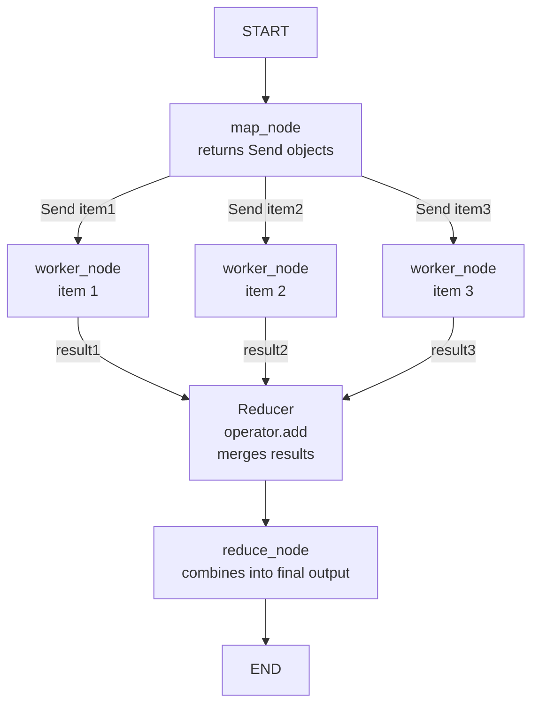
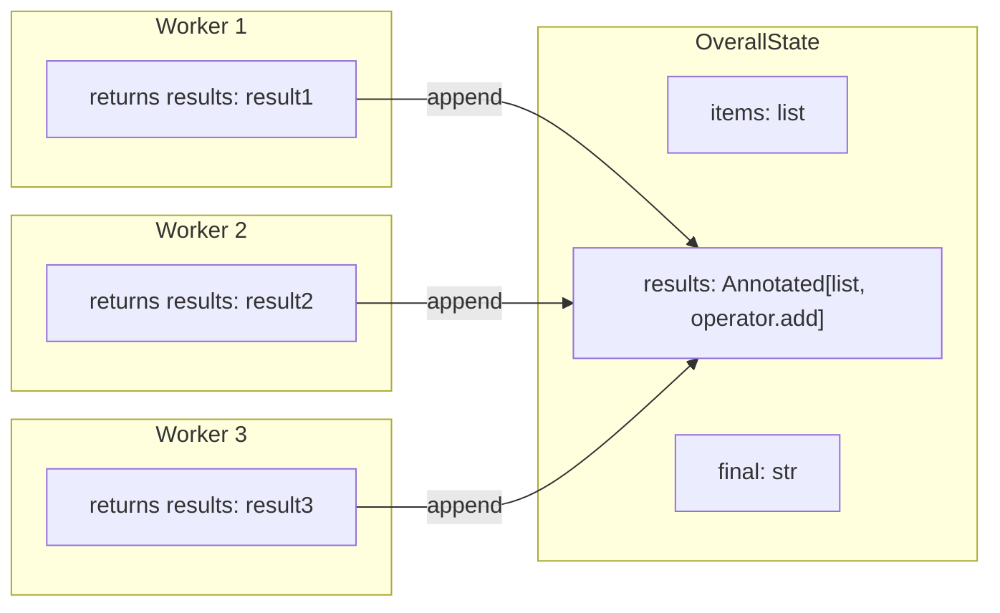
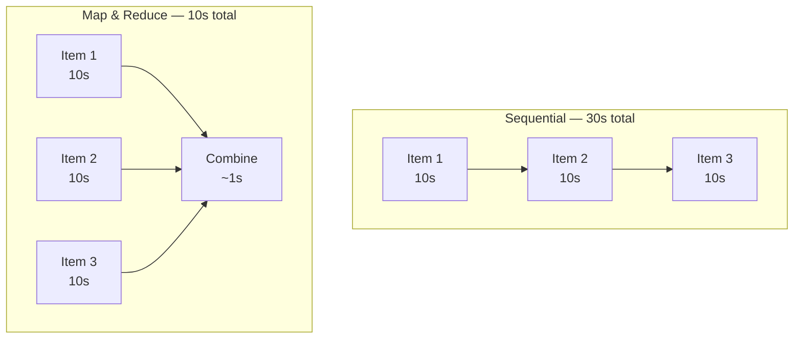
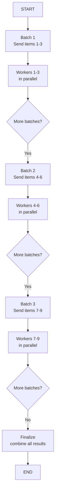

# Map & Reduce in Agentic Systems

> **Phase 4 — Other Concepts** | Estimated study time: **3–4 hours**  
> Prerequisites: Phase 3 (Multi-Agent Systems), LangGraph basics (Phase 4 `04_agent_frameworks.md`)

---

## Table of Contents

1. [Simple Explanation](#1-simple-explanation)
2. [Why It Matters](#2-why-it-matters)
3. [Internal Working](#3-internal-working)
4. [Real-World Use Cases](#4-real-world-use-cases)
5. [Common Beginner Mistakes](#5-common-beginner-mistakes)
6. [Best Practices](#6-best-practices)
7. [Python Examples](#7-python-examples)
8. [Diagrams](#8-diagrams)

---

## 1. Simple Explanation

**Map & Reduce** is a pattern for processing large amounts of work in parallel and then combining the results.

- **Map** — split a big task into smaller independent subtasks and run them all at the same time
- **Reduce** — collect all the results and combine them into a single final output

Think of it like a team of researchers:
- **Map**: Give each researcher one chapter of a book to summarize (parallel work)
- **Reduce**: One person reads all summaries and writes a single overall summary (combine)

In LangGraph, this is implemented using `Send` — which dynamically spawns parallel graph executions — and a reducer function on the state that merges results as they arrive.

---

## 2. Why It Matters

Without Map & Reduce, agents process things **sequentially** — one item at a time:

```
Document 1 → LLM → wait → Document 2 → LLM → wait → Document 3 → LLM → wait → combine
Total time: 30 seconds
```

With Map & Reduce, agents process things **in parallel**:

```
Document 1 → LLM ↘
Document 2 → LLM → combine
Document 3 → LLM ↗
Total time: 10 seconds
```

Same work, 3x faster. For 100 documents the difference is enormous.

Beyond speed, Map & Reduce also enables:
- Processing inputs of **unknown size** — you don't need to know how many items there are upfront
- **Dynamic branching** — the number of parallel workers is determined at runtime, not hardcoded in the graph

---

## 3. Internal Working

### `Send` — the Map primitive

In LangGraph, `Send` is what triggers parallel execution. Instead of routing to a single next node, you return a list of `Send` objects — one per item — each carrying its own state:

```python
from langgraph.types import Send

def map_node(state):
    # Dynamically create one parallel execution per item
    return [Send("worker_node", {"item": item}) for item in state["items"]]
```

LangGraph spawns all worker nodes simultaneously. Each runs independently with its own slice of state.

### Reducer — the Reduce primitive

A reducer is a function that tells LangGraph how to **merge** results from parallel workers back into the shared state. It's defined using `Annotated` on the state field:

```python
from typing import Annotated
import operator

class State(TypedDict):
    items: list[str]
    results: Annotated[list[str], operator.add]  # append each result to the list
```

`operator.add` on a list means: every time a worker writes to `results`, append it to the existing list rather than overwriting it. Without a reducer, parallel workers would overwrite each other's results.

### Full flow

```
1. map_node runs → returns [Send("worker", {item1}), Send("worker", {item2}), Send("worker", {item3})]
2. LangGraph spawns 3 parallel worker_node executions
3. Each worker processes its item and writes to state["results"]
4. Reducer (operator.add) merges: results = [result1, result2, result3]
5. reduce_node runs once all workers finish → reads state["results"] → combines
```

### `add_conditional_edges` with `Send`

`Send` is returned from a conditional edge function:

```python
graph.add_conditional_edges("map_node", map_fn)

def map_fn(state):
    return [Send("worker_node", {"item": item}) for item in state["items"]]
```

LangGraph sees a list of `Send` objects and knows to run them all in parallel.

---

## 4. Real-World Use Cases

| Use Case | Map | Reduce |
|---|---|---|
| **Document summarization** | Summarize each document in parallel | Combine all summaries into one |
| **Multi-source research** | Query each data source simultaneously | Merge all findings into a report |
| **Code review** | Review each file in parallel | Aggregate all issues into a final report |
| **Debate analysis** | Analyze each argument independently | Score and rank all arguments |
| **Product catalog** | Generate description for each product | Compile into a formatted catalog |
| **Test generation** | Generate tests for each function in parallel | Collect all tests into a test suite |

---

## 5. Common Beginner Mistakes

**Mistake 1: Forgetting the reducer — parallel workers overwrite each other**
```python
# ❌ BAD — no reducer, last worker wins
class State(TypedDict):
    results: list[str]  # workers overwrite each other

# ✅ GOOD — reducer merges all results
class State(TypedDict):
    results: Annotated[list[str], operator.add]
```

**Mistake 2: Returning a single node name instead of Send objects**
```python
# ❌ BAD — routes to one node, not parallel
def map_fn(state):
    return "worker_node"

# ✅ GOOD — returns Send objects for parallel execution
def map_fn(state):
    return [Send("worker_node", {"item": item}) for item in state["items"]]
```

**Mistake 3: Putting shared mutable state in worker nodes**
```python
# ❌ BAD — workers share a counter, race condition
def worker_node(state):
    state["counter"] += 1  # multiple workers writing to same field

# ✅ GOOD — each worker writes only to its own result
def worker_node(state):
    return {"results": [process(state["item"])]}  # reducer handles merging
```

**Mistake 4: Assuming results arrive in order**
```python
# ❌ BAD — assuming results[0] corresponds to items[0]
final = state["results"][0]  # could be any worker's result

# ✅ GOOD — include item identifier in the result
def worker_node(state):
    return {"results": [{"item": state["item"], "result": process(state["item"])}]}
```

**Mistake 5: Using Map & Reduce for sequential tasks**
```python
# ❌ BAD — step 2 depends on step 1's output, can't parallelize
[Send("step1", item), Send("step2", item)]  # step2 needs step1's result

# ✅ GOOD — Map & Reduce only for INDEPENDENT tasks
# If tasks depend on each other, use a sequential pipeline instead
```

---

## 6. Best Practices

1. **Only map independent tasks** — if worker B needs worker A's output, use sequential nodes instead
2. **Always define a reducer** for any state field that parallel workers write to
3. **Include item identity in results** — tag each result with its source item so reduce can correlate them
4. **Cap parallelism for API rate limits** — spawning 1000 workers simultaneously will hit LLM rate limits; batch with `Send` in chunks
5. **Keep worker nodes focused** — each worker should do one thing; complex logic belongs in the reduce step
6. **Handle worker failures gracefully** — one failed worker shouldn't crash the entire map; use try/except inside worker nodes
7. **Use `operator.add` for lists, custom reducers for dicts** — know which reducer matches your data structure

---

## 7. Python Examples

### Example 1: Basic Map & Reduce — Summarize Multiple Documents

```python
"""
Map & Reduce — summarize multiple documents in parallel, then combine.
Each document is processed by a separate worker node simultaneously.
"""
import os
import operator
from typing import Annotated, TypedDict
from langgraph.graph import StateGraph, START, END
from langgraph.types import Send
from langchain_google_genai import ChatGoogleGenerativeAI
from langchain_core.messages import SystemMessage, HumanMessage
from dotenv import load_dotenv

load_dotenv()

llm = ChatGoogleGenerativeAI(model=os.getenv("GEMINI_MODEL", "gemini-2.0-flash-lite"))


# ── State ─────────────────────────────────────────────

class OverallState(TypedDict):
    documents: list[str]                              # input: list of documents
    summaries: Annotated[list[str], operator.add]     # reducer: append each summary
    final_summary: str                                # output: combined summary


class WorkerState(TypedDict):
    document: str                                     # one document per worker


# ── Nodes ─────────────────────────────────────────────

def summarize_node(state: WorkerState) -> dict:
    """Worker node — summarizes one document. Runs in parallel."""
    response = llm.invoke([
        SystemMessage(content="Summarize the following text in 1-2 sentences."),
        HumanMessage(content=state["document"]),
    ])
    return {"summaries": [response.content]}


def combine_node(state: OverallState) -> dict:
    """Reduce node — combines all summaries into one final summary."""
    all_summaries = "\n".join(f"- {s}" for s in state["summaries"])
    response = llm.invoke([
        SystemMessage(content="Combine these summaries into one cohesive paragraph."),
        HumanMessage(content=all_summaries),
    ])
    return {"final_summary": response.content}


# ── Map function — spawns one worker per document ─────

def map_documents(state: OverallState):
    """Returns a Send for each document — triggers parallel execution."""
    return [Send("summarize", {"document": doc}) for doc in state["documents"]]


# ── Graph ─────────────────────────────────────────────

graph = StateGraph(OverallState)
graph.add_node("summarize", summarize_node)
graph.add_node("combine", combine_node)

graph.add_conditional_edges(START, map_documents)   # map: fan out
graph.add_edge("summarize", "combine")              # reduce: fan in
graph.add_edge("combine", END)

app = graph.compile()


# ── Run ───────────────────────────────────────────────

documents = [
    "LangGraph is a library for building stateful multi-agent systems. It uses a graph structure where nodes are agent functions and edges define the flow between them.",
    "RAG (Retrieval-Augmented Generation) combines a retrieval system with an LLM. The retrieval system finds relevant documents, which are then passed as context to the LLM.",
    "Vector databases store embeddings — numerical representations of text. They enable similarity search, finding documents that are semantically similar to a query.",
]

result = app.invoke({"documents": documents, "summaries": [], "final_summary": ""})

print("Individual summaries:")
for i, s in enumerate(result["summaries"], 1):
    print(f"  {i}. {s}")

print(f"\nFinal combined summary:\n{result['final_summary']}")
```

### Example 2: Map & Reduce with Item Identity — Parallel Code Review

```python
"""
Map & Reduce with item identity — review multiple code files in parallel.
Each result is tagged with its filename so the reduce step can correlate them.
"""
import os
import operator
from typing import Annotated, TypedDict
from pydantic import BaseModel, Field
from langgraph.graph import StateGraph, START, END
from langgraph.types import Send
from langchain_google_genai import ChatGoogleGenerativeAI
from langchain_core.messages import SystemMessage, HumanMessage
from dotenv import load_dotenv

load_dotenv()

llm = ChatGoogleGenerativeAI(model=os.getenv("GEMINI_MODEL", "gemini-2.0-flash-lite"))


# ── Schemas ───────────────────────────────────────────

class CodeFile(BaseModel):
    filename: str
    code: str


class ReviewResult(BaseModel):
    filename: str
    issues: list[str] = Field(description="List of issues found")
    severity: str = Field(description="overall: low | medium | high")


# ── State ─────────────────────────────────────────────

class OverallState(TypedDict):
    files: list[dict]
    reviews: Annotated[list[dict], operator.add]   # reducer appends each review
    report: str


class WorkerState(TypedDict):
    filename: str
    code: str


# ── Nodes ─────────────────────────────────────────────

_review_llm = llm.with_structured_output(ReviewResult)


def review_node(state: WorkerState) -> dict:
    """Worker — reviews one file. Runs in parallel with other workers."""
    result = _review_llm.invoke([
        SystemMessage(content="You are a code reviewer. Identify issues in the code."),
        HumanMessage(content=f"File: {state['filename']}\n\n```python\n{state['code']}\n```"),
    ])
    return {"reviews": [result.model_dump()]}


def report_node(state: OverallState) -> dict:
    """Reduce — aggregates all reviews into a final report."""
    lines = ["# Code Review Report\n"]
    for review in state["reviews"]:
        lines.append(f"## {review['filename']} — Severity: {review['severity']}")
        for issue in review["issues"]:
            lines.append(f"  - {issue}")
        lines.append("")
    return {"report": "\n".join(lines)}


# ── Map function ──────────────────────────────────────

def map_files(state: OverallState):
    return [Send("review", {"filename": f["filename"], "code": f["code"]}) for f in state["files"]]


# ── Graph ─────────────────────────────────────────────

graph = StateGraph(OverallState)
graph.add_node("review", review_node)
graph.add_node("report", report_node)

graph.add_conditional_edges(START, map_files)
graph.add_edge("review", "report")
graph.add_edge("report", END)

app = graph.compile()


# ── Run ───────────────────────────────────────────────

files = [
    {
        "filename": "auth.py",
        "code": "def login(user, pwd):\n    if user == 'admin' and pwd == 'password123':\n        return True",
    },
    {
        "filename": "api.py",
        "code": "def get_user(id):\n    query = f'SELECT * FROM users WHERE id = {id}'\n    return db.execute(query)",
    },
    {
        "filename": "utils.py",
        "code": "def divide(a, b):\n    return a / b",
    },
]

result = app.invoke({"files": files, "reviews": [], "report": ""})
print(result["report"])
```

### Example 3: Batched Map — Handling Rate Limits

```python
"""
Batched Map & Reduce — process items in parallel but in controlled batches
to avoid hitting LLM API rate limits.
"""
import os
import operator
import asyncio
from typing import Annotated, TypedDict
from langgraph.graph import StateGraph, START, END
from langgraph.types import Send
from langchain_google_genai import ChatGoogleGenerativeAI
from langchain_core.messages import SystemMessage, HumanMessage
from dotenv import load_dotenv

load_dotenv()

llm = ChatGoogleGenerativeAI(model=os.getenv("GEMINI_MODEL", "gemini-2.0-flash-lite"))

BATCH_SIZE = 3  # process 3 items at a time


class OverallState(TypedDict):
    topics: list[str]
    batch_index: int
    results: Annotated[list[str], operator.add]
    final: str


class WorkerState(TypedDict):
    topic: str


def generate_node(state: WorkerState) -> dict:
    """Worker — generates a one-liner for a topic."""
    response = llm.invoke([
        SystemMessage(content="Write one sentence about this topic."),
        HumanMessage(content=state["topic"]),
    ])
    return {"results": [f"{state['topic']}: {response.content}"]}


def map_batch(state: OverallState):
    """Map only the current batch — controls parallelism."""
    start = state["batch_index"] * BATCH_SIZE
    batch = state["topics"][start: start + BATCH_SIZE]
    return [Send("generate", {"topic": topic}) for topic in batch]


def sync_node(state: OverallState) -> dict:
    """Sync point — waits for all workers in the batch to finish, then advances index."""
    return {"batch_index": state["batch_index"] + 1}


def route_after_sync(state: OverallState) -> str:
    """After advancing index, check if more batches remain."""
    if state["batch_index"] * BATCH_SIZE < len(state["topics"]):
        return "map_batch"
    return "finalize"


def finalize_node(state: OverallState) -> dict:
    return {"final": "\n".join(state["results"])}


graph = StateGraph(OverallState)
graph.add_node("generate", generate_node)
graph.add_node("sync", sync_node)
graph.add_node("finalize", finalize_node)

graph.add_conditional_edges(START, map_batch)
graph.add_edge("generate", "sync")              # all workers converge here
graph.add_conditional_edges("sync", route_after_sync, {
    "map_batch": START,
    "finalize": "finalize",
})
graph.add_edge("finalize", END)

app = graph.compile()

topics = [
    "machine learning", "neural networks", "transformers",
    "reinforcement learning", "computer vision", "NLP",
    "LangGraph", "vector databases", "RAG",
]

result = app.invoke({"topics": topics, "batch_index": 0, "results": [], "final": ""})
print(result["final"])
```

---

## 8. Diagrams

### Map & Reduce Flow



### State with Reducer



### Sequential vs Parallel



### Batched Map for Rate Limiting



---

**Previous**: [10_streaming_and_human_in_the_loop.md](./10_streaming_and_human_in_the_loop.md)  
**Back to Phase 4**: [README.md](./README.md)
