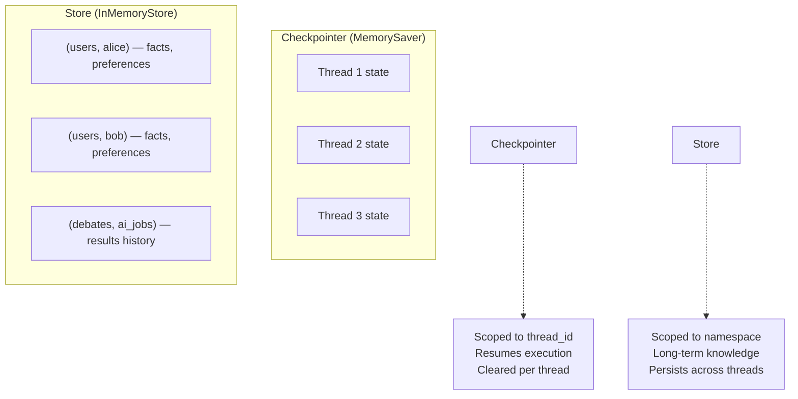
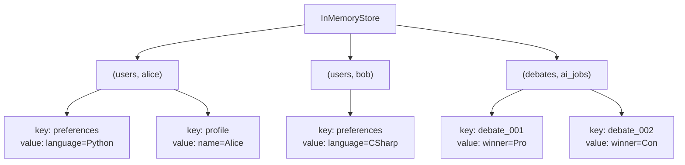
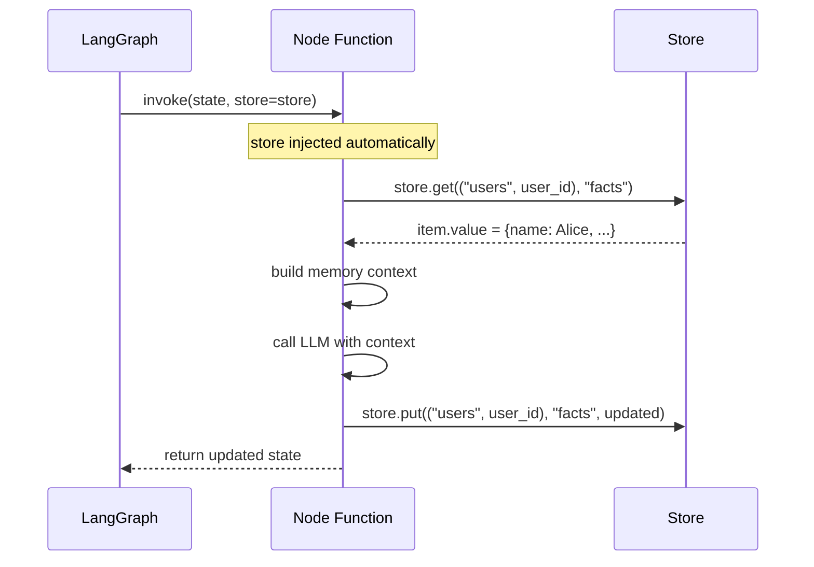
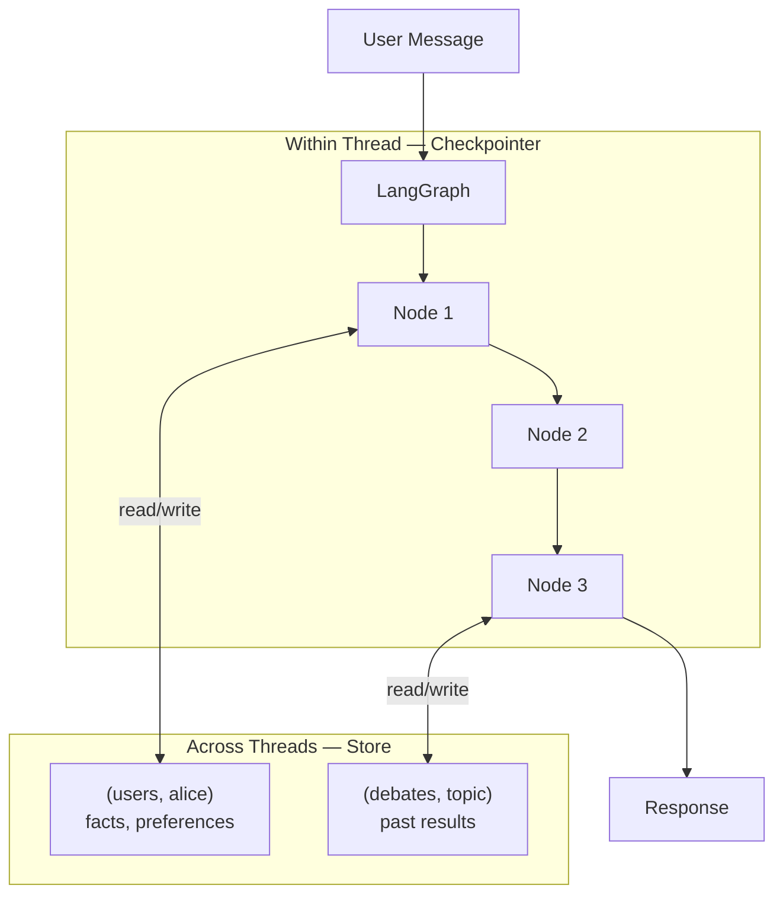

# Long-Term Memory with LangGraph Store

> **Phase 4 — Other Concepts** | Estimated study time: **3–4 hours**  
> Prerequisites: Memory in Agents (`03_memory_in_agents.md`), LangGraph basics (`04_agent_frameworks.md`)

---

## Table of Contents

1. [Simple Explanation](#1-simple-explanation)
2. [Why It Matters](#2-why-it-matters)
3. [Internal Working](#3-internal-working)
4. [Real-World Use Cases](#4-real-world-use-cases)
5. [Common Beginner Mistakes](#5-common-beginner-mistakes)
6. [Best Practices](#6-best-practices)
7. [Python Examples](#7-python-examples)
8. [.NET / C# Equivalent Explanation](#8-net--c-equivalent-explanation)
9. [Diagrams](#9-diagrams)

---

## 1. Simple Explanation

**LangGraph Store** is LangGraph's built-in long-term memory system. It gives agents a persistent key-value store that survives across graph runs, threads, and sessions.

Think of it as the difference between:
- **Checkpointer** (`MemorySaver`) — saves the graph's execution state so it can be resumed. Like saving a game mid-level.
- **Store** — saves information the agent wants to remember for future conversations. Like a notebook the agent writes in and reads from.

```
Checkpointer:  "Where was I in the graph?"      → resumes execution
Store:         "What do I know about this user?" → long-term knowledge
```

The Store is organized using **namespaces** (like folders) and **keys** (like filenames):

```
namespace: ("users", "alice")    key: "preferences"   value: {"language": "Python", "timezone": "PST"}
namespace: ("users", "alice")    key: "projects"      value: [{"name": "chatbot", "stack": "Azure"}]
namespace: ("debates", "ai")     key: "past_results"  value: [{"winner": "Pro", "topic": "AI jobs"}]
```

---

## 2. Why It Matters

Without LangGraph Store, long-term memory requires you to wire up your own database, manage connections, handle serialization, and inject memories manually into the graph state.

With LangGraph Store:
- Built into LangGraph — no external database setup for development
- Automatically available to any node via dependency injection
- Namespaced — different agents, users, and topics stay isolated
- Swappable backends — `InMemoryStore` for dev, Postgres/Redis for production
- Works alongside the checkpointer — they serve different purposes

```
Without Store:                         With Store:
  node reads state                       node reads state
  node calls your DB manually            node calls store.get(namespace, key)
  node deserializes JSON                 store returns Python dict directly
  node filters by user_id                store handles namespacing
  node injects into prompt               node injects into prompt
```

---

## 3. Internal Working

### Store Structure

The Store is a flat key-value store with namespaced keys:

```python
store.put(namespace, key, value)   # write
store.get(namespace, key)          # read one item → returns Item or None
store.search(namespace)            # read all items in namespace → list[Item]
store.delete(namespace, key)       # delete
```

- **namespace**: a tuple of strings — acts like a folder path. `("users", user_id)` keeps each user's data separate.
- **key**: a string identifier within the namespace. e.g. `"preferences"`, `"facts"`, `"history"`
- **value**: any JSON-serializable Python dict or list

### Accessing Store in a Node

The store is injected into nodes via the function signature — LangGraph sees `store: BaseStore` and injects it automatically:

```python
from langgraph.store.base import BaseStore

def my_node(state: State, store: BaseStore) -> dict:
    # store is automatically injected — you don't pass it manually
    item = store.get(("users", state["user_id"]), "preferences")
    value = item.value if item else {}
    ...
```

### InMemoryStore vs Persistent Store

```
InMemoryStore:
  - Lives in RAM
  - Lost when server restarts
  - Perfect for development and testing
  - No setup required

AsyncPostgresStore / AsyncRedisStore:
  - Persists to database
  - Survives restarts
  - Required for production
  - Needs connection string
```

### Store vs Checkpointer — Key Difference

```
Checkpointer (MemorySaver):
  - Scoped to a thread_id
  - Stores: graph state, node outputs, interrupt points
  - Purpose: resume interrupted graphs, time-travel debugging
  - Cleared when: you start a new thread

Store:
  - Scoped to a namespace (user, topic, agent)
  - Stores: facts, preferences, history, any knowledge
  - Purpose: remember things across ALL threads and sessions
  - Cleared when: you explicitly delete it
```

---

## 4. Real-World Use Cases

| Use Case | Namespace | Key | Value |
|---|---|---|---|
| **User preferences** | `("users", user_id)` | `"preferences"` | `{"language": "Python", "style": "concise"}` |
| **Debate history** | `("debates", topic)` | `"results"` | `[{"winner": "Pro", "date": "..."}]` |
| **Agent scratchpad** | `("agent", "research")` | `"findings"` | `{"sources": [...], "summary": "..."}` |
| **User profile** | `("profiles", user_id)` | `"bio"` | `{"name": "Alice", "role": "developer"}` |
| **Shared knowledge** | `("knowledge", "company")` | `"policies"` | `{"refund": "30 days", "support": "24/7"}` |
| **Task progress** | `("tasks", task_id)` | `"progress"` | `{"completed": ["step1"], "next": "step2"}` |

---

## 5. Common Beginner Mistakes

**Mistake 1: Confusing Store with Checkpointer**
```python
# ❌ BAD — MemorySaver only persists within a thread_id
# New thread = memory gone

# ✅ GOOD — Store persists across ALL threads for this user
store.put(("users", user_id), "facts", {"name": "Alice"})
```

**Mistake 2: Using a flat namespace for everything**
```python
# ❌ BAD — keys collide across users and topics
store.put(("memory",), "alice_prefs", {...})
store.put(("memory",), "bob_prefs", {...})

# ✅ GOOD — structured namespaces isolate data
store.put(("users", "alice"), "preferences", {...})
store.put(("users", "bob"), "preferences", {...})
```

**Mistake 3: Storing entire conversation history in Store**
```python
# ❌ BAD — Store is for long-term knowledge, not conversation history
store.put(("users", user_id), "history", all_messages)  # Gets huge fast

# ✅ GOOD — store extracted facts only
store.put(("users", user_id), "facts", extracted_key_facts)
# Use checkpointer for conversation history within a thread
```

**Mistake 4: Not handling missing keys**
```python
# ❌ BAD — crashes if key doesn't exist yet
item = store.get(("users", user_id), "preferences")
prefs = item.value  # AttributeError if item is None

# ✅ GOOD
item = store.get(("users", user_id), "preferences")
prefs = item.value if item else {}
```

**Mistake 5: Using InMemoryStore in production**
```python
# ❌ BAD — data lost on every server restart
store = InMemoryStore()

# ✅ GOOD — use persistent store in production
from langgraph.store.postgres import AsyncPostgresStore
store = AsyncPostgresStore.from_conn_string("postgresql://...")
```

---

## 6. Best Practices

1. **Design namespaces like a folder structure** — `("entity_type", "entity_id")` is a reliable pattern
2. **Store extracted facts, not raw conversations** — use an LLM to extract key facts before storing
3. **Always handle `None` from `store.get()`** — the key may not exist yet on first run
4. **Use `store.search()` to list all items in a namespace** — useful for building full context
5. **Keep values JSON-serializable** — dicts, lists, strings, numbers only — no Python objects
6. **Separate user data by user_id in namespace** — never mix data from different users
7. **Use `InMemoryStore` for tests, persistent store for production** — make it swappable via config

---

## 7. Python Examples

### Example 1: Basic Store Operations

```python
"""
Basic LangGraph Store operations — put, get, search, delete.
"""
from langgraph.store.memory import InMemoryStore

store = InMemoryStore()

# ── Write ─────────────────────────────────────────────
store.put(("users", "alice"), "preferences", {
    "language": "Python",
    "style": "concise",
    "timezone": "PST",
})

store.put(("users", "alice"), "projects", [
    {"name": "chatbot", "stack": "Azure + LangGraph"},
    {"name": "api", "stack": ".NET 8"},
])

store.put(("users", "bob"), "preferences", {
    "language": "C#",
    "style": "detailed",
})

# ── Read one item ─────────────────────────────────────
item = store.get(("users", "alice"), "preferences")
print(f"Alice's preferences: {item.value}")
# {'language': 'Python', 'style': 'concise', 'timezone': 'PST'}

# ── Handle missing key ────────────────────────────────
missing = store.get(("users", "alice"), "nonexistent")
print(f"Missing key returns: {missing}")  # None

# ── Search namespace ──────────────────────────────────
alice_items = store.search(("users", "alice"))
print(f"Alice's keys: {[item.key for item in alice_items]}")
# ['preferences', 'projects']

# Bob's namespace is isolated
bob_items = store.search(("users", "bob"))
print(f"Bob's keys: {[item.key for item in bob_items]}")
# ['preferences']

# ── Delete ────────────────────────────────────────────
store.delete(("users", "alice"), "projects")
alice_items = store.search(("users", "alice"))
print(f"After delete: {[item.key for item in alice_items]}")
# ['preferences']
```

### Example 2: Store Injected into a LangGraph Node

```python
"""
Using LangGraph Store inside graph nodes.
Store is injected automatically via the store: BaseStore parameter.
"""
import os
from typing import TypedDict
from langgraph.graph import StateGraph, START, END
from langgraph.store.memory import InMemoryStore
from langgraph.store.base import BaseStore
from langgraph.checkpoint.memory import MemorySaver
from langchain_google_genai import ChatGoogleGenerativeAI
from langchain_core.messages import SystemMessage, HumanMessage
from dotenv import load_dotenv

load_dotenv()

llm = ChatGoogleGenerativeAI(model=os.getenv("GEMINI_MODEL", "gemini-2.0-flash-lite"))


class State(TypedDict):
    user_id: str
    message: str
    response: str


def chat_node(state: State, store: BaseStore) -> dict:
    # Load all stored facts for this user
    items = store.search(("users", state["user_id"]))
    all_facts = {}
    for item in items:
        if isinstance(item.value, dict):
            all_facts.update(item.value)

    memory_context = ""
    if all_facts:
        memory_context = "What you know about this user:\n" + \
                         "\n".join(f"- {k}: {v}" for k, v in all_facts.items())

    response = llm.invoke([
        SystemMessage(content=f"""You are a helpful assistant with memory.
{memory_context}
Use your memories naturally. Don't say "according to my records"."""),
        HumanMessage(content=state["message"]),
    ])

    return {"response": response.content}


def store_facts_node(state: State, store: BaseStore) -> dict:
    """Extract and store facts from the user's message."""
    keywords = ["my name", "i am", "i work", "i use", "i prefer", "i like"]
    if not any(kw in state["message"].lower() for kw in keywords):
        return {}

    extract = llm.invoke([
        SystemMessage(content="Extract key facts as a flat JSON dict. Keys = short descriptors."),
        HumanMessage(content=state["message"]),
    ])

    try:
        import json
        facts_text = extract.content.strip().strip("```json").strip("```").strip()
        new_facts = json.loads(facts_text)

        existing_item = store.get(("users", state["user_id"]), "profile")
        existing = existing_item.value if existing_item else {}
        existing.update(new_facts)

        store.put(("users", state["user_id"]), "profile", existing)
        print(f"  [Store] Saved: {new_facts}")
    except Exception:
        pass

    return {}


# ── Graph ─────────────────────────────────────────────

graph = StateGraph(State)
graph.add_node("store_facts", store_facts_node)
graph.add_node("chat", chat_node)

graph.add_edge(START, "store_facts")
graph.add_edge("store_facts", "chat")
graph.add_edge("chat", END)

store = InMemoryStore()
checkpointer = MemorySaver()
app = graph.compile(store=store, checkpointer=checkpointer)


def chat(user_id: str, message: str, thread_id: str) -> str:
    result = app.invoke(
        {"user_id": user_id, "message": message, "response": ""},
        config={"configurable": {"thread_id": thread_id}},
    )
    return result["response"]


# ── Simulate two sessions ─────────────────────────────

print("=== Session 1 ===")
print(chat("alice", "Hi! My name is Alice and I prefer Python.", "s1"))
print(chat("alice", "I work at Microsoft on AI projects.", "s1"))

print("\n=== Session 2 (new thread, same user) ===")
print(chat("alice", "What do you know about me?", "s2"))
# Agent remembers Alice's name, preference, and employer across threads
```

### Example 3: Debate Agent with Long-Term Memory

```python
"""
Debate agent that stores past debate results in LangGraph Store.
Agents learn from previous debates on the same topic.
"""
import os
from typing import TypedDict
from datetime import datetime
from langgraph.graph import StateGraph, START, END
from langgraph.store.memory import InMemoryStore
from langgraph.store.base import BaseStore
from langchain_google_genai import ChatGoogleGenerativeAI
from langchain_core.messages import SystemMessage, HumanMessage
from dotenv import load_dotenv

load_dotenv()

llm = ChatGoogleGenerativeAI(model=os.getenv("GEMINI_MODEL", "gemini-2.0-flash-lite"))


class DebateState(TypedDict):
    topic: str
    pro_argument: str
    con_argument: str
    winner: str
    past_debates: list[dict]


def load_past_debates_node(state: DebateState, store: BaseStore) -> dict:
    namespace = ("debates", state["topic"].lower().replace(" ", "_"))
    items = store.search(namespace)
    past = [item.value for item in items]
    print(f"  [Store] Found {len(past)} past debates on '{state['topic']}'")
    return {"past_debates": past}


def pro_node(state: DebateState) -> dict:
    context = ""
    if state["past_debates"]:
        context = "Past debates:\n" + "\n".join(
            f"- Pro argued: {d['pro'][:80]}... Winner: {d['winner']}"
            for d in state["past_debates"][-3:]
        )
    response = llm.invoke([
        SystemMessage(content=f"You argue IN FAVOR. {context} Don't repeat losing arguments."),
        HumanMessage(content=f"2-sentence argument in favor of: {state['topic']}"),
    ])
    return {"pro_argument": response.content}


def con_node(state: DebateState) -> dict:
    context = ""
    if state["past_debates"]:
        context = "Past debates:\n" + "\n".join(
            f"- Con argued: {d['con'][:80]}... Winner: {d['winner']}"
            for d in state["past_debates"][-3:]
        )
    response = llm.invoke([
        SystemMessage(content=f"You argue AGAINST. {context} Don't repeat losing arguments."),
        HumanMessage(content=f"2-sentence argument against: {state['topic']}"),
    ])
    return {"con_argument": response.content}


def judge_node(state: DebateState, store: BaseStore) -> dict:
    response = llm.invoke([
        SystemMessage(content="Declare winner: Pro or Con. One sentence why."),
        HumanMessage(content=(
            f"Topic: {state['topic']}\n"
            f"Pro: {state['pro_argument']}\n"
            f"Con: {state['con_argument']}"
        )),
    ])
    winner = "Pro" if "pro" in response.content.lower()[:20] else "Con"

    # Store result for future debates
    namespace = ("debates", state["topic"].lower().replace(" ", "_"))
    store.put(namespace, f"debate_{datetime.now().strftime('%H%M%S')}", {
        "topic": state["topic"],
        "pro": state["pro_argument"],
        "con": state["con_argument"],
        "winner": winner,
        "date": datetime.now().isoformat(),
    })
    print(f"  [Store] Saved result. Winner: {winner}")
    return {"winner": winner}


graph = StateGraph(DebateState)
graph.add_node("load_past", load_past_debates_node)
graph.add_node("pro", pro_node)
graph.add_node("con", con_node)
graph.add_node("judge", judge_node)

graph.add_edge(START, "load_past")
graph.add_edge("load_past", "pro")
graph.add_edge("pro", "con")
graph.add_edge("con", "judge")
graph.add_edge("judge", END)

store = InMemoryStore()
app = graph.compile(store=store)

# Run 3 debates — agents evolve arguments based on history
for i in range(1, 4):
    print(f"\n{'='*40}\nDebate #{i}: AI will replace developers\n{'='*40}")
    result = app.invoke(
        {"topic": "AI will replace software developers", "pro_argument": "",
         "con_argument": "", "winner": "", "past_debates": []},
        config={"configurable": {"thread_id": f"d{i}"}},
    )
    print(f"Winner: {result['winner']}")
```

---

## 8. .NET / C# Equivalent Explanation

### Store ≈ IDistributedCache with Namespacing

```csharp
// .NET: Namespaced distributed cache — same concept as LangGraph Store
public class AgentStore
{
    private readonly IDistributedCache _cache;

    // store.put(("users", userId), "preferences", value)
    public async Task PutAsync<T>(string[] ns, string key, T value)
    {
        var cacheKey = string.Join(":", ns) + ":" + key;
        await _cache.SetStringAsync(cacheKey, JsonSerializer.Serialize(value));
    }

    // store.get(("users", userId), "preferences")
    public async Task<T?> GetAsync<T>(string[] ns, string key)
    {
        var cacheKey = string.Join(":", ns) + ":" + key;
        var json = await _cache.GetStringAsync(cacheKey);
        return json == null ? default : JsonSerializer.Deserialize<T>(json);
    }
}
```

### Checkpointer vs Store in .NET Terms

```csharp
// Checkpointer = HttpContext.Session
// Stores execution state for the current thread
// Cleared when the session/thread ends
HttpContext.Session.SetString("graph_state", serializedState);

// Store = IDistributedCache / EF Core
// Stores knowledge that persists across ALL sessions
// Never automatically cleared
await _distributedCache.SetStringAsync($"users:{userId}:facts", json);
```

### Full Mapping

| LangGraph | .NET Equivalent | Scope |
|---|---|---|
| `InMemoryStore` | `IMemoryCache` | Process lifetime |
| `AsyncPostgresStore` | EF Core + PostgreSQL | Permanent |
| `AsyncRedisStore` | `IDistributedCache` (Redis) | Configurable TTL |
| `store.put(ns, key, val)` | `cache.SetAsync(key, val)` | — |
| `store.get(ns, key)` | `cache.GetAsync(key)` | — |
| `store.search(ns)` | `dbContext.Where(x => x.Ns == ns)` | — |
| Namespace tuple | Key prefix / table partition | — |

---

## 9. Diagrams

### Store vs Checkpointer



### Store Namespace Structure



### Node Accessing Store



### Full Memory Architecture



---

**Previous**: [11_map_and_reduce.md](./11_map_and_reduce.md)  
**Back to Phase 4**: [README.md](./README.md)
