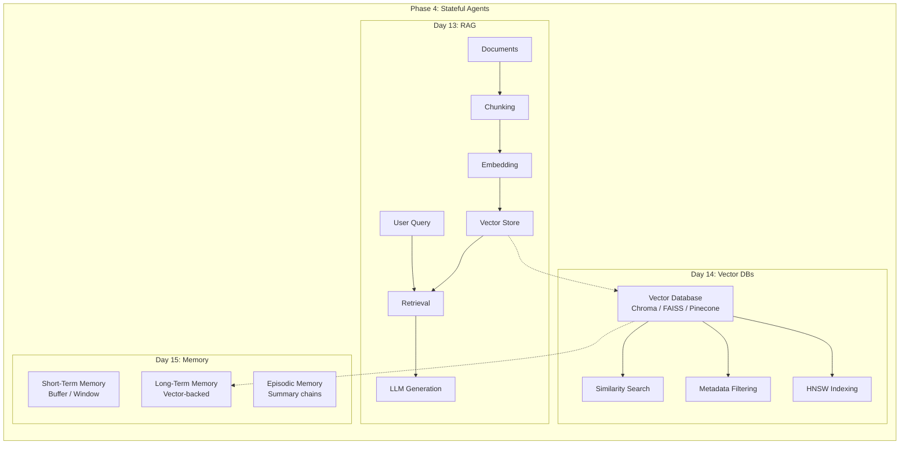

# Phase 4 — Stateful Agents (RAG, Vectors & Memory)

> **Days 13–15 of your learning path**  
> Estimated total study time: **15–18 hours** (5–6 hours/day × 3 days)  
> Prerequisites: Phase 3 (Multi-Agent Systems), basic understanding of embeddings helpful but not required

---

## What You'll Learn

Agents in Phase 2-3 were **stateless** — they forgot everything between conversations. Phase 4 makes agents **stateful** by teaching them to:

1. **Retrieve** relevant knowledge from documents (RAG)
2. **Store and search** knowledge using vector databases
3. **Remember** past interactions using short-term, long-term, and episodic memory

This is the phase where your agents go from "smart but forgetful" to "knowledgeable and remembering."

---

## Study Plan — 3 Days

### Day 13: RAG Fundamentals (~5–6 hours)

| Time | Topic | File |
|---|---|---|
| 1.5 hrs | How RAG works end-to-end: chunking, embedding, retrieval, generation | [01_rag_fundamentals.md](./01_rag_fundamentals.md) §1-4 |
| 1.5 hrs | Chunking strategies and embedding models deep dive | [01_rag_fundamentals.md](./01_rag_fundamentals.md) §5-7 |
| 1.5 hrs | Python examples: build a RAG pipeline from scratch with Gemini | [01_rag_fundamentals.md](./01_rag_fundamentals.md) §7-8 |
| 1 hr | RAG vs fine-tuning decision framework, .NET equivalents | [01_rag_fundamentals.md](./01_rag_fundamentals.md) §9-10 |

**Day 13 goal**: Understand the complete RAG pipeline and build one yourself.

### Day 14: Vector Databases (~5–6 hours)

| Time | Topic | File |
|---|---|---|
| 1.5 hrs | What vectors are, similarity search, distance metrics | [02_vector_databases.md](./02_vector_databases.md) §1-4 |
| 1.5 hrs | HNSW indexing, Chroma/FAISS/Pinecone comparison | [02_vector_databases.md](./02_vector_databases.md) §5-6 |
| 1.5 hrs | Python examples: set up Chroma, index documents, query | [02_vector_databases.md](./02_vector_databases.md) §7 |
| 1 hr | .NET equivalents, when to use which database, diagrams | [02_vector_databases.md](./02_vector_databases.md) §8-10 |

**Day 14 goal**: Understand vector storage internals and be able to set up a vector DB.

### Day 15: Memory in Agents (~5–6 hours)

| Time | Topic | File |
|---|---|---|
| 1.5 hrs | Three types of memory: short-term, long-term, episodic | [03_memory_in_agents.md](./03_memory_in_agents.md) §1-4 |
| 1.5 hrs | Implementation patterns: buffer, window, summary, vector-backed | [03_memory_in_agents.md](./03_memory_in_agents.md) §5-6 |
| 1.5 hrs | Python examples: all memory types with LangChain + Gemini | [03_memory_in_agents.md](./03_memory_in_agents.md) §7 |
| 1 hr | .NET equivalents (IMemoryCache vs IDistributedCache vs EF Core), diagrams | [03_memory_in_agents.md](./03_memory_in_agents.md) §8-10 |

**Day 15 goal**: Implement all three memory types and understand when to use each.

---

## Phase Architecture Overview

---

## Prerequisites

Before starting Phase 4, you should be comfortable with:

| Concept | Where You Learned It | Quick Check |
|---|---|---|
| LLM API calls (Gemini) | Phase 1 / existing codebase | Can you call `llm.invoke()` with system + human messages? |
| Structured output | Phase 2 `02_structured_outputs.md` | Can you use `with_structured_output()` with Pydantic? |
| Tool calling | Phase 2 `01_function_calling.md` | Can you create `@tool` functions and bind them to an LLM? |
| Agent patterns | Phase 3 | Do you understand supervisor and sequential patterns? |

---

## Key Outcomes

After Phase 4, you will be able to:

- ✅ Build a RAG pipeline that answers questions from your own documents
- ✅ Choose the right chunking strategy for different document types
- ✅ Set up and query a vector database (Chroma)
- ✅ Explain how HNSW indexing works and why it matters
- ✅ Implement short-term memory (conversation buffer)
- ✅ Implement long-term memory (vector-backed retrieval)
- ✅ Implement episodic memory (conversation summaries)
- ✅ Choose the right memory type for different agent applications

---

## Common Traps to Avoid

| Trap | Why It Happens | How to Avoid |
|---|---|---|
| **RAG = just search** | RAG is search + generation + context management | Study the full pipeline, not just retrieval |
| **Chunks too big or small** | No universal chunk size | Learn the trade-offs: too big = irrelevant noise, too small = missing context |
| **Ignoring metadata** | Focus only on vector similarity | Metadata filtering is as important as vector search |
| **Memory = chat history** | Short-term memory is just one type | Study all three types: short-term, long-term, episodic |
| **Vector DB = regular DB** | Trying to use it like PostgreSQL | Vector DBs are for similarity search, not relational queries |

---

## How Phase 4 Connects to Phase 3

In Phase 3, your multi-agent systems were stateless — each run started fresh. Phase 4 adds:

| Phase 3 Pattern | + Phase 4 Memory = |
|---|---|
| Supervisor agent | Supervisor that remembers which approaches worked for similar tasks |
| Sequential pipeline | Pipeline with RAG — each agent retrieves relevant knowledge |
| Collaborative debate | Agents that learn from past debates and don't repeat settled arguments |
| Blackboard pattern | Blackboard backed by vector DB — persists across sessions |

---

## .NET Developer Context

| Phase 4 Concept | Your .NET Mental Model |
|---|---|
| RAG pipeline | Full-text search service (Lucene.NET) + LLM for answer generation |
| Vector database | Like SQL Server but for similarity search instead of exact match |
| Embedding | Converting text to a fixed-size numeric array (`float[]`) — like a hash but preserving meaning |
| Chunking | Splitting a large document into indexable segments — like search engine indexing |
| Short-term memory | `IMemoryCache` — fast, in-process, limited lifetime |
| Long-term memory | `IDistributedCache` (Redis) or EF Core — persists across sessions |
| Episodic memory | Summary records in a database — compressed history |

---

## Glossary

See [glossary.md](./glossary.md) for all Phase 4 terms with definitions, analogies, and .NET equivalents.

---

## Other Concepts & Frameworks

Covered after the core Phase 4 assignments:

| File | Topic |
|---|---|
| [04_agent_frameworks.md](./04_agent_frameworks.md) | ADK & LangGraph — when to use each |
| [05_agent_evaluation.md](./05_agent_evaluation.md) | Metrics, benchmarks, LLM-as-judge |
| [06_debugging_monitoring.md](./06_debugging_monitoring.md) | LangSmith — tracing, debugging, datasets |
| [07_advanced_patterns.md](./07_advanced_patterns.md) | ReAct, Tree of Thought, Retry + Fallback |
| [08_guardrails_safety.md](./08_guardrails_safety.md) | Content filtering, ethical considerations |
| [09_mcp_a2a_protocols.md](./09_mcp_a2a_protocols.md) | MCP & A2A — standard agent protocols |
| [10_streaming_and_human_in_the_loop.md](./10_streaming_and_human_in_the_loop.md) | Streaming tokens + human approval workflows |
| [11_map_and_reduce.md](./11_map_and_reduce.md) | Parallel execution with Map & Reduce using `Send` |
| [12_langgraph_store_long_term_memory.md](./12_langgraph_store_long_term_memory.md) | Long-term memory with LangGraph Store across threads and sessions |

---

**Previous Phase**: [Phase 3 — Multi-Agent Systems](../phase3/README.md)  
**First Topic**: [01_rag_fundamentals.md](./01_rag_fundamentals.md)
