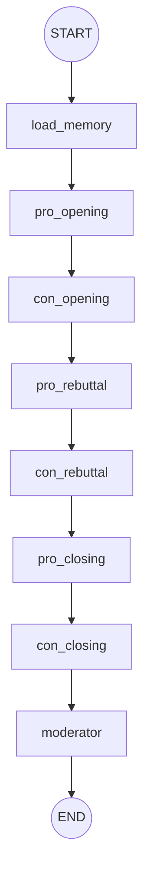

# Debate Graph

```mermaid
graph TD
    START((START)) --> load_memory
    load_memory --> pro_opening
    pro_opening --> con_opening
    con_opening --> pro_rebuttal
    pro_rebuttal --> con_rebuttal
    con_rebuttal --> pro_closing
    pro_closing --> con_closing
    con_closing --> moderator
    moderator --> END_NODE((END))
```
