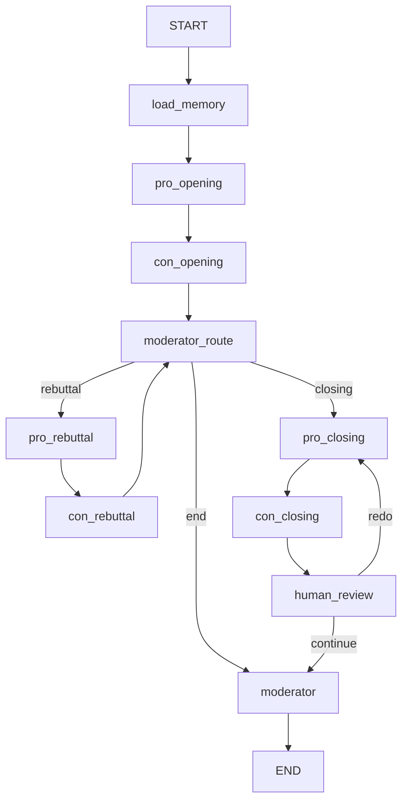
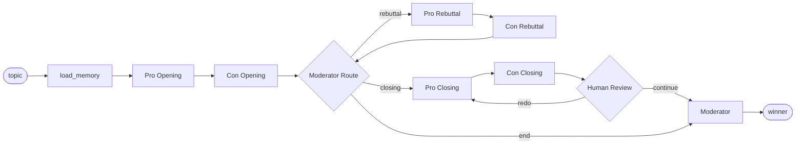
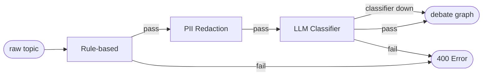

# Debate Graph — Phase 4

## Main Graph

```mermaid
graph TD
    A[START] --> B[load_memory]
    B --> C[pro_opening]
    C --> D[con_opening]
    D --> E[moderator_route]
    E -->|rebuttal| F[pro_rebuttal]
    E -->|closing| H[pro_closing]
    E -->|end| J[moderator]
    F --> G[con_rebuttal]
    G --> E
    H --> I[con_closing]
    I --> K[human_review]
    K -->|continue| J
    K -->|redo| H
    J --> L[END]
```

## Debate Flow

```mermaid
graph LR
    A([topic]) --> B[load_memory]
    B --> C[Pro Opening]
    C --> D[Con Opening]
    D --> E{Moderator Route}
    E -->|rebuttal| F[Pro Rebuttal]
    F --> G[Con Rebuttal]
    G --> E
    E -->|closing| H[Pro Closing]
    H --> I[Con Closing]
    I --> K{Human Review}
    K -->|continue| J[Moderator]
    K -->|redo| H
    E -->|end| J
    J --> L([winner])
```

## Guardrail Layers

```mermaid
graph LR
    A([raw topic]) --> B[Rule-based]
    B -->|pass| C[PII Redaction]
    C -->|pass| D[LLM Classifier]
    D -->|pass| E([debate graph])
    B -->|fail| F([400 Error])
    D -->|fail| F
    D -->|classifier down| E
```
